<div align="center">

# 🚀 Private RKE2 Kubernetes Platform

### Enterprise Private Kubernetes Platform

**RKE2 • Cilium • Gateway API • Envoy Gateway • Argo CD • Argo Rollouts • Prometheus • Alertmanager • Longhorn • MySQL HA • Redis**

<br>


<br>


<br>

Private production-oriented Kubernetes platform built from scratch using **RKE2**, with a highly available control plane, dedicated network architecture, **Cilium eBPF networking**, **Gateway API with Envoy Gateway**, GitOps through **Argo CD**, progressive delivery with **Argo Rollouts**, automated rollout analysis through **Prometheus**, operational alerting through **Alertmanager and Telegram**, persistent storage through **Longhorn**, and a stateful data layer based on **MySQL HA and Redis**.

</div>

---

# 🏗️ Architecture Domain

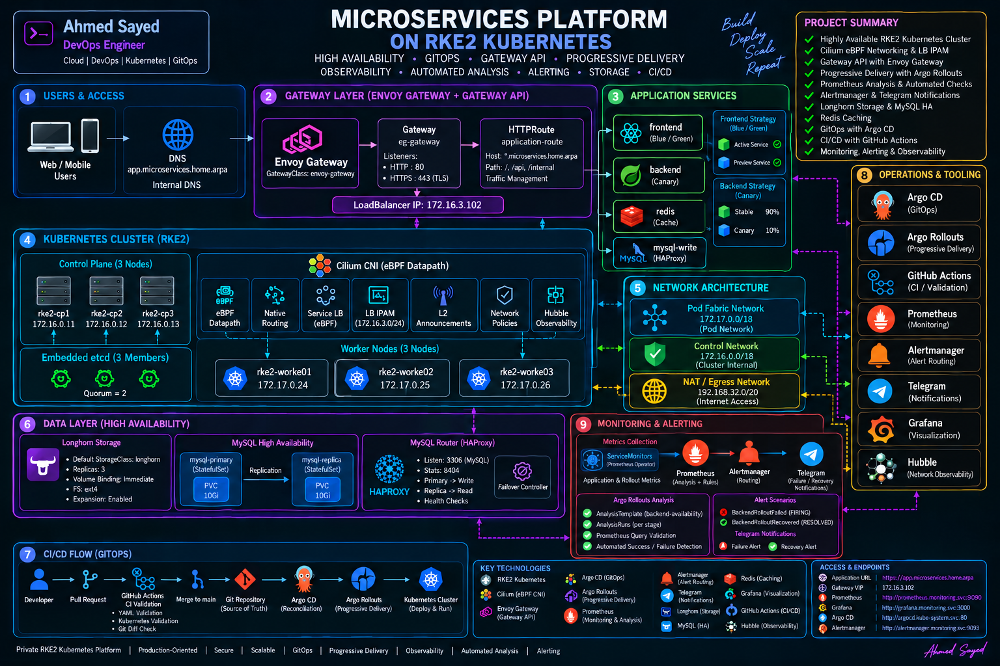

The architecture above provides the high-level view of the complete platform.

The detailed implementation of each layer is documented separately under the `docs/` directory.

---

# 🚀 Platform Overview

This project implements a private Kubernetes platform with:

- 3 RKE2 control-plane nodes
- 3 RKE2 worker nodes
- Embedded etcd for control-plane HA
- Dedicated Control and Pod networks
- MTU 1400 on internal networks
- NAT network for external egress
- Cilium as the Kubernetes CNI
- eBPF-based networking
- Native routing
- Cilium LoadBalancer IPAM
- Cilium L2 announcements
- Gateway API
- Envoy Gateway
- HTTPS and TLS termination
- Argo CD GitOps
- GitHub Actions CI
- Pull Request manifest validation
- Argo Rollouts
- Backend Canary deployments
- Frontend Blue/Green deployments
- Prometheus monitoring
- Argo Rollouts AnalysisRuns
- Prometheus-based rollout analysis
- Prometheus rollout failure alerts
- Alertmanager notification routing
- Telegram failure and recovery notifications
- Longhorn persistent storage
- MySQL Primary/Replica architecture
- Automatic MySQL failover
- HAProxy database routing
- Redis caching
- Resource requests and limits
- Failure and recovery validation

The platform follows a layered architecture where each component has a clearly defined responsibility.

---

# 🧭 Complete Platform Flow

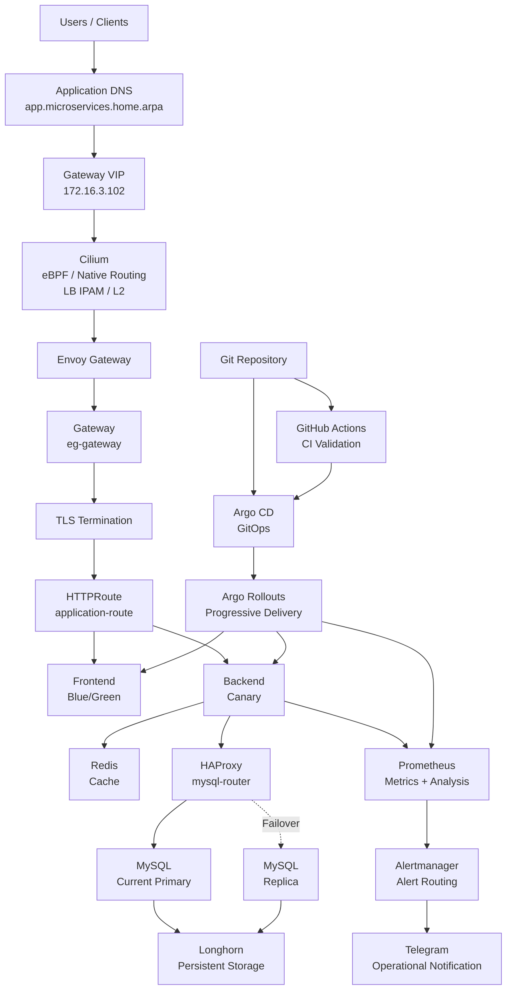
```mermaid
graph TD

    USER["Users / Clients"]
    DNS["Application DNS<br/>app.microservices.home.arpa"]
    VIP["Gateway VIP<br/>172.16.3.102"]
    CILIUM["Cilium<br/>eBPF / Native Routing<br/>LB IPAM / L2"]
    ENVOY["Envoy Gateway"]
    GATEWAY["Gateway<br/>eg-gateway"]
    TLS["TLS Termination"]
    ROUTE["HTTPRoute<br/>application-route"]

    FRONTEND["Frontend<br/>Blue/Green"]
    BACKEND["Backend<br/>Canary"]

    REDIS["Redis<br/>Cache"]
    HAPROXY["HAProxy<br/>mysql-router"]
    MYSQL_PRIMARY["MySQL<br/>Current Primary"]
    MYSQL_REPLICA["MySQL<br/>Replica"]
    LONGHORN["Longhorn<br/>Persistent Storage"]

    GIT["Git Repository"]
    CI["GitHub Actions<br/>CI Validation"]
    ARGOCD["Argo CD<br/>GitOps"]
    ROLLOUTS["Argo Rollouts<br/>Progressive Delivery"]

    PROM["Prometheus<br/>Metrics + Analysis"]
    ALERT["Alertmanager<br/>Alert Routing"]
    TELEGRAM["Telegram<br/>Operational Notification"]

    USER --> DNS
    DNS --> VIP
    VIP --> CILIUM
    CILIUM --> ENVOY
    ENVOY --> GATEWAY
    GATEWAY --> TLS
    TLS --> ROUTE

    ROUTE --> FRONTEND
    ROUTE --> BACKEND

    BACKEND --> REDIS
    BACKEND --> HAPROXY
    HAPROXY --> MYSQL_PRIMARY
    HAPROXY -. Failover .-> MYSQL_REPLICA

    MYSQL_PRIMARY --> LONGHORN
    MYSQL_REPLICA --> LONGHORN

    GIT --> CI
    GIT --> ARGOCD
    CI --> ARGOCD
    ARGOCD --> ROLLOUTS

    ROLLOUTS --> FRONTEND
    ROLLOUTS --> BACKEND

    BACKEND --> PROM
    ROLLOUTS --> PROM
    PROM --> ALERT
    ALERT --> TELEGRAM
```

---

# ☸️ RKE2 Kubernetes Foundation

The Kubernetes platform is built using RKE2.

The cluster contains three control-plane nodes and three worker nodes.

## Control Plane

- `rke2-cp1`
- `k8s-rke2-cp2`
- `k8s-rke2-cp3`

## Workers

- `rke2-worke01`
- `rke2-worke02`
- `rke2-worke03`

The cluster runs:

```text
v1.35.7+rke2r1
```

The control plane uses embedded etcd.

Three control-plane nodes provide an HA control-plane architecture where etcd maintains quorum across the cluster.

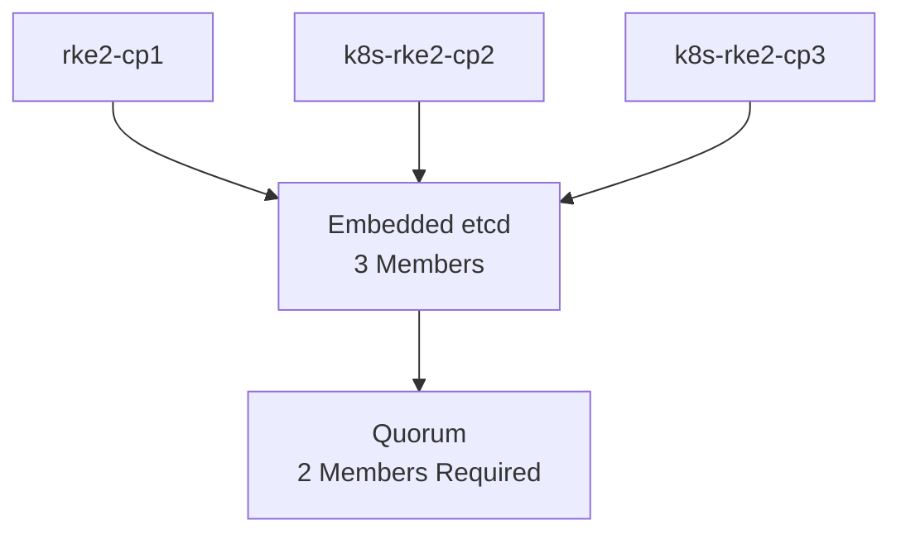
```mermaid
graph TD

    CP1["rke2-cp1"]
    CP2["k8s-rke2-cp2"]
    CP3["k8s-rke2-cp3"]

    ETCD["Embedded etcd<br/>3 Members"]
    QUORUM["Quorum<br/>2 Members Required"]

    CP1 --> ETCD
    CP2 --> ETCD
    CP3 --> ETCD
    ETCD --> QUORUM
```

With three etcd members:

- One control-plane failure can be tolerated while maintaining quorum.
- Two simultaneous control-plane failures would remove etcd quorum.

RKE2's built-in ingress controller is disabled because Gateway API and Envoy Gateway provide the external application entry point.

The RKE2 CNI is also disabled so that Cilium owns the Kubernetes networking layer.

---

# 🌐 Network Architecture

Each VM uses three networks:

- Control Network
- Pod Network
- NAT Network

The internal Kubernetes networks use MTU 1400.

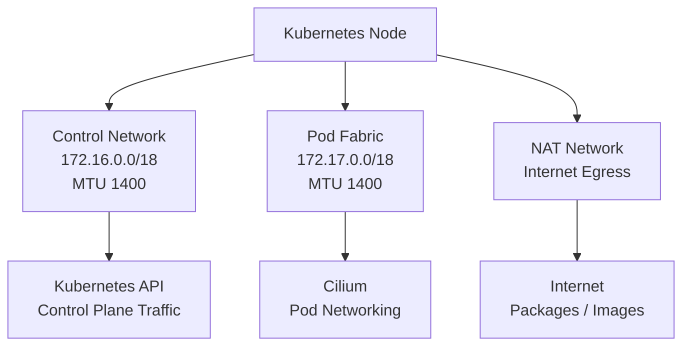
```mermaid
graph TD

    NODE["Kubernetes Node"]

    CONTROL["Control Network<br/>172.16.0.0/18<br/>MTU 1400"]
    POD["Pod Fabric<br/>172.17.0.0/18<br/>MTU 1400"]
    NAT["NAT Network<br/>Internet Egress"]

    API["Kubernetes API<br/>Control Plane Traffic"]
    CILIUM["Cilium<br/>Pod Networking"]
    INTERNET["Internet<br/>Packages / Images"]

    NODE --> CONTROL
    NODE --> POD
    NODE --> NAT

    CONTROL --> API
    POD --> CILIUM
    NAT --> INTERNET
```

The Control Network is used for Kubernetes control-plane communication.

The Pod Network provides the dedicated internal fabric used by Cilium for cluster networking.

The NAT network is used for Internet access such as package installation and container image retrieval.

Internal node-to-node communication does not depend on NAT.

This separation keeps management traffic, cluster networking, and external egress logically separated.

---

# 🐝 Cilium Networking

Cilium is the production CNI used by the cluster.

Its responsibilities include:

- eBPF datapath
- Pod networking
- Service networking
- Native routing
- kube-proxy replacement capability
- LoadBalancer IPAM
- L2 announcements

The platform uses native routing instead of relying on an overlay network for the primary Pod networking model.

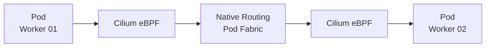
```mermaid
graph LR

    POD1["Pod<br/>Worker 01"]
    CILIUM1["Cilium eBPF"]
    ROUTING["Native Routing<br/>Pod Fabric"]
    CILIUM2["Cilium eBPF"]
    POD2["Pod<br/>Worker 02"]

    POD1 --> CILIUM1
    CILIUM1 --> ROUTING
    ROUTING --> CILIUM2
    CILIUM2 --> POD2
```

Native routing allows traffic to use the dedicated Pod-fabric network without adding an overlay encapsulation layer.

---

# 🚪 Gateway API and Envoy Gateway

Gateway API provides the external application entry point.

The final Gateway implementation uses Envoy Gateway.

Cilium provides the underlying Kubernetes networking capabilities together with LoadBalancer IP allocation and L2 announcement.

The Gateway is exposed through:

```text
172.16.3.102
```

The application endpoint is:

```text
https://app.microservices.home.arpa
```

The Gateway layer consists of:

- GatewayClass
- Gateway
- HTTPRoute
- Envoy Gateway
- TLS termination
- Application Services

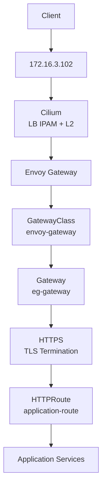
```mermaid
graph TD

    CLIENT["Client"]
    VIP["172.16.3.102"]
    CILIUM["Cilium<br/>LB IPAM + L2"]
    ENVOY["Envoy Gateway"]
    GCLASS["GatewayClass<br/>envoy-gateway"]
    GATEWAY["Gateway<br/>eg-gateway"]
    TLS["HTTPS<br/>TLS Termination"]
    ROUTE["HTTPRoute<br/>application-route"]
    SERVICES["Application Services"]

    CLIENT --> VIP
    VIP --> CILIUM
    CILIUM --> ENVOY
    ENVOY --> GCLASS
    GCLASS --> GATEWAY
    GATEWAY --> TLS
    TLS --> ROUTE
    ROUTE --> SERVICES
```

Gateway API separates infrastructure-level Gateway configuration from application-level routing.

This provides a cleaner responsibility model than putting all routing configuration into a single traditional Ingress resource.

---

# 🔀 Application Routing

The application HTTPRoute exposes frontend and backend paths.

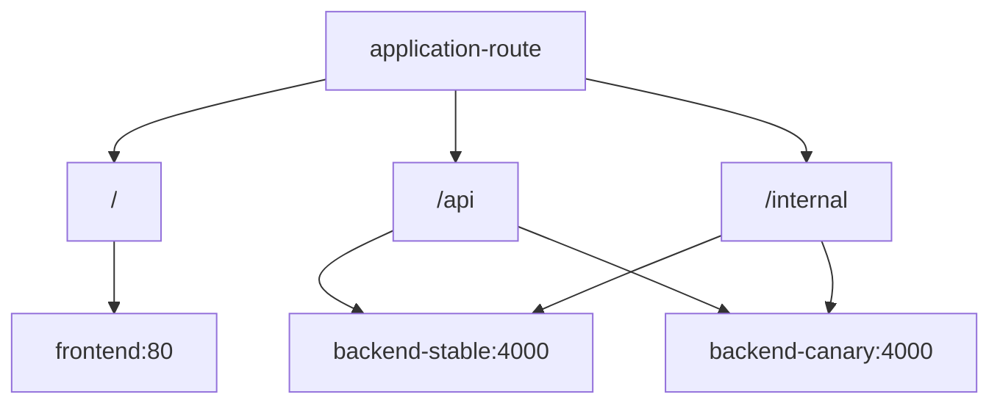
```mermaid
graph TD

    ROUTE["application-route"]

    ROOT["/"]
    API["/api"]
    INTERNAL["/internal"]

    FRONTEND["frontend:80"]
    STABLE["backend-stable:4000"]
    CANARY["backend-canary:4000"]

    ROUTE --> ROOT
    ROUTE --> API
    ROUTE --> INTERNAL

    ROOT --> FRONTEND
    API --> STABLE
    API --> CANARY
    INTERNAL --> STABLE
    INTERNAL --> CANARY
```

The backend stable and canary Services are used by Argo Rollouts to implement progressive traffic shifting.

---

# 🔐 TLS and Secure Application Access

The Gateway provides an HTTPS listener for:

```text
*.microservices.home.arpa
```

TLS is terminated at Envoy Gateway.

The application is accessed through:

```text
https://app.microservices.home.arpa
```

The Gateway configuration also includes security-oriented HTTP behavior such as HSTS.

The application route attaches specifically to the HTTPS Gateway listener.

---

# 📸 Gateway Evidence

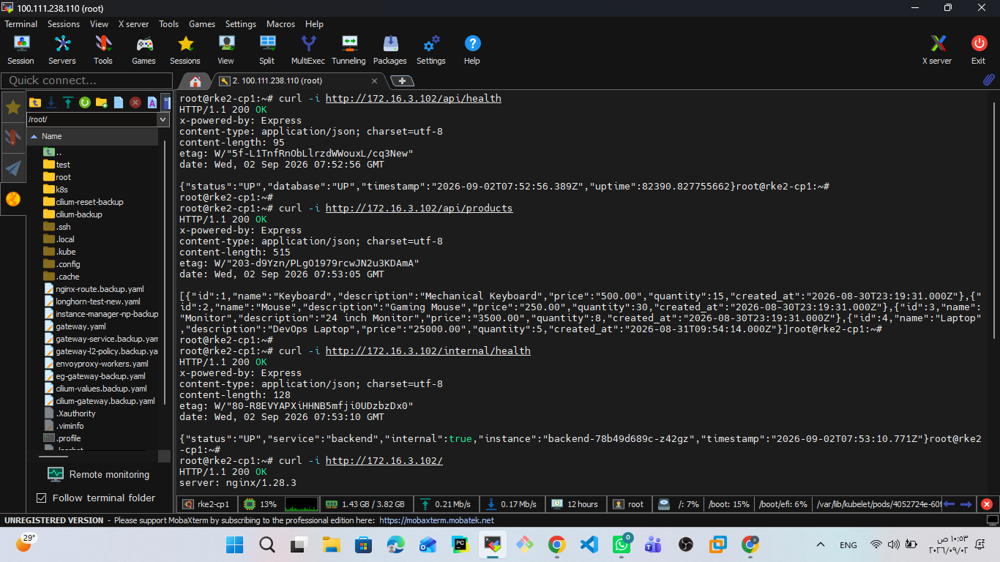

The Gateway was validated against the actual Gateway IP.

Validated application paths include:

- `/`
- `/api/health`
- `/api/products`
- `/internal/health`

---

# 🔄 GitOps with Argo CD

Argo CD provides GitOps reconciliation for the application platform.

The Argo CD Application is:

```text
microservices-platform
```

The Git repository acts as the desired-state source.

The Application recursively manages the manifests under the `apps/` directory.

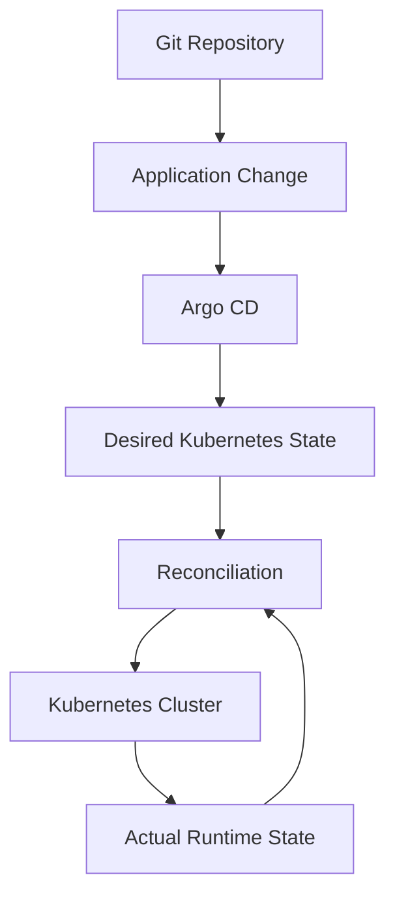
```mermaid
graph TD

    GIT["Git Repository"]
    CHANGE["Application Change"]
    ARGOCD["Argo CD"]
    DESIRED["Desired Kubernetes State"]
    CLUSTER["Kubernetes Cluster"]
    ACTUAL["Actual Runtime State"]
    RECONCILE["Reconciliation"]

    GIT --> CHANGE
    CHANGE --> ARGOCD
    ARGOCD --> DESIRED
    DESIRED --> RECONCILE
    ACTUAL --> RECONCILE
    RECONCILE --> CLUSTER
    CLUSTER --> ACTUAL
```

Argo CD is configured with:

- Automated synchronization
- Pruning
- Self-healing

This ensures that the runtime cluster continuously converges toward the desired state stored in Git.

### Evidence

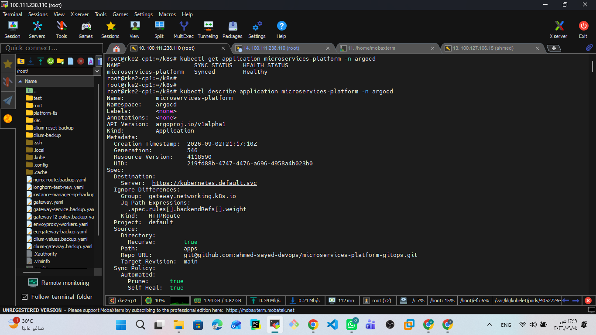

The Argo CD Application was validated as Synced and Healthy.

---

# 🧩 GitOps and Runtime Ownership

The Backend Canary rollout dynamically modifies HTTPRoute backend weights.

To avoid fighting with Argo Rollouts, Argo CD ignores only the runtime-managed weight fields.

The HTTPRoute itself remains GitOps-managed.

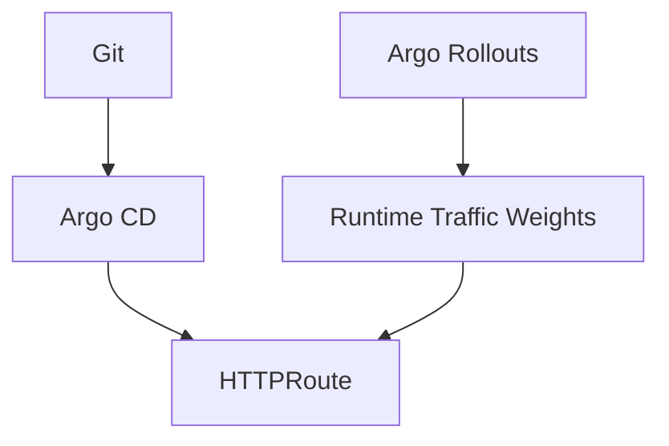
```mermaid
graph TD

    GIT["Git"]
    ARGOCD["Argo CD"]
    HTTPROUTE["HTTPRoute"]
    ROLLOUTS["Argo Rollouts"]
    WEIGHTS["Runtime Traffic Weights"]

    GIT --> ARGOCD
    ARGOCD --> HTTPROUTE
    ROLLOUTS --> WEIGHTS
    WEIGHTS --> HTTPROUTE
```

This creates a clear ownership model:

- Argo CD owns the desired resource definition.
- Argo Rollouts owns temporary runtime traffic weights.

---

# 🧪 Continuous Integration

GitHub Actions provides the Continuous Integration layer for the GitOps repository.

The CI pipeline validates Kubernetes manifests before changes are merged into the `main` branch.

The pipeline is intentionally limited to validation and does not deploy workloads directly to the Kubernetes cluster.

Deployment remains the responsibility of Argo CD.

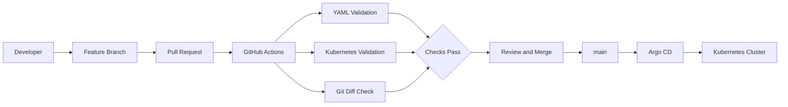
```mermaid
graph LR

    A["Developer"] --> B["Feature Branch"]
    B --> C["Pull Request"]
    C --> D["GitHub Actions"]

    D --> E["YAML Validation"]
    D --> F["Kubernetes Validation"]
    D --> G["Git Diff Check"]

    E --> H{"Checks Pass"}
    F --> H
    G --> H

    H --> I["Review and Merge"]
    I --> J["main"]
    J --> K["Argo CD"]
    K --> L["Kubernetes Cluster"]
```

## CI Responsibilities

The GitHub Actions workflow validates the GitOps repository through:

- YAML syntax and style validation
- Kubernetes manifest validation
- Git diff validation
- Pull Request validation
- Push validation on `main`

The CI workflow is stored at:

```text
.github/workflows/ci.yaml
```

The repository also contains:

```text
.yamllint.yml
```

which defines the YAML validation rules used by the pipeline.

## Validation Pipeline

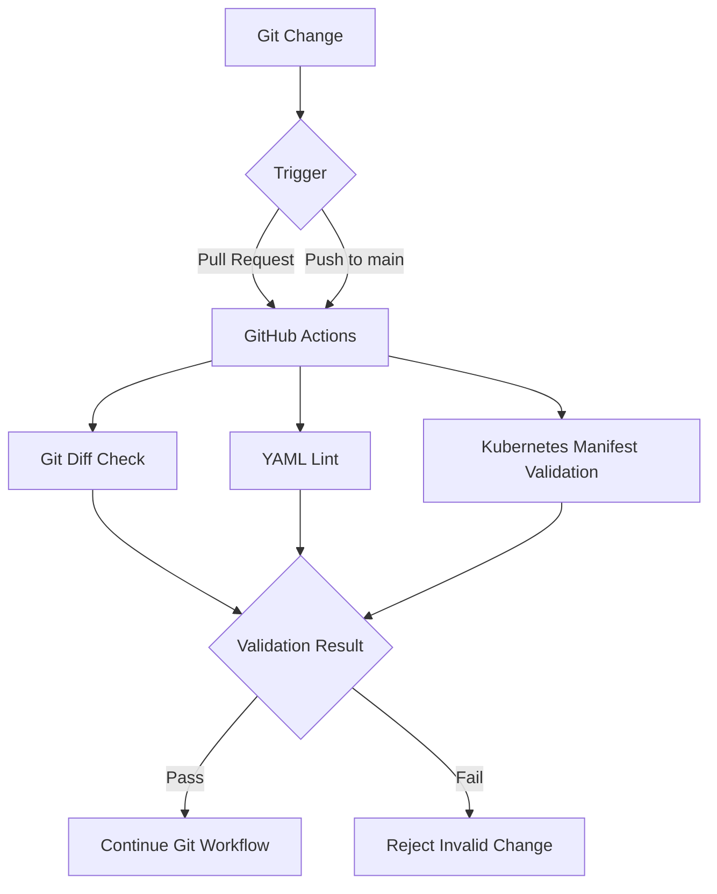
```mermaid
graph TD

    A["Git Change"] --> B{"Trigger"}

    B -->|Pull Request| C["GitHub Actions"]
    B -->|Push to main| C

    C --> D["Git Diff Check"]
    C --> E["YAML Lint"]
    C --> F["Kubernetes Manifest Validation"]

    D --> G{"Validation Result"}
    E --> G
    F --> G

    G -->|Pass| H["Continue Git Workflow"]
    G -->|Fail| I["Reject Invalid Change"]
```

### Pull Request Validation

The Pull Request workflow was tested using:

```text
test/ci-pr-check
```

The branch opened a Pull Request targeting:

```text
main
```

GitHub Actions successfully executed the GitOps CI validation workflow.

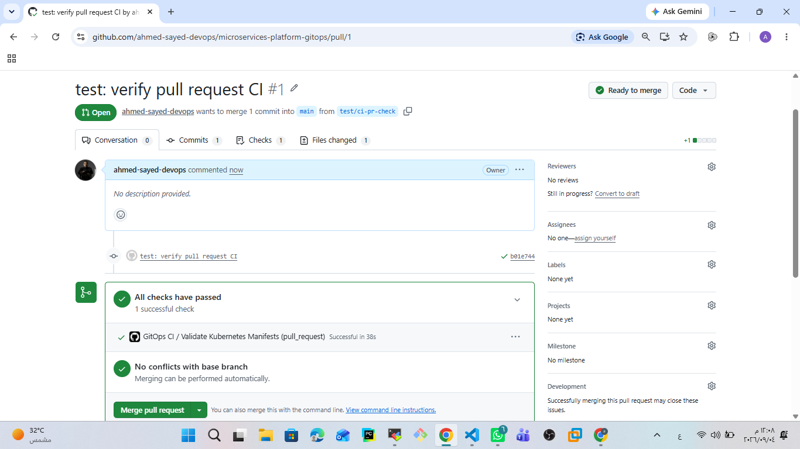

The successful check confirms that Pull Request validation is working as expected.

### Push Validation

The workflow was also validated after pushing changes to `main`.

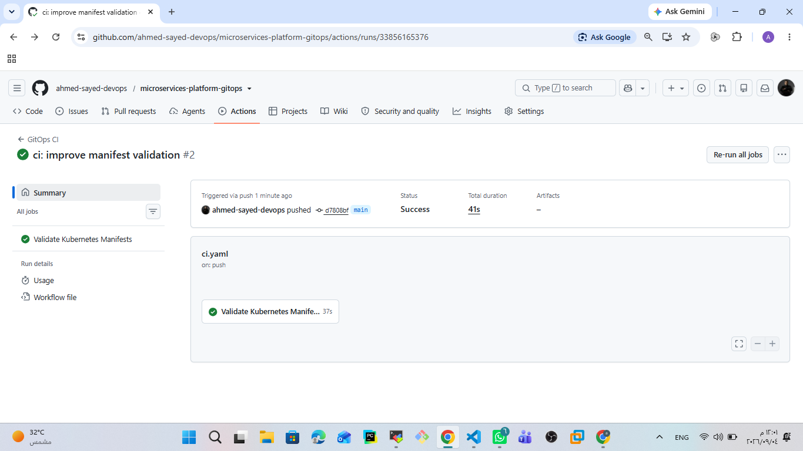

This confirms that the CI pipeline also validates changes pushed to the main branch.

## CI and GitOps Separation

CI and CD have intentionally different responsibilities.

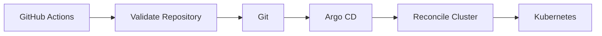
```mermaid
graph LR

    A["GitHub Actions"] --> B["Validate Repository"]
    B --> C["Git"]
    C --> D["Argo CD"]
    D --> E["Reconcile Cluster"]
    E --> F["Kubernetes"]
```

GitHub Actions verifies that repository changes are valid.

Argo CD uses the Git repository as the desired state and reconciles the Kubernetes cluster.

The CI workflow does not execute:

```bash
kubectl apply
```

and does not directly deploy workloads.

This prevents multiple deployment mechanisms from modifying the cluster and preserves the pull-based GitOps model.

---

# 📦 Progressive Delivery

Argo Rollouts manages progressive application releases.

Two different deployment strategies are intentionally implemented:

- Backend: Canary
- Frontend: Blue/Green

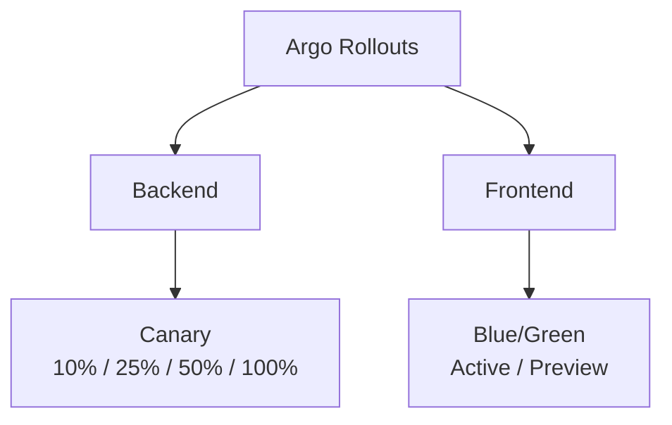
```mermaid
graph TD

    ROLLOUTS["Argo Rollouts"]

    BACKEND["Backend"]
    CANARY["Canary<br/>10% / 25% / 50% / 100%"]

    FRONTEND["Frontend"]
    BLUEGREEN["Blue/Green<br/>Active / Preview"]

    ROLLOUTS --> BACKEND
    BACKEND --> CANARY

    ROLLOUTS --> FRONTEND
    FRONTEND --> BLUEGREEN
```

The Backend Canary additionally uses automated Prometheus availability analysis.

The Frontend Blue/Green rollout uses manual validation and promotion.

---

# 🟡 Backend Canary

The Backend uses a Canary rollout strategy.

The architecture contains:

- `backend-stable`
- `backend-canary`
- Gateway API
- Envoy Gateway
- Argo Rollouts
- Prometheus Analysis

Traffic progression:

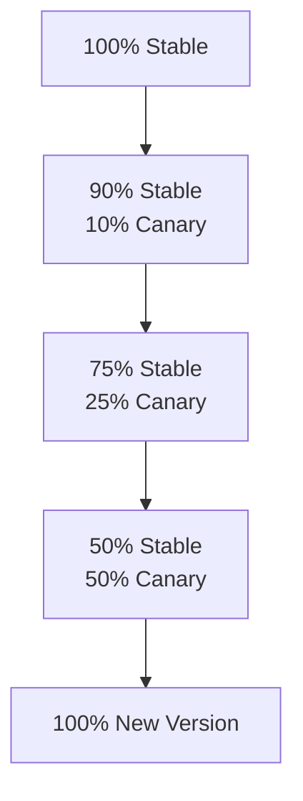
```mermaid
graph TD

    A["100% Stable"] --> B["90% Stable<br/>10% Canary"]
    B --> C["75% Stable<br/>25% Canary"]
    C --> D["50% Stable<br/>50% Canary"]
    D --> E["100% New Version"]
```

Each configured stage includes an availability AnalysisRun and a manual pause.

Argo Rollouts modifies the Gateway API HTTPRoute weights during the progression.

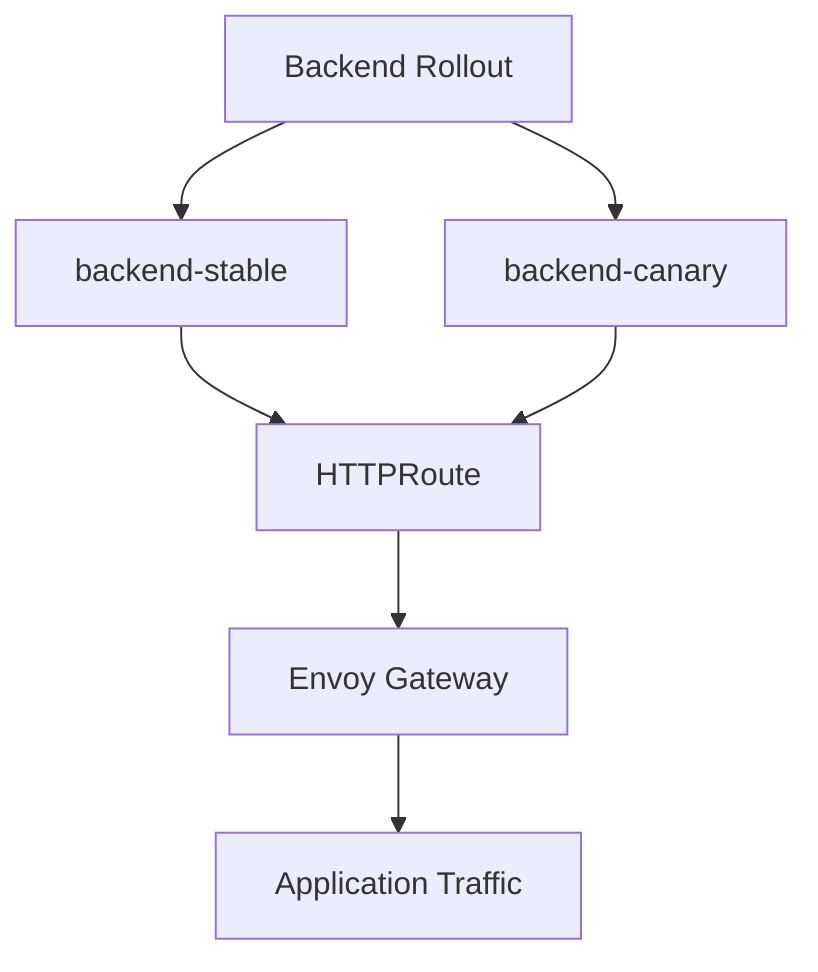
```mermaid
graph TD

    ROLLOUT["Backend Rollout"]
    STABLE["backend-stable"]
    CANARY["backend-canary"]
    HTTPROUTE["HTTPRoute"]
    ENVOY["Envoy Gateway"]
    CLIENT["Application Traffic"]

    ROLLOUT --> STABLE
    ROLLOUT --> CANARY

    STABLE --> HTTPROUTE
    CANARY --> HTTPROUTE

    HTTPROUTE --> ENVOY
    ENVOY --> CLIENT
```

### Evidence

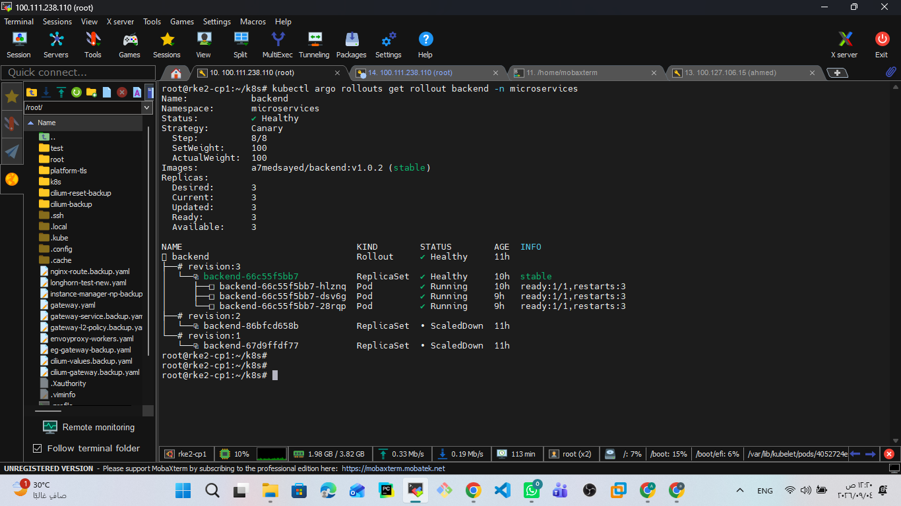

The screenshot demonstrates the successful Backend Canary rollout with the new version becoming stable.

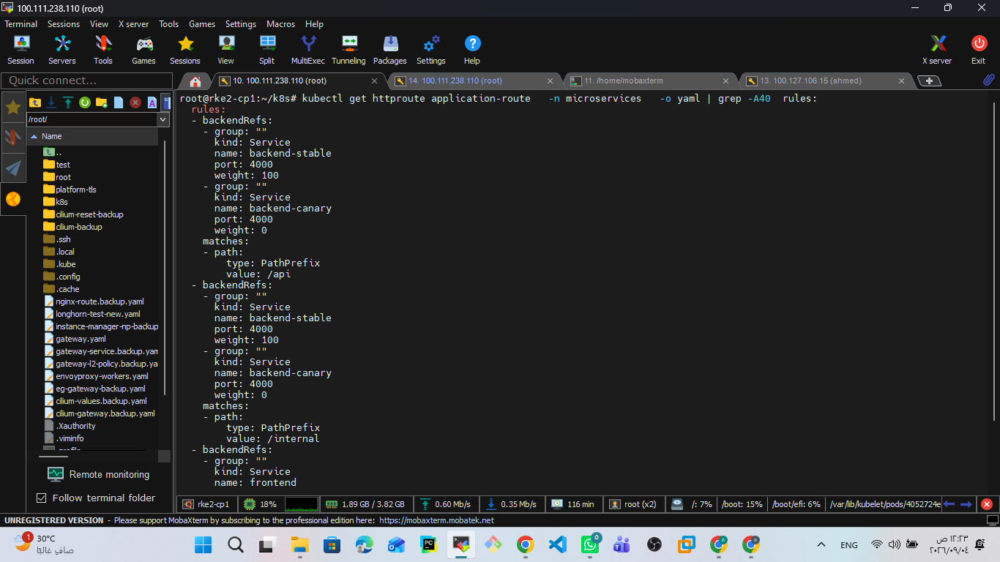

The HTTPRoute screenshot demonstrates the Gateway API resources used for Canary traffic management.

---

# 🔵 Frontend Blue/Green

The Frontend uses the Blue/Green strategy.

Two Services are maintained:

- `frontend`
- `frontend-preview`

The active Service represents production traffic.

The preview Service is used to expose and validate the new version before promotion.

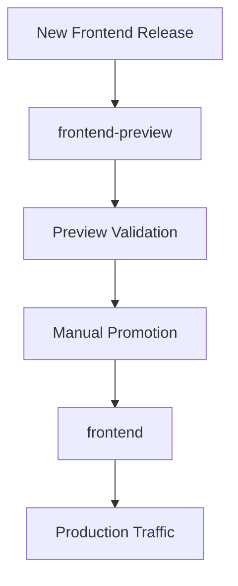
```mermaid
graph TD

    RELEASE["New Frontend Release"]
    PREVIEW["frontend-preview"]
    VALIDATE["Preview Validation"]
    PROMOTE["Manual Promotion"]
    ACTIVE["frontend"]
    PRODUCTION["Production Traffic"]

    RELEASE --> PREVIEW
    PREVIEW --> VALIDATE
    VALIDATE --> PROMOTE
    PROMOTE --> ACTIVE
    ACTIVE --> PRODUCTION
```

The current successful release is:

```text
a7medsayed/frontend:v1.0.1
```

Promotion is performed manually.

Before promotion:

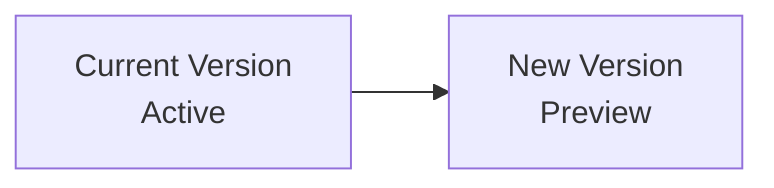
```mermaid
graph LR

    OLD["Current Version<br/>Active"]
    NEW["New Version<br/>Preview"]

    OLD --> NEW
```

After promotion:

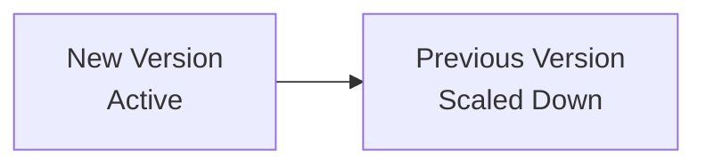
```mermaid
graph LR

    NEW["New Version<br/>Active"]
    OLD["Previous Version<br/>Scaled Down"]

    NEW --> OLD
```

### Evidence

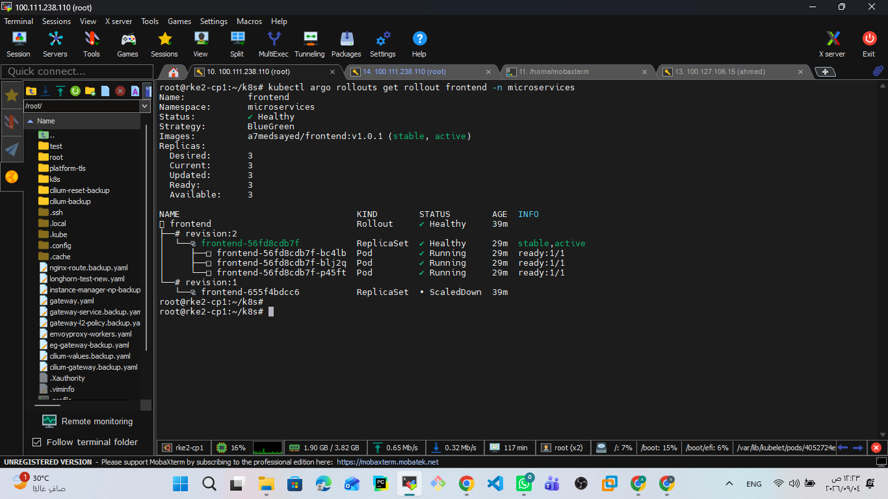

The screenshot demonstrates the successful Blue/Green rollout state.

The Active Service points to the new stable release after promotion.

---

# 🧪 Progressive Delivery Failure Isolation

A failed Preview release must not automatically replace the known-good production version.

This behavior was demonstrated using a failed Frontend Preview release.

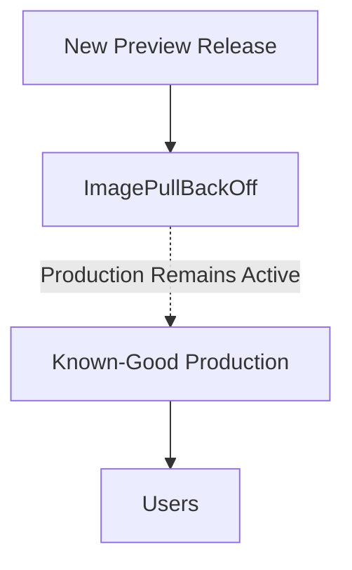
```mermaid
graph TD

    ACTIVE["Known-Good Production"]
    PREVIEW["New Preview Release"]
    FAILURE["ImagePullBackOff"]
    USERS["Users"]

    PREVIEW --> FAILURE
    ACTIVE --> USERS
    FAILURE -. Production Remains Active .-> ACTIVE
```

### Evidence

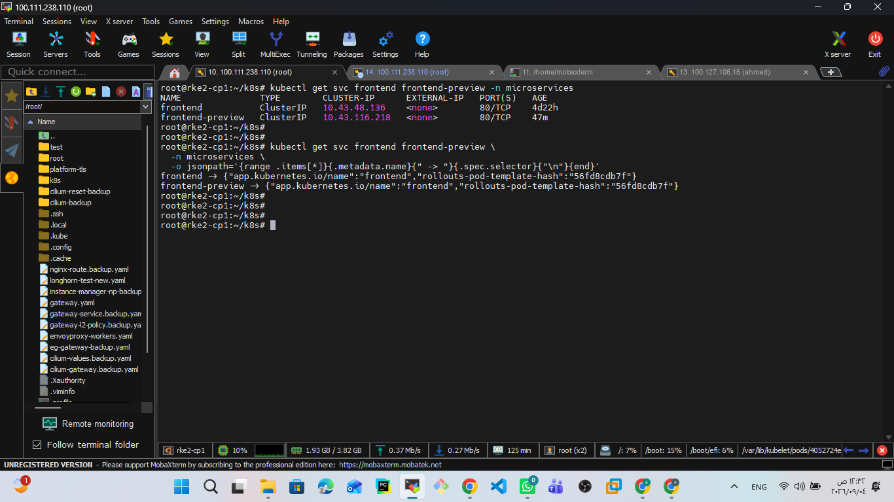

The Active and Preview Services demonstrate the isolation between the production and preview versions.

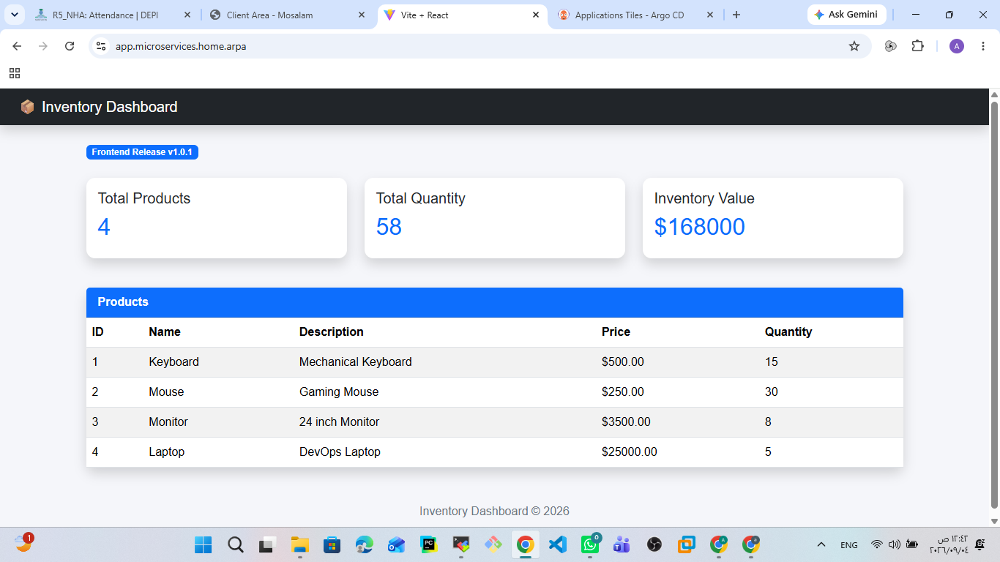

This confirms that the failed Preview release did not replace the known-good production version.

---

# 📊 Automated Rollout Analysis

The Backend Canary rollout is integrated with Prometheus through an Argo Rollouts `AnalysisTemplate`.

The analysis workflow is:

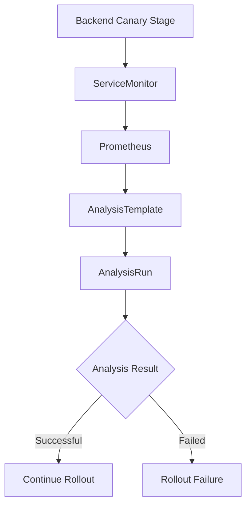
```mermaid
graph TD

    A["Backend Canary Stage"] --> B["ServiceMonitor"]
    B --> C["Prometheus"]
    C --> D["AnalysisTemplate"]
    D --> E["AnalysisRun"]

    E --> F{"Analysis Result"}

    F -->|Successful| G["Continue Rollout"]
    F -->|Failed| H["Rollout Failure"]
```

The `backend-availability` AnalysisTemplate validates Backend availability.

The success condition requires at least three available replicas.

```yaml
apiVersion: argoproj.io/v1alpha1
kind: AnalysisTemplate
metadata:
  name: backend-availability
  namespace: microservices
spec:
  metrics:
    - name: backend-available-replicas
      initialDelay: 15s
      count: 1
      successCondition: result[0] >= 3
      failureLimit: 1
      provider:
        prometheus:
          address: http://monitoring-kube-prometheus-prometheus.monitoring.svc.cluster.local:9090
          query: |
            sum(
              rollout_info_replicas_available{
                namespace="argo-rollouts",
                name="backend"
              }
            ) or vector(0)
```

Each configured Canary stage creates an AnalysisRun.

During the successful Backend v1.0.3 rollout, the AnalysisRuns completed successfully and validated the availability requirement before progression.

---

# 📈 Backend Metrics Collection

The Backend exposes application metrics through:

```text
/metrics
```

Prometheus discovers the Backend Canary through a ServiceMonitor targeting the Canary Service.

The ServiceMonitor uses:

```yaml
apiVersion: monitoring.coreos.com/v1
kind: ServiceMonitor
metadata:
  name: backend-canary
  namespace: monitoring
  labels:
    release: monitoring
spec:
  namespaceSelector:
    matchNames:
      - microservices
  selector:
    matchLabels:
      monitoring: backend-canary
  endpoints:
    - port: http
      path: /metrics
      interval: 15s
```

This provides a Prometheus target for the Backend Canary and allows rollout-specific metrics to be evaluated independently from the stable Service.

---

# 🚨 Rollout Failure Detection

Prometheus evaluates a `BackendRolloutFailed` alert based on the Argo Rollouts `rollout_info` metric.

The alert detects failed rollout phases such as:

- `Timeout`
- `Degraded`
- `Error`
- `Aborted`

The PrometheusRule uses:

```yaml
apiVersion: monitoring.coreos.com/v1
kind: PrometheusRule
metadata:
  name: microservices-rollout-alerts
  namespace: monitoring
  labels:
    release: monitoring
spec:
  groups:
    - name: microservices.rollouts
      rules:
        - alert: BackendRolloutFailed
          expr: |
            max(
              rollout_info{
                exported_namespace="microservices",
                name="backend",
                phase=~"Timeout|Degraded|Error|Aborted"
              }
            ) == 1
          for: 30s
          labels:
            severity: critical
            service: backend
          annotations:
            summary: "Backend rollout failed"
            description: "The backend Argo Rollout entered a failed state."
```

The monitoring path is:

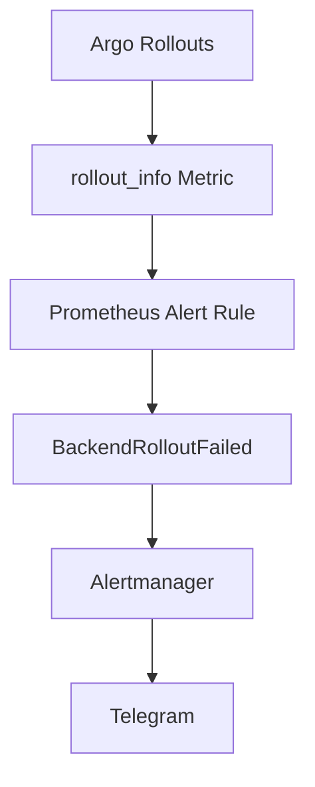
```mermaid
graph TD

    A["Argo Rollouts"] --> B["rollout_info Metric"]
    B --> C["Prometheus Alert Rule"]
    C --> D["BackendRolloutFailed"]
    D --> E["Alertmanager"]
    E --> F["Telegram"]
```

---

# 🧨 Backend Failure Scenario

A controlled Backend failure was introduced by deploying a non-existent image:

```text
a7medsayed/backend:v9.9.9
```

The invalid image created a new Canary ReplicaSet while the existing stable version remained available.

```mermaid
graph TD

    A["Backend v1.0.3"] --> B["Stable ReplicaSet"]
    B --> C["Production Traffic"]

    D["Backend v9.9.9"] --> E["Canary ReplicaSet"]
    E --> F["ImagePullBackOff"]

    F --> G["Rollout ProgressDeadlineExceeded"]
    G --> H["Rollout Degraded"]
```

## Canary Pod Failure

The invalid image caused the Canary Pod to enter:

```text
ImagePullBackOff
```

The Kubernetes events identified the image pull failure.

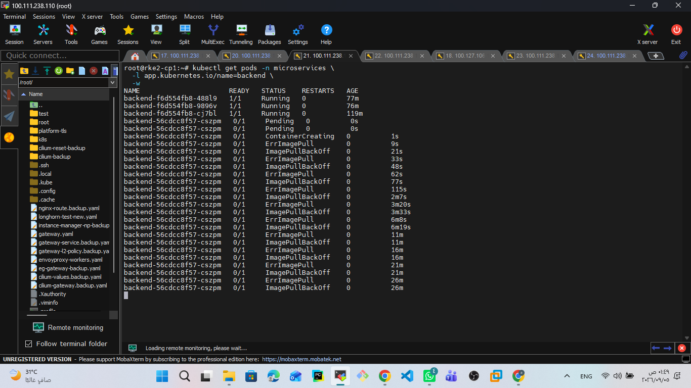

This screenshot demonstrates the first observable failure at the Kubernetes workload level.

The failure is isolated to the new Canary ReplicaSet and does not replace the known-good stable release.

## Rollout Becomes Degraded

Because the new ReplicaSet could not make progress, the Argo Rollout eventually entered a degraded state.

The Rollout reported:

```text
Status: Degraded

ProgressDeadlineExceeded
```

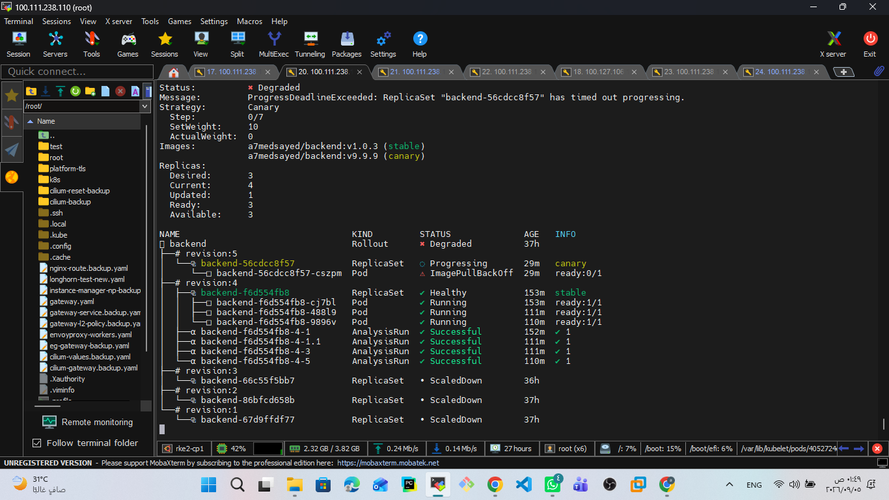

This demonstrates how the Kubernetes workload failure is reflected in the Argo Rollouts lifecycle.

## Argo CD Reflects the Failure

The failed rollout also affected the health status reported by the Argo CD Application.

The GitOps state remained synchronized with Git, while the runtime application health became degraded because the desired rollout could not successfully progress.

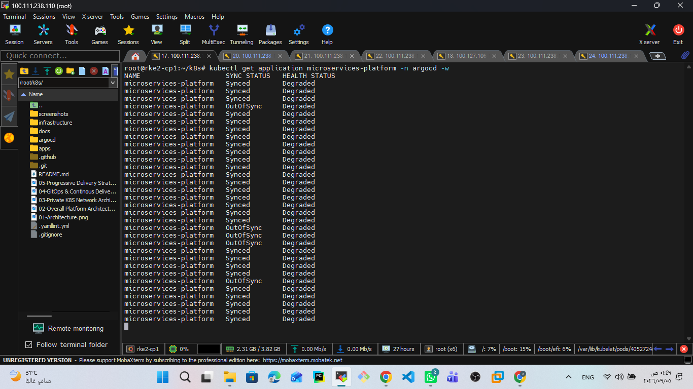

This demonstrates the distinction between:

- Sync status: whether the cluster matches Git.
- Health status: whether the deployed application is healthy.

A resource can remain synchronized with Git while its runtime health is degraded.

---

# 🔥 Prometheus Failure Detection

Once the Backend Rollout entered a failed phase, the Prometheus expression matched:

```promql
max(
  rollout_info{
    exported_namespace="microservices",
    name="backend",
    phase=~"Timeout|Degraded|Error|Aborted"
  }
) == 1
```

After the configured `for: 30s` period, the alert became:

```text
FIRING
```

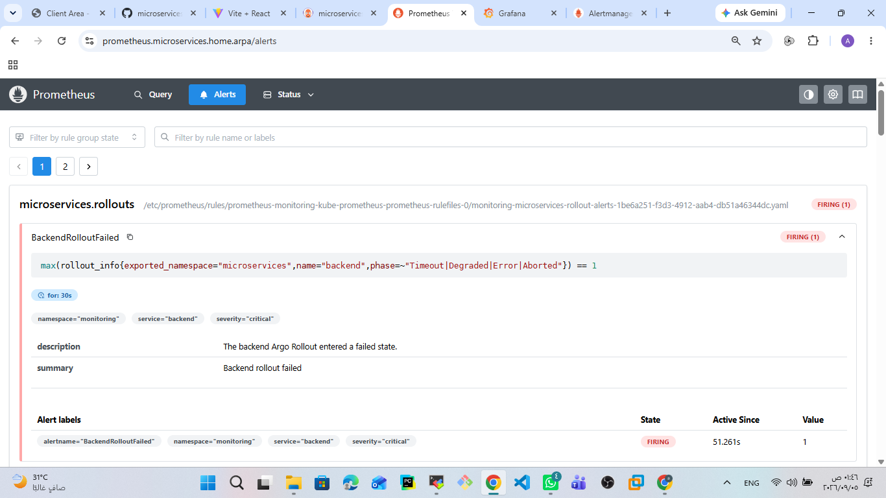

The alert contains:

```text
Alert:
BackendRolloutFailed

Service:
backend

Severity:
critical
```

This proves that Prometheus detected the actual Argo Rollouts failure through the rollout metrics.

The detection chain is:

```mermaid
graph TD

    A["Backend Canary Failure"] --> B["Rollout Degraded"]
    B --> C["rollout_info"]
    C --> D["Prometheus Rule"]
    D --> E["BackendRolloutFailed FIRING"]
```

---

# 📲 Telegram Failure Notification

After Prometheus fired the alert, Alertmanager routed it to the configured Telegram receiver.

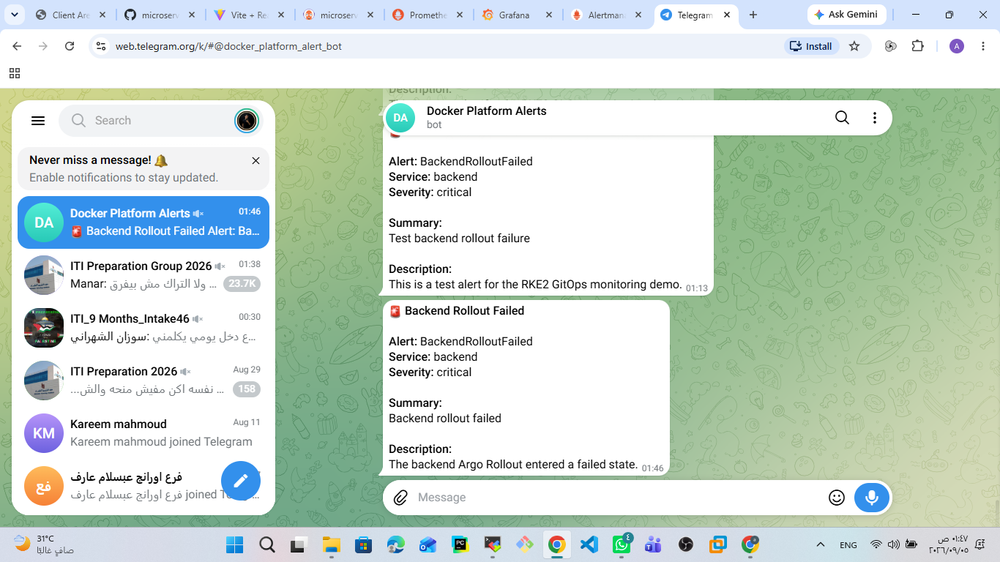

The notification identifies:

```text
Alert: BackendRolloutFailed
Service: backend
Severity: critical
```

The operational notification path is:

```mermaid
graph TD

    A["Backend Rollout"] --> B["Degraded"]
    B --> C["Prometheus"]
    C --> D["BackendRolloutFailed"]
    D --> E["Alertmanager"]
    E --> F["Telegram"]
```

This provides an operational alert without requiring an operator to continuously watch Kubernetes or Prometheus dashboards.

---

# 🔧 GitOps Recovery

The failed Backend image was restored through the GitOps repository.

The known-good version was restored to:

```text
a7medsayed/backend:v1.0.3
```

The recovery workflow is:

```mermaid
graph TD

    A["Bad Image v9.9.9"] --> B["Git Repository"]
    B --> C["Argo CD Reconciliation"]
    C --> D["Known-Good Image v1.0.3"]
    D --> E["Argo Rollouts"]
    E --> F["Healthy ReplicaSet"]
    F --> G["Stable Production Release"]
```

Recovery was therefore performed through the desired-state workflow instead of using an ad-hoc production-only change.

---

# ✅ Backend Rollout Recovery

After the known-good image was restored, the Backend Rollout returned to:

```text
Status: Healthy

Strategy: Canary

Step: 7/7

SetWeight: 100

ActualWeight: 100

Images:

a7medsayed/backend:v1.0.3 (stable)

Replicas:

Desired: 3
Current: 3
Updated: 3
Ready: 3
Available: 3
```

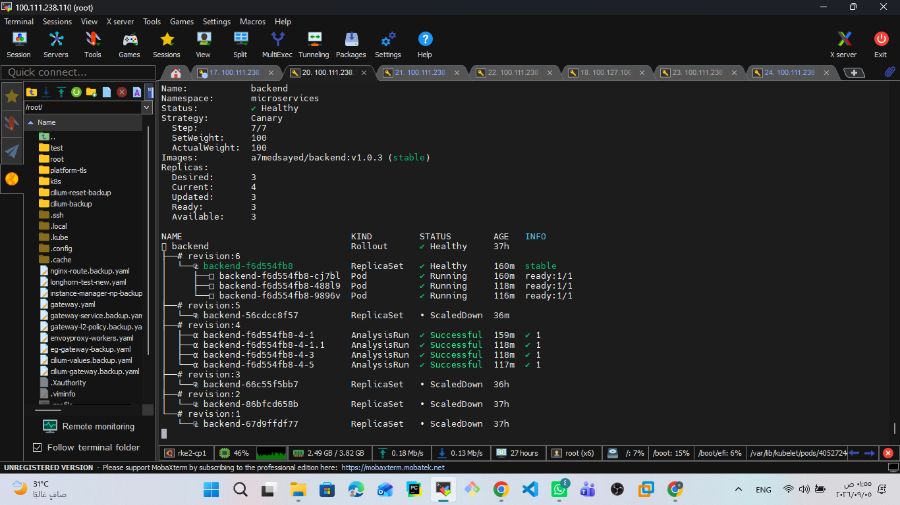

This demonstrates that the Backend returned to a healthy stable state after the failed release was removed through the GitOps workflow.

The recovery state is:

```mermaid
graph TD

    A["Known-Good Image v1.0.3"] --> B["Stable ReplicaSet"]
    B --> C["3 Ready Replicas"]
    C --> D["100% Production Traffic"]
    D --> E["Healthy Rollout"]
```

---

# 🟢 Prometheus Resolved State

Once the Backend Rollout returned to a healthy state, the failure expression no longer matched the Rollout.

The `BackendRolloutFailed` alert therefore became:

```text
INACTIVE
```

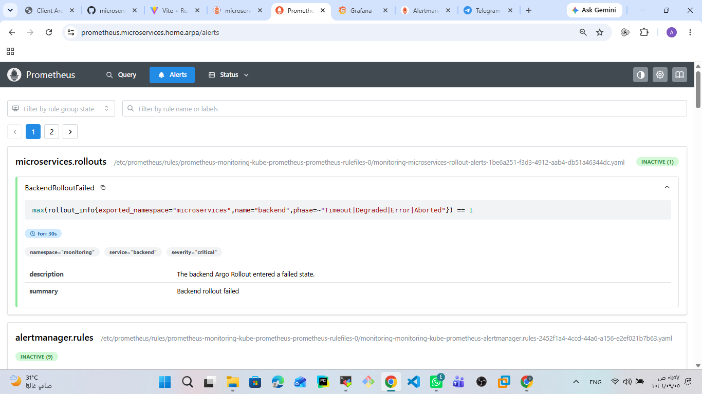

This demonstrates that Prometheus automatically detected the recovery.

The recovery path is:

```mermaid
graph TD

    A["Healthy Backend"] --> B["rollout_info"]
    B --> C["Prometheus Rule"]
    C --> D["BackendRolloutFailed INACTIVE"]
```

---

# 📲 Telegram Recovery Notification

Alertmanager is configured with:

```yaml
sendResolved: true
```

The Telegram notification template distinguishes between firing and resolved states:

```yaml
message: |
  {{ if eq .Status "firing" }}
  <b>🚨 Backend Rollout Failed</b>
  {{ else }}
  <b>✅ Backend Rollout Recovered</b>
  {{ end }}

  <b>Alert:</b> {{ .CommonLabels.alertname }}
  <b>Service:</b> {{ .CommonLabels.service }}
  <b>Severity:</b> {{ .CommonLabels.severity }}

  <b>Summary:</b>
  {{ .CommonAnnotations.summary }}

  <b>Description:</b>
  {{ .CommonAnnotations.description }}
```

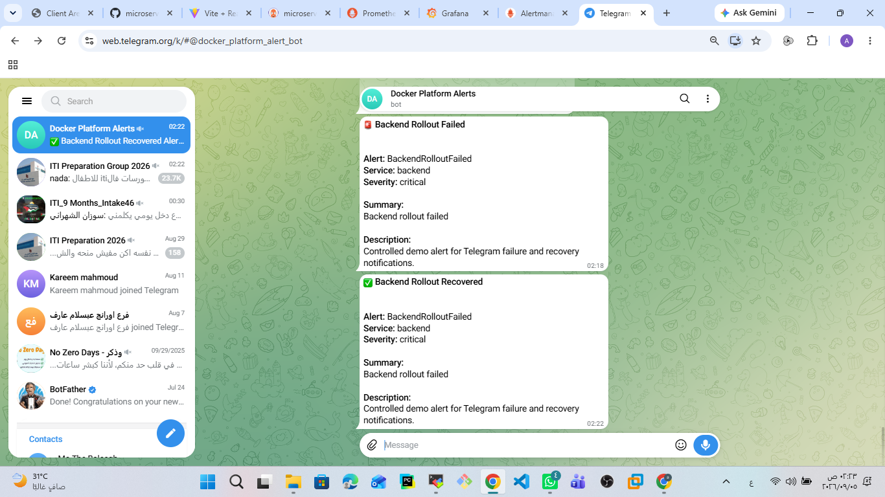

The recovery notification is clearly identified as:

```text
✅ Backend Rollout Recovered
```

The complete operational lifecycle is:

```mermaid
graph TD

    A["Failed Backend Release"] --> B["ImagePullBackOff"]
    B --> C["Rollout Degraded"]
    C --> D["Prometheus FIRING"]
    D --> E["Telegram Failure"]

    E --> F["GitOps Restore"]
    F --> G["Backend Healthy"]
    G --> H["Prometheus INACTIVE"]
    H --> I["Telegram Recovery"]
```

This completes the demonstrated failure detection, notification, and recovery workflow.

---

# 🧠 Progressive Delivery Decision Model

The platform uses different rollout strategies according to application requirements.

```mermaid
graph TD

    A["Application Release"] --> B{"Deployment Strategy"}

    B -->|Backend| C["Canary"]
    B -->|Frontend| D["Blue/Green"]

    C --> E["10% / 25% / 50% / 100%"]
    C --> F["Prometheus Analysis"]
    F --> G{"Healthy?"}

    G -->|Yes| H["Continue"]
    G -->|No| I["Fail / Alert"]

    D --> J["Active / Preview"]
    J --> K["Preview Validation"]
    K --> L["Manual Promotion"]

    H --> M["Production"]
    L --> M
```

The Backend focuses on gradual traffic exposure and automated availability verification.

The Frontend focuses on isolated Preview validation followed by explicit promotion.

---

# 💾 Persistent Storage

Longhorn provides the persistent storage layer for stateful workloads.

The storage architecture includes:

- Longhorn
- StorageClass
- PersistentVolumeClaims
- PersistentVolumes
- Replicated storage
- MySQL StatefulSets

The default StorageClass is:

```text
longhorn
```

The MySQL persistent volumes use 10Gi storage.

```mermaid
graph TD

    APP["Stateful Application"]
    PVC["PersistentVolumeClaim"]
    SC["StorageClass<br/>longhorn"]
    PV["PersistentVolume"]
    LONGHORN["Longhorn"]
    REPLICAS["Replicated Storage"]
    WORKERS["Worker Nodes"]

    APP --> PVC
    PVC --> SC
    SC --> PV
    PV --> LONGHORN
    LONGHORN --> REPLICAS
    REPLICAS --> WORKERS
```

Longhorn is configured for three-way volume replication.

Persistent storage separates application data from the lifecycle of individual Kubernetes Pods.

---

# 🗄️ MySQL High Availability

The database layer uses:

- MySQL Primary
- MySQL Replica
- HAProxy
- MySQL Failover Controller
- Persistent storage
- StatefulSets

```mermaid
graph TD

    APP["Backend Application"]
    ROUTER["HAProxy<br/>mysql-router"]
    PRIMARY["MySQL<br/>Current Primary"]
    REPLICA["MySQL<br/>Replica"]
    FC["MySQL Failover Controller"]
    PVC1["Primary PVC"]
    PVC2["Replica PVC"]
    LONGHORN["Longhorn"]

    APP --> ROUTER
    ROUTER --> PRIMARY
    ROUTER -. Failover Target .-> REPLICA

    PRIMARY --> PVC1
    REPLICA --> PVC2

    PVC1 --> LONGHORN
    PVC2 --> LONGHORN

    FC --> PRIMARY
    FC --> REPLICA
    FC --> ROUTER
```

The application does not need to know which MySQL instance is currently primary.

HAProxy provides a stable database access point.

The failover controller monitors the database topology and handles the controlled primary-to-replica transition.

---

# ❤️ Automatic MySQL Failover

The platform includes a controlled MySQL failover mechanism.

The demonstrated failure scenario starts with a healthy primary and replica.

When the primary becomes unavailable, the failover controller detects the failure and promotes the replica.

```mermaid
graph TD

    PRIMARY["MySQL Primary"]
    HEALTH["Primary Health Checks"]
    FAILURE["Primary Failure"]
    DETECT["Failure Detection"]
    PROMOTE["Replica Promotion"]
    STATE["Update HA State"]
    ROUTER["Update HAProxy"]
    RESTART["Restart Router"]
    NEWPRIMARY["MySQL Replica<br/>New Primary"]

    PRIMARY --> HEALTH
    HEALTH --> FAILURE
    FAILURE --> DETECT
    DETECT --> PROMOTE
    PROMOTE --> STATE
    STATE --> ROUTER
    ROUTER --> RESTART
    RESTART --> NEWPRIMARY
```

The validated failover state is represented by:

```text
current-primary = mysql-replica
```

and:

```text
rejoin-required = true
```

The failed primary Pod is recreated by Kubernetes.

The recreated Pod is treated as a recovery candidate rather than automatically becoming the database primary again.

---

# 🔁 MySQL Recovery and Rejoin

The recovery model separates database leadership from Kubernetes Pod identity.

```mermaid
graph TD

    FAILED["Original Primary Fails"]
    REPLICA["Replica"]
    PROMOTION["Replica Promoted"]
    OLDPRIMARY["Original Primary Pod Recreated"]
    REJOIN["Rejoin / Recovery"]
    FINAL["Healthy HA Topology"]

    FAILED --> REPLICA
    REPLICA --> PROMOTION
    FAILED --> OLDPRIMARY
    OLDPRIMARY --> REJOIN
    PROMOTION --> FINAL
    REJOIN --> FINAL
```

This avoids assuming that the StatefulSet name alone determines database leadership.

---

# 🧠 Redis Caching Layer

Redis provides a fast-access caching layer for application workloads.

Redis and MySQL have different responsibilities.

```mermaid
graph TD

    APPLICATION["Backend Application"]
    REDIS["Redis<br/>Cache"]
    MYSQL["MySQL<br/>Persistent Data"]

    APPLICATION --> REDIS
    APPLICATION --> MYSQL
```

Redis is used for cache-oriented access while MySQL remains responsible for persistent application data.

This keeps caching concerns separate from the persistent database layer.

---

# 🧱 Application Architecture

The application layer consists of:

- Frontend
- Backend
- Redis
- MySQL

```mermaid
graph TD

    FRONTEND["Frontend"]
    BACKEND["Backend"]
    REDIS["Redis"]
    MYSQL["MySQL HA"]

    FRONTEND --> BACKEND
    BACKEND --> REDIS
    BACKEND --> MYSQL
```

The application components are independently deployable and are managed through Kubernetes resources and GitOps.

---

# 🔄 End-to-End GitOps Delivery

The complete delivery model combines Git, GitHub Actions, Argo CD, Argo Rollouts, Gateway API, Prometheus, and Kubernetes.

```mermaid
graph TD

    DEVELOPER["Developer"]
    BRANCH["Feature Branch"]
    PR["Pull Request"]
    CI["GitHub Actions"]
    VALIDATION["Manifest Validation"]
    GIT["Git Repository"]

    ARGOCD["Argo CD"]
    MANIFESTS["Application Manifests"]
    ROLLOUTS["Argo Rollouts"]

    GATEWAY["Gateway API"]
    ENVOY["Envoy Gateway"]
    APPLICATION["Application"]

    PROM["Prometheus"]
    ANALYSIS["AnalysisRun"]
    ALERT["Alertmanager"]
    TELEGRAM["Telegram"]

    PROMOTE["Promotion"]

    DEVELOPER --> BRANCH
    BRANCH --> PR
    PR --> CI
    CI --> VALIDATION
    VALIDATION --> GIT

    GIT --> ARGOCD
    ARGOCD --> MANIFESTS
    MANIFESTS --> ROLLOUTS

    ROLLOUTS --> GATEWAY
    GATEWAY --> ENVOY
    ENVOY --> APPLICATION

    ROLLOUTS --> PROM
    PROM --> ANALYSIS
    ANALYSIS --> ROLLOUTS

    PROM --> ALERT
    ALERT --> TELEGRAM

    APPLICATION --> PROMOTE
```

This model provides a clear separation between:

- Code and configuration changes
- CI validation
- Desired state
- Cluster reconciliation
- Release progression
- External traffic routing
- Application validation
- Automated rollout analysis
- Operational alerting

---

# 🧯 Failure and Recovery

The platform treats failure scenarios as part of the operational design.

Validated failure behavior includes:

- Failed Frontend Preview
- Production isolation
- Backend progressive rollout
- Backend Canary image failure
- Rollout degradation
- Prometheus failure detection
- Alertmanager notification
- Telegram failure notification
- GitOps recovery
- Prometheus resolved state
- Telegram recovery notification
- MySQL primary Pod failure
- Automatic replica promotion
- HA state transition
- Primary Pod recreation
- Persistent storage across Pod lifecycle

```mermaid
graph TD

    FAILURE["Failure"]
    DETECT["Detection"]
    ISOLATE["Isolation"]
    ALERT["Alerting"]
    RECOVER["Recovery"]
    VALIDATE["Validation"]
    RESOLVED["Resolved State"]
    SUCCESS["Healthy State"]

    FAILURE --> DETECT
    DETECT --> ISOLATE
    ISOLATE --> ALERT
    ALERT --> RECOVER
    RECOVER --> VALIDATE
    VALIDATE --> RESOLVED
    RESOLVED --> SUCCESS
```

The Backend rollout failure scenario demonstrates the complete operational chain from workload failure to recovery notification.

---

# 📚 Documentation

Detailed documentation is organized by platform layer.

```text
docs/

├── 01-rke2-ha/
├── 02-cilium/
├── 03-gateway-api/
├── 04-progressive-delivery/
├── 05-storage/
└── 06-ci/
```

Each documentation section covers the implementation, configuration, validation, design decisions, and evidence for that platform layer.

---

# 🏛️ Design Principles

## Separation of Responsibilities

Each platform component has a defined role.

```mermaid
graph TD

    RKE2["RKE2<br/>Kubernetes Foundation"]
    CILIUM["Cilium<br/>Networking"]
    ENVOY["Envoy Gateway<br/>External Routing"]
    CI["GitHub Actions<br/>CI Validation"]
    ARGOCD["Argo CD<br/>GitOps"]
    ROLLOUTS["Argo Rollouts<br/>Progressive Delivery"]
    PROM["Prometheus<br/>Monitoring / Analysis"]
    ALERT["Alertmanager<br/>Alert Routing"]
    LONGHORN["Longhorn<br/>Persistent Storage"]
    MYSQL["MySQL HA<br/>Persistent Data"]
    REDIS["Redis<br/>Caching"]

    RKE2 --> CILIUM
    CILIUM --> ENVOY
    ENVOY --> ARGOCD
    CI --> ARGOCD
    ARGOCD --> ROLLOUTS
    ROLLOUTS --> PROM
    PROM --> ALERT
    ROLLOUTS --> MYSQL
    ROLLOUTS --> REDIS
    MYSQL --> LONGHORN
```

## Git as Source of Truth

Application configuration is maintained in Git and reconciled by Argo CD.

## Continuous Integration

GitHub Actions validates proposed repository changes before they become part of the approved GitOps state.

## Progressive Delivery

Application releases are introduced progressively rather than immediately replacing the previous version.

## Automated Rollout Analysis

Prometheus provides application and rollout metrics while Argo Rollouts evaluates AnalysisTemplates and AnalysisRuns.

## Failure Isolation

Failed releases are isolated from known-good production whenever the deployment strategy supports it.

## Persistent State

Stateful workloads use persistent storage so that Pod lifecycle does not define data lifecycle.

## Explicit Runtime Ownership

GitOps remains responsible for desired configuration while runtime controllers manage the specific fields they are designed to control.

---

# 📊 Current Implementation Status

## Infrastructure

- [x] RKE2 cluster
- [x] 3 control-plane nodes
- [x] 3 worker nodes
- [x] Embedded etcd
- [x] Dedicated internal networks
- [x] MTU 1400
- [x] NAT egress separation

## Networking

- [x] Cilium CNI
- [x] eBPF datapath
- [x] Native routing
- [x] LoadBalancer IPAM
- [x] L2 announcement
- [x] Kubernetes Service networking

## Gateway

- [x] Gateway API
- [x] Envoy Gateway
- [x] GatewayClass
- [x] Gateway
- [x] HTTPRoute
- [x] HTTPS listener
- [x] TLS termination
- [x] Application routing
- [x] External Gateway validation

## GitOps

- [x] Argo CD
- [x] Git repository integration
- [x] Automated synchronization
- [x] Pruning
- [x] Self-healing
- [x] Runtime HTTPRoute weight ownership
- [x] GitHub Actions CI
- [x] YAML validation
- [x] Kubernetes manifest validation
- [x] Pull Request checks
- [x] Push validation

## Progressive Delivery

- [x] Argo Rollouts
- [x] Backend Canary
- [x] Gateway API traffic shifting
- [x] 10/25/50/100 rollout stages
- [x] Frontend Blue/Green
- [x] Active Service
- [x] Preview Service
- [x] Manual promotion
- [x] Failed Preview validation
- [x] Backend Canary failure validation
- [x] Production isolation
- [x] Prometheus integration
- [x] ServiceMonitor
- [x] AnalysisTemplate
- [x] AnalysisRuns
- [x] Automated availability analysis
- [x] Rollout failure detection
- [x] Alertmanager integration
- [x] Telegram failure notification
- [x] GitOps recovery
- [x] Resolved alert detection
- [x] Telegram recovery notification

## Storage and Stateful Services

- [x] Longhorn
- [x] Dynamic provisioning
- [x] PersistentVolumeClaims
- [x] Replicated storage configuration
- [x] MySQL Primary
- [x] MySQL Replica
- [x] HAProxy
- [x] MySQL failover controller
- [x] Automatic replica promotion
- [x] Primary Pod recreation
- [x] Redis caching layer

---

# 🎯 Production-Oriented Decisions

## RKE2

RKE2 provides the Kubernetes foundation and HA control-plane architecture.

## Cilium

Cilium provides an eBPF-based networking datapath and native routing model aligned with the dedicated Pod network.

## Gateway API

Gateway API provides a structured separation between platform Gateway configuration and application routing.

## Envoy Gateway

Envoy Gateway provides the Gateway API implementation, Envoy proxy infrastructure, TLS termination, and HTTP routing.

## GitHub Actions

GitHub Actions provides repository-level CI validation without becoming a second deployment mechanism.

## Argo CD

Argo CD establishes Git as the desired-state source and continuously reconciles the Kubernetes cluster.

## Argo Rollouts

Argo Rollouts provides progressive release control through Canary and Blue/Green strategies.

## Prometheus

Prometheus provides metrics collection and acts as the metric provider for automated rollout analysis.

## Alertmanager

Alertmanager handles rollout failure notification routing and resolved-state notifications.

## Telegram

Telegram provides an operational notification channel for important rollout failures and recoveries.

## Longhorn

Longhorn provides Kubernetes-native persistent storage with replicated volumes.

## MySQL HA

MySQL Primary/Replica, HAProxy, and the failover controller provide a controlled stateful availability model.

## Redis

Redis provides fast cache access while MySQL remains the persistent data layer.

---

# 🗺️ Platform Evolution

The platform is structured so additional production capabilities can be introduced without redesigning the core architecture.

```mermaid
graph TD

    FOUNDATION["Infrastructure<br/>RKE2"]
    NETWORK["Networking<br/>Cilium"]
    GATEWAY["Gateway<br/>Envoy Gateway"]
    CI["CI<br/>GitHub Actions"]
    GITOPS["GitOps<br/>Argo CD"]
    DELIVERY["Progressive Delivery<br/>Argo Rollouts"]
    OBS["Observability<br/>Prometheus"]
    ALERTING["Alerting<br/>Alertmanager"]
    NOTIFY["Notifications<br/>Telegram"]
    STORAGE["Storage<br/>Longhorn"]
    STATEFUL["Stateful Services<br/>MySQL + Redis"]
    SECURITY["Security<br/>Hardening / Policies"]

    FOUNDATION --> NETWORK
    NETWORK --> GATEWAY
    GATEWAY --> CI
    CI --> GITOPS
    GITOPS --> DELIVERY
    DELIVERY --> OBS
    OBS --> ALERTING
    ALERTING --> NOTIFY
    DELIVERY --> STORAGE
    STORAGE --> STATEFUL
    STATEFUL --> SECURITY
```

The current implementation has already progressed beyond basic monitoring by integrating Prometheus with Argo Rollouts and adding failure/recovery notifications through Alertmanager and Telegram.

Future improvements can focus on deeper application-level analysis, security hardening, and additional observability.

---

# 🏁 Final Architecture

```mermaid
graph TD

    USERS["Users"]
    DNS["Application DNS"]
    VIP["Gateway VIP<br/>172.16.3.102"]

    CILIUM["Cilium"]
    ENVOY["Envoy Gateway"]
    HTTPROUTE["Gateway API<br/>HTTPRoute"]

    FRONTEND["Frontend<br/>Blue/Green"]
    BACKEND["Backend<br/>Canary"]

    REDIS["Redis"]
    HAPROXY["HAProxy"]
    MYSQL_PRIMARY["MySQL Primary"]
    MYSQL_REPLICA["MySQL Replica"]
    LONGHORN["Longhorn"]

    GIT["Git Repository"]
    CI["GitHub Actions"]
    ARGOCD["Argo CD"]
    ROLLOUTS["Argo Rollouts"]

    PROM["Prometheus"]
    ANALYSIS["AnalysisRuns"]
    ALERT["Alertmanager"]
    TELEGRAM["Telegram"]

    USERS --> DNS
    DNS --> VIP
    VIP --> CILIUM
    CILIUM --> ENVOY
    ENVOY --> HTTPROUTE

    HTTPROUTE --> FRONTEND
    HTTPROUTE --> BACKEND

    BACKEND --> REDIS
    BACKEND --> HAPROXY

    HAPROXY --> MYSQL_PRIMARY
    HAPROXY -. Failover .-> MYSQL_REPLICA

    MYSQL_PRIMARY --> LONGHORN
    MYSQL_REPLICA --> LONGHORN

    GIT --> CI
    CI --> ARGOCD
    GIT --> ARGOCD

    ARGOCD --> ROLLOUTS

    ROLLOUTS --> FRONTEND
    ROLLOUTS --> BACKEND

    ROLLOUTS --> PROM
    PROM --> ANALYSIS
    ANALYSIS --> ROLLOUTS

    PROM --> ALERT
    ALERT --> TELEGRAM
```

---

# 🏆 Final Result

The resulting platform provides a private, production-oriented Kubernetes environment where:

- RKE2 provides the Kubernetes foundation and control-plane HA.
- Cilium provides the cluster networking datapath.
- Envoy Gateway provides the Gateway API-based application entry point.
- GitHub Actions provides CI validation for GitOps changes.
- Argo CD provides GitOps reconciliation.
- Argo Rollouts provides progressive application delivery.
- Backend releases use Canary traffic progression.
- Frontend releases use Blue/Green Active/Preview deployment.
- Prometheus provides rollout metrics and automated availability analysis.
- AnalysisRuns validate Backend availability during Canary progression.
- Alertmanager provides rollout failure and recovery notification routing.
- Telegram provides operational failure and recovery notifications.
- Longhorn provides persistent replicated storage.
- MySQL provides persistent application data with a controlled HA model.
- HAProxy provides a stable database access layer.
- The MySQL failover controller handles failure detection and replica promotion.
- Redis provides fast cache access.
- Failure scenarios are explicitly tested and documented.
- GitOps provides the recovery mechanism for application releases.

The demonstrated progressive delivery failure scenario validates the complete operational lifecycle:

```mermaid
graph TD

    A["Release"] --> B["Progressive Delivery"]
    B --> C["Health Analysis"]

    C -->|Healthy| D["Promotion"]
    D --> E["Production"]

    C -->|Failed| F["Rollout Degraded"]
    F --> G["Prometheus Alert"]
    G --> H["Alertmanager"]
    H --> I["Telegram"]

    I --> J["GitOps Recovery"]
    J --> K["Healthy Rollout"]
    K --> L["Resolved Alert"]
    L --> M["Recovery Notification"]
```

The platform therefore combines infrastructure HA, dedicated networking, Gateway API, GitOps, CI validation, progressive delivery, automated rollout analysis, failure detection, operational alerting, persistent storage, and stateful service recovery into a single production-oriented Kubernetes platform.

---

# 📄 License

This project is licensed under the MIT License.

---

# 👨‍💻 Author

<div align="center">

## Ahmed Sayed

**DevOps Engineer | Cloud Engineer | Docker | AWS | Linux | Kubernetes**

GitHub

https://github.com/ahmed-sayed-devops

LinkedIn

https://linkedin.com/in/ahmed-sayed-devops

⭐ If you found this project useful, consider giving it a Star.

</div>