<div align="center">

# 🚀 Private RKE2 Kubernetes Platform

### Enterprise Private Kubernetes Platform with **RKE2 • Cilium • Gateway API • Envoy Gateway • Argo CD • Argo Rollouts • Longhorn • MySQL HA • Redis**

<p align="center">


</p>

Private production-oriented Kubernetes platform built from scratch using **RKE2**, with a highly available control plane, dedicated network architecture, **Cilium eBPF networking**, **Gateway API with Envoy Gateway**, GitOps through **Argo CD**, progressive delivery with **Argo Rollouts**, persistent storage through **Longhorn**, and a stateful data layer based on **MySQL HA and Redis**.

</div>

**---**
---

# 🏗️ Architecture Domain


The architecture above provides the high-level view of the complete platform.

The detailed implementation of each layer is documented separately under the `docs/` directory.

---

# 🚀 Platform Overview

This project implements a private Kubernetes platform with:

- 3 RKE2 control-plane nodes
- 3 RKE2 worker nodes
- Embedded etcd for control-plane HA
- Dedicated Control and Pod networks
- MTU 1400 on internal networks
- NAT network for external egress
- Cilium as the Kubernetes CNI
- eBPF-based networking
- Native routing
- Cilium LoadBalancer IPAM
- Cilium L2 announcements
- Gateway API
- Envoy Gateway
- HTTPS and TLS termination
- Argo CD GitOps
- Argo Rollouts
- Backend Canary deployments
- Frontend Blue/Green deployments
- Longhorn persistent storage
- MySQL Primary/Replica architecture
- Automatic MySQL failover
- HAProxy database routing
- Redis caching
- Resource requests and limits
- Failure and recovery validation

The platform follows a layered architecture where each component has a clearly defined responsibility.

---

# 🧭 Complete Platform Flow

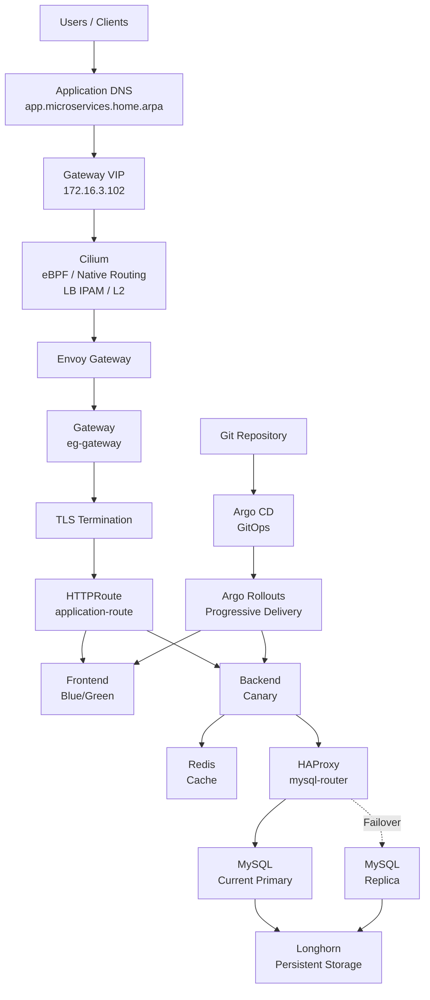

---

# ☸️ RKE2 Kubernetes Foundation

The Kubernetes platform is built using RKE2.

The cluster contains three control-plane nodes and three worker nodes.

## Control Plane

- `rke2-cp1`
- `k8s-rke2-cp2`
- `k8s-rke2-cp3`

## Workers

- `rke2-worke01`
- `rke2-worke02`
- `rke2-worke03`

The cluster runs:

`v1.35.7+rke2r1`

The control plane uses embedded etcd.

Three control-plane nodes provide an HA control-plane architecture where etcd maintains quorum across the cluster.

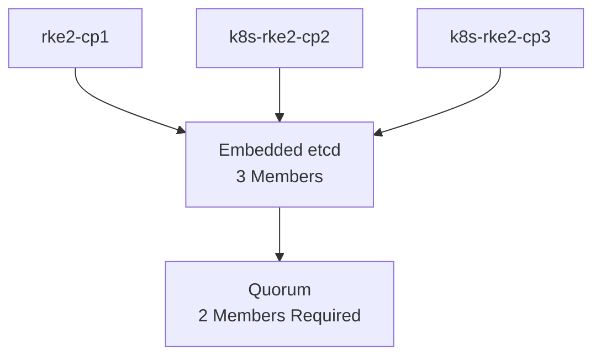

With three etcd members:

- One control-plane failure can be tolerated while maintaining quorum.
- Two simultaneous control-plane failures would remove etcd quorum.

RKE2's built-in ingress controller is disabled because Gateway API and Envoy Gateway provide the external application entry point.

The RKE2 CNI is also disabled so that Cilium owns the Kubernetes networking layer.

---

# 🌐 Network Architecture

Each VM uses three networks:

- Control Network
- Pod Network
- NAT Network

The internal Kubernetes networks use MTU 1400.

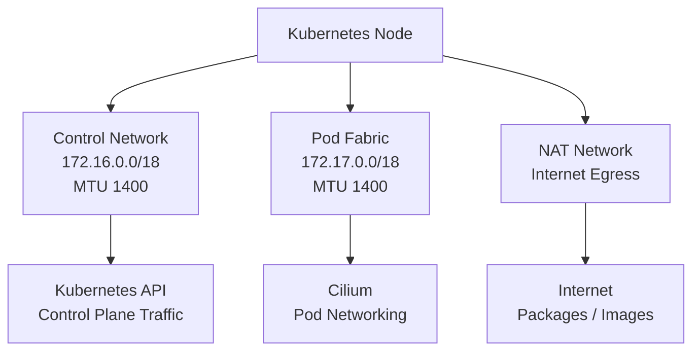

The Control Network is used for Kubernetes control-plane communication.

The Pod Network provides the dedicated internal fabric used by Cilium for cluster networking.

The NAT network is used for Internet access such as package installation and container image retrieval.

Internal node-to-node communication does not depend on NAT.

This separation keeps management traffic, cluster networking, and external egress logically separated.

---

# 🐝 Cilium Networking

Cilium is the production CNI used by the cluster.

Its responsibilities include:

- eBPF datapath
- Pod networking
- Service networking
- Native routing
- kube-proxy replacement capability
- LoadBalancer IPAM
- L2 announcements

The platform uses native routing instead of relying on an overlay network for the primary Pod networking model.

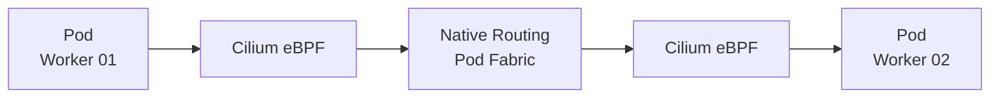

Native routing allows traffic to use the dedicated Pod-fabric network without adding an overlay encapsulation layer.

---

# 🚪 Gateway API and Envoy Gateway

Gateway API provides the external application entry point.

The final Gateway implementation uses Envoy Gateway.

Cilium provides the underlying Kubernetes networking capabilities together with LoadBalancer IP allocation and L2 announcement.

The Gateway is exposed through:

`172.16.3.102`

The application endpoint is:

`https://app.microservices.home.arpa`

The Gateway layer consists of:

- GatewayClass
- Gateway
- HTTPRoute
- Envoy Gateway
- TLS termination
- Application Services

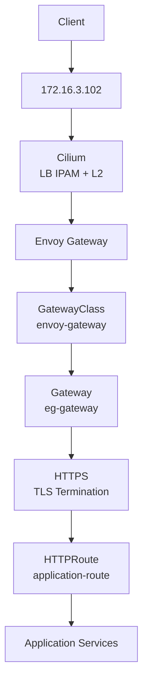

Gateway API separates infrastructure-level Gateway configuration from application-level routing.

This provides a cleaner responsibility model than putting all routing configuration into a single traditional Ingress resource.

---

# 🔀 Application Routing

The application HTTPRoute exposes frontend and backend paths.

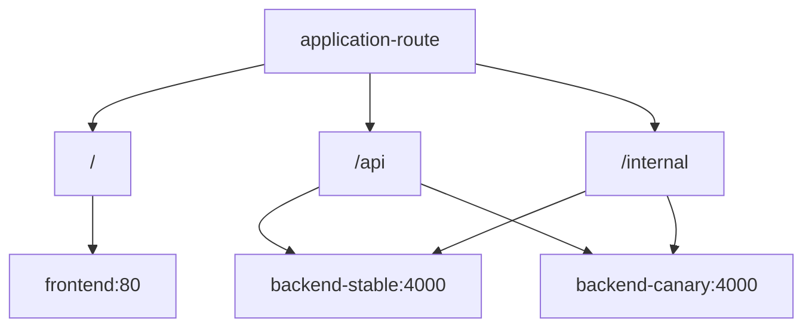

The backend stable and canary Services are used by Argo Rollouts to implement progressive traffic shifting.

---

# 🔐 TLS and Secure Application Access

The Gateway provides an HTTPS listener for:

`*.microservices.home.arpa`

TLS is terminated at Envoy Gateway.

The application is accessed through:

`https://app.microservices.home.arpa`

The Gateway configuration also includes security-oriented HTTP behavior such as HSTS.

The application route attaches specifically to the HTTPS Gateway listener.

---

# 📸 Gateway Evidence


The Gateway was validated against the actual Gateway IP.

Validated application paths include:

- `/`
- `/api/health`
- `/api/products`
- `/internal/health`

---

# 🔄 GitOps with Argo CD

Argo CD provides GitOps reconciliation for the application platform.

The Argo CD Application is:

`microservices-platform`

The Git repository acts as the desired-state source.

The Application recursively manages the manifests under the `apps/` directory.

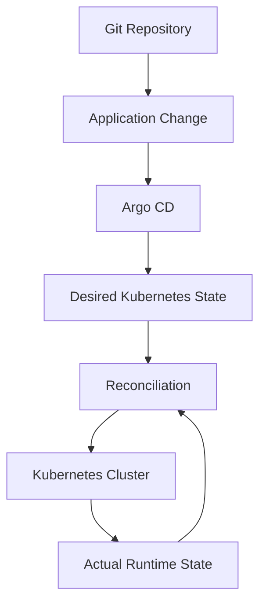

Argo CD is configured with:

- Automated synchronization
- Pruning
- Self-healing

This ensures that the runtime cluster continuously converges toward the desired state stored in Git.

---

# 🧩 GitOps and Runtime Ownership

The backend Canary rollout dynamically modifies HTTPRoute backend weights.

To avoid fighting with Argo Rollouts, Argo CD ignores only the runtime-managed weight fields.

The HTTPRoute itself remains GitOps-managed.

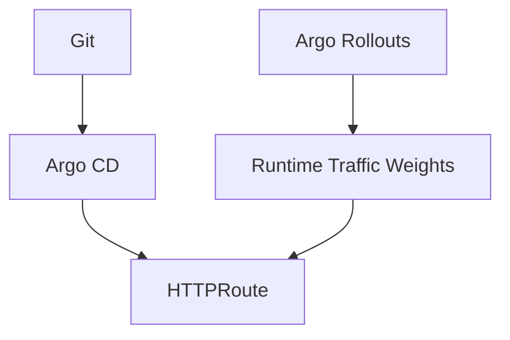

This creates a clear ownership model:

- Argo CD owns the desired resource definition.
- Argo Rollouts owns temporary runtime traffic weights.

---

# 📸 GitOps Evidence


The Argo CD Application was validated as Synced and Healthy.

---

# 📦 Progressive Delivery

Argo Rollouts manages progressive application releases.

Two different deployment strategies are intentionally implemented:

- Backend: Canary
- Frontend: Blue/Green

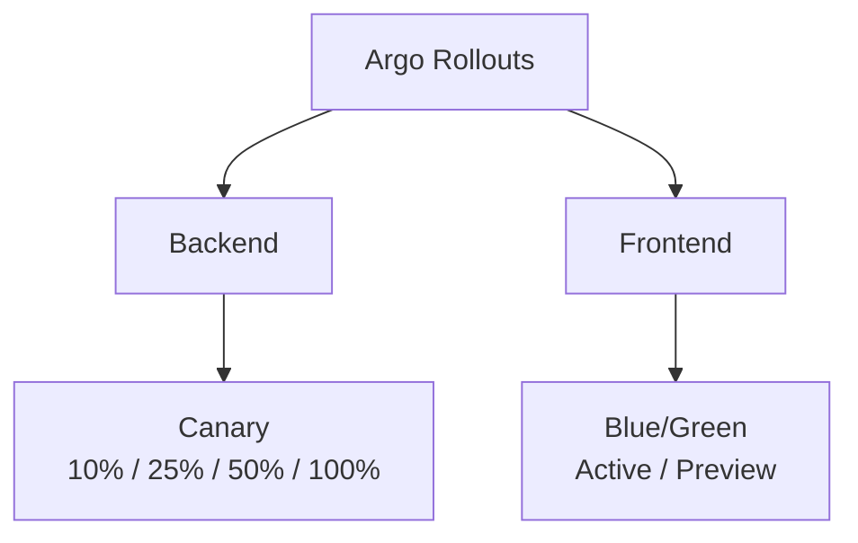

The current implementation uses manual promotion.

This makes every stage visible during the lab and allows validation before the next production transition.

---

# 🟡 Backend Canary

The Backend uses a Canary rollout strategy.

The architecture contains:

- `backend-stable`
- `backend-canary`
- Gateway API
- Envoy Gateway
- Argo Rollouts

Traffic progression:

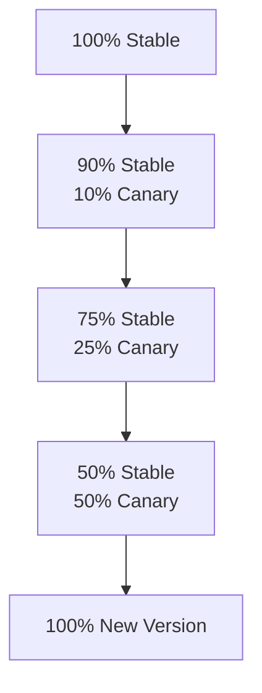

Each stage uses a manual pause.

Argo Rollouts modifies the Gateway API HTTPRoute weights during the progression.

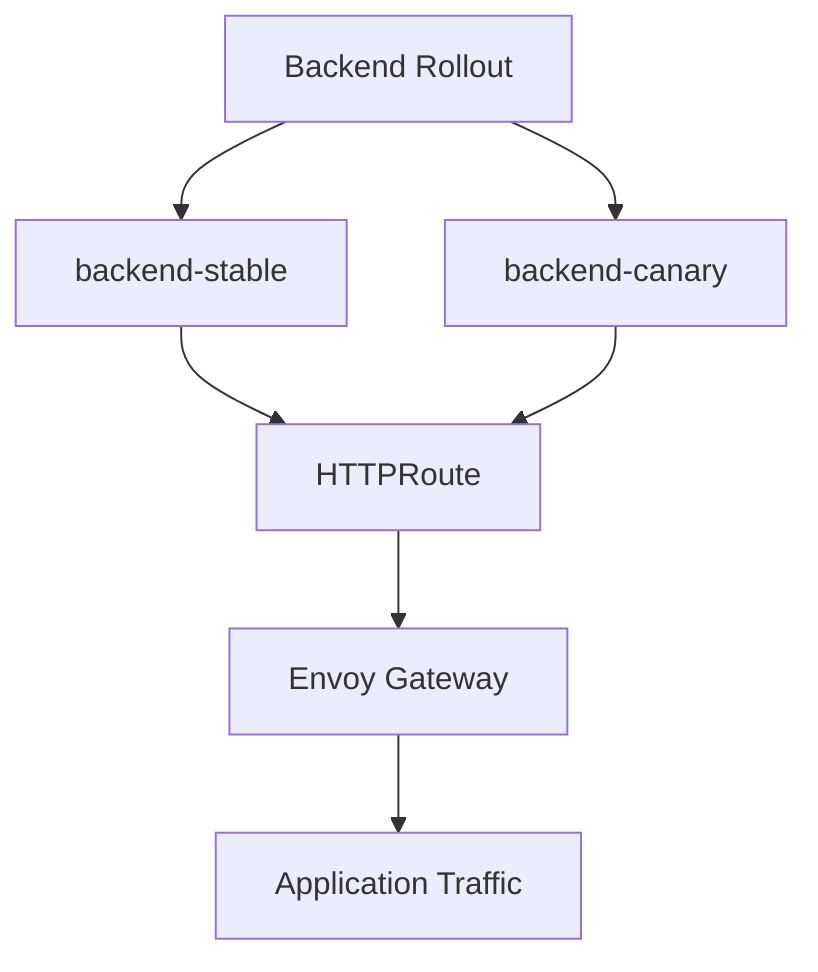

---

# 📸 Backend Canary Evidence


The screenshots demonstrate the healthy rollout state and Gateway API traffic configuration.

---

# 🔵 Frontend Blue/Green

The Frontend uses the Blue/Green strategy.

Two Services are maintained:

- `frontend`
- `frontend-preview`

The active Service represents production traffic.

The preview Service is used to expose and validate the new version before promotion.

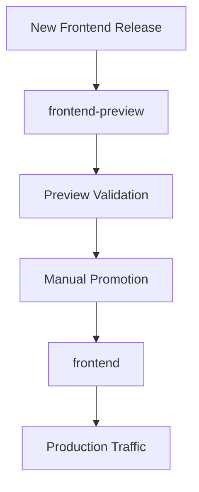

The current successful release is:

`a7medsayed/frontend:v1.0.1`

Promotion is performed manually.

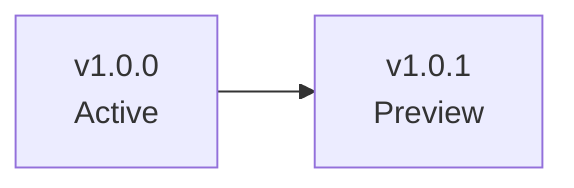

After promotion:

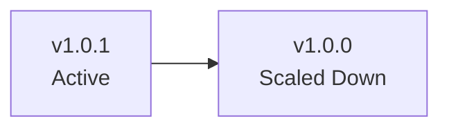

---

# 🧪 Progressive Delivery Failure Isolation

A failed Preview release must not automatically replace the known-good production version.

This behavior was demonstrated using a failed Frontend Preview release.

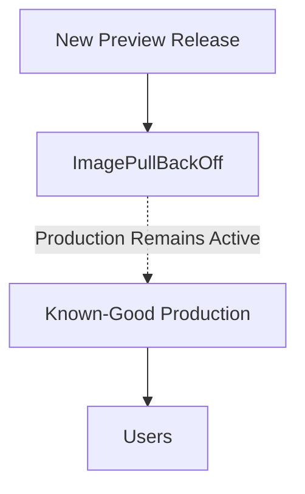

The failed Preview was isolated while the active production release remained available.

---

# 📸 Failure Evidence


This demonstrates one of the key Blue/Green safety properties:

A failed Preview release does not automatically replace the active production release.

---

# 💾 Persistent Storage

Longhorn provides the persistent storage layer for stateful workloads.

The storage architecture includes:

- Longhorn
- StorageClass
- PersistentVolumeClaims
- PersistentVolumes
- Replicated storage
- MySQL StatefulSets

The default StorageClass is:

`longhorn`

The MySQL persistent volumes use 10Gi storage.

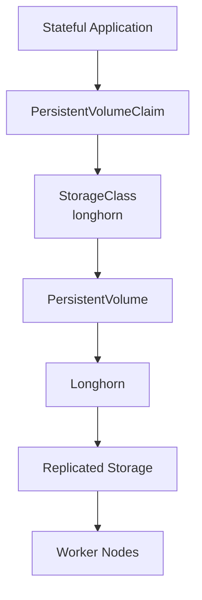

Longhorn is configured for three-way volume replication.

Persistent storage separates application data from the lifecycle of individual Kubernetes Pods.

---

# 🗄️ MySQL High Availability

The database layer uses:

- MySQL Primary
- MySQL Replica
- HAProxy
- MySQL Failover Controller
- Persistent storage
- StatefulSets

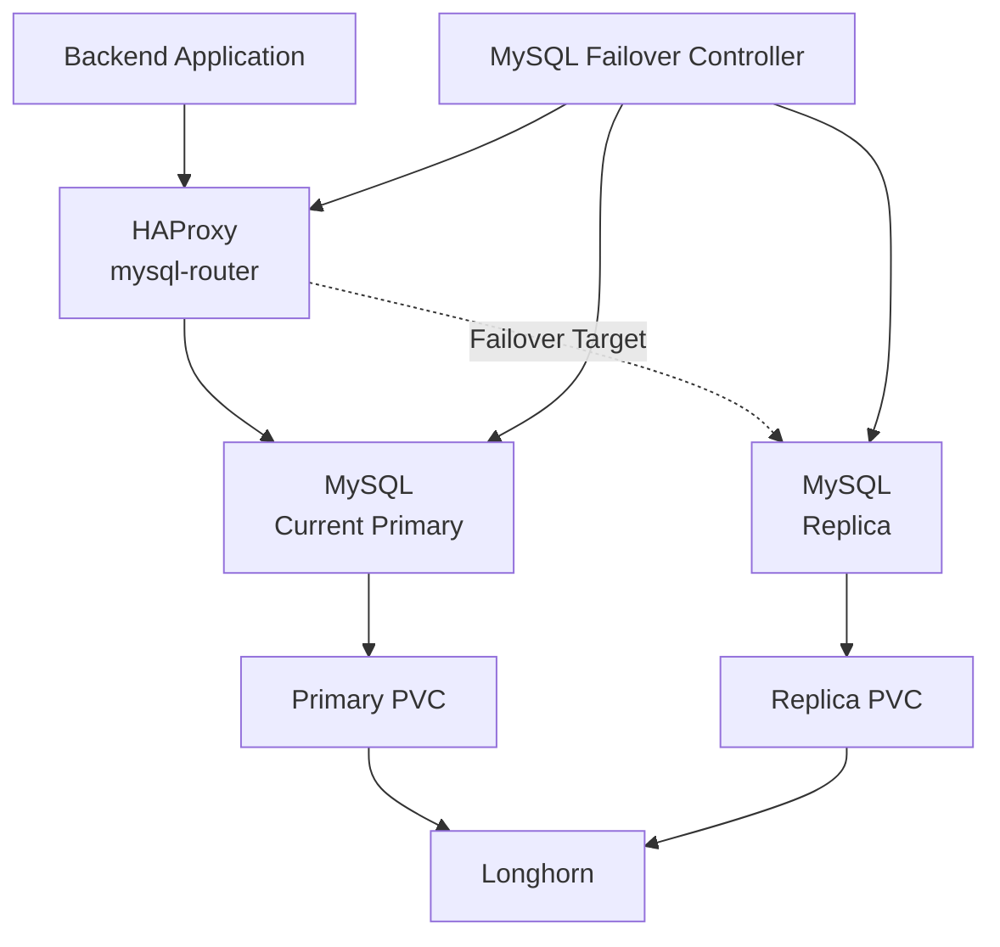

The application does not need to know which MySQL instance is currently primary.

HAProxy provides a stable database access point.

The failover controller monitors the database topology and handles the controlled primary-to-replica transition.

---

# ❤️ Automatic MySQL Failover

The platform includes a controlled MySQL failover mechanism.

The demonstrated failure scenario starts with a healthy primary and replica.

When the primary becomes unavailable, the failover controller detects the failure and promotes the replica.

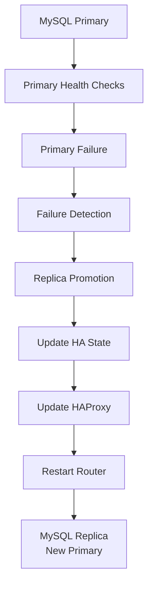

The validated failover state is represented by:

`current-primary = mysql-replica`

and:

`rejoin-required = true`

The failed primary Pod is recreated by Kubernetes.

The recreated Pod is treated as a recovery candidate rather than automatically becoming the database primary again.

---

# 🔁 MySQL Recovery and Rejoin

The recovery model separates database leadership from Kubernetes Pod identity.

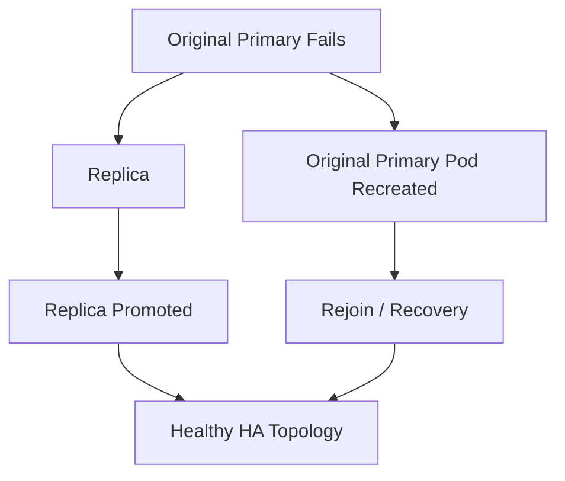

This avoids assuming that the StatefulSet name alone determines database leadership.

---

# 🧠 Redis Caching Layer

Redis provides a fast-access caching layer for application workloads.

Redis and MySQL have different responsibilities.

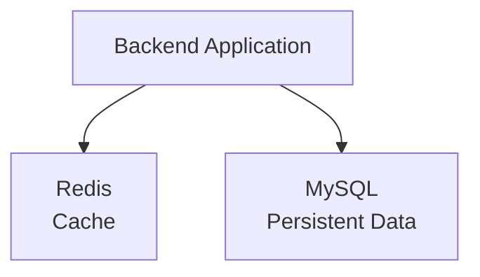

Redis is used for cache-oriented access while MySQL remains responsible for persistent application data.

This keeps caching concerns separate from the persistent database layer.

---

# 🧱 Application Architecture

The application layer consists of:

- Frontend
- Backend
- Redis
- MySQL

```mermaid
graph TD

    FRONTEND["Frontend"]

    BACKEND["Backend"]

    REDIS["Redis"]

    MYSQL["MySQL HA"]

    FRONTEND --> BACKEND
    BACKEND --> REDIS
    BACKEND --> MYSQL
```

The application components are independently deployable and are managed through Kubernetes resources and GitOps.

---

# 🔄 End-to-End GitOps Delivery

The complete delivery model combines Git, Argo CD, Argo Rollouts, Gateway API, and Kubernetes.

```mermaid
graph TD

    DEVELOPER["Developer"]

    PR["Pull Request"]

    GIT["Git Repository"]

    ARGOCD["Argo CD"]

    MANIFESTS["Application Manifests"]

    ROLLOUTS["Argo Rollouts"]

    GATEWAY["Gateway API"]

    ENVOY["Envoy Gateway"]

    APPLICATION["Application"]

    VALIDATE["Validation"]

    PROMOTE["Promotion"]

    DEVELOPER --> PR
    PR --> GIT
    GIT --> ARGOCD
    ARGOCD --> MANIFESTS
    MANIFESTS --> ROLLOUTS

    ROLLOUTS --> GATEWAY
    GATEWAY --> ENVOY
    ENVOY --> APPLICATION

    APPLICATION --> VALIDATE
    VALIDATE --> PROMOTE
```

This model provides a clear separation between:

- Desired state
- Cluster reconciliation
- Release progression
- External traffic routing
- Application validation

---

# 🧯 Failure and Recovery

The platform treats failure scenarios as part of the operational design.

Validated failure behavior includes:

- Failed Frontend Preview
- Production isolation
- Backend progressive rollout
- MySQL primary Pod failure
- Automatic replica promotion
- HA state transition
- Primary Pod recreation
- Persistent storage across Pod lifecycle

```mermaid
graph TD

    FAILURE["Failure"]

    DETECT["Detection"]

    ISOLATE["Isolation"]

    RECOVER["Recovery"]

    VALIDATE["Validation"]

    SUCCESS["Healthy State"]

    FAILURE --> DETECT
    DETECT --> ISOLATE
    ISOLATE --> RECOVER
    RECOVER --> VALIDATE
    VALIDATE --> SUCCESS
```

---

# 📸 Selected Evidence

The repository contains detailed screenshots inside:

`screenshots/`

Selected evidence includes:


The screenshots are intentionally selected to demonstrate important implementation milestones without duplicating every command output.

---

# 📚 Documentation

Detailed documentation is organized by platform layer.

```text
docs/
├── 01-rke2/
├── 02-cilium/
├── 03-gateway/
├── 04-storage/
└── 05-progressive-delivery/
```

Each documentation section covers the implementation, configuration, validation, design decisions, and evidence for that platform layer.

---

# 🏛️ Design Principles

## Separation of Responsibilities

Each platform component has a defined role.

```mermaid
graph TD

    RKE2["RKE2<br/>Kubernetes Foundation"]

    CILIUM["Cilium<br/>Networking"]

    ENVOY["Envoy Gateway<br/>External Routing"]

    ARGOCD["Argo CD<br/>GitOps"]

    ROLLOUTS["Argo Rollouts<br/>Progressive Delivery"]

    LONGHORN["Longhorn<br/>Persistent Storage"]

    MYSQL["MySQL HA<br/>Persistent Data"]

    REDIS["Redis<br/>Caching"]

    RKE2 --> CILIUM
    CILIUM --> ENVOY
    ENVOY --> ARGOCD
    ARGOCD --> ROLLOUTS
    ROLLOUTS --> MYSQL
    ROLLOUTS --> REDIS
    MYSQL --> LONGHORN
```

## Git as Source of Truth

Application configuration is maintained in Git and reconciled by Argo CD.

## Progressive Delivery

Application releases are introduced progressively rather than immediately replacing the previous version.

## Failure Isolation

Failed releases are isolated from known-good production whenever the deployment strategy supports it.

## Persistent State

Stateful workloads use persistent storage so that Pod lifecycle does not define data lifecycle.

## Explicit Runtime Ownership

GitOps remains responsible for desired configuration while runtime controllers manage the specific fields they are designed to control.

---

# 📊 Current Implementation Status

## Infrastructure

- [x] RKE2 cluster
- [x] 3 control-plane nodes
- [x] 3 worker nodes
- [x] Embedded etcd
- [x] Dedicated internal networks
- [x] MTU 1400
- [x] NAT egress separation

## Networking

- [x] Cilium CNI
- [x] eBPF datapath
- [x] Native routing
- [x] LoadBalancer IPAM
- [x] L2 announcement
- [x] Kubernetes Service networking

## Gateway

- [x] Gateway API
- [x] Envoy Gateway
- [x] GatewayClass
- [x] Gateway
- [x] HTTPRoute
- [x] HTTPS listener
- [x] TLS termination
- [x] Application routing
- [x] External Gateway validation

## GitOps

- [x] Argo CD
- [x] Git repository integration
- [x] Automated synchronization
- [x] Pruning
- [x] Self-healing
- [x] Runtime HTTPRoute weight ownership

## Progressive Delivery

- [x] Argo Rollouts
- [x] Backend Canary
- [x] Gateway API traffic shifting
- [x] 10/25/50/100 rollout stages
- [x] Frontend Blue/Green
- [x] Active Service
- [x] Preview Service
- [x] Manual promotion
- [x] Failed Preview validation
- [x] Production isolation

## Storage and Stateful Services

- [x] Longhorn
- [x] Dynamic provisioning
- [x] PersistentVolumeClaims
- [x] Replicated storage configuration
- [x] MySQL Primary
- [x] MySQL Replica
- [x] HAProxy
- [x] MySQL failover controller
- [x] Automatic replica promotion
- [x] Primary Pod recreation
- [x] Redis caching layer

## Future Enhancements

- [ ] Prometheus-based rollout analysis
- [ ] Argo Rollouts AnalysisTemplate
- [ ] Automated metric-based promotion
- [ ] Automated metric-based rollback
- [ ] Expanded failure-domain validation
- [ ] Extended observability
- [ ] Additional security hardening

---

# 🎯 Production-Oriented Decisions

## RKE2

RKE2 provides the Kubernetes foundation and HA control-plane architecture.

## Cilium

Cilium provides an eBPF-based networking datapath and native routing model aligned with the dedicated Pod network.

## Gateway API

Gateway API provides a structured separation between platform Gateway configuration and application routing.

## Envoy Gateway

Envoy Gateway provides the Gateway API implementation, Envoy proxy infrastructure, TLS termination, and HTTP routing.

## Argo CD

Argo CD establishes Git as the desired-state source and continuously reconciles the Kubernetes cluster.

## Argo Rollouts

Argo Rollouts provides progressive release control through Canary and Blue/Green strategies.

## Longhorn

Longhorn provides Kubernetes-native persistent storage with replicated volumes.

## MySQL HA

MySQL Primary/Replica, HAProxy, and the failover controller provide a controlled stateful availability model.

## Redis

Redis provides fast cache access while MySQL remains the persistent data layer.

---

# 🗺️ Platform Evolution

The platform is structured so additional production capabilities can be introduced without redesigning the core architecture.

```mermaid
graph TD

    FOUNDATION["Infrastructure<br/>RKE2"]

    NETWORK["Networking<br/>Cilium"]

    GATEWAY["Gateway<br/>Envoy Gateway"]

    GITOPS["GitOps<br/>Argo CD"]

    DELIVERY["Progressive Delivery<br/>Argo Rollouts"]

    STORAGE["Storage<br/>Longhorn"]

    STATEFUL["Stateful Services<br/>MySQL + Redis"]

    OBS["Observability<br/>Prometheus / Metrics"]

    SECURITY["Security<br/>Hardening / Policies"]

    FOUNDATION --> NETWORK
    NETWORK --> GATEWAY
    GATEWAY --> GITOPS
    GITOPS --> DELIVERY
    DELIVERY --> STORAGE
    STORAGE --> STATEFUL
    STATEFUL --> OBS
    OBS --> SECURITY
```

---

# 🏁 Final Architecture

```mermaid
graph TD

    USERS["Users"]

    DNS["Application DNS"]

    VIP["Gateway VIP<br/>172.16.3.102"]

    CILIUM["Cilium"]

    ENVOY["Envoy Gateway"]

    HTTPROUTE["Gateway API<br/>HTTPRoute"]

    FRONTEND["Frontend<br/>Blue/Green"]

    BACKEND["Backend<br/>Canary"]

    REDIS["Redis"]

    HAPROXY["HAProxy"]

    MYSQL_PRIMARY["MySQL Primary"]

    MYSQL_REPLICA["MySQL Replica"]

    LONGHORN["Longhorn"]

    ARGOCD["Argo CD"]

    ROLLOUTS["Argo Rollouts"]

    GIT["Git Repository"]

    USERS --> DNS
    DNS --> VIP
    VIP --> CILIUM
    CILIUM --> ENVOY
    ENVOY --> HTTPROUTE

    HTTPROUTE --> FRONTEND
    HTTPROUTE --> BACKEND

    BACKEND --> REDIS
    BACKEND --> HAPROXY

    HAPROXY --> MYSQL_PRIMARY
    HAPROXY -. Failover .-> MYSQL_REPLICA

    MYSQL_PRIMARY --> LONGHORN
    MYSQL_REPLICA --> LONGHORN

    GIT --> ARGOCD
    ARGOCD --> ROLLOUTS

    ROLLOUTS --> FRONTEND
    ROLLOUTS --> BACKEND
```

---

# 🏆 Final Result

The resulting platform provides a private, production-oriented Kubernetes environment where:

- RKE2 provides the Kubernetes foundation and control-plane HA.
- Cilium provides the cluster networking datapath.
- Envoy Gateway provides the Gateway API-based application entry point.
- Argo CD provides GitOps reconciliation.
- Argo Rollouts provides progressive application delivery.
- Longhorn provides persistent replicated storage.
- MySQL provides persistent application data with a controlled HA model.
- HAProxy provides a stable database access layer.
- The MySQL failover controller handles failure detection and replica promotion.
- Redis provides fast cache access.
- Failure scenarios are explicitly tested and documented.

The architecture is modular and provides a strong foundation for adding observability, security hardening, automated rollout analysis, and additional production controls.

---

**---

**# 📄 License**

This project is licensed under the MIT License.

**---

**# 👨‍💻 Author**

<div align="center">

## Ahmed Sayed

**DevOps Engineer | Cloud Engineer | Docker | AWS | Linux | Kubernetes**

GitHub

https://github.com/ahmed-sayed-devops

LinkedIn

https://linkedin.com/in/ahmed-sayed-devops

⭐ If you found this project useful, consider giving it a Star.

</div>
