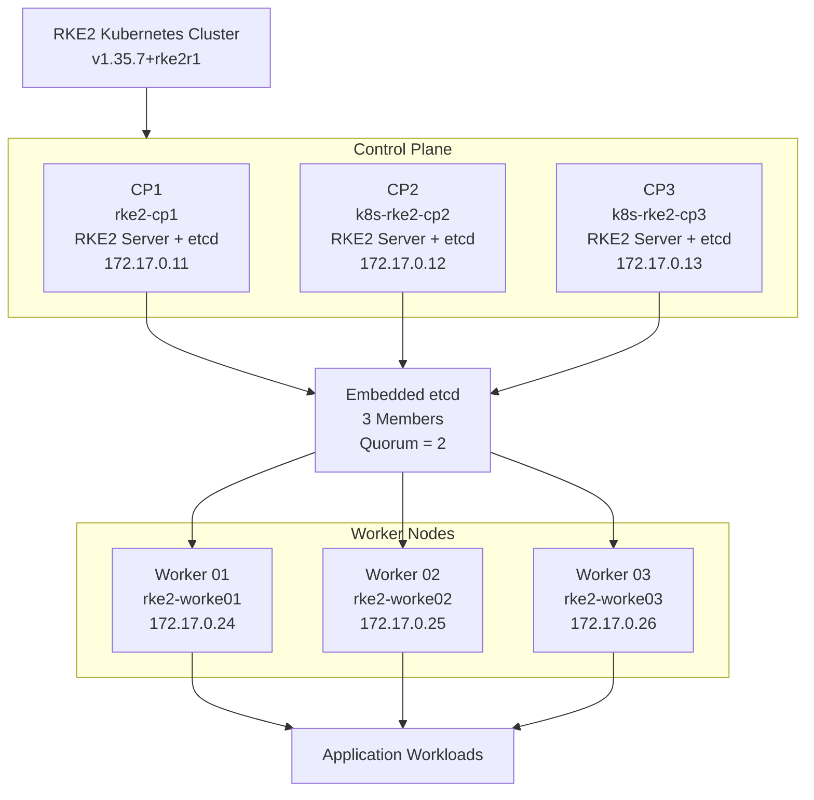
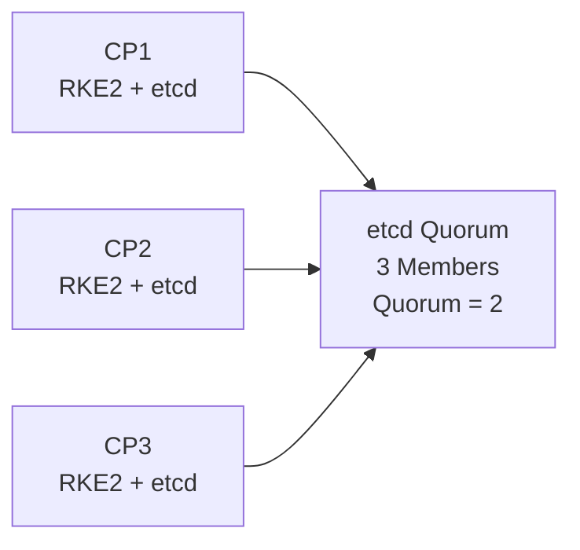
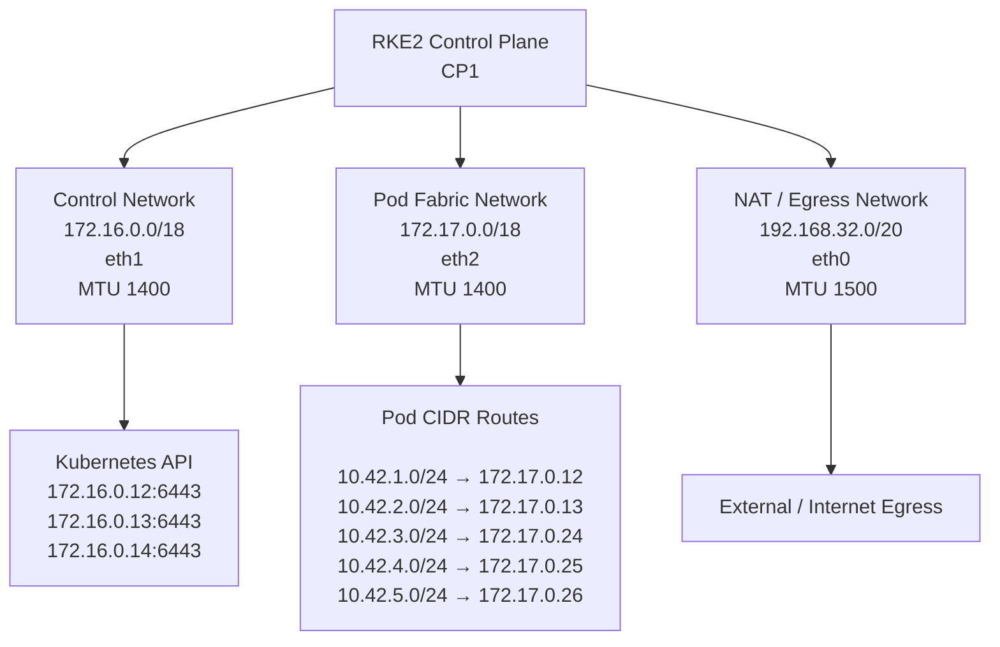
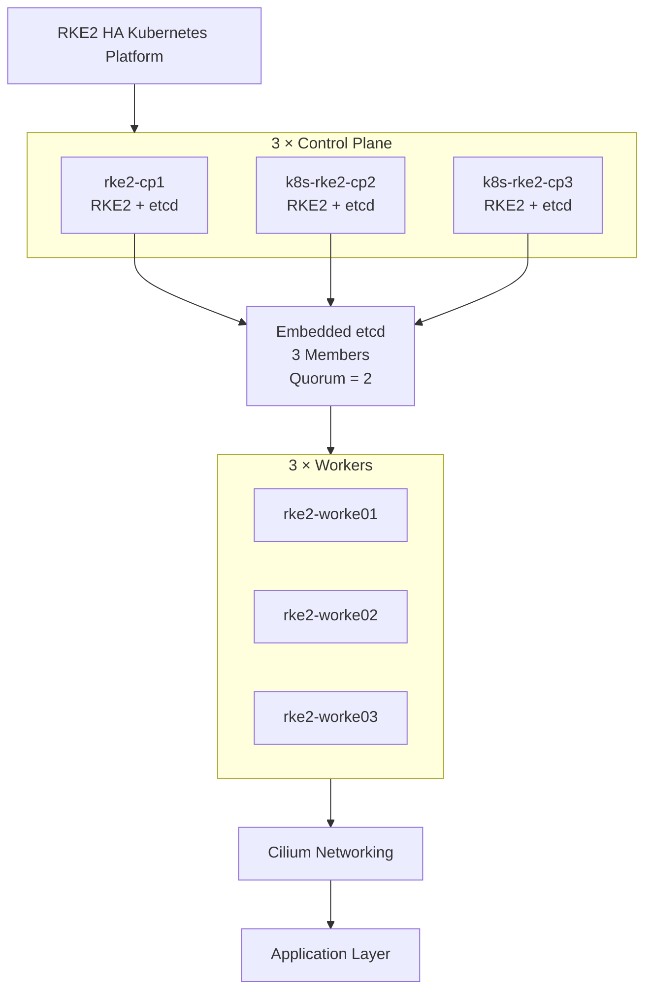

# RKE2 High-Availability Kubernetes Cluster

## 1. Overview

This section documents the Kubernetes infrastructure layer built with **RKE2**.

The current platform consists of:

- 3 RKE2 control-plane nodes
- 3 RKE2 worker nodes
- Embedded etcd with 3 members
- Dedicated internal Control Network
- Dedicated Pod Fabric Network
- Separate NAT / Egress Network
- MTU 1400 on Kubernetes-facing internal networks
- No external IPs assigned to Kubernetes nodes

The objective of this layer is to provide a highly available and production-like Kubernetes foundation for the networking, Gateway API, storage, application, and later GitOps layers.

---

## 2. Architecture



---

## 3. Cluster Topology

| Role | Hostname | Node IP | Kubernetes Role |
|---|---|---:|---|
| Control Plane 1 | `rke2-cp1` | `172.17.0.11` | `control-plane,etcd` |
| Control Plane 2 | `k8s-rke2-cp2` | `172.17.0.12` | `control-plane,etcd` |
| Control Plane 3 | `k8s-rke2-cp3` | `172.17.0.13` | `control-plane,etcd` |
| Worker 01 | `rke2-worke01` | `172.17.0.24` | `worker` |
| Worker 02 | `rke2-worke02` | `172.17.0.25` | `worker` |
| Worker 03 | `rke2-worke03` | `172.17.0.26` | `worker` |

All six nodes were observed in `Ready` state and running:

```text
v1.35.7+rke2r1
```

---

## 4. Why RKE2?

RKE2 was selected as the Kubernetes distribution for this platform because it provides a production-oriented Kubernetes distribution with an integrated high-availability architecture.

The design separates the cluster into:

```text
RKE2 Server
    │
    ├── Kubernetes Control Plane
    └── Embedded etcd

RKE2 Agent
    │
    └── Worker Nodes
```

This provides a realistic multi-node Kubernetes foundation instead of a single-node deployment.

---

## 5. High-Availability Design

The control plane consists of three RKE2 server nodes.



With three etcd members:

```text
Members = 3
Quorum  = 2
```

Therefore:

```text
3 members
    │
    ├── 1 member fails
    │       ↓
    │    2 remain
    │       ↓
    │   Quorum maintained
    │
    └── 2 members fail
            ↓
         1 remains
            ↓
        Quorum lost
```

The three-node design therefore tolerates a single control-plane/etcd member failure.

---

## 6. Kubernetes API Endpoints

The Kubernetes API service currently exposes three control-plane endpoints:

```text
172.16.0.12:6443
172.16.0.13:6443
172.16.0.14:6443
```

This avoids depending on a single control-plane endpoint.

Verification:

```bash
kubectl get endpoints kubernetes -o wide
```

> The `Endpoints` API is deprecated in newer Kubernetes versions; `EndpointSlice` is the preferred API for new tooling.

---

## 7. Node Roles

### Control Plane Nodes

The control-plane nodes have:

```text
node-role.kubernetes.io/control-plane=true
node-role.kubernetes.io/etcd=true
```

They run:

- kube-apiserver
- kube-controller-manager
- kube-scheduler
- embedded etcd
- RKE2 server

### Worker Nodes

The worker nodes have:

```text
node-role.kubernetes.io/worker=true
```

They run the RKE2 agent and provide capacity for application workloads.

---

## 8. Embedded etcd

RKE2 uses embedded etcd for Kubernetes cluster state.

Current etcd members:

```text
etcd-rke2-cp1
etcd-k8s-rke2-cp2
etcd-k8s-rke2-cp3
```

Member addresses:

```text
CP1 → 172.17.0.11
CP2 → 172.17.0.12
CP3 → 172.17.0.13
```

Verification:

```bash
kubectl get pods -n kube-system -l component=etcd -o wide
```

Expected:

```text
3 × etcd members
3 × Running
```

---

## 9. Network Architecture

The cluster uses separate network paths for different traffic purposes.



---

## 10. Control Network

The Control Network is:

```text
Subnet:    172.16.0.0/18
Interface: eth1
MTU:       1400
```

On CP1:

```text
eth1 → 172.16.0.12/18
```

The RKE2 configuration uses:

```yaml
advertise-address: 172.16.0.12
```

The control-plane addresses are:

```text
CP1 → 172.16.0.12
CP2 → 172.16.0.13
CP3 → 172.16.0.14
```

This network is used for the Kubernetes control-plane/API addressing.

---

## 11. Pod Fabric Network

The Pod Fabric Network is:

```text
Subnet:    172.17.0.0/18
Interface: eth2
MTU:       1400
```

CP1 uses:

```yaml
node-ip: 172.17.0.11
```

Observed node addresses:

```text
CP1 → 172.17.0.11
CP2 → 172.17.0.12
CP3 → 172.17.0.13

W01 → 172.17.0.24
W02 → 172.17.0.25
W03 → 172.17.0.26
```

This network provides the internal node/pod networking path.

---

## 12. NAT / Egress Network

CP1 has:

```text
Interface: eth0
Address:   192.168.32.12/20
Gateway:   192.168.32.1
MTU:       1500
```

The default route is:

```text
default via 192.168.32.1 dev eth0
```

This network provides external egress for the nodes.

Internal Kubernetes communication is kept on the dedicated internal networks rather than using the default NAT path.

---

## 13. Routing

The CP1 routing table contains routes to the pod CIDRs through the pod-fabric network:

```text
10.42.1.0/24 → 172.17.0.12
10.42.2.0/24 → 172.17.0.13
10.42.3.0/24 → 172.17.0.24
10.42.4.0/24 → 172.17.0.25
10.42.5.0/24 → 172.17.0.26
```

The node networks are:

```text
172.16.0.0/18 → eth1
172.17.0.0/18 → eth2
192.168.32.0/20 → eth0
```

This keeps internal Kubernetes networking separate from external egress.

---

## 14. MTU

The Kubernetes-facing internal interfaces use MTU 1400:

```text
eth1 → MTU 1400
eth2 → MTU 1400
```

The Cilium host interfaces also use MTU 1400.

The NAT interface remains at:

```text
eth0 → MTU 1500
```

A consistent internal MTU is important for predictable packet handling across the Kubernetes networking path.

---

## 15. RKE2 Configuration

The relevant CP1 configuration is:

```yaml
node-ip: 172.17.0.11
advertise-address: 172.16.0.12

cni: none
ingress-controller: none
```

### `node-ip`

The `node-ip` points to the Pod Fabric network:

```text
172.17.0.11
```

### `advertise-address`

The `advertise-address` points to the Control Network:

```text
172.16.0.12
```

This separation is intentional:

```text
Kubernetes API / Control Plane
        ↓
172.16.0.x
        ↓
Control Network

Node / Pod Networking
        ↓
172.17.0.x
        ↓
Pod Fabric
```

### `cni: none`

The built-in RKE2 CNI is disabled because **Cilium** provides the cluster networking layer.

### `ingress-controller: none`

The built-in ingress controller is disabled because the platform uses **Gateway API with Envoy Gateway** for application north-south traffic.

---

## 16. Connectivity Verification

Control-network connectivity from CP1 was verified successfully:

```text
172.16.0.12 → 172.16.0.13
0% packet loss

172.16.0.12 → 172.16.0.14
0% packet loss
```

Pod-fabric connectivity from CP1 to the other control planes and all three workers was also verified with `0% packet loss`.

Example:

```bash
ping -c 3 172.16.0.13
ping -c 3 172.16.0.14

ping -c 3 172.17.0.12
ping -c 3 172.17.0.13

ping -c 3 172.17.0.24
ping -c 3 172.17.0.25
ping -c 3 172.17.0.26
```

---

## 17. Verification Commands

### Cluster Nodes

```bash
kubectl get nodes -o wide
```

### Node Roles

```bash
kubectl get nodes --show-labels
```

### Control Planes

```bash
kubectl get nodes \
  -l node-role.kubernetes.io/control-plane \
  -o wide
```

### etcd Members

```bash
kubectl get pods \
  -n kube-system \
  -l component=etcd \
  -o wide
```

### Kubernetes API Endpoints

```bash
kubectl get endpoints kubernetes -o wide
```

### RKE2 Version

```bash
rke2 --version
```

### Network Interfaces

```bash
ip -br addr
```

### Routing

```bash
ip route
```

### MTU

```bash
ip link
```

---

## 18. Evidence

The following screenshots were captured directly from the cluster and are stored at the repository root under:

```text
screenshots/
├── 01-Nodes(CPs & Workers).png
└── 02-ETCD Members & Net Interfaces.png
```

### 01 — Nodes (CPs & Workers)


This screenshot shows:

- 3 control-plane nodes
- 3 worker nodes
- Node roles
- Ready status
- Kubernetes version
- Internal node addresses

### 02 — etcd Members & Network Interfaces


This screenshot shows:

- 3 embedded etcd members
- Control-plane node addresses
- `eth1` control network
- `eth2` pod-fabric network
- Network addressing and interface state

---

## 19. Design Decisions

| Decision | Rationale |
|---|---|
| 3 control-plane nodes | Provides etcd quorum of 2 and tolerates one member failure |
| 3 worker nodes | Provides distributed workload capacity |
| Embedded etcd | Integrated RKE2 HA cluster-state storage |
| Separate Control Network | Isolates control-plane/API addressing |
| Separate Pod Fabric | Provides a dedicated internal node/pod networking path |
| Separate NAT Network | Keeps external egress separate from internal Kubernetes traffic |
| MTU 1400 internally | Maintains a consistent Kubernetes-facing MTU |
| `cni: none` | Allows Cilium to provide the cluster CNI |
| `ingress-controller: none` | Allows Envoy Gateway to provide Gateway API traffic management |

---

## 20. Security Considerations

The RKE2 configuration contains a cluster join token.

The token must **never** be:

- committed to Git
- included in screenshots
- included in documentation
- shared publicly

When documenting the RKE2 configuration, only sanitized configuration should be displayed.

---

## 21. Failure Testing

The HA design will be validated through a controlled failure test.

### Planned test

```text
Healthy Cluster
      │
      ▼
Stop one Control Plane
      │
      ▼
2 etcd members remain
      │
      ▼
Quorum maintained
      │
      ▼
Cluster continues operating
      │
      ▼
Restore failed node
      │
      ▼
Cluster returns to 3-member state
```

The actual failure test results will be added here after execution.

---

## 22. Final State



The RKE2 infrastructure layer provides the highly available Kubernetes foundation for the platform.

The next layer will document **Cilium**, including:

- eBPF datapath
- Native routing
- kube-proxy replacement
- Pod CIDR routing
- Cilium LoadBalancer
- LoadBalancer IPAM
- L2 announcements
- MTU considerations
- Service traffic flow
