# Cilium Networking

Cilium is the production CNI layer used by the RKE2 Kubernetes cluster.

The platform uses Cilium to provide:

- eBPF-based networking
- Native Routing between Kubernetes nodes
- Kubernetes Pod networking
- Kubernetes Service load balancing through eBPF
- kube-proxy replacement capability
- LoadBalancer IP Address Management (LB IPAM)
- Layer 2 LoadBalancer IP announcements
- Hubble-based observability support
- Network policy enforcement

The Cilium layer sits between the RKE2 Kubernetes control plane and the application/Gateway layers.

The final platform networking flow is:

Client
  |
  v
LoadBalancer VIP
  |
  v
Cilium L2 Announcement / LB IPAM
  |
  v
Cilium eBPF Datapath
  |
  v
Envoy Gateway
  |
  v
Gateway API HTTPRoute
  |
  +------------------+
  |                  |
  v                  v
Frontend           Backend
                       |
                       +----> MySQL Router
                       |
                       +----> Redis


---

# 1. Architecture

## 1.1 High-Level Cilium Architecture

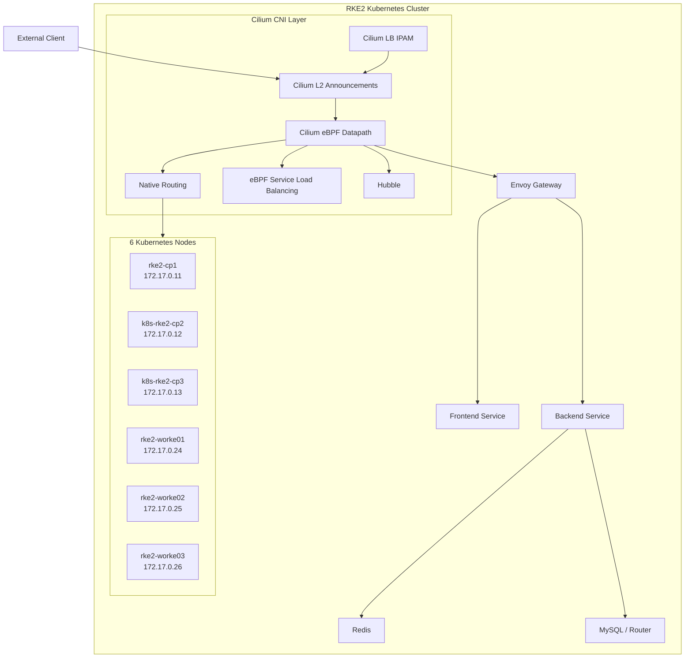

Cilium runs as a DaemonSet, placing one Cilium agent on every Kubernetes node.

The actual cluster contains six Cilium agents, one on each of the three control-plane nodes and three worker nodes.

The current Cilium DaemonSet reports:

- Desired: 6
- Current: 6
- Ready: 6
- Available: 6

The Cilium agents are also visible on all six nodes.

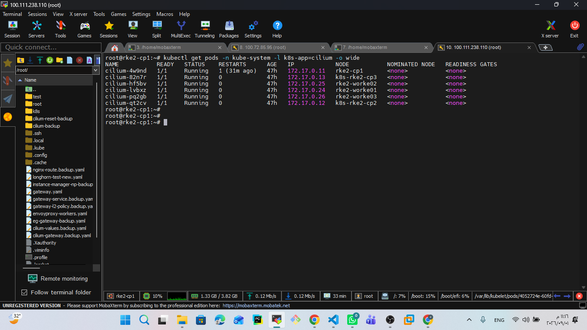


---

# 2. Why Cilium?

The cluster is designed as a private, production-like Kubernetes environment rather than a simple single-node Kubernetes lab.

Cilium was selected because it provides networking through the Linux kernel using eBPF instead of depending entirely on traditional iptables-based datapaths.

The important design goals are:

1. Efficient Pod-to-Pod networking.
2. Native routing instead of overlay encapsulation.
3. eBPF-based Service handling.
4. LoadBalancer IP management for the private network.
5. Layer 2 announcement of LoadBalancer VIPs.
6. Network policy support.
7. Hubble integration for future observability.
8. A networking layer suitable for Gateway API and progressive delivery workloads.

This keeps the network architecture close to a production private-cloud design.


---

# 3. Cilium's Role in the Platform

Cilium is responsible for the Kubernetes networking layer.

It is not the application Gateway itself.

The responsibilities are separated as follows:

| Component | Responsibility |
|---|---|
| RKE2 | Kubernetes distribution and control plane |
| Cilium | CNI, eBPF datapath, Pod networking and Service networking |
| Cilium LB IPAM | Allocates LoadBalancer IPs |
| Cilium L2 Announcements | Announces LoadBalancer VIPs on the private LAN |
| Envoy Gateway | Implements Gateway API and HTTP routing |
| Gateway API | Defines Gateway and HTTPRoute resources |
| Kubernetes Services | Provide application service abstraction |
| Longhorn | Persistent storage |
| Argo CD | GitOps reconciliation |
| Argo Rollouts | Progressive delivery |

This separation is intentional.

Cilium provides the network datapath, while Envoy Gateway provides the L7 Gateway API implementation.


---

# 4. Cilium Installation Model

RKE2 was prepared without the default CNI so that Cilium could become the cluster networking layer.

The RKE2 configuration contains:

```yaml
cni: none
```

This prevents RKE2 from installing a competing CNI.

The cluster also uses:

```yaml
ingress-controller: none
```

because the Gateway layer is handled separately by Envoy Gateway.

The general installation flow is:

```text
RKE2 Cluster
     |
     | CNI disabled
     v
Kubernetes API
     |
     v
Install Cilium
     |
     +----------------------+
     |                      |
     v                      v
Cilium Agent            Cilium Operator
     |
     v
eBPF Datapath
```

Cilium can be installed through Helm.

A configuration matching the design used by this cluster is conceptually:

```bash
helm repo add cilium https://helm.cilium.io/
helm repo update

helm install cilium cilium/cilium \
  --namespace kube-system \
  --create-namespace \
  --set ipam.mode=kubernetes \
  --set routingMode=native \
  --set ipv4NativeRoutingCIDR=10.42.0.0/16 \
  --set autoDirectNodeRoutes=true \
  --set devices=eth2 \
  --set kubeProxyReplacement=true \
  --set l2announcements.enabled=true \
  --set operator.replicas=2
```

The exact historical Helm command used to bootstrap this cluster was not preserved in the captured terminal output. Therefore, the command above documents the intended configuration rather than claiming to be the exact original installation command.

The resulting configuration can be verified through:

```bash
kubectl -n kube-system get configmap cilium-config -o yaml
```

Cilium stores the effective agent configuration in the `cilium-config` ConfigMap.

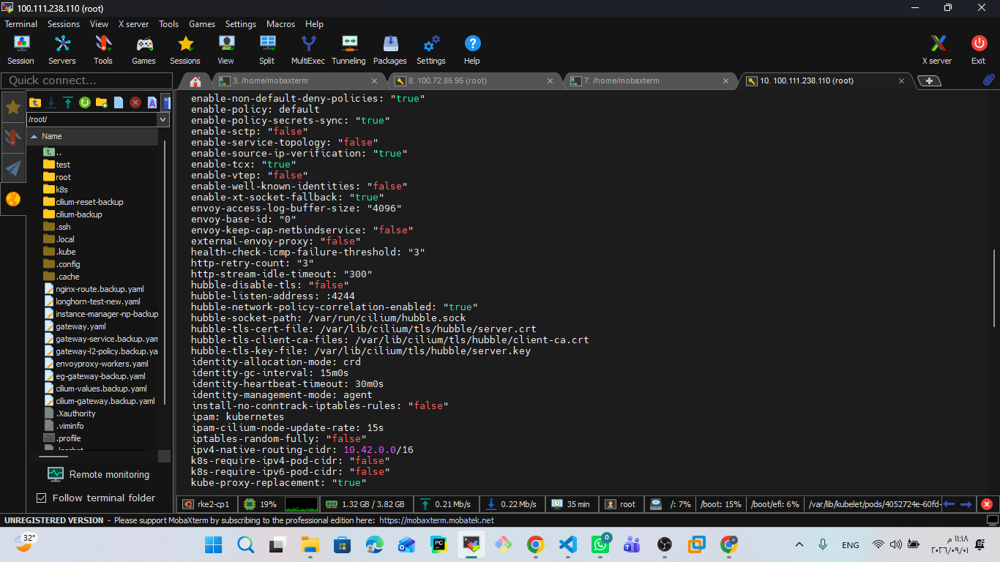


---

# 5. Cilium Configuration

The important configuration values in the running cluster are:

```yaml
ipam: kubernetes

routing-mode: native

ipv4-native-routing-cidr: 10.42.0.0/16

auto-direct-node-routes: "true"

devices: eth2

direct-routing-device: eth2

kube-proxy-replacement: "true"

enable-l2-announcements: "true"

enable-lb-ipam: "true"

default-lb-service-ipam: lbipam

enable-hubble: "true"

enable-metrics: "true"

enable-endpoint-routes: "true"
```

These values define the main networking behavior of the cluster.

The most important design decision is:

```yaml
routing-mode: native
```

combined with:

```yaml
auto-direct-node-routes: true
```

and:

```yaml
direct-routing-device: eth2
```

This means that Pod traffic between nodes is routed using the Linux routing table over the dedicated Pod-fabric network.


---

# 6. Network Interface Selection

The Kubernetes nodes have three network roles:

```text
                Kubernetes Node
                      |
          +-----------+-----------+
          |           |           |
          v           v           v
        eth0        eth1        eth2
         |           |           |
         v           v           v
       NAT        Control       Pod Fabric
    192.168.x    172.16.x      172.17.x
```

For the Cilium datapath, `eth2` is the important interface.

On CP1:

```text
eth0 -> 192.168.32.12/20
eth1 -> 172.16.0.12/18
eth2 -> 172.17.0.11/18
```

The Cilium configuration explicitly uses:

```yaml
devices: eth2
direct-routing-device: eth2
```

Therefore:

```text
Control-plane traffic
        |
        v
      eth1

Pod traffic
        |
        v
      eth2

Internet / package egress
        |
        v
      eth0
```

This keeps Kubernetes control traffic and Pod traffic logically separated.


---

# 7. Native Routing

## 7.1 What Is Native Routing?

In native routing mode, Cilium does not encapsulate every cross-node Pod packet inside an overlay tunnel.

Instead, Cilium allows the Linux kernel to route the Pod packet using normal IP routing.

Conceptually:

```text
Pod A
 |
 | Packet
 v
Cilium eBPF
 |
 v
Linux Routing Table
 |
 v
Pod CIDR Route
 |
 v
Pod Fabric
 |
 v
Destination Node
 |
 v
Cilium eBPF
 |
 v
Pod B
```

Native routing therefore depends on the underlying network being able to route the Pod CIDRs.


---

# 8. Pod CIDR Design

The cluster uses:

```text
Pod CIDR:
10.42.0.0/16
```

Each Kubernetes node receives a `/24` PodCIDR:

```text
rke2-cp1       -> 10.42.0.0/24
k8s-rke2-cp2   -> 10.42.1.0/24
k8s-rke2-cp3   -> 10.42.2.0/24

rke2-worke01   -> 10.42.3.0/24
rke2-worke02   -> 10.42.4.0/24
rke2-worke03   -> 10.42.5.0/24
```

The cluster confirms these PodCIDRs through:

```bash
kubectl get nodes \
  -o custom-columns=NAME:.metadata.name,PODCIDR:.spec.podCIDR
```

The Cilium nodes also map each Kubernetes node to its Cilium internal address.

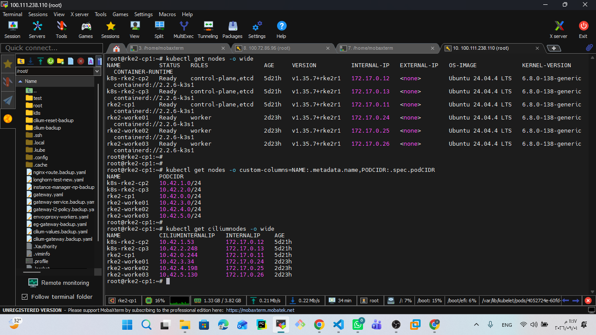


---

# 9. How Native Routing Works in This Cluster

On CP1, the Linux routing table contains:

```text
10.42.1.0/24 via 172.17.0.12 dev eth2
10.42.2.0/24 via 172.17.0.13 dev eth2
10.42.3.0/24 via 172.17.0.24 dev eth2
10.42.4.0/24 via 172.17.0.25 dev eth2
10.42.5.0/24 via 172.17.0.26 dev eth2
```

This is the key evidence that the cluster is using direct native routing between node PodCIDRs.

For example, if a Pod on CP1 wants to reach a Pod on worker03:

```text
Source Pod
10.42.0.x
     |
     v
Cilium eBPF
     |
     v
Linux routing table
     |
     | 10.42.5.0/24
     | via 172.17.0.26
     v
eth2
172.17.0.11
     |
     v
Pod Fabric
172.17.0.0/18
     |
     v
worker03
172.17.0.26
     |
     v
Cilium
     |
     v
Destination Pod
10.42.5.x
```

No VXLAN overlay header is required for this native Pod-to-Pod path.


---

# 10. Native Routing vs VXLAN

This distinction is important because Cilium's configuration contains:

```yaml
routing-mode: native
```

and also:

```yaml
tunnel-protocol: vxlan
```

The important setting for the current datapath is:

```yaml
routing-mode: native
```

The VXLAN protocol setting does not mean that the current Pod datapath is using VXLAN encapsulation.

The routing mode determines whether Cilium uses native routing or tunneling.

---

## 10.1 Native Routing

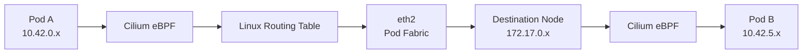

Packet:

```text
Original IP packet
        |
        v
Cilium eBPF
        |
        v
Linux routing
        |
        v
Pod Fabric
        |
        v
Destination node
```

There is no overlay encapsulation added for the cross-node Pod packet.

Advantages:

- Lower encapsulation overhead.
- Simpler packet path.
- Better performance potential.
- Uses the existing node network.
- Easier packet inspection.
- No VXLAN tunnel header.

Trade-off:

The underlying network must be able to route the Pod CIDRs.

---

## 10.2 VXLAN

With VXLAN tunneling mode, the packet would conceptually look like:


Conceptually:

```text
Original Pod packet
        |
        v
VXLAN encapsulation
        |
        v
Outer node-to-node packet
        |
        v
Destination node
        |
        v
VXLAN decapsulation
        |
        v
Original Pod packet
```

Advantages:

- Underlying network does not need to know Pod CIDRs.
- Easier deployment across networks that cannot route Pod CIDRs.
- Provides an overlay abstraction.

Trade-offs:

- Additional encapsulation overhead.
- More processing.
- Additional MTU considerations.
- More complex packet path.


---

# 11. Why Native Routing Was Selected

The cluster already has a dedicated Pod-fabric network:

```text
172.17.0.0/18
```

All nodes have connectivity through this network.

The Pod CIDRs are also explicitly routed between nodes.

Therefore, an overlay tunnel was unnecessary for this topology.

The selected design is:

```text
Dedicated Pod Fabric
        +
Pod CIDR routing
        +
Cilium native routing
        =
Direct Pod networking
```

This keeps the datapath simple and avoids unnecessary encapsulation.


---

# 12. MTU Considerations

The internal Kubernetes networks use an MTU target of:

```text
1400
```

The important interfaces are:

```text
Control Network -> eth1 -> MTU 1400
Pod Fabric      -> eth2 -> MTU 1400
```

The NAT interface remains separate from the internal cluster networks.

The reason MTU matters is that encapsulation can consume additional bytes from the packet.

For example:

```text
Native Routing:

[ IP ][ TCP ][ Application Data ]


VXLAN:

[ Outer IP ][ UDP ][ VXLAN ][ Inner IP ][ TCP ][ Application Data ]
```

Because the current Pod datapath is native routing, the cluster avoids VXLAN encapsulation overhead for normal cross-node Pod traffic.


---

# 13. kube-proxy Replacement

Cilium can implement Kubernetes Service handling using eBPF.

Traditional Kubernetes networking normally uses:

```text
Client
  |
  v
Service
  |
  v
kube-proxy
  |
  v
iptables / IPVS
  |
  v
Backend Pod
```

With Cilium's kube-proxy replacement model:

```text
Client
  |
  v
Service
  |
  v
Cilium eBPF Service LB
  |
  v
Backend Pod
```

The eBPF datapath can perform:

- Service lookup
- Backend selection
- NAT
- NodePort handling
- LoadBalancer handling
- Service traffic forwarding

This moves Service processing into the kernel datapath.

---

# 14. kube-proxy Replacement in the Current Cluster

The running Cilium configuration contains:

```yaml
kube-proxy-replacement: "true"
```

This confirms that Cilium's kube-proxy replacement capability is enabled.

However, the current RKE2 cluster still has kube-proxy Pods running.

Therefore the current cluster should NOT be documented as completely kube-proxy-free.

The accurate state is:

```text
Cilium:
kube-proxy-replacement = true

AND

RKE2:
kube-proxy DaemonSet = still present
```

This distinction is important when describing the current architecture.

---

# 15. kube-proxy Architecture Comparison

## Traditional Kubernetes


The Service traffic is programmed through traditional kernel networking mechanisms.

---

## Cilium eBPF Service Datapath


The Service lookup and backend selection are implemented through Cilium's eBPF datapath.

---

# 16. What Happens to a Service Packet?

Consider:

```text
frontend
ClusterIP:
10.43.48.136:80
```

A Pod sends:

```text
Destination:
10.43.48.136:80
```

The conceptual path is:

```text
Application
     |
     v
ClusterIP
10.43.48.136:80
     |
     v
Cilium eBPF
     |
     v
Service LB lookup
     |
     v
Selected frontend Pod
     |
     v
10.42.x.x:80
```

Instead of depending exclusively on a userspace proxy, Cilium programs the kernel datapath to perform the Service translation.


---

# 17. kube-proxy Status and Migration Consideration

The current cluster has both:

```text
Cilium kube-proxy replacement enabled
```

and:

```text
RKE2 kube-proxy Pods still running
```

Therefore, a future move to a completely kube-proxy-free cluster should be treated as a separate migration task.

A safe migration should include:

```text
Verify Cilium KPR
        |
        v
Validate Service traffic
        |
        v
Migrate node by node
        |
        v
Validate Service traffic
        |
        v
Remove kube-proxy
```

The current Cilium implementation does not claim that this migration has already been completed.


---

# 18. Cilium LoadBalancer IPAM

The private Kubernetes environment does not have a cloud-provider LoadBalancer.

Therefore, Cilium LB IPAM is used to allocate LoadBalancer IP addresses.

The configured pool is:

```text
172.16.3.100 - 172.16.3.150
```

This gives:

```text
Total IPs: 51
Used:       3
Available: 48
```

The current pool is:

```yaml
apiVersion: cilium.io/v2
kind: CiliumLoadBalancerIPPool
metadata:
  name: gateway-pool
spec:
  blocks:
    - start: 172.16.3.100
      stop: 172.16.3.150
```

The pool is not disabled and has no conflict.

Cilium LB IPAM is responsible for allocation.

It does not by itself advertise the IP on the network.

That responsibility is handled by L2 Announcements.

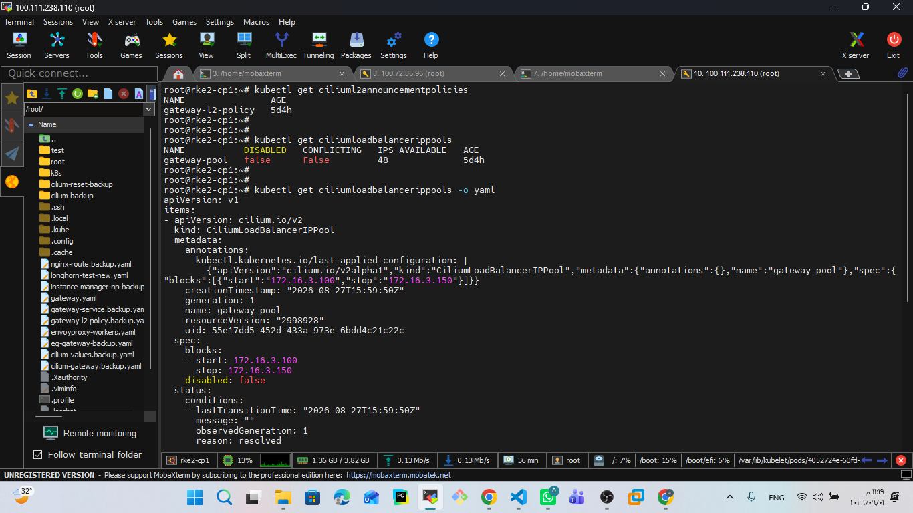


---

# 19. Cilium L2 Announcements

The cluster uses:

```yaml
apiVersion: cilium.io/v2alpha1
kind: CiliumL2AnnouncementPolicy
metadata:
  name: gateway-l2-policy
spec:
  interfaces:
    - eth1
  loadBalancerIPs: true
```

This means LoadBalancer IPs are announced on:

```text
eth1
```

which belongs to the private Control Network:

```text
172.16.0.0/18
```

The important idea is:

```text
LB IPAM
   |
   | Allocates VIP
   v
172.16.3.102
   |
   v
L2 Announcement
   |
   | ARP
   v
Private Network
```

Cilium L2 Announcements make the LoadBalancer VIP reachable on the local Layer-2 network.

---

# 20. LB IPAM + L2 Announcement Architecture

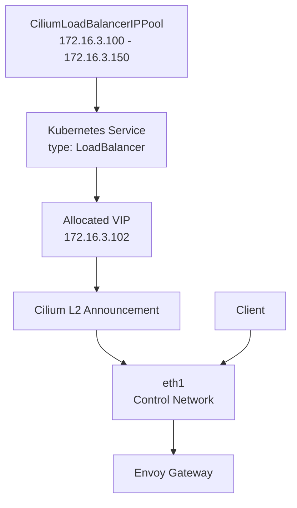

This provides a private-cloud style LoadBalancer mechanism without requiring a cloud LoadBalancer provider.


---

# 21. Gateway VIP Example

The Envoy Gateway Service currently has:

```text
Type:
LoadBalancer

ClusterIP:
10.43.198.235

External IP:
172.16.3.102

Port:
80
```

Therefore the complete path is:

```text
Client
   |
   | HTTP
   v
172.16.3.102:80
   |
   | L2 / ARP
   v
Node announcing VIP
   |
   v
Cilium eBPF Service LB
   |
   v
Envoy Gateway Pod
   |
   v
Gateway API
   |
   v
HTTPRoute
   |
   +----> Frontend
   |
   +----> Backend
```

The separation is:

```text
Cilium:
Network datapath + VIP reachability

Envoy Gateway:
L7 Gateway API + HTTP routing
```

Cilium is not acting as the final Gateway API controller in this design.


---

# 22. Cilium Service Connectivity Test

The networking layer was validated from an actual Pod inside the cluster.

A temporary test client was created:

```bash
kubectl run cilium-test-client \
  --image=curlimages/curl \
  --restart=Never \
  -n microservices \
  -- sleep 3600
```

The Pod received:

```text
IP:
10.42.5.254

Node:
rke2-worke03
```

This confirms that Cilium assigned Pod networking correctly.

The test then accessed the internal frontend Service:

```bash
curl http://frontend
```

The frontend returned its HTTP response successfully.

The same Pod accessed the backend Service:

```bash
curl http://backend:4000/api/health
```

The backend returned:

```json
{
  "status": "UP",
  "database": "UP"
}
```

This validates:

```text
Pod
 |
 v
Cilium networking
 |
 v
Kubernetes Service
 |
 v
Backend Pod
 |
 v
Database connectivity
```

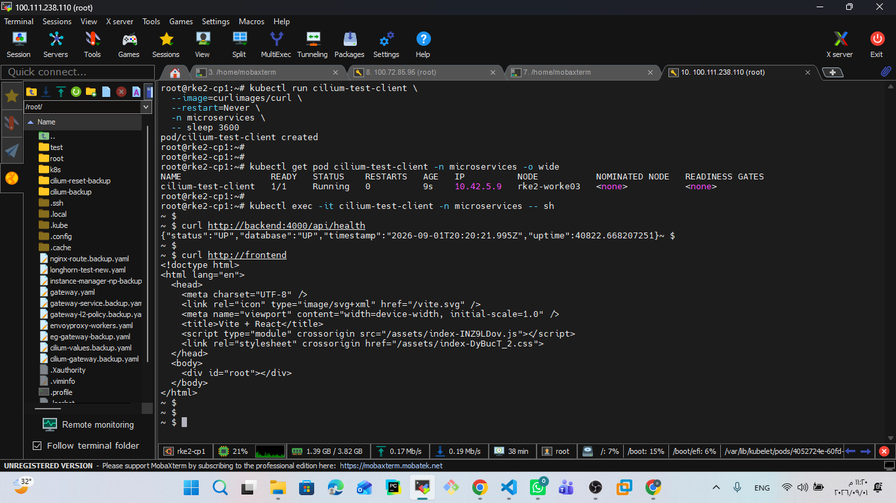


---

# 23. Pod-to-Service Traffic Flow

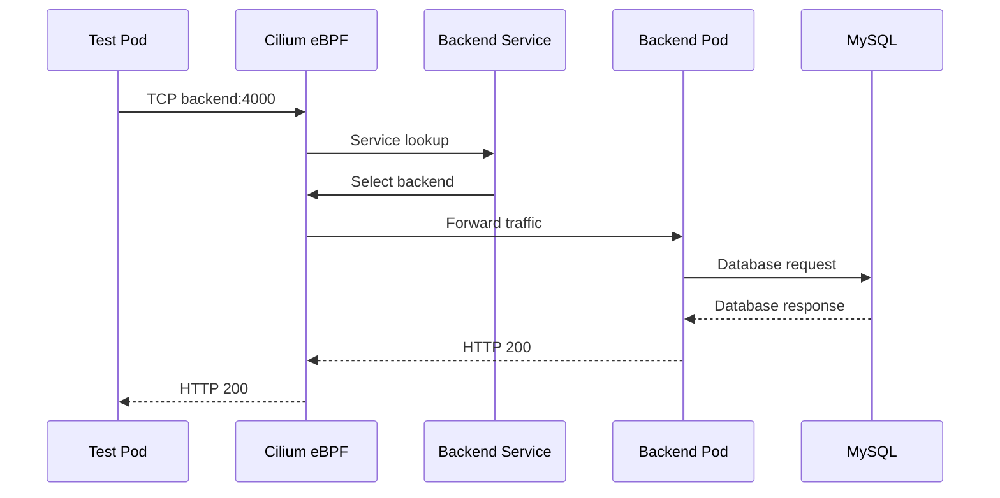

The actual test result was:

```text
GET /api/health

status = UP
database = UP
```

---

# 24. Cilium Node Mapping

Cilium maintains a CiliumNode representation for every Kubernetes node.

Current mapping:

```text
Node               Cilium IP       Pod Network IP

rke2-cp1            10.42.0.244     172.17.0.11
k8s-rke2-cp2        10.42.1.53      172.17.0.12
k8s-rke2-cp3        10.42.2.248     172.17.0.13

rke2-worke01        10.42.3.34      172.17.0.24
rke2-worke02        10.42.4.198     172.17.0.25
rke2-worke03        10.42.5.130     172.17.0.26
```

The Cilium internal addresses are associated with the corresponding node Pod CIDR.

This provides the node-level information required by the Cilium datapath.


---

# 25. Cilium Datapath Summary

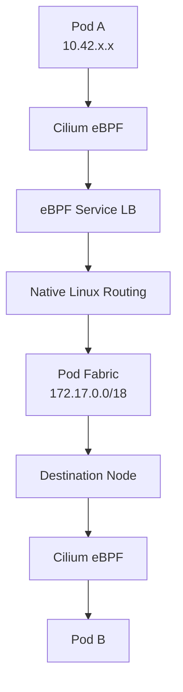

The major design principle is:

```text
eBPF
 +
Native Routing
 +
Dedicated Pod Fabric
```


---

# 26. External Traffic Flow

For external traffic entering through the Gateway:

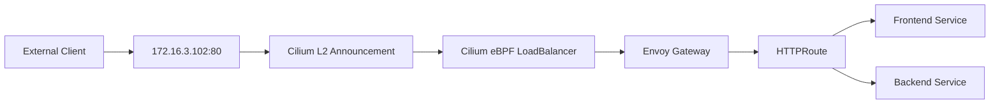

The important separation is:

```text
Cilium:
Network datapath + VIP reachability

Envoy Gateway:
L7 Gateway API + HTTP routing
```


---

# 27. Internal Traffic Flow

For Pod-to-Pod traffic:


No overlay tunnel is required for this native routing path.


---

# 28. Network Separation

The node networking model is:

```text
                         Kubernetes Node
                               |
             +-----------------+-----------------+
             |                 |                 |
             v                 v                 v
          eth0              eth1              eth2
             |                 |                 |
             v                 v                 v
          NAT/Egress       Control Network    Pod Fabric
        192.168.32.0/20   172.16.0.0/18     172.17.0.0/18
             |                 |                 |
             v                 v                 v
        Internet         Kubernetes/Admin     Pod traffic
```

This separation reduces contention and makes the network responsibilities easier to reason about.


---

# 29. Why Use eth2 for Cilium?

The cluster intentionally separates Pod traffic from Kubernetes control traffic.

Cilium therefore uses:

```yaml
devices: eth2
direct-routing-device: eth2
```

The Pod-fabric interface is:

```text
eth2
172.17.0.x/18
```

This means native Pod traffic is sent over the dedicated Pod network instead of the NAT network.

The design prevents normal Pod-to-Pod traffic from depending on Internet/NAT connectivity.


---

# 30. Why Use eth1 for L2 Announcements?

The LoadBalancer VIP range is:

```text
172.16.3.100 - 172.16.3.150
```

This belongs to the Control Network:

```text
172.16.0.0/18
```

Therefore the L2 announcement policy explicitly uses:

```yaml
interfaces:
  - eth1
```

The architecture becomes:

```text
LoadBalancer VIP
172.16.3.102
       |
       v
Cilium L2 Announcement
       |
       v
eth1
       |
       v
Control Network
172.16.0.0/18
```

This keeps the external/private service VIP mechanism on the intended internal network.


---

# 31. Hubble

Hubble is enabled in the current Cilium configuration:

```yaml
enable-hubble: "true"
```

Cilium also exposes the Hubble peer service:

```text
hubble-peer
```

Hubble is intended to provide visibility into:

- Pod-to-Pod flows
- Service traffic
- Network policy decisions
- DNS flows
- Drop events
- HTTP/L7 visibility when applicable

The current Cilium configuration also enables metrics and policy correlation.

Hubble is therefore part of the networking foundation and can be expanded later as part of the platform's Observability phase.


---

# 32. Repository Structure

The GitOps repository separates infrastructure from applications.

The Cilium-related infrastructure is organized under:

```text
k8s/
└── infrastructure/
    ├── cilium/
    │   ├── l2-announcement-policy.yaml
    │   └── loadbalancer-ip-pool.yaml
    │
    ├── envoy-gateway/
    │   ├── envoyproxy.yaml
    │   └── gatewayclass.yaml
    │
    └── longhorn/
        └── helmchart.yaml
```

Cilium infrastructure manifests:

```text
k8s/infrastructure/cilium/
```

Application manifests remain under:

```text
k8s/apps/
```

This separation allows the networking foundation to remain independent from application workloads.


---

# 33. Cilium L2 Announcement Manifest

The repository contains:

```yaml
apiVersion: cilium.io/v2alpha1
kind: CiliumL2AnnouncementPolicy
metadata:
  name: gateway-l2-policy
spec:
  interfaces:
    - eth1
  loadBalancerIPs: true
```

This policy tells Cilium to announce LoadBalancer IPs on `eth1`.


---

# 34. Cilium LoadBalancer IP Pool Manifest

The repository contains:

```yaml
apiVersion: cilium.io/v2
kind: CiliumLoadBalancerIPPool
metadata:
  name: gateway-pool
spec:
  blocks:
    - start: 172.16.3.100
      stop: 172.16.3.150
```

This creates a controlled address pool for LoadBalancer Services.

The current pool contains:

```text
51 total IPs
48 available
3 used
```


---

# 35. Verification Commands

## Cilium Agents

```bash
kubectl get pods -n kube-system \
  -l k8s-app=cilium \
  -o wide
```

Expected:

```text
6 Cilium Pods
6/6 Running
```

---

## DaemonSet

```bash
kubectl get ds cilium -n kube-system
```

Expected:

```text
DESIRED   CURRENT   READY   AVAILABLE
6         6         6       6
```

---

## Cilium Nodes

```bash
kubectl get ciliumnodes -o wide
```

---

## Cilium Configuration

```bash
kubectl -n kube-system get configmap cilium-config -o yaml
```

---

## Native Routing

```bash
kubectl get nodes \
  -o custom-columns=NAME:.metadata.name,PODCIDR:.spec.podCIDR
```

And on a node:

```bash
ip route
```

Look for routes such as:

```text
10.42.1.0/24 via 172.17.0.12 dev eth2
10.42.2.0/24 via 172.17.0.13 dev eth2
10.42.3.0/24 via 172.17.0.24 dev eth2
10.42.4.0/24 via 172.17.0.25 dev eth2
10.42.5.0/24 via 172.17.0.26 dev eth2
```

---

## kube-proxy Replacement Configuration

```bash
kubectl -n kube-system get configmap cilium-config -o yaml \
  | grep -i kube-proxy
```

Expected:

```text
kube-proxy-replacement: "true"
```

Also verify whether kube-proxy is still present:

```bash
kubectl get pods -n kube-system | grep kube-proxy
```

In the current cluster, kube-proxy Pods are still present.

---

## L2 Announcement

```bash
kubectl get ciliuml2announcementpolicies
```

Detailed:

```bash
kubectl get ciliuml2announcementpolicies -o yaml
```

---

## LB IPAM

```bash
kubectl get ciliumloadbalancerippools
```

Detailed:

```bash
kubectl get ciliumloadbalancerippools -o yaml
```

---

## LoadBalancer Services

```bash
kubectl get svc -A -o wide
```

---

## Service Connectivity

Create a temporary client:

```bash
kubectl run cilium-test-client \
  --image=curlimages/curl \
  --restart=Never \
  -n microservices \
  -- sleep 3600
```

Check the Pod:

```bash
kubectl get pod cilium-test-client \
  -n microservices \
  -o wide
```

Test frontend:

```bash
kubectl exec -it cilium-test-client \
  -n microservices -- \
  curl http://frontend
```

Test backend:

```bash
kubectl exec -it cilium-test-client \
  -n microservices -- \
  curl http://backend:4000/api/health
```

Cleanup:

```bash
kubectl delete pod cilium-test-client -n microservices
```


---

# 36. Troubleshooting

## Cilium Pod Not Running

```bash
kubectl get pods -n kube-system -l k8s-app=cilium -o wide
```

Then:

```bash
kubectl describe pod <cilium-pod> -n kube-system
```

Check logs:

```bash
kubectl logs -n kube-system <cilium-pod>
```

---

## Check Effective Cilium Configuration

```bash
kubectl -n kube-system get configmap cilium-config -o yaml
```

Check the important values:

```text
routing-mode
ipv4-native-routing-cidr
auto-direct-node-routes
devices
direct-routing-device
kube-proxy-replacement
enable-l2-announcements
enable-lb-ipam
```

---

## Native Routing Troubleshooting

Check interfaces:

```bash
ip -br addr
```

Check routes:

```bash
ip route
```

Check that PodCIDRs exist:

```bash
kubectl get nodes \
  -o custom-columns=NAME:.metadata.name,PODCIDR:.spec.podCIDR
```

The node must have a route toward the destination PodCIDR.

For example:

```text
10.42.5.0/24 via 172.17.0.26 dev eth2
```

---

## LoadBalancer VIP Not Reachable

Check:

```bash
kubectl get svc -A -o wide
```

Then:

```bash
kubectl get ciliuml2announcementpolicies -o yaml
```

And:

```bash
kubectl get ciliumloadbalancerippools -o yaml
```

Verify:

```text
VIP belongs to the configured pool
L2 policy is enabled
Correct interface is selected
eth1 is available
Service has LoadBalancer type
```


---

# 37. Engineering Decision: Native Routing

Decision:

```text
Use Cilium Native Routing
```

Instead of:

```text
VXLAN Overlay
```

Reasoning:

1. The cluster already has a dedicated Pod-fabric network.
2. The Pod-fabric network is reachable between nodes.
3. PodCIDR routes are installed directly on the nodes.
4. Cilium can use `eth2` for direct routing.
5. Avoiding encapsulation simplifies the datapath.
6. It reduces overlay overhead.
7. It makes packet troubleshooting easier.

The trade-off is that the underlying network must understand or carry routes to the Pod CIDRs.


---

# 38. Engineering Decision: Cilium LB IPAM + L2

Decision:

```text
Cilium LB IPAM
+
Cilium L2 Announcements
```

Reasoning:

The private cluster does not rely on a cloud provider LoadBalancer.

Therefore:

```text
LB IPAM
```

provides the IP allocation mechanism.

And:

```text
L2 Announcement
```

provides Layer-2 reachability for the allocated VIP.

This produces a private LoadBalancer architecture suitable for the internal network.


---

# 39. Engineering Decision: Envoy Gateway vs Cilium Gateway

Cilium is used as the networking foundation.

Envoy Gateway is used as the Gateway API implementation.

Therefore:

```text
Cilium
    |
    +--> eBPF
    +--> Native Routing
    +--> Service LB
    +--> LB IPAM
    +--> L2 Announcement
    |
    v
Envoy Gateway
    |
    +--> Gateway API
    +--> HTTPRoute
    +--> L7 Routing
```

This keeps Layer 3/4 networking and Layer 7 Gateway responsibilities clearly separated.


---

# 40. Final Cilium Architecture

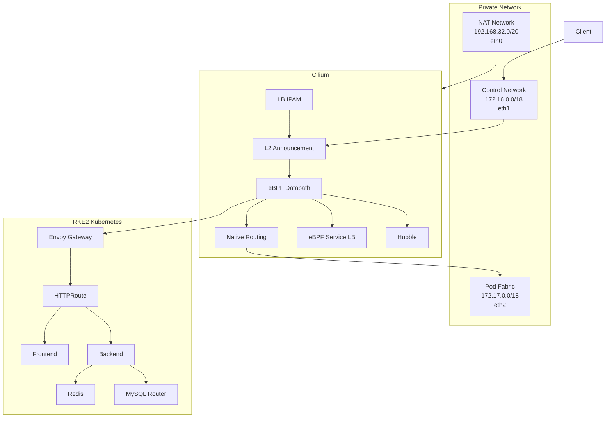

---

# 41. Final Packet Flow Scenarios

## Scenario 1: Pod-to-Pod

```text
Pod A
  |
  v
Cilium eBPF
  |
  v
Native Routing
  |
  v
eth2
  |
  v
Pod Fabric
  |
  v
Destination Node
  |
  v
Cilium eBPF
  |
  v
Pod B
```

---

## Scenario 2: Pod-to-Service

```text
Pod
  |
  v
ClusterIP
  |
  v
Cilium eBPF Service LB
  |
  v
Selected Backend Pod
```

---

## Scenario 3: External-to-Gateway

```text
Client
  |
  v
172.16.3.102
  |
  v
L2 Announcement
  |
  v
Cilium eBPF
  |
  v
Envoy Gateway
  |
  v
HTTPRoute
  |
  +----> Frontend
  |
  +----> Backend
```

---

## Scenario 4: Backend-to-Database

```text
Backend Pod
    |
    v
Cilium Service Networking
    |
    v
mysql-router
    |
    v
MySQL Primary / Replica
```


---

# 42. Current Cluster State

At the time of documentation:

```text
Cilium Agents:
6 / 6 Running

Cilium DaemonSet:
6 / 6 Ready

Routing:
Native

Native Routing CIDR:
10.42.0.0/16

Direct Routing Device:
eth2

Pod Fabric:
172.17.0.0/18

Cilium Internal Node Networking:
172.17.0.x

kube-proxy replacement:
Enabled in Cilium configuration

kube-proxy DaemonSet:
Still present

LB IPAM:
Enabled

LB Pool:
172.16.3.100 - 172.16.3.150

Total LB IPs:
51

Available:
48

Used:
3

L2 Announcements:
Enabled

L2 Interface:
eth1

Hubble:
Enabled

Service Connectivity:
Verified
```

---

# 43. Verification Summary

The Cilium implementation was validated through several layers.

## Agent Layer

All six Cilium agents are Running.

## Node Layer

All six Kubernetes nodes have Cilium networking information.

## Routing Layer

PodCIDRs are installed and directly routed through `eth2`.

## Service Layer

Cilium's kube-proxy replacement configuration is enabled.

## LoadBalancer Layer

Cilium successfully maintains the configured LoadBalancer IP pool.

## L2 Layer

Cilium L2 Announcement policy is configured on `eth1`.

## Application Layer

A temporary Pod successfully reached:

```text
frontend
backend:4000/api/health
```

The backend returned:

```text
status = UP
database = UP
```

This validates the networking path from a Pod through Kubernetes Services to application workloads.


---

# 44. What This Layer Provides to the Rest of the Platform

Cilium now provides the networking foundation required by the next platform layers.

```text
RKE2
  |
  v
Cilium
  |
  +----------------------+
  |                      |
  v                      v
Pod Networking        Service Networking
  |                      |
  +----------+-----------+
             |
             v
       Gateway Layer
             |
             v
       Envoy Gateway
             |
             v
       Gateway API
             |
             v
        Applications
             |
             v
      GitOps / Argo CD
             |
             v
     Progressive Delivery
             |
             v
       Argo Rollouts
```

Cilium therefore becomes the networking foundation for the remaining Kubernetes platform.

---

# 45. Next Step

The next platform layer is:

```text
Gateway API + Envoy Gateway
```

This layer will document:

- GatewayClass
- Envoy Gateway
- Gateway
- HTTPRoute
- L7 routing
- Path-based routing
- Gateway architecture
- External traffic flow
- Gateway API vs traditional Ingress
- Multi-tenant routing model
- Gateway verification and troubleshooting

The documentation for the next layer will be available under:

```text
docs/03-gateway-api/
```

The Cilium documentation for this layer is located at:

```text
docs/02-cilium/README.md
```

The related Cilium manifests are located at:

```text
k8s/infrastructure/cilium/
```

And the screenshots used in this documentation are located at:

```text
screenshots/
├── 03-Cilium-Agents.png
├── 04-Cilium-Configuration.png
├── 05-Cilium-Native-Routing.png
├── 06-Cilium-LB-IPAM-L2.png
└── 07-Cilium-Service-Connectivity.png
```
