# Cilium Networking

Cilium is the production CNI layer used by the RKE2 Kubernetes cluster.

It provides the networking foundation for the platform through:

- eBPF-based networking
- Native Routing between Kubernetes nodes
- Kubernetes Pod networking
- eBPF-based Service networking
- kube-proxy replacement capability
- LoadBalancer IP Address Management (LB IPAM)
- Layer 2 LoadBalancer IP announcements
- Hubble-based observability support
- Kubernetes network policy support

Cilium is responsible for the Kubernetes networking datapath, while Envoy Gateway is responsible for the Gateway API and Layer 7 HTTP routing.

---

# 1. Architecture

## 1.1 Cilium Platform Architecture

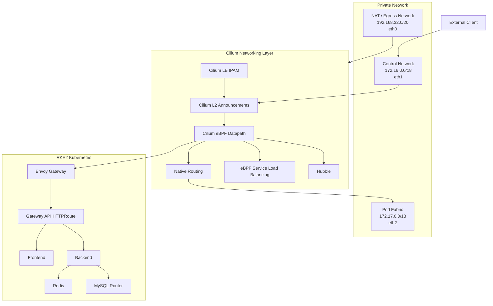

The overall platform separates networking responsibilities from application routing responsibilities:

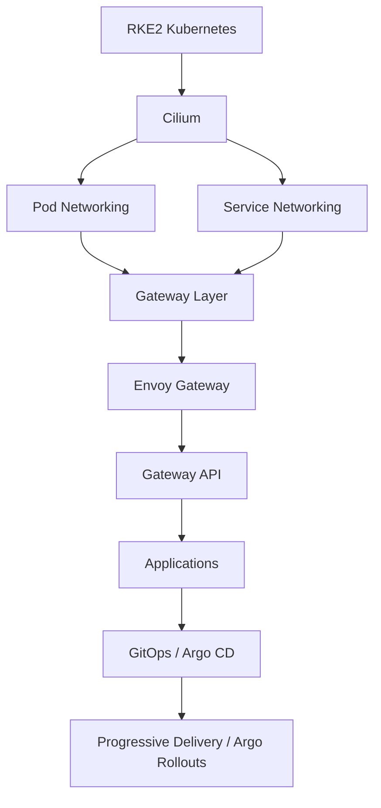

---

# 2. Why Cilium?

The cluster is designed as a private, production-like Kubernetes platform.

Cilium was selected as the CNI because it provides a modern Linux-kernel-based networking datapath using eBPF.

The main design goals are:

1. Efficient Pod-to-Pod networking.
2. Native routing instead of overlay encapsulation.
3. eBPF-based Service networking.
4. Private LoadBalancer IP management.
5. Layer 2 advertisement of LoadBalancer VIPs.
6. Kubernetes network policy support.
7. Hubble support for networking visibility.
8. A networking layer suitable for Gateway API and progressive delivery workloads.

The cluster already contains a dedicated Pod-fabric network, so native routing can be used instead of requiring an overlay network.

---

# 3. Cilium's Role

Cilium provides the Kubernetes networking foundation.

It is not the final Gateway API implementation.

The responsibilities are separated as follows:

| Component | Responsibility |
|---|---|
| RKE2 | Kubernetes distribution and control plane |
| Cilium | CNI, eBPF datapath and Pod networking |
| Cilium Service LB | Kubernetes Service load balancing |
| Cilium LB IPAM | LoadBalancer IP allocation |
| Cilium L2 Announcements | LoadBalancer VIP advertisement |
| Envoy Gateway | Gateway API implementation and L7 routing |
| Gateway API | Gateway and HTTPRoute resources |
| Longhorn | Persistent storage |
| Argo CD | GitOps reconciliation |
| Argo Rollouts | Progressive delivery |

This separation keeps Layer 3/4 networking independent from Layer 7 HTTP routing.

---

# 4. Cilium Installation Model

RKE2 was configured without the default CNI:

```yaml
cni: none
```

This allows Cilium to become the cluster networking layer.

The cluster also uses:

```yaml
ingress-controller: none
```

because the Gateway layer is handled separately by Envoy Gateway.

The installation model is:

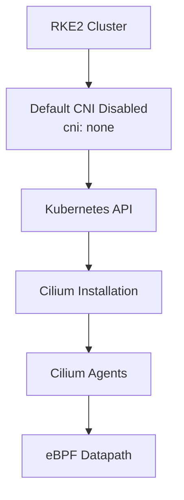

Cilium can be installed and managed using Helm.

A representative installation command for this architecture is:

```bash
helm repo add cilium https://helm.cilium.io/
helm repo update

helm install cilium cilium/cilium \
  --namespace kube-system \
  --create-namespace \
  --set ipam.mode=kubernetes \
  --set routingMode=native \
  --set ipv4NativeRoutingCIDR=10.42.0.0/16 \
  --set autoDirectNodeRoutes=true \
  --set devices=eth2 \
  --set kubeProxyReplacement=true \
  --set l2announcements.enabled=true
```

The effective configuration can be verified with:

```bash
kubectl -n kube-system get configmap cilium-config -o yaml
```

The documentation focuses on the effective configuration currently running in the cluster.

---

# 5. Main Cilium Configuration

The important configuration currently running in the cluster is:

```yaml
ipam: kubernetes

routing-mode: native

ipv4-native-routing-cidr: 10.42.0.0/16

auto-direct-node-routes: "true"

devices: eth2

direct-routing-device: eth2

kube-proxy-replacement: "true"

enable-l2-announcements: "true"

enable-lb-ipam: "true"

default-lb-service-ipam: lbipam

enable-hubble: "true"

enable-metrics: "true"

enable-endpoint-routes: "true"
```

The most important networking decisions are:

```text
routing-mode: native
auto-direct-node-routes: true
direct-routing-device: eth2
ipv4-native-routing-cidr: 10.42.0.0/16
```

These settings allow Cilium to use native Linux routing over the dedicated Pod-fabric network.


---

# 6. Cilium Agents

Cilium runs as a DaemonSet.

This means a Cilium agent is deployed on each Kubernetes node.

The cluster contains:

```text
3 Control-plane nodes
3 Worker nodes
----------------
6 Kubernetes nodes
```

Therefore the expected Cilium state is:

```text
Desired:   6
Current:   6
Ready:     6
Available: 6
```

Verification:

```bash
kubectl get pods -n kube-system \
  -l k8s-app=cilium \
  -o wide
```

And:

```bash
kubectl get ds cilium -n kube-system
```

The captured cluster output confirms that all six Cilium agents are Running and the DaemonSet is 6/6 ready.


---

# 7. Network Interface Design

Each Kubernetes node has three network roles:

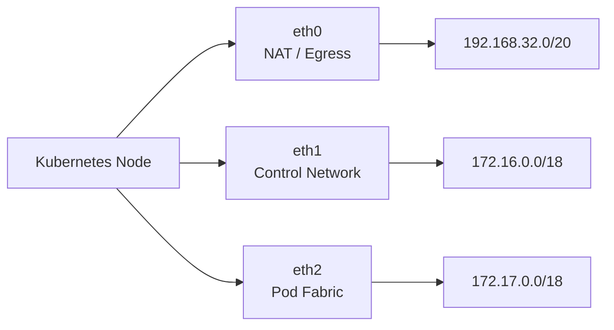

On CP1 the interfaces are:

```text
eth0 -> 192.168.32.12/20
eth1 -> 172.16.0.12/18
eth2 -> 172.17.0.11/18
```

Cilium is explicitly configured to use:

```yaml
devices: eth2
direct-routing-device: eth2
```

Therefore the traffic roles are:

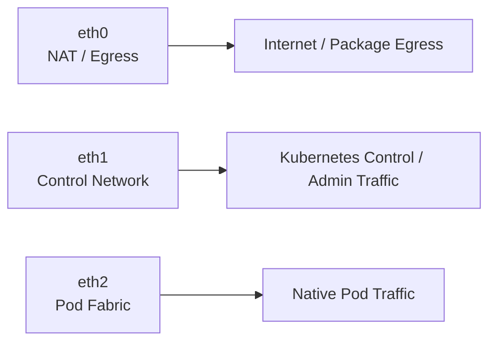

This keeps normal Pod-to-Pod traffic on the dedicated Pod-fabric network.

---

# 8. Cilium Native Routing

## 8.1 What Is Native Routing?

In native routing mode, Cilium uses the underlying network and Linux routing table to forward Pod traffic between nodes.

Instead of encapsulating the Pod packet inside a VXLAN tunnel, the packet can be routed directly toward the destination node.

The simplified datapath is:


The important requirement is that the underlying network must be able to reach the destination Pod CIDR.

---

# 9. Pod CIDR Design

The cluster uses:

```text
Pod Network CIDR:
10.42.0.0/16
```

Each Kubernetes node receives a `/24` PodCIDR:

```text
rke2-cp1       -> 10.42.0.0/24
k8s-rke2-cp2   -> 10.42.1.0/24
k8s-rke2-cp3   -> 10.42.2.0/24

rke2-worke01   -> 10.42.3.0/24
rke2-worke02   -> 10.42.4.0/24
rke2-worke03   -> 10.42.5.0/24
```

Verification:

```bash
kubectl get nodes \
  -o custom-columns=NAME:.metadata.name,PODCIDR:.spec.podCIDR
```

The Cilium node mapping can also be checked with:

```bash
kubectl get ciliumnodes -o wide
```

Current Cilium node mapping:

```text
Node               Cilium IP       Node IP

rke2-cp1            10.42.0.244     172.17.0.11
k8s-rke2-cp2        10.42.1.53      172.17.0.12
k8s-rke2-cp3        10.42.2.248     172.17.0.13

rke2-worke01        10.42.3.34      172.17.0.24
rke2-worke02        10.42.4.198     172.17.0.25
rke2-worke03        10.42.5.130     172.17.0.26
```

---

# 10. Native Routing Evidence

On CP1, the Linux routing table contains routes for the PodCIDRs of the other nodes:

```text
10.42.1.0/24 via 172.17.0.12 dev eth2
10.42.2.0/24 via 172.17.0.13 dev eth2
10.42.3.0/24 via 172.17.0.24 dev eth2
10.42.4.0/24 via 172.17.0.25 dev eth2
10.42.5.0/24 via 172.17.0.26 dev eth2
```

The relevant network routes are:

```text
172.16.0.0/18 dev eth1
172.17.0.0/18 dev eth2
192.168.32.0/20 dev eth0
```

This provides direct routing from the node to the PodCIDRs through the Pod-fabric interface.

For example, traffic from CP1 to a Pod on worker03 follows:


---

# 11. Native Routing vs VXLAN

Cilium supports different datapath models.

The two relevant models for this design are:

```text
Native Routing
VXLAN Overlay
```

---

## 11.1 Native Routing


The packet remains an IP packet and is routed through the underlying network.

The packet path is:

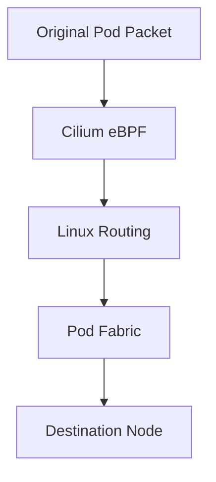

Advantages:

- No overlay encapsulation.
- Lower packet overhead.
- Simpler datapath.
- Better visibility into the actual network path.
- Uses the dedicated Pod network directly.

Trade-off:

The underlying network must provide reachability to the Pod CIDRs.

---

## 11.2 VXLAN Overlay


The packet path becomes:

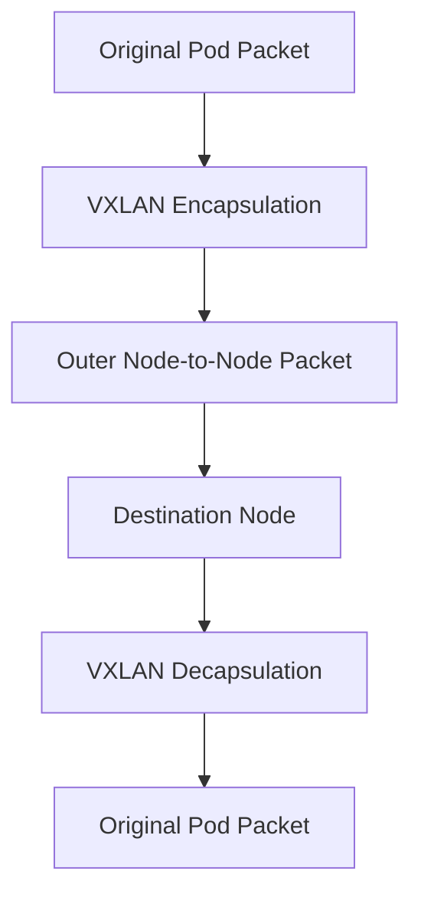

Advantages:

- Underlying network does not need direct Pod CIDR routing.
- Provides an overlay abstraction.
- Useful when the underlying network cannot route Pod networks.

Trade-offs:

- Additional encapsulation overhead.
- More MTU considerations.
- More complex packet path.
- Additional processing.

---

# 12. Why Native Routing Was Selected

The cluster already has a dedicated Pod-fabric network:

```text
172.17.0.0/18
```

Cilium is configured to use:

```yaml
routing-mode: native
```

and:

```yaml
auto-direct-node-routes: "true"
```

with:

```yaml
direct-routing-device: eth2
```

The nodes also have direct routes to the PodCIDRs.

Therefore the architecture does not require an overlay tunnel.

The design is:

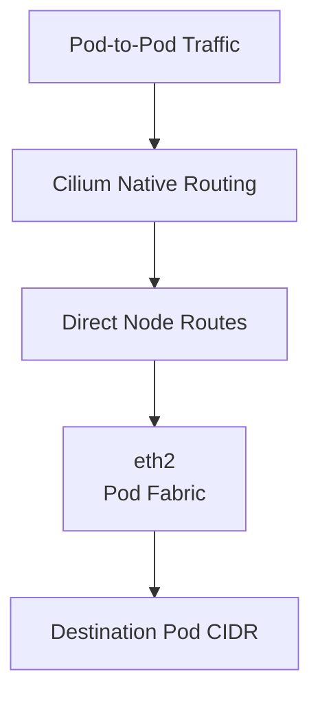

This keeps the Pod datapath simple and avoids unnecessary VXLAN encapsulation.

---

# 13. MTU Design

The internal Kubernetes networks use an MTU target of:

```text
1400
```

The relevant interfaces are:

```text
eth1 -> Control Network -> MTU 1400
eth2 -> Pod Fabric      -> MTU 1400
```

The NAT interface remains separate.

MTU becomes especially important when using overlay encapsulation.

A native packet is conceptually:

```text
+------------------------------+
| IP | TCP | Application Data  |
+------------------------------+
```

A VXLAN packet adds an outer encapsulation:

```text
+------------------------------------------------------+
| Outer IP | UDP | VXLAN | Inner IP | TCP | Data       |
+------------------------------------------------------+
```

Because the selected Pod datapath is native routing, normal cross-node Pod traffic does not require VXLAN encapsulation.

---

# 14. kube-proxy Replacement

Cilium provides Kubernetes Service networking through its eBPF datapath.

With Cilium's kube-proxy replacement capability enabled, Service traffic can be processed through eBPF.

The architecture is:


Cilium's eBPF Service datapath provides functionality such as:

- Service lookup
- Backend selection
- Service forwarding
- NAT
- NodePort handling
- LoadBalancer handling

The Cilium configuration enables this capability through:

```yaml
kube-proxy-replacement: "true"
```

Verification:

```bash
kubectl -n kube-system get configmap cilium-config -o yaml \
  | grep -i kube-proxy
```

Expected:

```text
kube-proxy-replacement: "true"
```

---

# 15. Service Packet Flow

Consider the frontend Service:

```text
frontend
ClusterIP:
10.43.48.136:80
```

A Pod sends traffic to:

```text
10.43.48.136:80
```

The conceptual datapath is:


Cilium performs the Service lookup and selects an available backend through the eBPF datapath.

This provides an efficient kernel-level path for Kubernetes Service traffic.

---

# 16. LoadBalancer Service Flow

For a LoadBalancer Service, Cilium extends the same networking model:

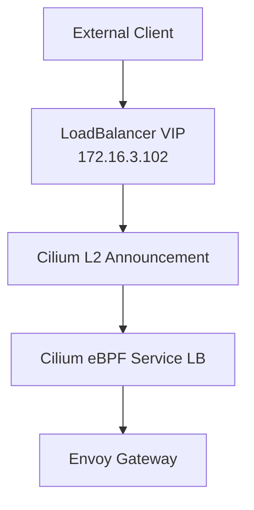

This demonstrates how the Cilium networking layer connects the private LoadBalancer VIP to the Gateway workload.

The responsibilities remain separated:

```text
Cilium:
L2 + LoadBalancer + eBPF datapath

Envoy Gateway:
Gateway API + HTTP routing
```

---

# 17. Cilium LoadBalancer IPAM

The private Kubernetes cluster does not rely on a cloud-provider LoadBalancer.

Cilium LB IPAM is therefore used to allocate LoadBalancer IP addresses.

The configured pool is:

```text
172.16.3.100 - 172.16.3.150
```

The pool contains:

```text
Total:     51 IPs
Used:       3 IPs
Available: 48 IPs
```

Verification:

```bash
kubectl get ciliumloadbalancerippools
```

Detailed configuration:

```bash
kubectl get ciliumloadbalancerippools -o yaml
```

Current pool:

```yaml
apiVersion: cilium.io/v2
kind: CiliumLoadBalancerIPPool
metadata:
  name: gateway-pool
spec:
  blocks:
    - start: 172.16.3.100
      stop: 172.16.3.150
```

LB IPAM is responsible for IP allocation.

It does not by itself make the IP reachable on the network.

That is handled by the L2 Announcement layer.


---

# 18. Cilium L2 Announcements

The cluster uses:

```yaml
apiVersion: cilium.io/v2alpha1
kind: CiliumL2AnnouncementPolicy
metadata:
  name: gateway-l2-policy
spec:
  interfaces:
    - eth1
  loadBalancerIPs: true
```

Verification:

```bash
kubectl get ciliuml2announcementpolicies
```

Detailed:

```bash
kubectl get ciliuml2announcementpolicies -o yaml
```

The policy uses:

```text
eth1
```

which belongs to:

```text
172.16.0.0/18
```

The relationship is:

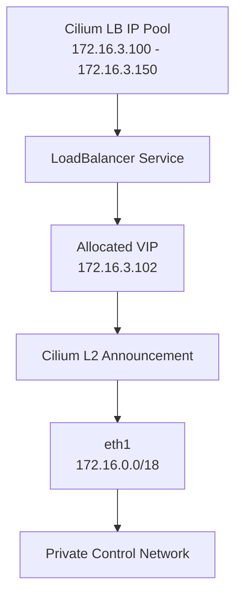

This allows the private network to learn how to reach the LoadBalancer VIP.

---

# 19. LB IPAM vs L2 Announcement

These two Cilium features have different responsibilities:

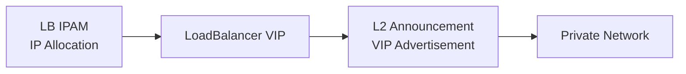

LB IPAM answers:

```text
Which IP should the LoadBalancer Service receive?
```

Example:

```text
172.16.3.102
```

L2 Announcement answers:

```text
How should that VIP be advertised on the local network?
```

Therefore:

```text
LB IPAM
=
IP allocation

L2 Announcement
=
Network advertisement
```

Both features work together to provide the private LoadBalancer architecture.

---

# 20. Gateway VIP Example

The Envoy Gateway Service currently uses:

```text
Type:
LoadBalancer

ClusterIP:
10.43.198.235

External IP:
172.16.3.102

Port:
80
```

The traffic architecture is:

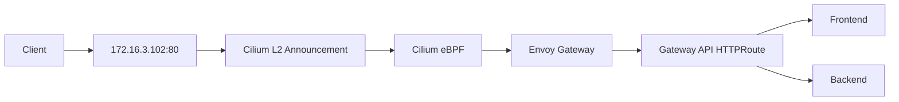

This clearly separates:

```text
Cilium:
Network datapath + LoadBalancer reachability

Envoy Gateway:
Gateway API + Layer 7 HTTP routing
```

Cilium is therefore the networking foundation, while Envoy Gateway provides the application-facing Gateway API layer.

---

# 21. Pod-to-Service Connectivity

The Cilium networking layer was validated from an actual Pod inside the cluster.

A temporary test Pod was created:

```bash
kubectl run cilium-test-client \
  --image=curlimages/curl \
  --restart=Never \
  -n microservices \
  -- sleep 3600
```

The Pod received:

```text
IP:
10.42.5.254

Node:
rke2-worke03
```

The Pod successfully accessed the frontend Service:

```bash
curl http://frontend
```

It also successfully accessed the backend Service:

```bash
curl http://backend:4000/api/health
```

The backend returned:

```json
{
  "status": "UP",
  "database": "UP"
}
```

This validates the internal Service networking path.


---

# 22. Pod-to-Service Traffic Flow

The tested traffic can be represented as:

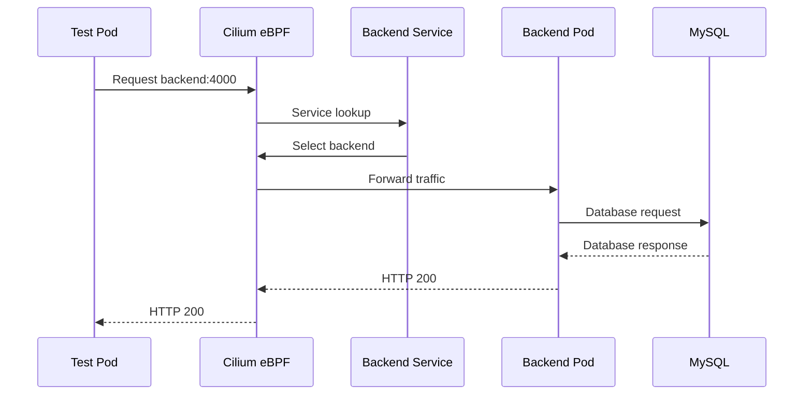

This validates:

```text
Pod
  |
  v
Cilium networking
  |
  v
Kubernetes Service
  |
  v
Backend
  |
  v
Database
```

---

# 23. Pod-to-Pod Traffic Flow

For cross-node Pod communication, the datapath is:


The important point is that cross-node Pod traffic uses the dedicated Pod-fabric network.

---

# 24. External Traffic Flow

The external request path through the Gateway layer is:

```mermaid
flowchart TB

    Client["External Client"]

    VIP["LoadBalancer VIP<br/>172.16.3.102"]

    L2["Cilium L2 Announcement"]

    ServiceLB["Cilium Service Load Balancer"]

    Envoy["Envoy Gateway"]

    HTTPRoute["Gateway API HTTPRoute"]

    Frontend["Frontend Service"]

    Backend["Backend Service"]

    Client --> VIP
    VIP --> L2
    L2 --> ServiceLB
    ServiceLB --> Envoy
    Envoy --> HTTPRoute

    HTTPRoute --> Frontend
    HTTPRoute --> Backend
```

This is the main external traffic path used by the platform.

---

# 25. Network Separation

The complete network separation is:

```mermaid
flowchart TB

    Node["Kubernetes Node"]

    NAT["eth0<br/>192.168.32.0/20<br/>NAT / Egress"]

    Control["eth1<br/>172.16.0.0/18<br/>Control Network"]

    PodFabric["eth2<br/>172.17.0.0/18<br/>Pod Fabric"]

    Internet["Internet"]

    API["Kubernetes / Admin Traffic"]

    Pods["Pod Traffic"]

    Node --> NAT
    Node --> Control
    Node --> PodFabric

    NAT --> Internet
    Control --> API
    PodFabric --> Pods
```

The three networks have different responsibilities:

| Network | Interface | Purpose |
|---|---|---|
| NAT | eth0 | Internet/package/image egress |
| Control | eth1 | Kubernetes control/admin traffic and LoadBalancer VIP advertisement |
| Pod Fabric | eth2 | Native Pod and node-to-node Pod traffic |

---

# 26. Hubble

Hubble is enabled in the current Cilium configuration:

```yaml
enable-hubble: "true"
```

The cluster also contains the Hubble peer Service:

```text
hubble-peer
```

Hubble can provide visibility into:

- Pod-to-Pod flows
- Service traffic
- Network policy decisions
- DNS traffic
- Dropped packets
- HTTP/L7 flows when applicable

The Cilium configuration also enables metrics and policy correlation.

Hubble is therefore part of the networking foundation and can be expanded during the platform's Observability phase.

---

# 27. Repository Structure

The GitOps repository separates infrastructure from applications.

The Cilium manifests are located under:

```text
k8s/
└── infrastructure/
    ├── cilium/
    │   ├── l2-announcement-policy.yaml
    │   └── loadbalancer-ip-pool.yaml
    │
    ├── envoy-gateway/
    │   ├── envoyproxy.yaml
    │   └── gatewayclass.yaml
    │
    └── longhorn/
        └── helmchart.yaml
```

Application resources remain under:

```text
k8s/apps/
```

This separation keeps the networking foundation independent from application workloads.

---

# 28. Cilium Manifests

## 28.1 L2 Announcement Policy

File:

```text
k8s/infrastructure/cilium/l2-announcement-policy.yaml
```

Content:

```yaml
apiVersion: cilium.io/v2alpha1
kind: CiliumL2AnnouncementPolicy
metadata:
  name: gateway-l2-policy
spec:
  interfaces:
    - eth1
  loadBalancerIPs: true
```

The policy enables LoadBalancer IP advertisement through `eth1`.

---

## 28.2 LoadBalancer IP Pool

File:

```text
k8s/infrastructure/cilium/loadbalancer-ip-pool.yaml
```

Content:

```yaml
apiVersion: cilium.io/v2
kind: CiliumLoadBalancerIPPool
metadata:
  name: gateway-pool
spec:
  blocks:
    - start: 172.16.3.100
      stop: 172.16.3.150
```

The pool provides a controlled private address range for LoadBalancer Services.

---

# 29. Verification

## 29.1 Cilium Agents

```bash
kubectl get pods -n kube-system \
  -l k8s-app=cilium \
  -o wide
```

Expected:

```text
6 Cilium Pods
6/6 Running
```

---

## 29.2 Cilium DaemonSet

```bash
kubectl get ds cilium -n kube-system
```

Expected:

```text
DESIRED   CURRENT   READY   UP-TO-DATE   AVAILABLE
6         6         6       6             6
```

---

## 29.3 Cilium Nodes

```bash
kubectl get ciliumnodes -o wide
```

---

## 29.4 Effective Configuration

```bash
kubectl -n kube-system get configmap cilium-config -o yaml
```

Important values:

```text
routing-mode
ipv4-native-routing-cidr
auto-direct-node-routes
devices
direct-routing-device
kube-proxy-replacement
enable-l2-announcements
enable-lb-ipam
enable-hubble
```

---

## 29.5 Pod CIDRs

```bash
kubectl get nodes \
  -o custom-columns=NAME:.metadata.name,PODCIDR:.spec.podCIDR
```

---

## 29.6 Linux Routing

On a node:

```bash
ip route
```

Look for routes such as:

```text
10.42.1.0/24 via 172.17.0.12 dev eth2
10.42.2.0/24 via 172.17.0.13 dev eth2
10.42.3.0/24 via 172.17.0.24 dev eth2
10.42.4.0/24 via 172.17.0.25 dev eth2
10.42.5.0/24 via 172.17.0.26 dev eth2
```

---

## 29.7 kube-proxy Replacement

```bash
kubectl -n kube-system get configmap cilium-config -o yaml \
  | grep -i kube-proxy
```

Expected:

```text
kube-proxy-replacement: "true"
```

---

## 29.8 L2 Announcements

```bash
kubectl get ciliuml2announcementpolicies
```

Detailed:

```bash
kubectl get ciliuml2announcementpolicies -o yaml
```

---

## 29.9 LoadBalancer IP Pool

```bash
kubectl get ciliumloadbalancerippools
```

Detailed:

```bash
kubectl get ciliumloadbalancerippools -o yaml
```

---

## 29.10 LoadBalancer Services

```bash
kubectl get svc -A -o wide
```

---

## 29.11 Service Connectivity

Create a temporary client:

```bash
kubectl run cilium-test-client \
  --image=curlimages/curl \
  --restart=Never \
  -n microservices \
  -- sleep 3600
```

Check it:

```bash
kubectl get pod cilium-test-client \
  -n microservices \
  -o wide
```

Test frontend:

```bash
kubectl exec -it cilium-test-client \
  -n microservices -- \
  curl http://frontend
```

Test backend:

```bash
kubectl exec -it cilium-test-client \
  -n microservices -- \
  curl http://backend:4000/api/health
```

Cleanup:

```bash
kubectl delete pod cilium-test-client \
  -n microservices
```

---

# 30. Troubleshooting

## 30.1 Cilium Pod Not Running

Check:

```bash
kubectl get pods -n kube-system \
  -l k8s-app=cilium \
  -o wide
```

Describe the affected Pod:

```bash
kubectl describe pod <cilium-pod> \
  -n kube-system
```

Check logs:

```bash
kubectl logs \
  -n kube-system \
  <cilium-pod>
```

---

## 30.2 Check Cilium Configuration

```bash
kubectl -n kube-system get configmap cilium-config -o yaml
```

Verify:

```text
routing-mode
ipv4-native-routing-cidr
auto-direct-node-routes
devices
direct-routing-device
kube-proxy-replacement
enable-l2-announcements
enable-lb-ipam
```

---

## 30.3 Native Routing Troubleshooting

Check interfaces:

```bash
ip -br addr
```

Check routes:

```bash
ip route
```

Check PodCIDRs:

```bash
kubectl get nodes \
  -o custom-columns=NAME:.metadata.name,PODCIDR:.spec.podCIDR
```

A destination PodCIDR should have a route through the Pod-fabric interface.

Example:

```text
10.42.5.0/24 via 172.17.0.26 dev eth2
```

---

## 30.4 LoadBalancer VIP Troubleshooting

Check Services:

```bash
kubectl get svc -A -o wide
```

Check L2 policy:

```bash
kubectl get ciliuml2announcementpolicies -o yaml
```

Check IP pool:

```bash
kubectl get ciliumloadbalancerippools -o yaml
```

Verify:

```text
VIP belongs to the configured pool
L2 announcements are enabled
Correct interface is selected
eth1 is available
Service type is LoadBalancer
```

---

# 31. Engineering Decisions

## 31.1 Native Routing

Decision:

```text
Cilium Native Routing
```

Instead of:

```text
VXLAN Overlay
```

Reasons:

1. The cluster has a dedicated Pod-fabric network.
2. The Pod-fabric network is reachable between nodes.
3. PodCIDR routes are installed directly on the nodes.
4. Cilium uses `eth2` for direct routing.
5. Native routing avoids overlay encapsulation.
6. The datapath is simpler.
7. Packet troubleshooting is more straightforward.

Trade-off:

The underlying network must provide reachability to the Pod CIDRs.

---

## 31.2 LB IPAM + L2 Announcements

Decision:

```text
Cilium LB IPAM
+
Cilium L2 Announcements
```

Reasons:

1. The cluster is private.
2. No cloud-provider LoadBalancer is required.
3. LB IPAM provides controlled VIP allocation.
4. L2 Announcements provide private network reachability.
5. The VIP range is isolated in the internal Control Network.

---

## 31.3 eth2 for Native Pod Routing

Decision:

```text
Cilium direct routing device = eth2
```

Reasons:

1. eth2 belongs to the dedicated Pod-fabric network.
2. Pod traffic is separated from control traffic.
3. Pod-to-Pod traffic does not depend on NAT.
4. Node routes to PodCIDRs use eth2.

---

## 31.4 eth1 for LoadBalancer VIP Advertisement

Decision:

```text
Cilium L2 Announcement interface = eth1
```

Reasons:

1. The LoadBalancer VIP range belongs to the Control Network.
2. eth1 is the Control Network interface.
3. VIP advertisement remains within the intended private network.

---

## 31.5 Envoy Gateway as Gateway API Implementation

Cilium provides:

```text
CNI
eBPF
Native Routing
Service Networking
LB IPAM
L2 Announcements
```

Envoy Gateway provides:

```text
Gateway API
Gateway
HTTPRoute
L7 HTTP routing
```

The architecture is:

```mermaid
flowchart TB

    Cilium["Cilium"]

    Network["L3/L4 Networking"]

    Envoy["Envoy Gateway"]

    GatewayAPI["Gateway API"]

    HTTP["HTTP Routing"]

    Cilium --> Network
    Network --> Envoy
    Envoy --> GatewayAPI
    GatewayAPI --> HTTP
```

This separation keeps networking and application routing responsibilities clear.

---

# 32. Final Cilium Architecture

```mermaid
flowchart TB

    Client["External Client"]

    subgraph PrivateNetwork["Private Network"]
        Control["Control Network<br/>172.16.0.0/18<br/>eth1"]
        PodFabric["Pod Fabric<br/>172.17.0.0/18<br/>eth2"]
        NAT["NAT / Egress<br/>192.168.32.0/20<br/>eth0"]
    end

    subgraph CiliumLayer["Cilium"]
        LBIPAM["LB IPAM"]
        L2["L2 Announcements"]
        EBPF["eBPF Datapath"]
        Native["Native Routing"]
        ServiceLB["eBPF Service LB"]
        Hubble["Hubble"]
    end

    subgraph RKE2["RKE2 Kubernetes"]
        Gateway["Envoy Gateway"]
        HTTPRoute["HTTPRoute"]
        Frontend["Frontend"]
        Backend["Backend"]
        Redis["Redis"]
        MySQL["MySQL Router"]
    end

    Client --> Control
    Control --> L2
    LBIPAM --> L2
    L2 --> EBPF

    EBPF --> Gateway
    Gateway --> HTTPRoute

    HTTPRoute --> Frontend
    HTTPRoute --> Backend

    Backend --> Redis
    Backend --> MySQL

    EBPF --> Native
    Native --> PodFabric

    EBPF --> ServiceLB
    EBPF --> Hubble

    NAT --> CiliumLayer
```

---

# 33. Final Packet Flow Summary

## Pod-to-Pod

```mermaid
flowchart LR

    A["Pod A"]

    C1["Cilium eBPF"]

    R["Native Linux Routing"]

    F["Pod Fabric<br/>eth2"]

    N["Destination Node"]

    C2["Cilium eBPF"]

    B["Pod B"]

    A --> C1
    C1 --> R
    R --> F
    F --> N
    N --> C2
    C2 --> B
```

---

## Pod-to-Service

```mermaid
flowchart LR

    Pod["Pod"]

    Service["ClusterIP Service"]

    LB["Cilium eBPF Service LB"]

    Backend["Backend Pod"]

    Pod --> Service
    Service --> LB
    LB --> Backend
```

---

## External-to-Gateway

```mermaid
flowchart LR

    Client["Client"]

    VIP["172.16.3.102"]

    L2["Cilium L2"]

    LB["Cilium Service LB"]

    Envoy["Envoy Gateway"]

    Route["HTTPRoute"]

    App["Application"]

    Client --> VIP
    VIP --> L2
    L2 --> LB
    LB --> Envoy
    Envoy --> Route
    Route --> App
```

---

## Backend-to-Database

```mermaid
flowchart LR

    Backend["Backend Pod"]

    Cilium["Cilium Service Networking"]

    Router["MySQL Router"]

    MySQL["MySQL"]

    Backend --> Cilium
    Cilium --> Router
    Router --> MySQL
```

---

# 34. Current Cluster State

The current Cilium implementation is:

| Area | Current State |
|---|---|
| Cilium Agents | 6/6 Running |
| Cilium DaemonSet | 6/6 Ready |
| Routing Mode | Native |
| Native Routing CIDR | 10.42.0.0/16 |
| Direct Routing Device | eth2 |
| Pod Fabric | 172.17.0.0/18 |
| Pod CIDRs | 10.42.0.0/16 |
| kube-proxy Replacement | Enabled |
| LB IPAM | Enabled |
| LB Pool | 172.16.3.100 - 172.16.3.150 |
| Total LB IPs | 51 |
| Used LB IPs | 3 |
| Available LB IPs | 48 |
| L2 Announcements | Enabled |
| L2 Interface | eth1 |
| Hubble | Enabled |
| Service Connectivity | Verified |

---

# 35. Verification Summary

The Cilium implementation was validated through multiple layers.

## Agent Layer

All six Cilium agents are Running.

## Node Layer

All six Kubernetes nodes have Cilium node information.

## Routing Layer

Each Kubernetes node has a PodCIDR and cross-node PodCIDR routes are installed through `eth2`.

## Service Layer

Cilium kube-proxy replacement is enabled in the effective configuration.

## LoadBalancer Layer

Cilium LB IPAM manages the private LoadBalancer IP pool.

## L2 Layer

The LoadBalancer VIPs are configured to be announced through `eth1`.

## Application Layer

A temporary Pod successfully reached:

```text
frontend
backend:4000/api/health
```

The backend returned:

```text
status = UP
database = UP
```

This validates the Kubernetes networking path from a Pod through Kubernetes Services to application workloads.

---

# 36. Documentation Evidence

The following screenshots provide the main evidence for the Cilium implementation:

```text
screenshots/
├── 03-Cilium-Agents.png
├── 04-Cilium-Configuration.png
├── 05-Cilium-Native-Routing.png
├── 06-Cilium-LB-IPAM-L2.png
└── 07-Cilium-Service-Connectivity.png
```

Each screenshot is used only where it provides meaningful evidence of the corresponding configuration or verification step.

---

# 37. Final Design Principles

The final Cilium design can be summarized as:

```mermaid
flowchart TB

    RKE2["RKE2"]

    Cilium["Cilium"]

    EBPF["eBPF"]

    Native["Native Routing"]

    PodFabric["Dedicated Pod Fabric"]

    ServiceLB["eBPF Service LB"]

    LBIPAM["LB IPAM"]

    L2["L2 Announcements"]

    Gateway["Envoy Gateway"]

    Applications["Applications"]

    RKE2 --> Cilium

    Cilium --> EBPF
    Cilium --> Native
    Cilium --> ServiceLB
    Cilium --> LBIPAM
    Cilium --> L2

    Native --> PodFabric

    L2 --> Gateway
    ServiceLB --> Gateway

    Gateway --> Applications
```

The networking foundation is:

```mermaid
flowchart TB

    RKE2["RKE2"]

    Cilium["Cilium"]

    EBPF["eBPF Datapath"]

    Native["Native Routing"]

    Service["Service Networking"]

    LB["LB IPAM + L2"]

    Hubble["Hubble"]

    Gateway["Gateway / Applications"]

    RKE2 --> Cilium

    Cilium --> EBPF
    Cilium --> Native
    Cilium --> Service
    Cilium --> LB
    Cilium --> Hubble

    EBPF --> Gateway
    Native --> Gateway
    Service --> Gateway
    LB --> Gateway
```

---

# 38. Next Step

The next platform layer is:

```text
Gateway API + Envoy Gateway
```

This layer will document:

- GatewayClass
- Envoy Gateway
- Gateway resources
- HTTPRoutes
- Path-based routing
- Gateway API architecture
- External traffic flow
- Gateway API vs traditional Ingress
- Multi-tenant routing
- Gateway verification
- Gateway troubleshooting

Documentation for the next layer will be located at:

```text
docs/03-gateway-api/README.md
```

The Cilium documentation is located at:

```text
docs/02-cilium/README.md
```

Cilium infrastructure manifests are located at:

```text
k8s/infrastructure/cilium/
```
