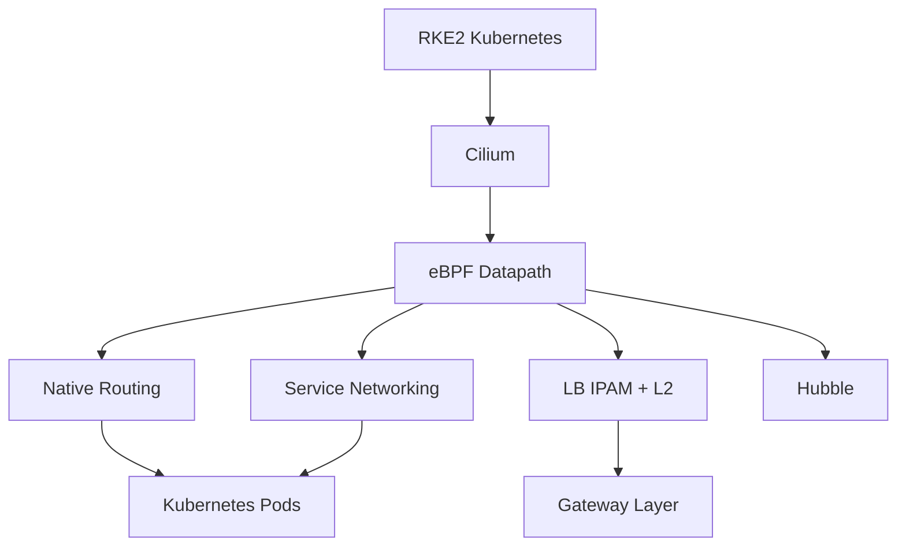
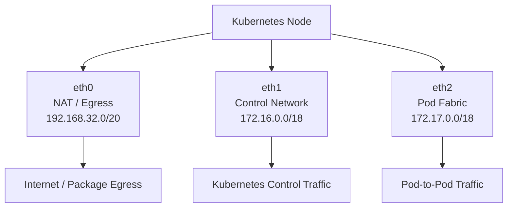
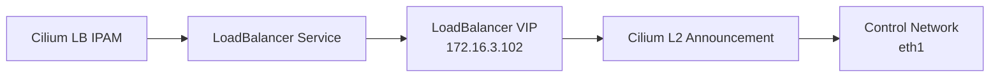
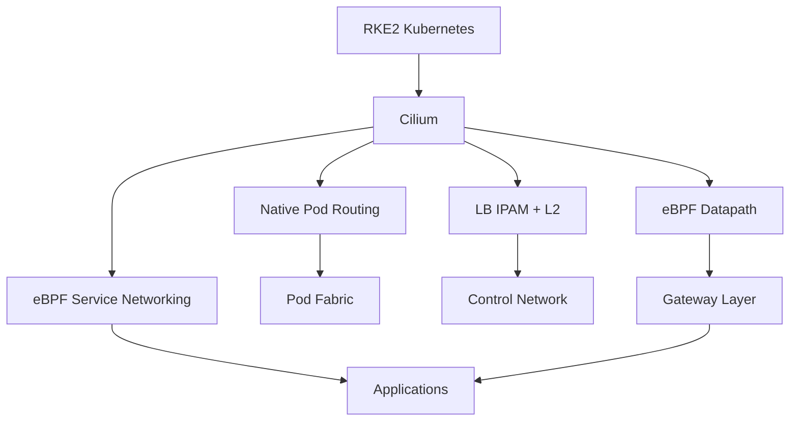

# Cilium Networking

Cilium is the CNI and networking datapath used by the RKE2 Kubernetes cluster.

The implementation provides:

- eBPF-based networking
- Native Pod-to-Pod routing
- eBPF-based Kubernetes Service networking
- kube-proxy replacement capability
- LoadBalancer IP Address Management (LB IPAM)
- Layer 2 LoadBalancer announcements
- Hubble-based network visibility

The cluster uses a dedicated Pod-fabric network for native routing and a separate Control Network for Kubernetes control traffic and LoadBalancer VIP advertisement.

---

# 1. Architecture

The Cilium networking layer sits between the RKE2 Kubernetes platform and the underlying private networks.



Cilium is responsible for the Kubernetes networking datapath, while the Gateway layer handles Layer 7 HTTP routing.

---

# 2. Why Cilium?

Cilium was selected to provide a modern eBPF-based networking layer for the private Kubernetes platform.

The main goals are:

- Efficient Pod networking.
- Native routing between Kubernetes nodes.
- eBPF-based Service load balancing.
- Private LoadBalancer IP management.
- Layer 2 VIP advertisement.
- Network visibility through Hubble.
- A networking foundation suitable for the Gateway and GitOps layers.

Because the cluster already has a dedicated Pod-fabric network, native routing can be used instead of an overlay network.

---

# 3. Network Design

Each Kubernetes node has three network roles.



The interfaces have separate responsibilities:

| Interface | Network | Purpose |
|---|---|---|
| `eth0` | `192.168.32.0/20` | NAT and Internet egress |
| `eth1` | `172.16.0.0/18` | Control network and LoadBalancer VIP advertisement |
| `eth2` | `172.17.0.0/18` | Pod-fabric and native Pod routing |

The internal interfaces use an MTU target of:

```text
1400
```

On CP1:

```text
eth0 -> 192.168.32.12/20
eth1 -> 172.16.0.12/18
eth2 -> 172.17.0.11/18
```

Cilium uses `eth2` as the direct routing interface.

---

# 4. Cilium Configuration

RKE2 was configured with the default CNI disabled:

```yaml
cni: none
```

This allows Cilium to provide the Kubernetes networking layer.

The important Cilium configuration is:

```yaml
ipam: kubernetes

routing-mode: native

ipv4-native-routing-cidr: 10.42.0.0/16

auto-direct-node-routes: "true"

direct-routing-device: eth2

kube-proxy-replacement: "true"

enable-l2-announcements: "true"

enable-lb-ipam: "true"

enable-hubble: "true"
```

The effective configuration can be verified with:

```bash
kubectl -n kube-system get configmap cilium-config -o yaml
```


---

# 5. Cilium Agents

Cilium runs as a DaemonSet across the Kubernetes nodes.

The cluster contains:

```text
3 Control-plane nodes
3 Worker nodes
----------------
6 Kubernetes nodes
```

Verification:

```bash
kubectl get pods -n kube-system \
  -l k8s-app=cilium \
  -o wide
```

Expected:

```text
6 Cilium agents
6/6 Running
```

The current cluster has Cilium agents running on all six nodes.


---

# 6. Native Routing

Cilium is configured to use native routing:

```yaml
routing-mode: native
```

with:

```yaml
auto-direct-node-routes: "true"
```

and:

```yaml
direct-routing-device: eth2
```

The Kubernetes Pod network is:

```text
10.42.0.0/16
```

Each node receives a `/24` PodCIDR:

```text
rke2-cp1       -> 10.42.0.0/24
k8s-rke2-cp2   -> 10.42.1.0/24
k8s-rke2-cp3   -> 10.42.2.0/24

rke2-worke01   -> 10.42.3.0/24
rke2-worke02   -> 10.42.4.0/24
rke2-worke03   -> 10.42.5.0/24
```

The simplified packet path is:


On CP1, the PodCIDR routes are visible through the Pod-fabric interface:

```text
10.42.1.0/24 via 172.17.0.12 dev eth2
10.42.2.0/24 via 172.17.0.13 dev eth2
10.42.3.0/24 via 172.17.0.24 dev eth2
10.42.4.0/24 via 172.17.0.25 dev eth2
10.42.5.0/24 via 172.17.0.26 dev eth2
```

Verification:

```bash
kubectl get nodes \
  -o custom-columns=NAME:.metadata.name,PODCIDR:.spec.podCIDR
```

```bash
ip route
```


---

# 7. Native Routing vs VXLAN

The cluster uses native routing because the underlying infrastructure already provides a dedicated Pod-fabric network.

## Native Routing


The Pod packet is routed directly through the underlying network.

There is no VXLAN overlay encapsulation in the selected datapath.

## VXLAN


### Comparison

| Feature | Native Routing | VXLAN |
|---|---|---|
| Overlay | No | Yes |
| Encapsulation | No | Yes |
| Pod CIDR routing | Required | Not required from underlay |
| Packet overhead | Lower | Higher |
| MTU complexity | Lower | Higher |
| Underlay requirement | Pod CIDRs must be reachable | Underlay only needs node reachability |

For this platform:

```text
Dedicated Pod Fabric
        +
Direct PodCIDR Routes
        +
Cilium Native Routing
```

make native routing the preferred design.

---

# 8. kube-proxy Replacement and eBPF Service Networking

Cilium provides Kubernetes Service networking through its eBPF datapath.

The configuration enables:

```yaml
kube-proxy-replacement: "true"
```

The Service networking path is:


Cilium's eBPF Service datapath can handle:

- Service lookup
- Backend selection
- Service forwarding
- NAT
- NodePort traffic
- LoadBalancer traffic

Verification:

```bash
kubectl -n kube-system get configmap cilium-config -o yaml \
  | grep -i kube-proxy
```

Expected:

```text
kube-proxy-replacement: "true"
```

---

# 9. LoadBalancer IPAM and L2 Announcements

The cluster uses Cilium to provide private LoadBalancer IPs.

The configured pool is:

```text
172.16.3.100 - 172.16.3.150
```

The pool contains:

```text
Total:      51
Used:        3
Available:  48
```

Verification:

```bash
kubectl get ciliumloadbalancerippools
```

The IP pool is defined by:

```yaml
apiVersion: cilium.io/v2
kind: CiliumLoadBalancerIPPool
metadata:
  name: gateway-pool
spec:
  blocks:
    - start: 172.16.3.100
      stop: 172.16.3.150
```

L2 announcements are configured through:

```yaml
apiVersion: cilium.io/v2alpha1
kind: CiliumL2AnnouncementPolicy
metadata:
  name: gateway-l2-policy
spec:
  interfaces:
    - eth1
  loadBalancerIPs: true
```

The relationship is:



The two components have separate responsibilities:

```text
LB IPAM
    |
    +--> Allocates the VIP


L2 Announcement
    |
    +--> Advertises the VIP on the private network
```


---

# 10. Gateway LoadBalancer Flow

The current Envoy Gateway LoadBalancer Service uses:

```text
Type:
LoadBalancer

ClusterIP:
10.43.198.235

External IP:
172.16.3.102

Port:
80
```

The complete external traffic path is:


Cilium handles the networking and LoadBalancer reachability.

Envoy Gateway handles Gateway API and Layer 7 HTTP routing.

---

# 11. Service Connectivity Verification

A temporary test Pod was created inside the `microservices` namespace:

```bash
kubectl run cilium-test-client \
  --image=curlimages/curl \
  --restart=Never \
  -n microservices \
  -- sleep 3600
```

The Pod was scheduled on:

```text
rke2-worke03
```

and received:

```text
10.42.5.254
```

Frontend connectivity was tested with:

```bash
kubectl exec -it cilium-test-client \
  -n microservices -- \
  curl http://frontend
```

Backend connectivity was tested with:

```bash
kubectl exec -it cilium-test-client \
  -n microservices -- \
  curl http://backend:4000/api/health
```

The backend returned:

```json
{
  "status": "UP",
  "database": "UP"
}
```

This validates the internal Kubernetes Service networking path.


Cleanup:

```bash
kubectl delete pod cilium-test-client \
  -n microservices
```

---

# 12. Hubble

Hubble is enabled in the current Cilium configuration:

```yaml
enable-hubble: "true"
```

Hubble provides network visibility for areas such as:

- Pod-to-Pod flows
- Service traffic
- DNS traffic
- Network policy decisions
- Dropped traffic
- HTTP/L7 visibility where applicable

Hubble is part of the networking foundation and can be expanded later as part of the Observability layer.

---

# 13. Repository Structure

Cilium infrastructure manifests are stored separately from application manifests.

```text
k8s/
└── infrastructure/
    ├── cilium/
    │   ├── l2-announcement-policy.yaml
    │   └── loadbalancer-ip-pool.yaml
    │
    ├── envoy-gateway/
    │   ├── envoyproxy.yaml
    │   └── gatewayclass.yaml
    │
    └── longhorn/
        └── helmchart.yaml
```

Cilium configuration files:

```text
k8s/infrastructure/cilium/
```

Cilium documentation:

```text
docs/02-cilium/README.md
```

Screenshots:

```text
screenshots/
├── 03-Cilium-Agents.png
├── 04-Cilium-Configuration.png
├── 05-Cilium-Native-Routing.png
├── 06-Cilium-LB-IPAM-L2.png
└── 07-Cilium-Service-Connectivity.png
```

---

# 14. Verification Commands

## Cilium Agents

```bash
kubectl get pods -n kube-system \
  -l k8s-app=cilium \
  -o wide
```

## Cilium DaemonSet

```bash
kubectl get ds cilium -n kube-system
```

## Cilium Nodes

```bash
kubectl get ciliumnodes -o wide
```

## Cilium Configuration

```bash
kubectl -n kube-system get configmap cilium-config -o yaml
```

## Pod CIDRs

```bash
kubectl get nodes \
  -o custom-columns=NAME:.metadata.name,PODCIDR:.spec.podCIDR
```

## Node Routing

```bash
ip route
```

## LB IP Pool

```bash
kubectl get ciliumloadbalancerippools
```

## L2 Announcement Policy

```bash
kubectl get ciliuml2announcementpolicies
```

## LoadBalancer Services

```bash
kubectl get svc -A -o wide
```

## Service Connectivity

```bash
kubectl run cilium-test-client \
  --image=curlimages/curl \
  --restart=Never \
  -n microservices \
  -- sleep 3600
```

```bash
kubectl exec -it cilium-test-client \
  -n microservices -- \
  curl http://backend:4000/api/health
```

---

# 15. Final State

The final Cilium networking layer provides:

| Area | State |
|---|---|
| Cilium Agents | 6/6 Running |
| Routing Mode | Native |
| Pod Network | `10.42.0.0/16` |
| Pod Fabric | `172.17.0.0/18` |
| Direct Routing Interface | `eth2` |
| Native Node Routes | Enabled |
| eBPF Service Networking | Enabled |
| kube-proxy Replacement | Enabled |
| LB IPAM | Enabled |
| LB Pool | `172.16.3.100 - 172.16.3.150` |
| L2 Announcements | Enabled |
| L2 Interface | `eth1` |
| Hubble | Enabled |
| Service Connectivity | Verified |

The resulting networking architecture is:



---

# 16. Next Step

The next platform layer is:

```text
Gateway API + Envoy Gateway
```

This section will cover:

- GatewayClass
- Envoy Gateway
- Gateway resources
- HTTPRoutes
- Path-based routing
- External traffic flow
- Gateway API architecture
- Gateway verification

Documentation for the next layer:

```text
docs/03-gateway-api/README.md
```

Cilium infrastructure manifests:

```text
k8s/infrastructure/cilium/
```
