# Gateway API with Envoy Gateway

## 1. Overview

This section implements the north-south application traffic layer using **Kubernetes Gateway API** with **Envoy Gateway**.

The platform uses:

- Gateway API
- Envoy Gateway
- Envoy proxy replicas
- HTTPRoute
- Cilium LoadBalancer IPAM
- Cilium L2 Announcements
- Kubernetes Services

The final Gateway is:

```text
Gateway:     eg-gateway
Namespace:   gateway-demo
Address:     172.16.3.102
Protocol:    HTTP
Port:        80
```

The Gateway routes external requests to application Services in the `microservices` namespace.

---

## 2. Architecture

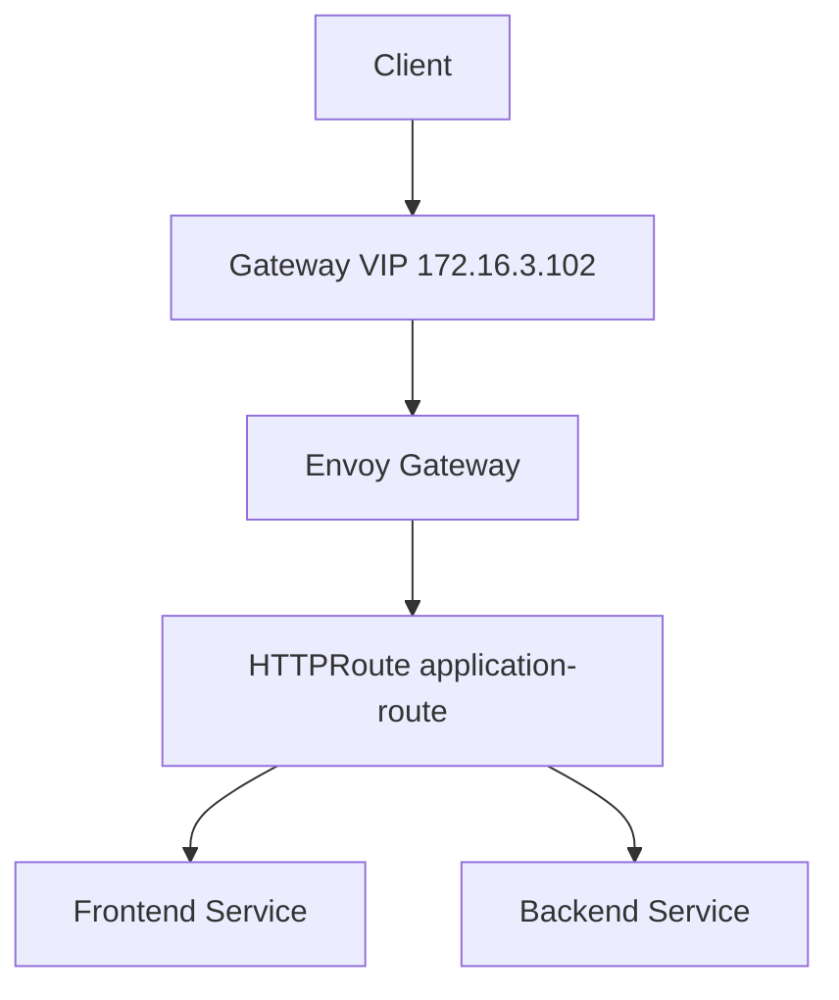

The traffic path is:

```text
Client
  |
  v
172.16.3.102
  |
  v
Envoy Gateway
  |
  v
HTTPRoute
  |
  +---- / --------> frontend:80
  |
  +---- /api -----> backend:4000
  |
  +---- /internal -> backend:4000
```

---

## 3. Why Gateway API?

Kubernetes originally used `Ingress` as the standard HTTP routing API.

Gateway API provides a more expressive and structured model for traffic management.

Instead of putting all routing configuration into a single Ingress resource, Gateway API separates responsibilities between different resources.

The main resources used here are:

| Resource | Responsibility |
|---|---|
| GatewayClass | Defines the Gateway controller implementation |
| Gateway | Defines the actual traffic entry point |
| HTTPRoute | Defines HTTP routing rules |
| Service | Provides access to application workloads |

This separation makes the architecture easier to manage and allows infrastructure and application teams to work with different resources.

---

## 4. Gateway API Architecture

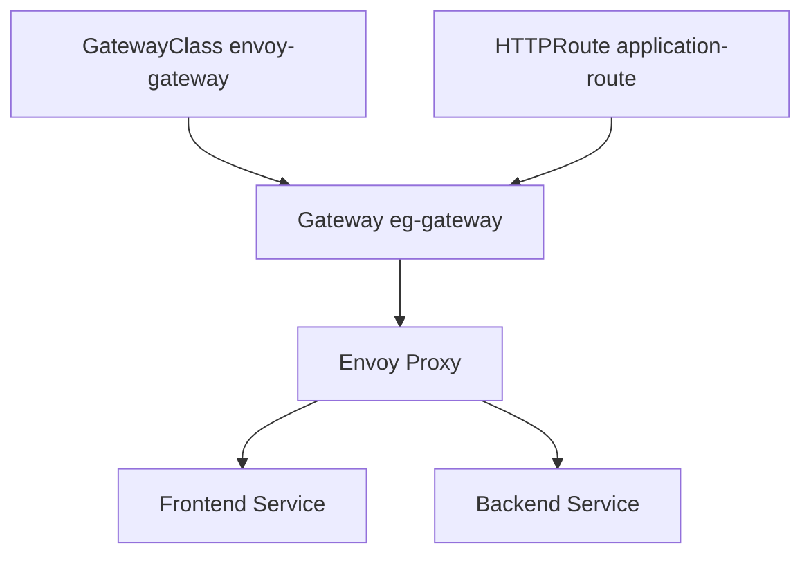

The relationship is:

```text
GatewayClass
    |
    v
Gateway
    |
    v
Envoy Proxy
    |
    v
HTTPRoute
    |
    +----> Frontend Service
    |
    +----> Backend Service
```

---

# 5. Envoy Gateway

Envoy Gateway is used as the Gateway API implementation.

The GatewayClass uses the Envoy Gateway controller:

```text
gateway.envoyproxy.io/gatewayclass-controller
```

The controller watches Gateway API resources and configures the Envoy proxy infrastructure accordingly.

The platform therefore separates responsibilities:

```text
RKE2
  |
  +-- Kubernetes Control Plane
  +-- Embedded etcd

Cilium
  |
  +-- eBPF Networking
  +-- Service Load Balancing
  +-- LoadBalancer IPAM
  +-- L2 Announcements

Envoy Gateway
  |
  +-- Gateway API
  +-- HTTP Routing
  +-- Envoy Proxy
```

---

# 6. GatewayClass

The GatewayClass identifies which controller manages the Gateway resources.

The platform uses:

```text
Name:
envoy-gateway

Controller:
gateway.envoyproxy.io/gatewayclass-controller
```

The GatewayClass also references the EnvoyProxy configuration used for the Gateway infrastructure.

```text
GatewayClass
    |
    v
Envoy Gateway Controller
    |
    v
Envoy Proxy Infrastructure
```

### Verification

```bash
kubectl get gatewayclass -o wide
```

Expected result:

```text
NAME            CONTROLLER                                      ACCEPTED
envoy-gateway   gateway.envoyproxy.io/gatewayclass-controller   True
```

---

## 7. GatewayClass Evidence

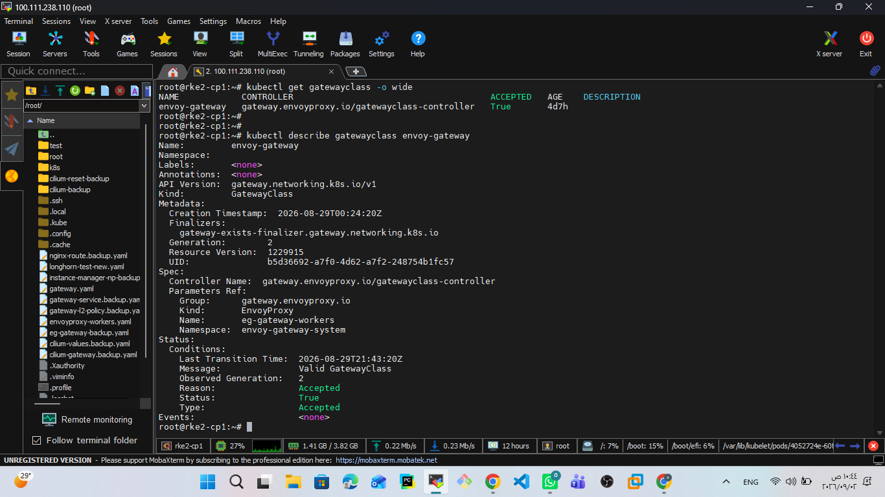

The screenshot verifies:

- `envoy-gateway` GatewayClass exists.
- The Envoy Gateway controller is registered.
- GatewayClass status is `Accepted=True`.
- The GatewayClass references the EnvoyProxy configuration.

---

# 8. Gateway

The application traffic entry point is:

```text
Gateway:
eg-gateway

Namespace:
gateway-demo

Address:
172.16.3.102

Listener:
HTTP :80
```

The Gateway is configured to accept HTTPRoutes from namespaces allowed by the listener configuration.

The current Gateway listener allows routes from all namespaces.

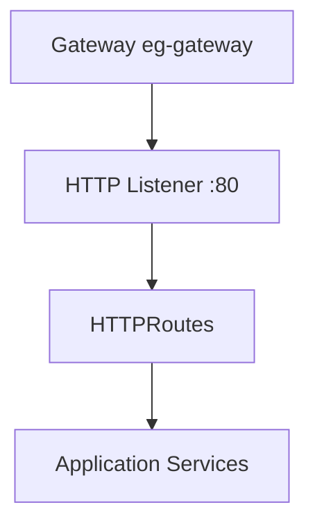

---

## 9. Gateway Address

The Gateway uses:

```text
172.16.3.102
```

This address is allocated from the Cilium LoadBalancer IP pool.

The LoadBalancer IP pool is:

```text
172.16.3.100 - 172.16.3.150
```

Cilium provides the LoadBalancer IP allocation and L2 announcement functionality.

The Envoy Gateway Service receives:

```text
ClusterIP:
10.43.198.235

External IP:
172.16.3.102

Port:
80

NodePort:
32411
```

The important application-facing endpoint is:

```text
http://172.16.3.102
```

---

# 10. Gateway Evidence

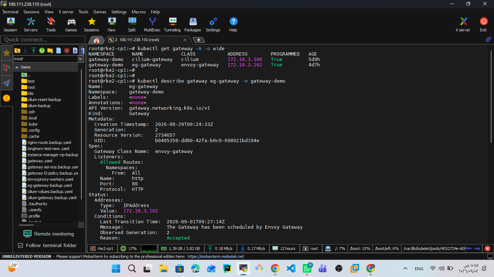

The screenshot verifies:

- `eg-gateway` exists in `gateway-demo`.
- GatewayClass is `envoy-gateway`.
- Gateway address is `172.16.3.102`.
- HTTP listener is configured on port `80`.
- Gateway status is `Programmed=True`.

---

# 11. HTTPRoute

The application routing rules are defined using:

```text
HTTPRoute:
application-route

Namespace:
microservices
```

The route defines three path-based rules.

| Path | Backend | Port |
|---|---|---:|
| `/` | frontend | 80 |
| `/api` | backend | 4000 |
| `/internal` | backend | 4000 |

---

## 12. HTTPRoute Architecture

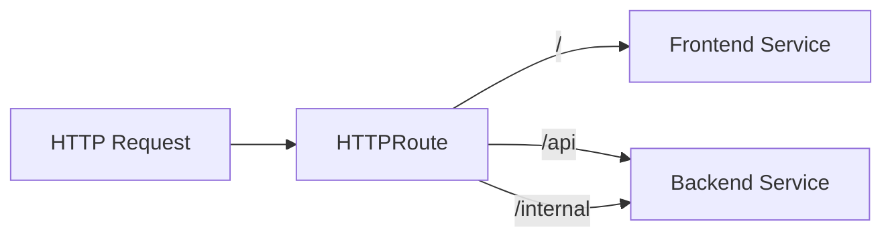

This allows the same Gateway IP to expose multiple application endpoints.

---

# 13. HTTPRoute Configuration

The routing logic is conceptually:

```text
/ 
    -> frontend:80

/api
    -> backend:4000

/internal
    -> backend:4000
```

The backend Service is:

```text
backend
10.43.220.95:4000
```

The frontend Service is:

```text
frontend
10.43.48.136:80
```

---

# 14. HTTPRoute Evidence

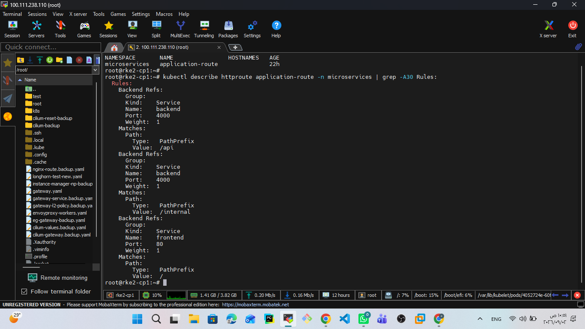

The screenshot verifies:

- `application-route` exists in the `microservices` namespace.
- `/api` routes to the backend Service.
- `/internal` routes to the backend Service.
- `/` routes to the frontend Service.
- HTTPRoute status is accepted.
- Backend references are resolved successfully.

---

# 15. Cross-Namespace Routing

The Gateway is deployed in:

```text
gateway-demo
```

while the application HTTPRoute is deployed in:

```text
microservices
```

This demonstrates separation between the infrastructure-facing Gateway layer and the application layer.

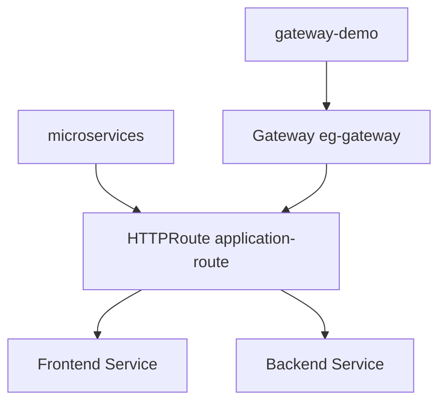

The Gateway listener is configured to allow routes from namespaces other than its own.

This enables the Gateway infrastructure to remain independent from individual application namespaces.

---

# 16. Envoy Gateway Deployment

Envoy Gateway runs the Envoy proxy infrastructure used by the Gateway.

The deployed proxy replicas are distributed across the worker nodes.

Current Envoy proxy pods include:

```text
rke2-worke01
rke2-worke02
rke2-worke03
```

This provides multiple Envoy instances instead of relying on a single proxy pod.

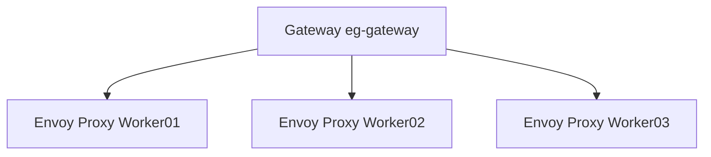

---

# 17. Envoy Gateway Evidence

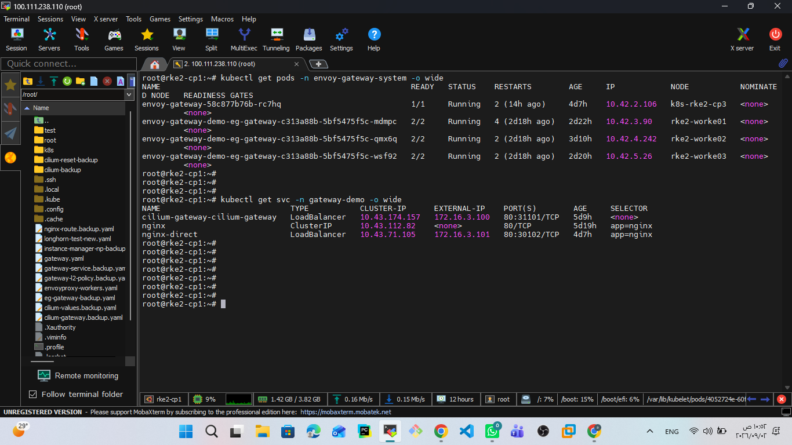

The screenshot shows the Envoy Gateway controller and Envoy proxy infrastructure running in the cluster.

The final Envoy proxy deployment uses three replicas across the worker nodes.

This provides redundancy at the Gateway proxy layer.

---

# 18. Gateway LoadBalancer

The Envoy Gateway Service is exposed as a Kubernetes `LoadBalancer` Service.

```text
Service:
envoy-gateway-demo-eg-gateway-c313a88b

Namespace:
envoy-gateway-system

Type:
LoadBalancer

ClusterIP:
10.43.198.235

External IP:
172.16.3.102

Port:
80
```

The flow is:


Cilium provides the LoadBalancer IP functionality used by the Gateway Service.

---

# 19. Request Routing

The final HTTP request flow is:

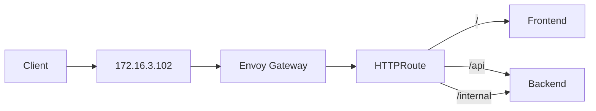

For example:

```text
GET /
```

is routed to:

```text
frontend:80
```

while:

```text
GET /api/health
```

is routed to:

```text
backend:4000
```

and:

```text
GET /internal/health
```

is routed to:

```text
backend:4000
```

---

# 20. Gateway API vs Ingress

Traditional Kubernetes Ingress provides a simpler HTTP routing model.

Gateway API introduces a more structured model.

### Ingress

```text
Ingress
   |
   +-- Routing Rules
   |
   +-- Backend Services
```

### Gateway API

```text
GatewayClass
   |
   v
Gateway
   |
   v
HTTPRoute
   |
   +-- Frontend
   |
   +-- Backend
```

Gateway API provides a clearer separation of responsibilities.

This is especially useful when infrastructure and application teams manage different parts of the platform.

---

# 21. Why Envoy Gateway?

Envoy Gateway was selected as the Gateway API implementation for the final platform.

The design separates:

```text
Cilium
    |
    +-- Cluster networking
    +-- eBPF datapath
    +-- LoadBalancer IP management
    +-- L2 announcements

Envoy Gateway
    |
    +-- Gateway API implementation
    +-- HTTP traffic routing
    +-- Envoy proxy infrastructure
```

This keeps the network datapath and application traffic gateway responsibilities clearly separated.

---

# 22. Repository Structure

The Gateway resources are kept separately from the application workloads.

```text
k8s/
├── apps/
│   ├── backend/
│   ├── database/
│   ├── frontend/
│   ├── gateway/
│   │   ├── gateway.yaml
│   │   └── httproute.yaml
│   └── redis/
│
└── infrastructure/
    ├── cilium/
    │   ├── l2-announcement-policy.yaml
    │   └── loadbalancer-ip-pool.yaml
    │
    ├── envoy-gateway/
    │   ├── envoyproxy.yaml
    │   └── gatewayclass.yaml
    │
    └── longhorn/
        └── helmchart.yaml
```

The Gateway API resources are therefore GitOps-ready and separated from the application Deployment and Service manifests.

---

# 23. Verification

## GatewayClass

```bash
kubectl get gatewayclass -o wide
```

## Gateway

```bash
kubectl get gateway -A -o wide
```

## Gateway Details

```bash
kubectl describe gateway eg-gateway -n gateway-demo
```

## HTTPRoute

```bash
kubectl get httproute -A -o wide
```

## HTTPRoute Details

```bash
kubectl describe httproute application-route -n microservices
```

## Envoy Gateway Pods

```bash
kubectl get pods -n envoy-gateway-system -o wide
```

## Gateway Services

```bash
kubectl get svc -A -o wide
```

---

# 24. End-to-End Verification

The final Gateway was tested through the actual Gateway IP.

## Frontend

```bash
curl -i http://172.16.3.102/
```

Expected:

```text
HTTP/1.1 200 OK
```

The request reaches the frontend application.

---

## Backend Health

```bash
curl -i http://172.16.3.102/api/health
```

Expected:

```text
HTTP/1.1 200 OK
```

The backend reports:

```text
status: UP
database: UP
```

---

## Backend Products API

```bash
curl -i http://172.16.3.102/api/products
```

Expected:

```text
HTTP/1.1 200 OK
```

The API returns the application product data.

---

## Internal Backend Route

```bash
curl -i http://172.16.3.102/internal/health
```

Expected:

```text
HTTP/1.1 200 OK
```

---

# 25. End-to-End Traffic Flow

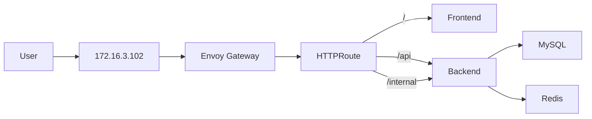

The complete request path is:

```text
Client
  |
  v
Gateway VIP
172.16.3.102
  |
  v
Envoy Gateway
  |
  v
HTTPRoute
  |
  +---- / --------> Frontend Service
  |
  +---- /api -----> Backend Service
  |
  +---- /internal -> Backend Service
                         |
                         +----> MySQL
                         |
                         +----> Redis
```

---

# 26. End-to-End Evidence


The screenshot verifies the complete application traffic path through the Gateway.

Verified endpoints:

```text
http://172.16.3.102/
http://172.16.3.102/api/health
http://172.16.3.102/api/products
http://172.16.3.102/internal/health
```

All required routes successfully reached their intended backend Services.

---

# 27. Final State

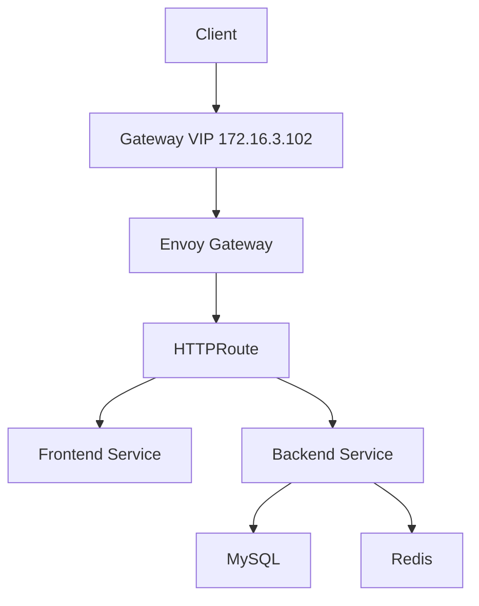

The final Gateway layer provides:

- Gateway API based traffic management.
- Envoy Gateway as the Gateway API controller.
- Three Envoy proxy replicas.
- A dedicated Gateway VIP.
- HTTP path-based routing.
- Cross-namespace Gateway/HTTPRoute separation.
- Integration with Cilium LoadBalancer IP management.
- GitOps-ready Kubernetes manifests.
- End-to-end verified application access.

---

# 28. Design Summary

| Component | Final Design |
|---|---|
| Gateway API implementation | Envoy Gateway |
| GatewayClass | `envoy-gateway` |
| Gateway | `eg-gateway` |
| Gateway namespace | `gateway-demo` |
| Application namespace | `microservices` |
| Gateway IP | `172.16.3.102` |
| Listener | HTTP :80 |
| HTTPRoute | `application-route` |
| Frontend route | `/` |
| Backend API route | `/api` |
| Internal route | `/internal` |
| Envoy replicas | 3 |
| LoadBalancer IP management | Cilium |
| L2 announcement | Cilium |
| Configuration location | `k8s/apps/gateway` |
| GitOps readiness | Yes |

---

# 29. Current Platform Flow

The platform now has the following layered architecture:

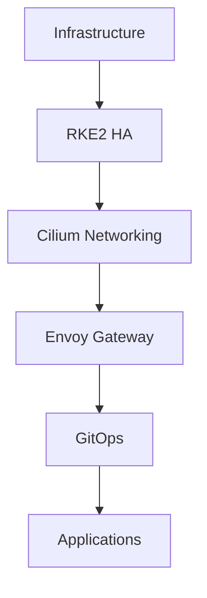

The Gateway layer therefore sits between the Kubernetes networking layer and the application delivery layer.

---

# 30. Next Step

The Gateway API layer is complete and verified.

The next section will implement GitOps using Argo CD.

Next documentation:

```text
docs/04-gitops-argocd/README.md
```

The next platform flow will be:

```text
Git Repository
      |
      v
   Argo CD
      |
      v
Kubernetes Cluster
      |
      v
Applications
```
