# Gateway API with Envoy Gateway

## Overview

Gateway API provides the application entry point into the Kubernetes platform.

The implementation uses Envoy Gateway as the Gateway API controller, while Cilium provides the underlying Kubernetes networking, LoadBalancer IP allocation, and L2 announcement capabilities.

The Gateway exposes the application through the dedicated LoadBalancer IP `172.16.3.102`.

The application is accessed through:

`https://app.microservices.home.arpa`

TLS is terminated at Envoy Gateway, while HTTPRoute resources define how requests are forwarded to the application services.

## Architecture

The Gateway layer consists of:

- Cilium for Kubernetes networking, eBPF datapath, native routing, LoadBalancer IPAM, and L2 announcements.
- Envoy Gateway for Gateway API implementation, Envoy proxy management, TLS termination, and HTTP routing.
- Gateway API resources including GatewayClass, Gateway, and HTTPRoute.
- Application Services including frontend, backend-stable, and backend-canary.

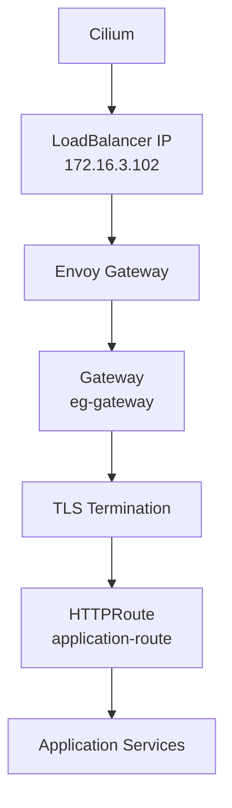

## Why Gateway API

Gateway API was selected instead of the traditional Kubernetes Ingress API because it provides a more structured traffic-management model.

The configuration separates responsibilities between:

- GatewayClass
- Gateway
- HTTPRoute

This allows platform infrastructure and application routing to be managed independently.

A platform administrator can manage the shared Gateway while application teams manage their own HTTPRoutes.

This also provides a foundation for progressive delivery because Argo Rollouts can modify HTTPRoute backend weights during a canary rollout.

## Gateway API Architecture

The Gateway API resource relationship is:

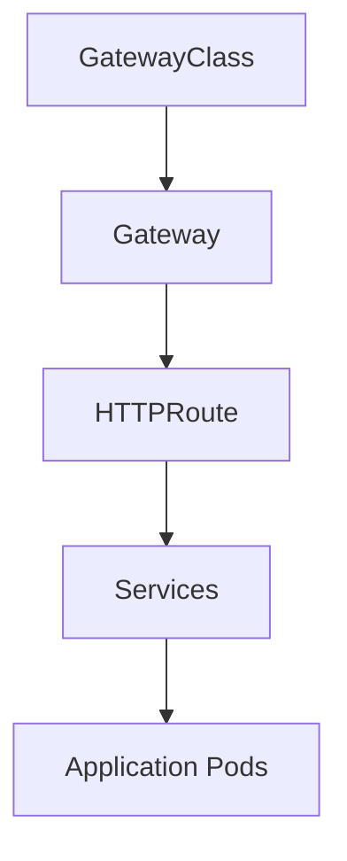

The actual implementation uses:

```text
GatewayClass:
envoy-gateway

Gateway:
gateway-demo/eg-gateway

HTTPRoute:
microservices/application-route
```

## Envoy Gateway

Envoy Gateway is responsible for implementing the Gateway API resources.

The controller is:

```text
gateway.envoyproxy.io/gatewayclass-controller
```

The GatewayClass is:

```yaml
apiVersion: gateway.networking.k8s.io/v1
kind: GatewayClass
metadata:
  name: envoy-gateway
spec:
  controllerName: gateway.envoyproxy.io/gatewayclass-controller
```

The GatewayClass connects the Kubernetes Gateway API resources with Envoy Gateway.

## GatewayClass Evidence


## Gateway

The platform Gateway is:

```yaml
apiVersion: gateway.networking.k8s.io/v1
kind: Gateway
metadata:
  name: eg-gateway
  namespace: gateway-demo
```

The Gateway is exposed through:

```text
172.16.3.102
```

It provides two listeners:

```text
HTTP
Port: 80

HTTPS
Port: 443
Hostname: *.microservices.home.arpa
```

The HTTPS listener is used for application traffic.

The Gateway allows HTTPRoutes from all namespaces:

```text
allowedRoutes:
  namespaces:
    from: All
```

This allows application namespaces to attach their HTTPRoute resources to the shared Gateway.

## Gateway Evidence


## TLS Termination

TLS is terminated at Envoy Gateway.

The application endpoint is:

```text
https://app.microservices.home.arpa
```

The Gateway HTTPS listener uses the configured Kubernetes TLS Secret for:

```text
*.microservices.home.arpa
```

The HTTPS request is received by Envoy, TLS is terminated at the Gateway, and the resulting HTTP request is evaluated by the HTTPRoute.

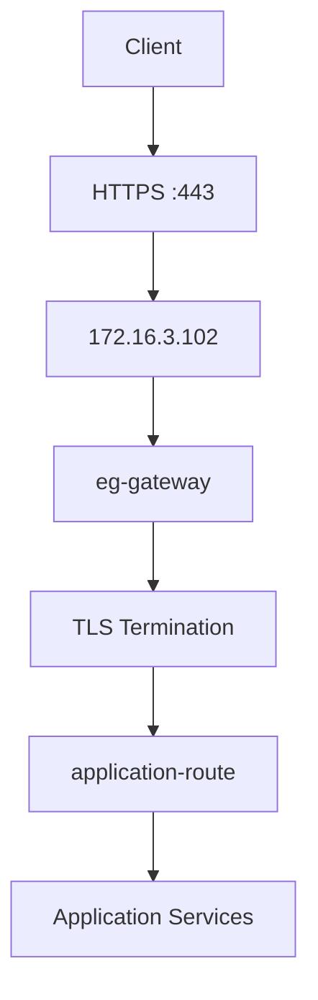

## HSTS

HSTS is enabled as part of the secure Gateway configuration.

Its purpose is to instruct compatible clients to use HTTPS for subsequent requests to the application domain.

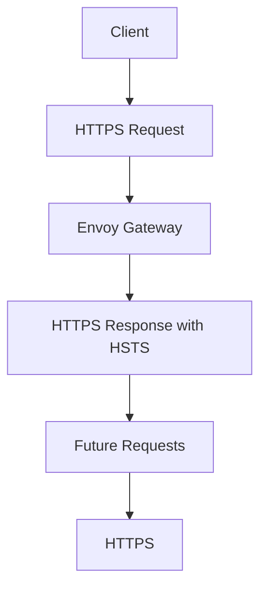

## Gateway LoadBalancer

Envoy Gateway creates a Kubernetes LoadBalancer Service.

The Service is:

```text
Namespace:
envoy-gateway-system

Service:
envoy-gateway-demo-eg-gateway-c313a88b5

Type:
LoadBalancer

ClusterIP:
10.43.198.235

External IP:
172.16.3.102

NodePort:
32411
```

The LoadBalancer IP is provided through the Cilium LoadBalancer implementation.

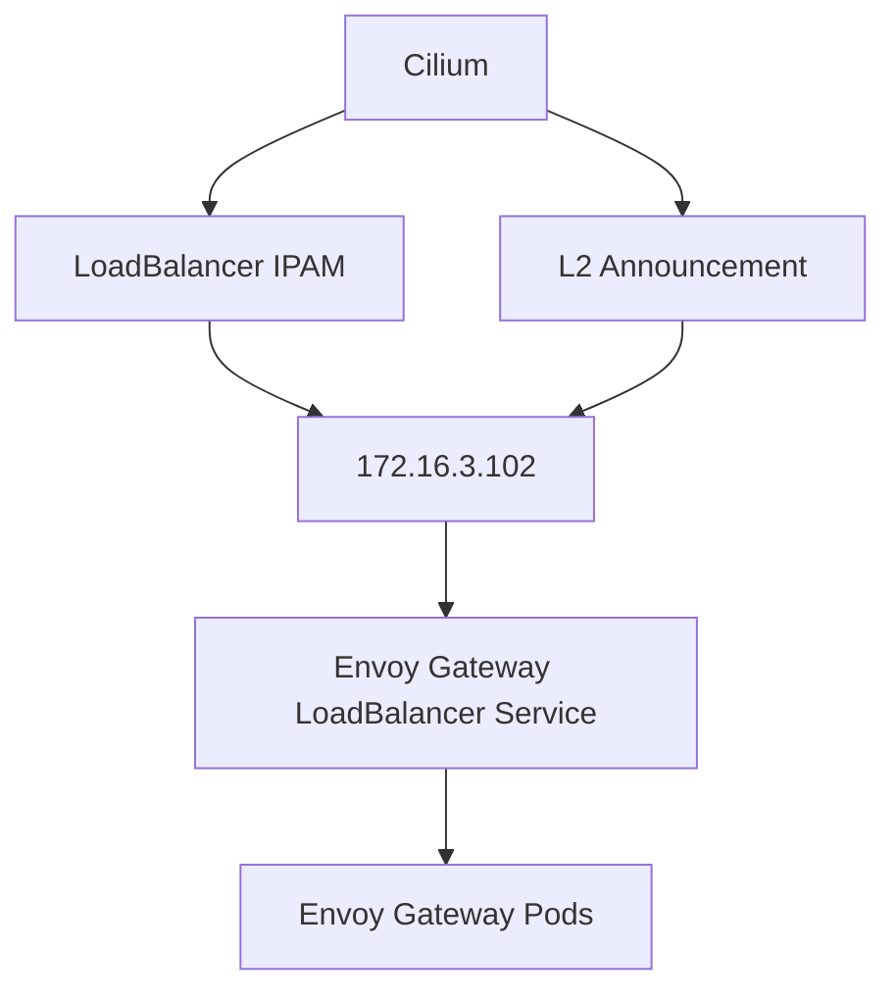

## Cilium LoadBalancer Configuration

The LoadBalancer IP pool is:

```yaml
apiVersion: cilium.io/v2
kind: CiliumLoadBalancerIPPool
metadata:
  name: gateway-pool
spec:
  blocks:
  - start: 172.16.3.100
    stop: 172.16.3.150
```

The pool provides addresses from:

```text
172.16.3.100 - 172.16.3.150
```

The Gateway currently uses:

```text
172.16.3.102
```

The L2 announcement policy is:

```yaml
apiVersion: cilium.io/v2alpha1
kind: CiliumL2AnnouncementPolicy
metadata:
  name: gateway-l2-policy
spec:
  interfaces:
  - eth1
  loadBalancerIPs: true
```

This allows Cilium to announce LoadBalancer addresses on the configured internal network.

## HTTPRoute

The application routing is defined by:

```text
Namespace:
microservices

Name:
application-route
```

The HTTPRoute attaches to:

```text
Gateway:
gateway-demo/eg-gateway

Listener:
https
```

The application hostname is:

```text
app.microservices.home.arpa
```

The HTTPRoute handles:

```text
/api
/internal
/
```

The routing model is:

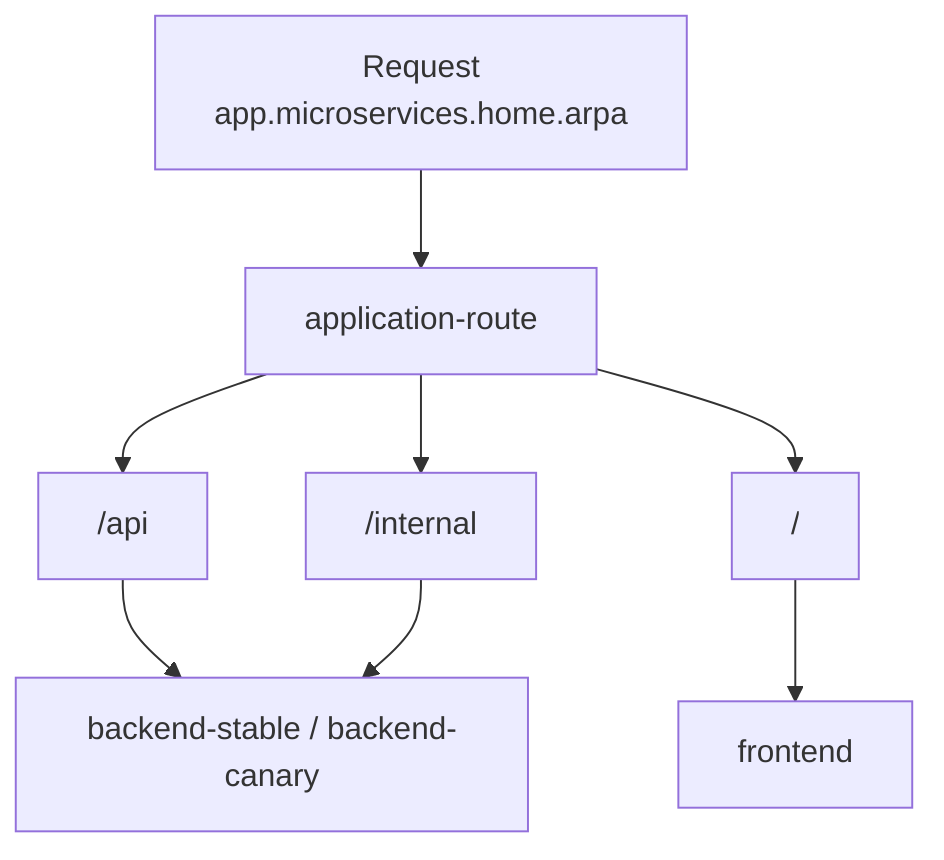

## HTTPRoute Configuration

The HTTPRoute uses the HTTPS listener:

```yaml
parentRefs:
- name: eg-gateway
  namespace: gateway-demo
  sectionName: https
```

The hostname is:

```yaml
hostnames:
- app.microservices.home.arpa
```

The backend routing is:

```text
/api       -> backend-stable / backend-canary
/internal  -> backend-stable / backend-canary
/          -> frontend
```

The backend routes are integrated with Argo Rollouts.

During a backend canary rollout, Argo Rollouts updates the backend weights in the HTTPRoute.

This allows traffic to move progressively between the stable and canary versions.

## HTTPRoute Evidence


## Cross-Namespace Routing

The Gateway exists in:

```text
gateway-demo
```

while the application HTTPRoute exists in:

```text
microservices
```

The HTTPRoute references the Gateway across namespaces.

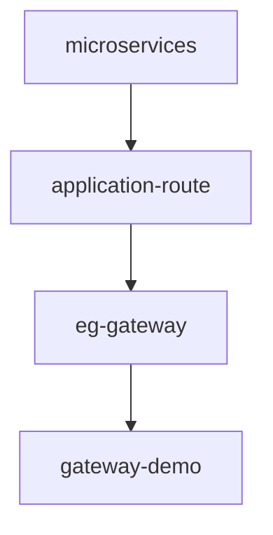

The Gateway allows routes from all namespaces through:

```text
allowedRoutes.namespaces.from: All
```

This demonstrates the separation between the shared platform Gateway and application namespaces.

## Envoy Gateway Deployment

Envoy Gateway runs in:

```text
envoy-gateway-system
```

The Envoy proxy deployment is configured with three replicas.

The replicas are distributed across worker nodes using topology spread configuration.

This provides redundancy at the Gateway layer.

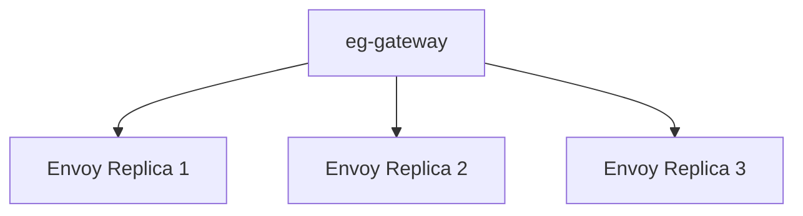

## Envoy Gateway Evidence


## HTTPS Application Access

The application is accessed through:

```text
https://app.microservices.home.arpa
```

The Gateway uses:

```text
172.16.3.102:443
```

The hostname is required because the HTTPRoute is configured for:

```text
app.microservices.home.arpa
```

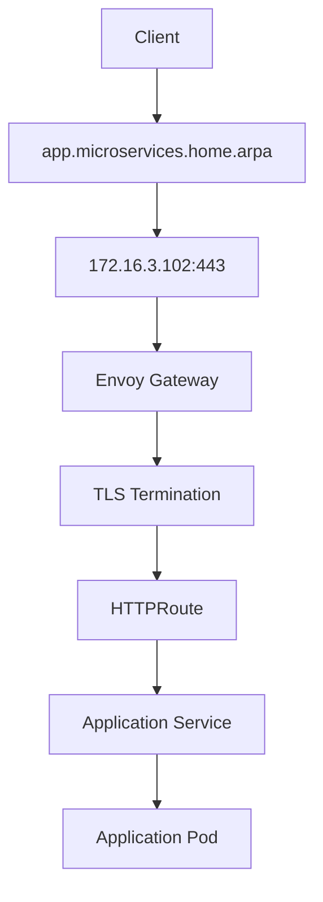

## Request Routing

For a frontend request:

```text
https://app.microservices.home.arpa/
```

the HTTPRoute sends the request to:

```text
frontend:80
```

For backend requests:

```text
https://app.microservices.home.arpa/api
https://app.microservices.home.arpa/internal
```

the HTTPRoute sends the requests to the backend Services.

During a canary rollout, backend traffic is distributed between:

```text
backend-stable
backend-canary
```

according to the weights managed by Argo Rollouts.

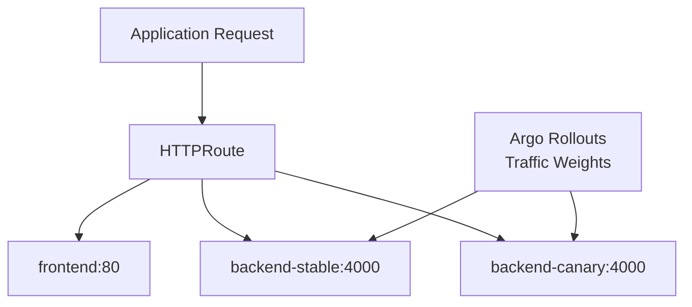

## Complete Gateway Traffic Flow

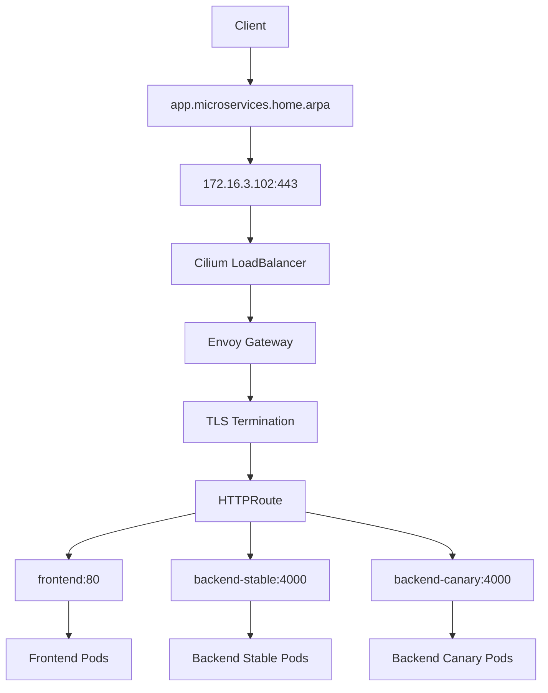

## Gateway API vs Ingress

Traditional Kubernetes Ingress provides a simpler HTTP routing model.

Gateway API introduces dedicated resources for different responsibilities.

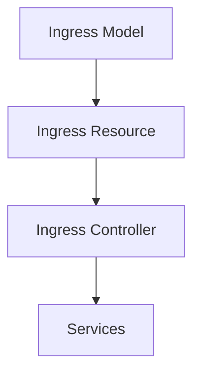

Gateway API separates these responsibilities:

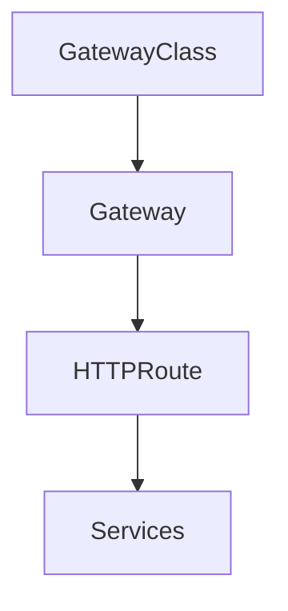

Gateway API provides better separation of responsibilities and is better suited for shared Gateway infrastructure and advanced traffic-management use cases.

## Why Envoy Gateway

Envoy Gateway was selected as the Gateway API implementation because it provides:

- Native Gateway API support
- Envoy-based proxy architecture
- TLS termination
- HTTP routing
- LoadBalancer integration
- Multi-namespace Gateway usage
- Integration with Argo Rollouts through the Gateway API traffic-routing plugin

The final Gateway implementation is:

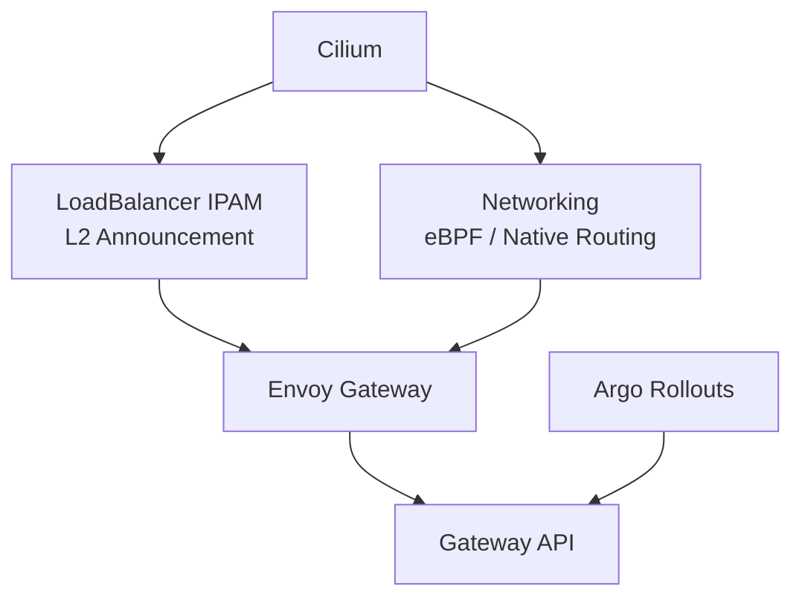

Cilium remains responsible for the network and LoadBalancer layer, while Envoy Gateway is responsible for Gateway API traffic processing.

## Repository Structure

```text
microservices-platform-gitops/
├── apps/
│   ├── backend/
│   │   ├── rollout.yaml
│   │   ├── stable-service.yaml
│   │   └── canary-service.yaml
│   │
│   ├── frontend/
│   │   ├── rollout.yaml
│   │   └── preview-service.yaml
│   │
│   └── database/
│
├── argocd/
│   └── applications/
│
├── infrastructure/
│
├── docs/
│   ├── 01-rke2-ha/
│   ├── 02-cilium/
│   ├── 03-gateway-api/
│   └── ...
│
└── screenshots/
```

Gateway documentation screenshots are stored in the repository root:

```text
screenshots/
```

The documentation file is located under:

```text
docs/03-gateway-api/
```

Therefore screenshots are referenced using:

```text
../../screenshots/
```

## Verification Commands

Check GatewayClass:

```bash
kubectl get gatewayclass
```

Check Gateway:

```bash
kubectl get gateway -n gateway-demo
```

Check Gateway details:

```bash
kubectl describe gateway eg-gateway -n gateway-demo
```

Check HTTPRoute:

```bash
kubectl get httproute -n microservices
```

Check HTTPRoute details:

```bash
kubectl describe httproute application-route -n microservices
```

Check Envoy Gateway pods:

```bash
kubectl get pods -n envoy-gateway-system -o wide
```

Check Envoy Gateway Service:

```bash
kubectl get svc -n envoy-gateway-system
```

Check Cilium LoadBalancer IP pool:

```bash
kubectl get ciliuml2announcementpolicy
kubectl get ciliumloadbalancerippools
```

## End-to-End Verification

The Gateway was verified using the configured application hostname and Gateway address.

Frontend:

```bash
curl -k --resolve app.microservices.home.arpa:443:172.16.3.102 \
  https://app.microservices.home.arpa/
```

Backend health:

```bash
curl -k --resolve app.microservices.home.arpa:443:172.16.3.102 \
  https://app.microservices.home.arpa/api/health
```

Backend products endpoint:

```bash
curl -k --resolve app.microservices.home.arpa:443:172.16.3.102 \
  https://app.microservices.home.arpa/api/products
```

Internal endpoint:

```bash
curl -k --resolve app.microservices.home.arpa:443:172.16.3.102 \
  https://app.microservices.home.arpa/internal/health
```

The verification confirmed:

- Gateway is programmed.
- HTTPS listener is active.
- TLS termination works.
- HTTPRoute is accepted.
- Frontend traffic reaches the frontend service.
- Backend traffic reaches the backend services.
- Canary traffic can be controlled through HTTPRoute weights.

## End-to-End Evidence


## Final Architecture

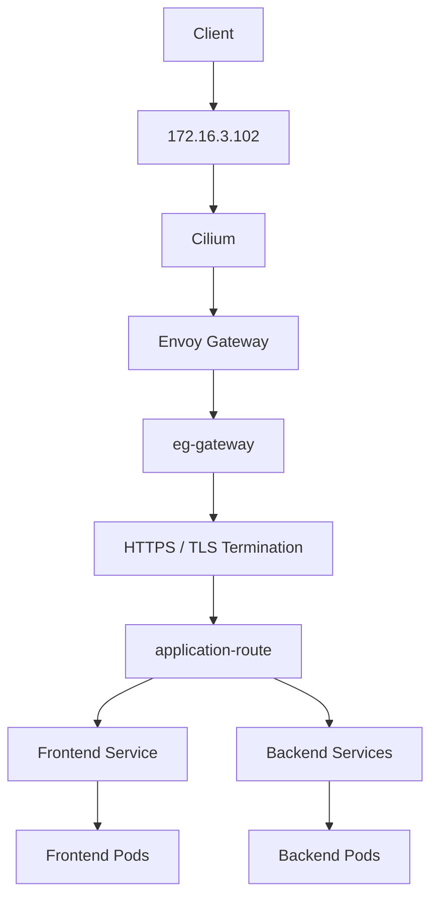

## Final Gateway and TLS Flow

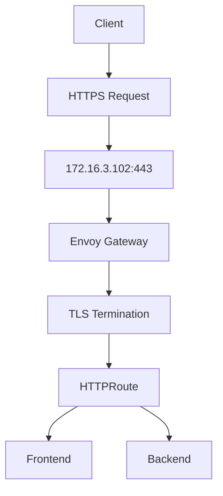

## Final State

The final Gateway implementation can be represented as:

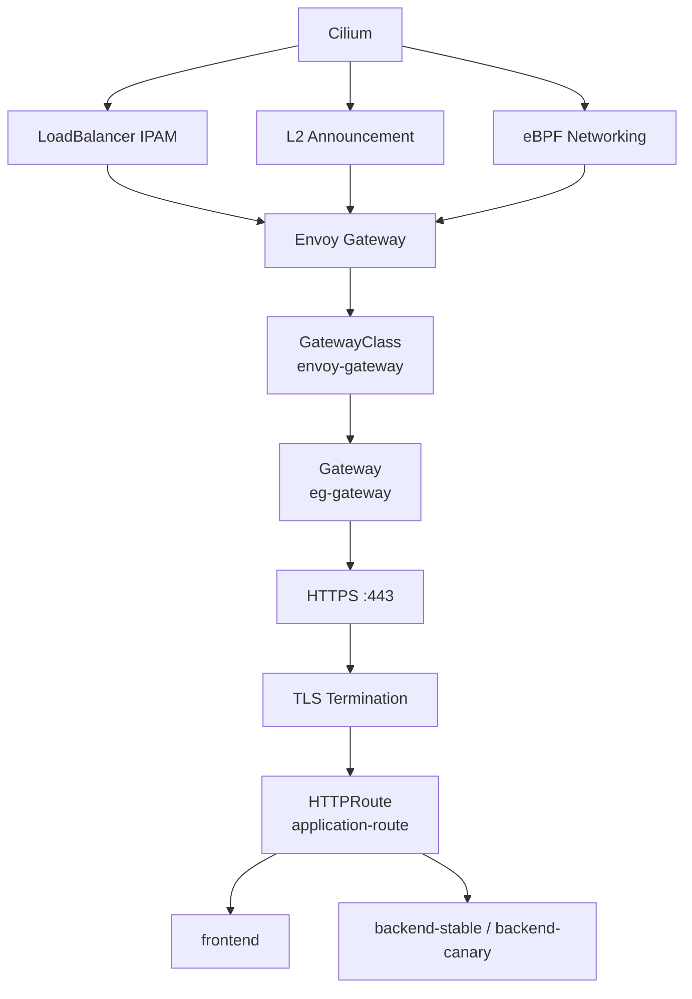

## Design Summary

The Gateway architecture separates networking, Gateway infrastructure, routing, and application workloads.

Cilium provides the underlying network connectivity and LoadBalancer functionality.

Envoy Gateway implements the Gateway API and handles TLS termination and HTTP traffic processing.

Gateway API resources provide the routing model.

Argo Rollouts integrates with HTTPRoute to control backend canary traffic.

The architecture provides:

- Dedicated internal LoadBalancer IP.
- HTTPS access through the application domain.
- TLS termination at the Gateway.
- HSTS security behavior.
- Shared Gateway infrastructure.
- Namespace-level application routing.
- Progressive delivery integration.
- Separation between platform networking and application routing.

## Current Platform Flow

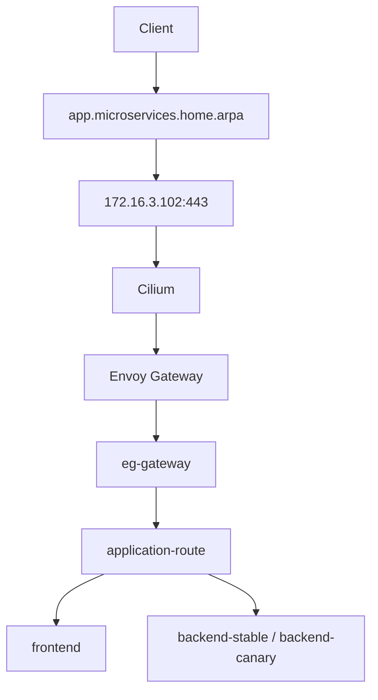

The Gateway layer is now integrated with the secure external access model and is ready to serve the GitOps-managed application platform.
