# Gateway API with Envoy Gateway

## 1. Overview

This section implements the north-south application traffic layer using **Kubernetes Gateway API** with **Envoy Gateway**.

The platform uses:

- Kubernetes Gateway API
- Envoy Gateway
- Envoy proxy replicas
- HTTPRoute
- Cilium LoadBalancer IPAM
- Cilium L2 Announcements
- Kubernetes Services

The final Gateway is:

```text
Gateway:     eg-gateway
Namespace:   gateway-demo
Address:     172.16.3.102
Protocol:    HTTP
Port:        80
```

The Gateway provides a single entry point for application traffic and routes requests to the appropriate application Services.

---

## 2. Architecture

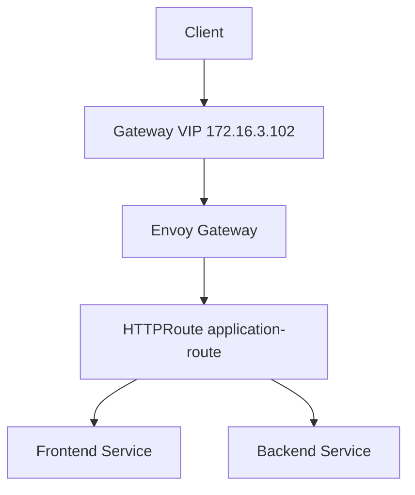

The final architecture separates the responsibilities of the networking and application traffic layers:

- **Cilium** provides cluster networking and LoadBalancer IP management.
- **Envoy Gateway** implements Gateway API.
- **HTTPRoute** defines application routing rules.
- **Services** expose the application workloads internally.

---

## 3. Why Gateway API?

Kubernetes originally provided `Ingress` as the standard HTTP routing API.

Gateway API introduces a more structured model where infrastructure and application traffic configuration are separated into different resources.

The main resources used in this platform are:

| Resource | Responsibility |
|---|---|
| GatewayClass | Defines the Gateway controller implementation |
| Gateway | Defines the traffic entry point |
| HTTPRoute | Defines HTTP routing rules |
| Service | Provides access to application workloads |

This separation makes the platform easier to manage and provides a cleaner model for multi-application and multi-namespace environments.

---

# 4. Gateway API Architecture

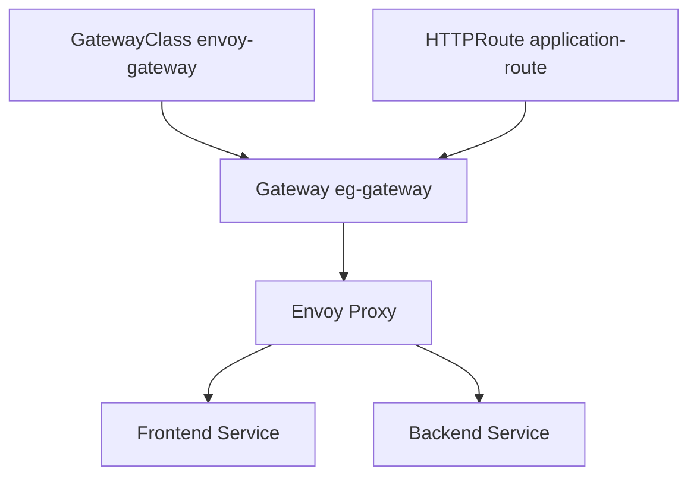

The relationship between the Gateway API resources is:

```text
GatewayClass
    |
    v
Gateway
    |
    v
Envoy Gateway
    |
    v
HTTPRoute
    |
    +----> Frontend Service
    |
    +----> Backend Service
```

The ASCII representation above is only used as a conceptual text representation. The actual architecture diagram is provided using Mermaid so GitHub can render it visually.

---

# 5. Envoy Gateway

Envoy Gateway is the Gateway API implementation used by the final platform.

The GatewayClass is controlled by:

```text
gateway.envoyproxy.io/gatewayclass-controller
```

The Envoy Gateway controller watches Gateway API resources and creates and configures the required Envoy proxy infrastructure.

The responsibility split is:

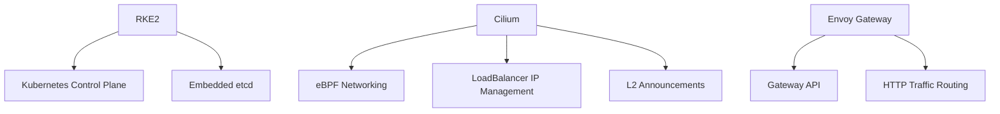

This provides a clean separation between:

- Kubernetes control-plane responsibilities.
- Cluster networking responsibilities.
- External LoadBalancer addressing.
- Application traffic routing.

---

# 6. GatewayClass

The `GatewayClass` identifies the controller responsible for managing Gateway resources.

The platform uses:

```text
Name:
envoy-gateway

Controller:
gateway.envoyproxy.io/gatewayclass-controller
```

The GatewayClass is associated with the EnvoyProxy configuration used by the Gateway infrastructure.

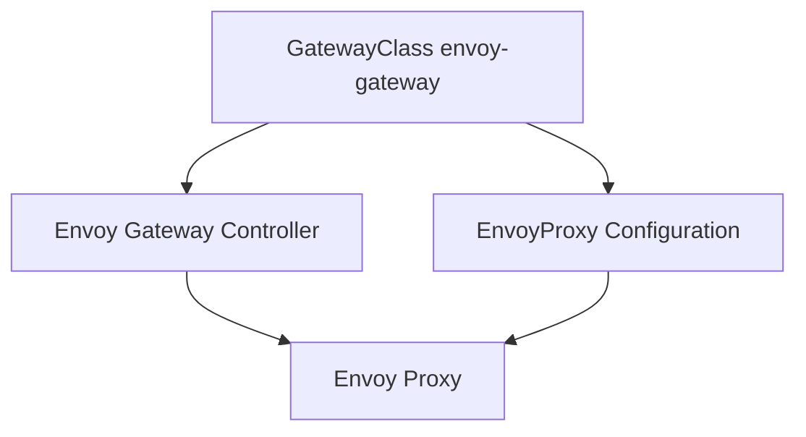

### Verification

```bash
kubectl get gatewayclass -o wide
```

Expected:

```text
NAME            CONTROLLER                                      ACCEPTED
envoy-gateway   gateway.envoyproxy.io/gatewayclass-controller   True
```

---

# 7. GatewayClass Evidence


The screenshot verifies:

- `envoy-gateway` GatewayClass exists.
- The Envoy Gateway controller is registered.
- GatewayClass status is `Accepted=True`.
- The GatewayClass references the EnvoyProxy configuration.

---

# 8. Gateway

The final application traffic entry point is:

```text
Gateway:
eg-gateway

Namespace:
gateway-demo

Address:
172.16.3.102

Listener:
HTTP :80
```

The Gateway is responsible for defining the listener and accepting HTTPRoute resources.

The listener is configured to allow routes from namespaces according to the Gateway configuration.

---

# 9. Gateway Listener

The Gateway exposes an HTTP listener:

```text
Protocol: HTTP
Port:     80
```

The traffic relationship is:

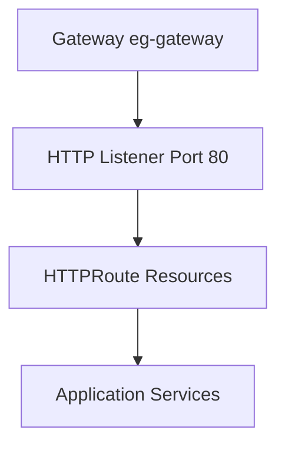

The Gateway itself does not define the application backend paths.

Those paths are defined by `HTTPRoute`.

---

# 10. Gateway Address

The Gateway uses the following external address:

```text
172.16.3.102
```

The address is allocated from the Cilium LoadBalancer IP pool.

The configured pool is:

```text
172.16.3.100 - 172.16.3.150
```

The Envoy Gateway Service is exposed as a Kubernetes `LoadBalancer` Service.

Current Service information:

```text
Service:
envoy-gateway-demo-eg-gateway-c313a88b

Namespace:
envoy-gateway-system

Type:
LoadBalancer

ClusterIP:
10.43.198.235

External IP:
172.16.3.102

Port:
80

NodePort:
32411
```

The application-facing endpoint is:

```text
http://172.16.3.102
```

---

# 11. Gateway and LoadBalancer Flow

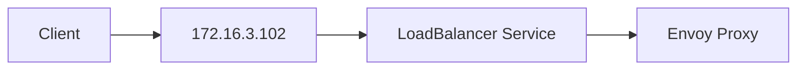

Cilium provides the LoadBalancer IP management and L2 announcement functionality used to make the Gateway address reachable on the internal network.

---

# 12. Gateway Evidence


The screenshot verifies:

- `eg-gateway` exists in the `gateway-demo` namespace.
- The GatewayClass is `envoy-gateway`.
- The Gateway address is `172.16.3.102`.
- The Gateway uses an HTTP listener on port `80`.
- Gateway status is `Programmed=True`.

---

# 13. HTTPRoute

Application routing is defined using:

```text
HTTPRoute:
application-route

Namespace:
microservices
```

The route defines three path-based rules:

| Path | Backend | Port |
|---|---|---:|
| `/` | frontend | 80 |
| `/api` | backend | 4000 |
| `/internal` | backend | 4000 |

---

# 14. HTTPRoute Architecture

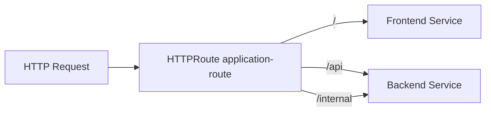

This allows a single Gateway IP to expose multiple application endpoints.

---

# 15. HTTPRoute Configuration

The routing logic is:

```text
/ 
    -> frontend:80

/api
    -> backend:4000

/internal
    -> backend:4000
```

The frontend Service is:

```text
frontend
10.43.48.136:80
```

The backend Service is:

```text
backend
10.43.220.95:4000
```

The HTTPRoute connects the Gateway traffic layer to these application Services.

---

# 16. HTTPRoute Evidence


The screenshot verifies:

- `application-route` exists in the `microservices` namespace.
- `/api` routes to the backend Service.
- `/internal` routes to the backend Service.
- `/` routes to the frontend Service.
- The HTTPRoute is accepted.
- Backend references are resolved successfully.

---

# 17. Cross-Namespace Routing

The Gateway and HTTPRoute are intentionally separated into different namespaces.

Gateway:

```text
gateway-demo
```

HTTPRoute:

```text
microservices
```

This provides separation between the Gateway infrastructure layer and the application layer.

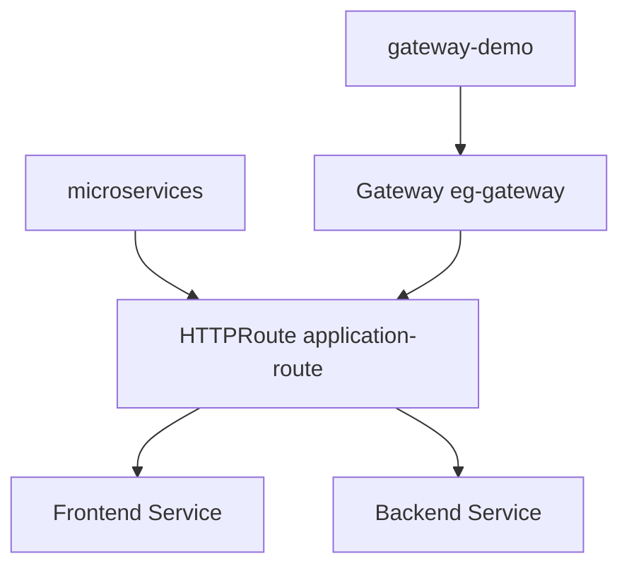

The Gateway listener is configured to accept routes from the required namespaces.

This allows applications to define their own routing rules without moving the Gateway infrastructure into the application namespace.

---

# 18. Envoy Gateway Deployment

Envoy Gateway provides the Envoy proxy infrastructure used by the Gateway.

The final proxy deployment uses three replicas distributed across the worker nodes:

```text
rke2-worke01
rke2-worke02
rke2-worke03
```

The architecture is:

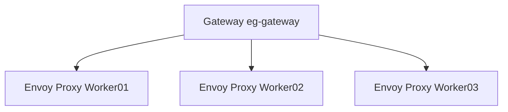

This avoids relying on a single Envoy proxy instance.

---

# 19. Envoy Gateway Evidence


The screenshot shows:

- Envoy Gateway controller.
- Envoy proxy infrastructure.
- Three Envoy proxy replicas.
- Proxy placement across the worker nodes.

The three proxy replicas provide redundancy at the Gateway layer.

---

# 20. Request Routing

The final request path is:

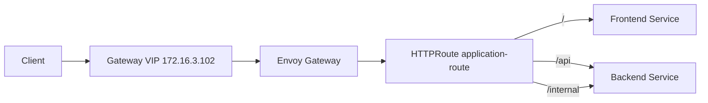

For example:

```text
GET /
```

is routed to:

```text
frontend:80
```

while:

```text
GET /api/health
```

is routed to:

```text
backend:4000
```

and:

```text
GET /internal/health
```

is routed to:

```text
backend:4000
```

---

# 21. Complete Gateway Traffic Flow

This is the complete application traffic path:

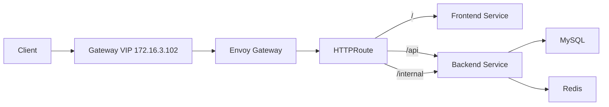

This represents the actual application flow:

- Client connects to the Gateway VIP.
- Traffic reaches Envoy Gateway.
- Envoy processes the HTTPRoute.
- `/` is routed to the frontend.
- `/api` is routed to the backend.
- `/internal` is routed to the backend.
- The backend communicates with MySQL and Redis.

---

# 22. Gateway API vs Ingress

Traditional Kubernetes Ingress provides HTTP routing using a single resource model.

Gateway API separates the traffic configuration into multiple resources.

### Ingress model

```text
Ingress
    |
    +-- Routing Rules
    |
    +-- Backend Services
```

### Gateway API model

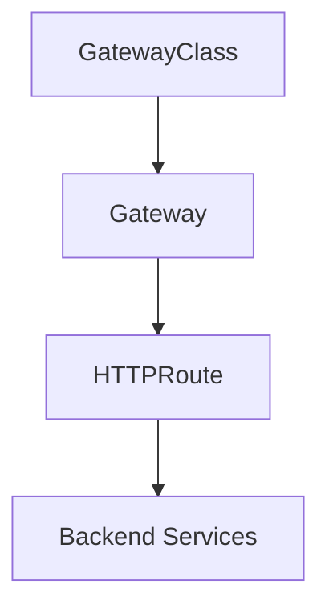

Gateway API provides clearer separation of responsibilities and is better suited to larger platforms with multiple applications and teams.

---

# 23. Why Envoy Gateway?

Envoy Gateway was selected as the final Gateway API implementation.

The design keeps Cilium and Envoy Gateway responsibilities separate.

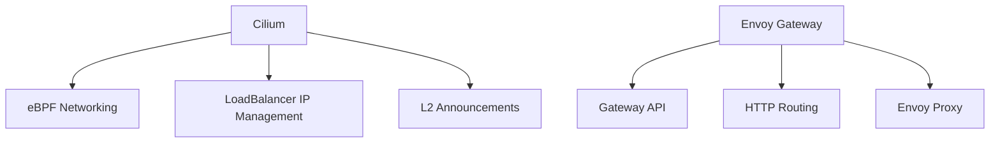

### Cilium responsibilities

- Cluster networking.
- eBPF datapath.
- LoadBalancer IP management.
- L2 announcements.

### Envoy Gateway responsibilities

- Gateway API implementation.
- Gateway resources.
- HTTPRoute processing.
- Envoy proxy infrastructure.
- Application traffic routing.

This separation keeps the architecture easier to understand and maintain.

---

# 24. Repository Structure

The Gateway resources are kept separately from the application workloads.

```text
k8s/
├── apps/
│   ├── backend/
│   ├── database/
│   ├── frontend/
│   ├── gateway/
│   │   ├── gateway.yaml
│   │   └── httproute.yaml
│   └── redis/
│
└── infrastructure/
    ├── cilium/
    │   ├── l2-announcement-policy.yaml
    │   └── loadbalancer-ip-pool.yaml
    │
    ├── envoy-gateway/
    │   ├── envoyproxy.yaml
    │   └── gatewayclass.yaml
    │
    └── longhorn/
        └── helmchart.yaml
```

The Gateway API resources are therefore ready to be managed through GitOps.

---

# 25. Verification Commands

## GatewayClass

```bash
kubectl get gatewayclass -o wide
```

## Gateway

```bash
kubectl get gateway -A -o wide
```

## Gateway Details

```bash
kubectl describe gateway eg-gateway -n gateway-demo
```

## HTTPRoute

```bash
kubectl get httproute -A -o wide
```

## HTTPRoute Details

```bash
kubectl describe httproute application-route -n microservices
```

## Envoy Gateway Pods

```bash
kubectl get pods -n envoy-gateway-system -o wide
```

## Gateway Services

```bash
kubectl get svc -A -o wide
```

---

# 26. End-to-End Verification

The Gateway was tested through the actual Gateway IP:

```text
172.16.3.102
```

## Frontend

```bash
curl -i http://172.16.3.102/
```

Expected:

```text
HTTP/1.1 200 OK
```

The request reaches the frontend application.

---

## Backend Health

```bash
curl -i http://172.16.3.102/api/health
```

Expected:

```text
HTTP/1.1 200 OK
```

The backend reports:

```text
status: UP
database: UP
```

---

## Backend Products API

```bash
curl -i http://172.16.3.102/api/products
```

Expected:

```text
HTTP/1.1 200 OK
```

The API returns the application product data.

---

## Internal Backend Route

```bash
curl -i http://172.16.3.102/internal/health
```

Expected:

```text
HTTP/1.1 200 OK
```

The request reaches the backend through the `/internal` route.

---

# 27. End-to-End Evidence


The screenshot verifies the complete application traffic path through the Gateway.

Verified endpoints:

```text
http://172.16.3.102/
http://172.16.3.102/api/health
http://172.16.3.102/api/products
http://172.16.3.102/internal/health
```

The requests successfully reached their intended application Services.

---

# 28. Final Architecture

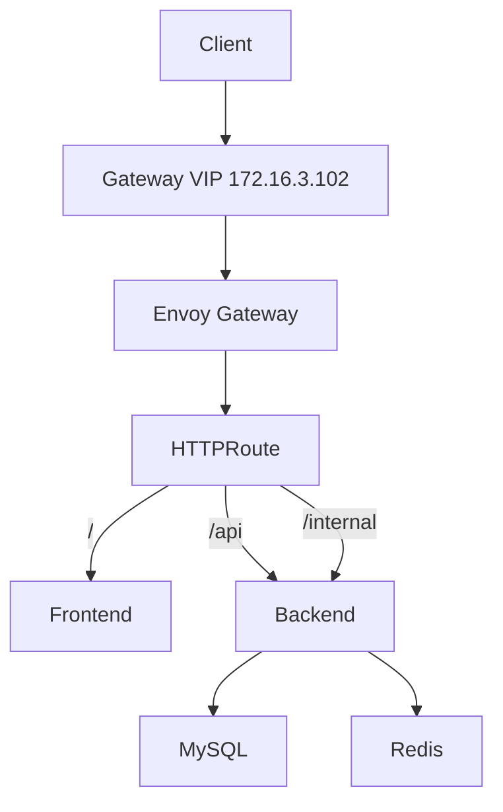

---

# 29. Final State

The Gateway API layer now provides:

- Kubernetes Gateway API.
- Envoy Gateway as the Gateway API controller.
- `envoy-gateway` GatewayClass.
- `eg-gateway` Gateway.
- Dedicated Gateway VIP `172.16.3.102`.
- HTTP listener on port `80`.
- Three Envoy proxy replicas.
- Path-based HTTP routing.
- Cross-namespace Gateway and HTTPRoute separation.
- Integration with Cilium LoadBalancer IP management.
- Integration with Cilium L2 announcements.
- GitOps-ready Kubernetes manifests.
- End-to-end verified application traffic.

---

# 30. Design Summary

| Component | Final Design |
|---|---|
| Gateway API implementation | Envoy Gateway |
| GatewayClass | `envoy-gateway` |
| Gateway | `eg-gateway` |
| Gateway namespace | `gateway-demo` |
| Application namespace | `microservices` |
| Gateway IP | `172.16.3.102` |
| Listener | HTTP :80 |
| HTTPRoute | `application-route` |
| Frontend route | `/` |
| Backend API route | `/api` |
| Internal route | `/internal` |
| Envoy replicas | 3 |
| LoadBalancer IP management | Cilium |
| L2 announcement | Cilium |
| Gateway manifests | `k8s/apps/gateway` |
| Envoy Gateway manifests | `k8s/infrastructure/envoy-gateway` |
| GitOps readiness | Yes |

---

# 31. Current Platform Flow

The platform currently follows this layered model:

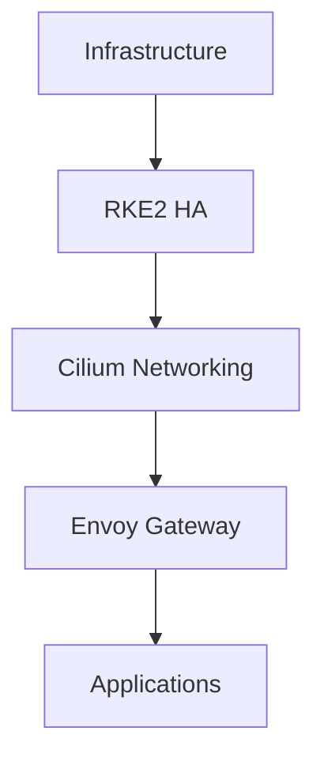

The Gateway layer provides the north-south traffic entry point into the application layer.

The next platform layer is GitOps, where application and infrastructure state will be continuously reconciled from Git.

---

# 32. Next Step

The Gateway API layer is complete and verified.

The next section will implement GitOps using **Argo CD**.

Next documentation:

```text
docs/04-gitops-argocd/README.md
```

The next platform flow will be:


