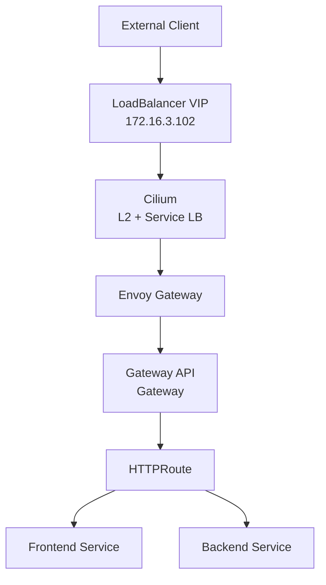
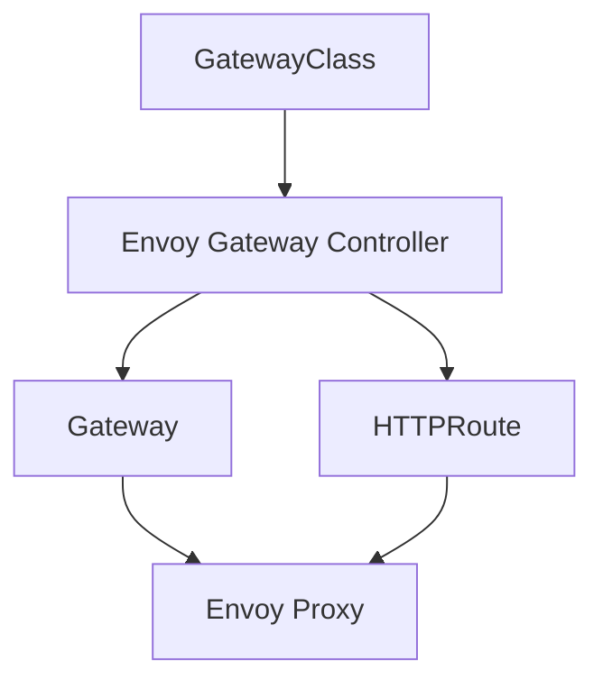
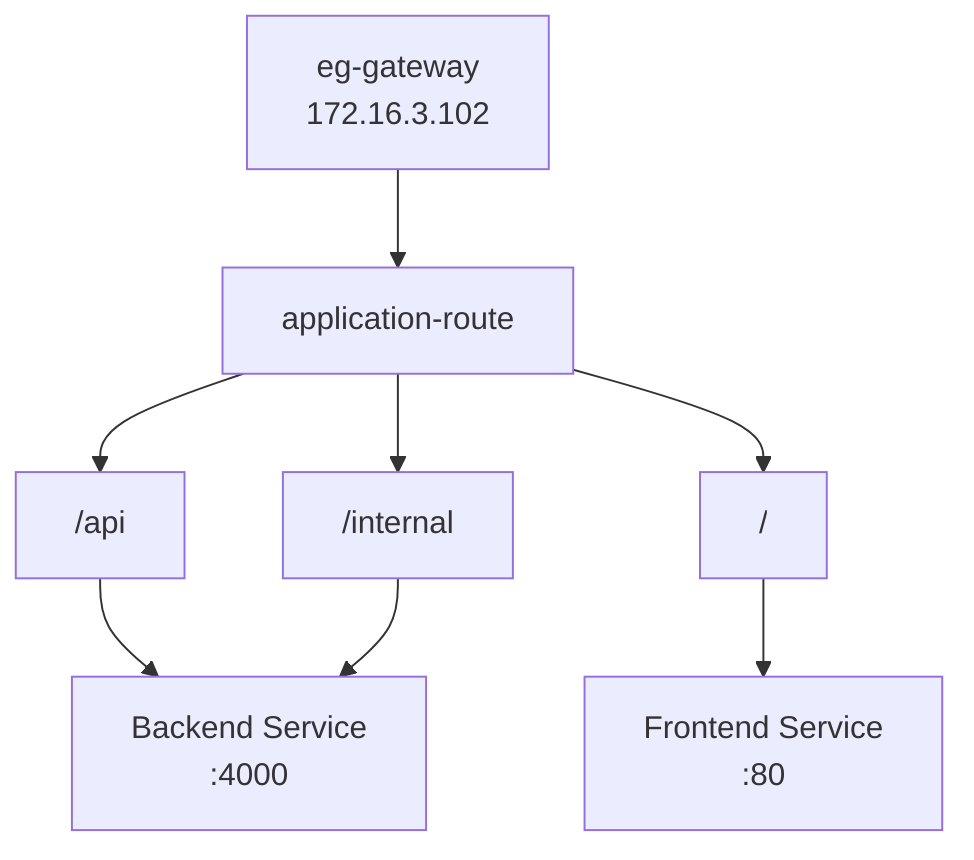
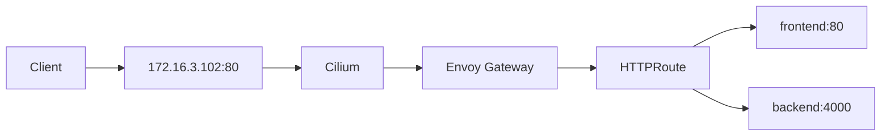

# Gateway API with Envoy Gateway

Gateway API is the application-facing traffic entry layer of the Kubernetes platform.

The implementation uses Envoy Gateway as the Gateway API controller and Cilium as the underlying networking and LoadBalancer layer.

The final traffic path is:



---

# 1. Why Gateway API?

The platform uses Gateway API instead of the traditional Kubernetes Ingress model.

Gateway API provides a more structured separation between:

```text
Gateway Infrastructure
        |
        v
Gateway
        |
        v
HTTPRoute
        |
        v
Application Services
```

This allows the infrastructure layer to own the Gateway while application teams can own their HTTPRoutes.

It also provides a cleaner foundation for:

- Path-based routing
- Multi-tenant routing
- Multiple Gateways
- Traffic policies
- Progressive delivery
- Future TLS configuration

---

# 2. Gateway API Architecture

The main Gateway API resources are:

```text
GatewayClass
     |
     v
  Gateway
     |
     v
 HTTPRoute
     |
     +---------> Frontend Service
     |
     +---------> Backend Service
```

Each resource has a different responsibility.

| Resource | Responsibility |
|---|---|
| GatewayClass | Defines which controller manages the Gateway |
| Gateway | Defines the network listener and entry point |
| HTTPRoute | Defines HTTP routing rules |
| Service | Provides the application backend |

---

# 3. Envoy Gateway

Envoy Gateway is the Gateway API implementation used by the cluster.

The controller is:

```text
gateway.envoyproxy.io/gatewayclass-controller
```

The Envoy Gateway controller watches Gateway API resources and translates them into the Envoy proxy configuration.

The architecture is:



---

# 4. GatewayClass

The cluster uses:

```text
GatewayClass:
envoy-gateway
```

The controller is:

```text
gateway.envoyproxy.io/gatewayclass-controller
```

The GatewayClass status is:

```text
Accepted: True
```

Verification:

```bash
kubectl get gatewayclass -o wide
```

Detailed:

```bash
kubectl describe gatewayclass envoy-gateway
```

The captured output confirms that the GatewayClass is accepted by Envoy Gateway.


---

# 5. Gateway

The main Gateway resource is:

```text
Name:
eg-gateway

Namespace:
gateway-demo

GatewayClass:
envoy-gateway

Address:
172.16.3.102

Protocol:
HTTP

Port:
80
```

The Gateway is programmed successfully:

```text
Programmed: True
```

Verification:

```bash
kubectl get gateway -A -o wide
```

Detailed:

```bash
kubectl describe gateway eg-gateway -n gateway-demo
```

The Gateway is configured to accept HTTPRoutes from namespaces allowed by its listener configuration.


---

# 6. Gateway and LoadBalancer

The Gateway is exposed through a Kubernetes `LoadBalancer` Service.

The external VIP is:

```text
172.16.3.102
```

The networking responsibility is split between Cilium and Envoy Gateway:

```text
Cilium
  |
  +--> LoadBalancer IP
  |
  +--> L2 Advertisement
  |
  +--> Service Networking
  |
  v
Envoy Gateway
  |
  +--> Gateway API
  |
  +--> HTTP Routing
```

Therefore:

```text
Cilium
=
Network / LoadBalancer Layer

Envoy Gateway
=
Gateway API / HTTP Layer
```

---

# 7. Envoy Gateway Deployment

The Envoy Gateway data plane is deployed with three replicas across the worker nodes.

Current placement:

```text
worker01
worker02
worker03
```

Verification:

```bash
kubectl get pods \
  -n envoy-gateway-system \
  -o wide
```

The current environment shows the Envoy Gateway proxy replicas distributed across the three worker nodes.

The Gateway Service can be checked with:

```bash
kubectl get svc \
  -n gateway-demo \
  -o wide
```

The Gateway LoadBalancer is associated with:

```text
172.16.3.102
```


---

# 8. HTTPRoute

The application routing rules are defined using:

```text
HTTPRoute:
application-route

Namespace:
microservices
```

The route attaches to:

```text
Gateway:
eg-gateway

Namespace:
gateway-demo
```

The Gateway allows routes from the required namespace, enabling the cross-namespace attachment.

The routing rules are:

```text
/api
    |
    v
backend:4000


/internal
    |
    v
backend:4000


/
    |
    v
frontend:80
```

Verification:

```bash
kubectl get httproute -A -o wide
```

Detailed:

```bash
kubectl describe httproute \
  application-route \
  -n microservices
```

The captured output confirms the backend references and path prefixes.


---

# 9. HTTPRoute Architecture

The final application routing model is:



This keeps the routing rules in the HTTPRoute instead of coupling them to the Gateway implementation.

---

# 10. Request Routing

A request to:

```text
http://172.16.3.102/
```

matches:

```text
/
```

and is routed to:

```text
frontend:80
```

A request to:

```text
http://172.16.3.102/api/health
```

matches:

```text
/api
```

and is routed to:

```text
backend:4000
```

A request to:

```text
http://172.16.3.102/internal/health
```

matches:

```text
/internal
```

and is routed to:

```text
backend:4000
```

The complete path is:



---

# 11. Gateway API vs Ingress

The platform uses Gateway API because it provides a cleaner separation of responsibilities.

Traditional Ingress:

```text
Ingress
   |
   +--> Controller-specific configuration
   |
   +--> Application routing
```

Gateway API:

```text
GatewayClass
     |
     v
  Gateway
     |
     v
 HTTPRoute
     |
     v
 Services
```

The Gateway API model separates:

```text
Infrastructure ownership
        |
        v
Gateway

Application routing ownership
        |
        v
HTTPRoute
```

This becomes especially useful when multiple teams or applications share the same Gateway infrastructure.

---

# 12. Cross-Namespace Routing

The Gateway is located in:

```text
gateway-demo
```

while the application HTTPRoute is located in:

```text
microservices
```

The relationship is:

```text
gateway-demo
    |
    +--> eg-gateway
            |
            v
microservices
    |
    +--> application-route
```

The Gateway listener is configured to allow routes from the required namespaces.

This allows the Gateway infrastructure to remain separated from the application namespace.

---

# 13. Repository Structure

Gateway resources are intentionally separated from application workloads.

```text
k8s/
├── apps/
│   ├── backend/
│   ├── database/
│   ├── frontend/
│   ├── gateway/
│   │   ├── gateway.yaml
│   │   └── httproute.yaml
│   └── redis/
│
└── infrastructure/
    ├── cilium/
    ├── envoy-gateway/
    │   ├── envoyproxy.yaml
    │   └── gatewayclass.yaml
    └── longhorn/
```

The Gateway resources are located at:

```text
k8s/apps/gateway/
```

The Envoy Gateway infrastructure configuration is located at:

```text
k8s/infrastructure/envoy-gateway/
```

This separation follows the platform structure:

```text
Infrastructure
    |
    +--> Cilium
    +--> Envoy Gateway
    +--> Longhorn

Applications
    |
    +--> Frontend
    +--> Backend
    +--> Database
    +--> Redis
    +--> Gateway API resources
```

---

# 14. Verification

## GatewayClass

```bash
kubectl get gatewayclass -o wide
```

Expected:

```text
envoy-gateway
Accepted: True
```

---

## Gateway

```bash
kubectl get gateway -A -o wide
```

Expected:

```text
eg-gateway
172.16.3.102
Programmed: True
```

---

## HTTPRoute

```bash
kubectl get httproute -A -o wide
```

Expected:

```text
application-route
```

Inspect routing rules:

```bash
kubectl describe httproute \
  application-route \
  -n microservices
```

---

## Envoy Gateway Pods

```bash
kubectl get pods \
  -n envoy-gateway-system \
  -o wide
```

Expected:

```text
3 Envoy Gateway proxy replicas
```

---

## Gateway Service

```bash
kubectl get svc \
  -n gateway-demo \
  -o wide
```

Verify:

```text
Type:
LoadBalancer

External IP:
172.16.3.102
```

---

# 15. End-to-End Verification

The Gateway was tested through its LoadBalancer VIP.

## Backend Health

```bash
curl -i \
  http://172.16.3.102/api/health
```

Result:

```text
HTTP/1.1 200 OK
```

The backend returned:

```json
{
  "status": "UP",
  "database": "UP"
}
```

---

## Backend Products

```bash
curl -i \
  http://172.16.3.102/api/products
```

Result:

```text
HTTP/1.1 200 OK
```

The API returned the application product data.

---

## Internal Backend Route

```bash
curl -i \
  http://172.16.3.102/internal/health
```

Result:

```text
HTTP/1.1 200 OK
```

---

## Frontend

```bash
curl -i \
  http://172.16.3.102/
```

Result:

```text
HTTP/1.1 200 OK
```

The response is served by the frontend application.


---

# 16. Final Traffic Flow

The complete external request path is:

```text
External Client
      |
      v
172.16.3.102:80
      |
      v
Cilium
      |
      v
Envoy Gateway
      |
      v
Gateway
      |
      v
HTTPRoute
      |
      +-----------> frontend:80
      |
      +-----------> backend:4000
```

The responsibilities are clearly separated:

```text
Cilium
    |
    +--> L2 Advertisement
    +--> LoadBalancer
    +--> Service Networking

Envoy Gateway
    |
    +--> Gateway API Controller
    +--> Gateway
    +--> HTTPRoute Processing
    +--> HTTP Routing

Applications
    |
    +--> Frontend
    +--> Backend
```

---

# 17. Final State

| Component | Current State |
|---|---|
| Gateway API | Enabled |
| Gateway Controller | Envoy Gateway |
| GatewayClass | `envoy-gateway` |
| Gateway | `eg-gateway` |
| Gateway Namespace | `gateway-demo` |
| Gateway VIP | `172.16.3.102` |
| Listener | HTTP :80 |
| HTTPRoute | `application-route` |
| HTTPRoute Namespace | `microservices` |
| Frontend Route | `/` |
| Backend Route | `/api` |
| Internal Route | `/internal` |
| Envoy Proxy Replicas | 3 |
| Envoy Placement | Worker nodes |
| Gateway Status | Programmed |
| End-to-End HTTP | Verified |

---

# 18. Next Step

The Gateway API layer is now complete.

The next platform layer is:

```text
GitOps with Argo CD
```

This section will cover:

- Git repository as the source of truth
- Argo CD architecture
- Application resource
- Automated reconciliation
- Sync process
- Application health
- Git-to-cluster deployment flow
- GitOps repository structure
- Verification

Documentation for the next layer:

```text
docs/04-gitops-argocd/README.md
```

Gateway API documentation:

```text
docs/03-gateway-api/README.md
```

Gateway resources:

```text
k8s/apps/gateway/
```

Envoy Gateway infrastructure:

```text
k8s/infrastructure/envoy-gateway/
```
