# Gateway API with Envoy Gateway

## 1. Overview

This section implements the north-south application traffic layer using **Kubernetes Gateway API** with **Envoy Gateway**.

The platform uses:

- Kubernetes Gateway API
- Envoy Gateway
- Envoy proxy replicas
- HTTPRoute
- Cilium LoadBalancer IPAM
- Cilium L2 Announcements
- Kubernetes Services
- TLS termination at the Gateway
- HTTPS application routing

The final Gateway is:

```text
Gateway:     eg-gateway
Namespace:   gateway-demo
Address:     172.16.3.102
Protocols:   HTTP :80
             HTTPS :443
Hostname:    *.microservices.home.arpa
```

The Gateway provides a single entry point for application traffic and routes requests to the appropriate application Services.

---

## 2. Architecture

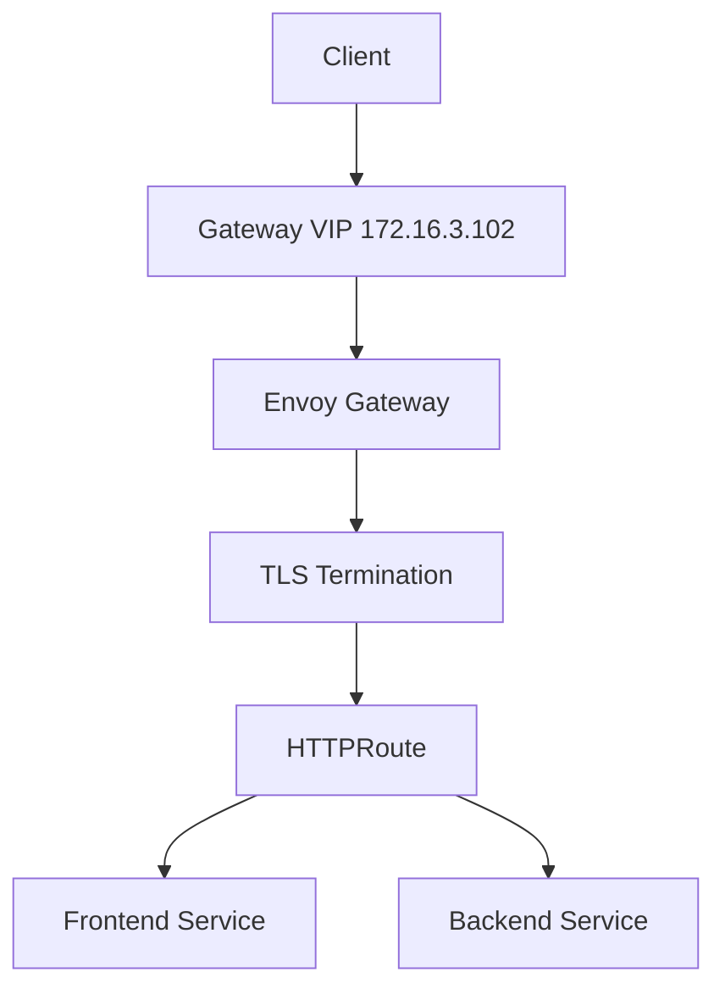

The final architecture separates the responsibilities of the networking and application traffic layers:

- **Cilium** provides cluster networking and LoadBalancer IP management.
- **Cilium L2 Announcements** make the Gateway LoadBalancer IP reachable on the internal network.
- **Envoy Gateway** implements Gateway API and manages Envoy proxy infrastructure.
- **Gateway API** defines the Gateway and HTTPRoute resources.
- **TLS** is terminated at the Gateway.
- **HTTPRoute** defines application routing rules.
- **Services** expose the application workloads internally.

---

## 3. Why Gateway API?

Kubernetes originally provided `Ingress` as the standard HTTP routing API.

Gateway API introduces a more structured model where infrastructure and application traffic configuration are separated into different resources.

The main resources used in this platform are:

| Resource | Responsibility |
|---|---|
| GatewayClass | Defines the Gateway controller implementation |
| Gateway | Defines the traffic entry point and listeners |
| HTTPRoute | Defines HTTP routing rules |
| Service | Provides access to application workloads |

This separation makes the platform easier to manage and provides a cleaner model for multi-application and multi-namespace environments.

---

# 4. Gateway API Architecture

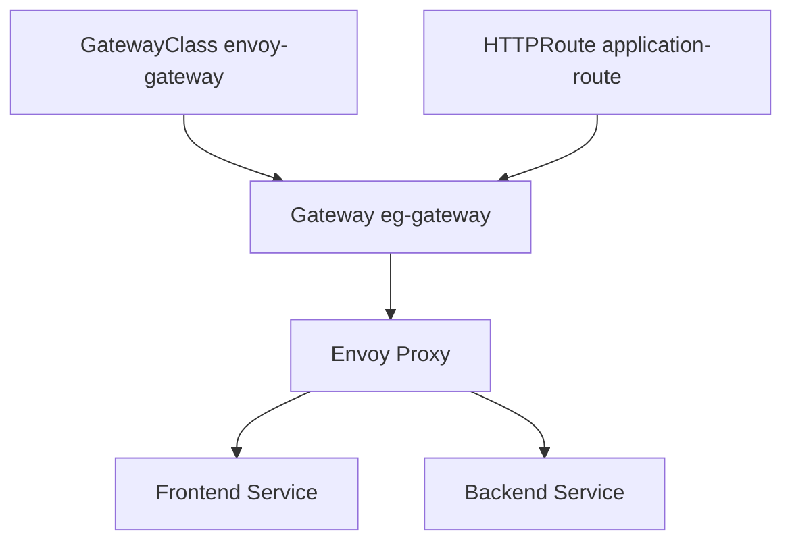

The relationship between the Gateway API resources is:

```text
GatewayClass
    |
    v
Gateway
    |
    v
Envoy Gateway
    |
    v
HTTPRoute
    |
    +----> Frontend Service
    |
    +----> Backend Service
```

The ASCII representation above is only used as a conceptual text representation. The actual architecture diagram is provided using Mermaid so GitHub can render it visually.

---

# 5. Envoy Gateway

Envoy Gateway is the Gateway API implementation used by the final platform.

The GatewayClass is controlled by:

```text
gateway.envoyproxy.io/gatewayclass-controller
```

The Envoy Gateway controller watches Gateway API resources and creates and configures the required Envoy proxy infrastructure.

The responsibility split is:

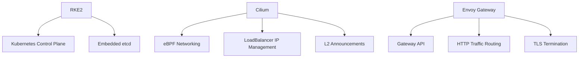

This provides a clean separation between:

- Kubernetes control-plane responsibilities.
- Cluster networking responsibilities.
- External LoadBalancer addressing.
- Gateway and HTTP routing.
- TLS termination.

---

# 6. GatewayClass

The `GatewayClass` identifies the controller responsible for managing Gateway resources.

The platform uses:

```text
Name:
envoy-gateway

Controller:
gateway.envoyproxy.io/gatewayclass-controller
```

The GatewayClass is associated with the EnvoyProxy configuration used by the Gateway infrastructure.

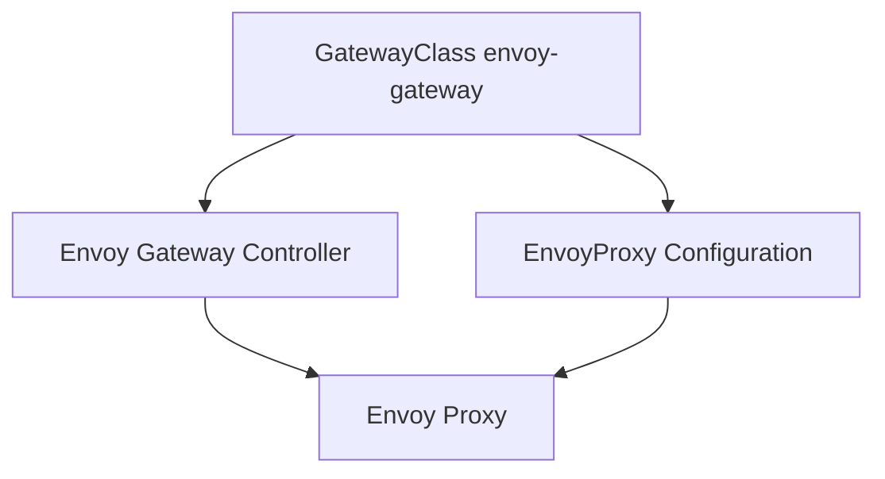

### Verification

```bash
kubectl get gatewayclass -o wide
```

Expected:

```text
NAME            CONTROLLER                                      ACCEPTED
envoy-gateway   gateway.envoyproxy.io/gatewayclass-controller   True
```

---

# 7. GatewayClass Evidence


The screenshot verifies:

- `envoy-gateway` GatewayClass exists.
- The Envoy Gateway controller is registered.
- GatewayClass status is `Accepted=True`.
- The GatewayClass references the EnvoyProxy configuration.

---

# 8. Gateway

The final application traffic entry point is:

```text
Gateway:
eg-gateway

Namespace:
gateway-demo

Address:
172.16.3.102
```

The Gateway now exposes two listeners:

```text
HTTP
Port: 80

HTTPS
Port: 443
Hostname: *.microservices.home.arpa
```

The HTTP listener provides the HTTP entry point, while HTTPS is the secure application-facing listener.

The HTTPS listener is configured with the TLS certificate used by the Gateway.

The Gateway is responsible for defining:

- The external listeners.
- The Gateway address.
- TLS configuration.
- Which HTTPRoutes can attach to the Gateway.

---

# 9. Gateway Listeners

The final Gateway configuration contains:

```text
HTTP Listener
-------------
Protocol: HTTP
Port:     80


HTTPS Listener
--------------
Protocol: HTTPS
Port:     443
Hostname: *.microservices.home.arpa
TLS:      Enabled
```

The traffic relationship is:

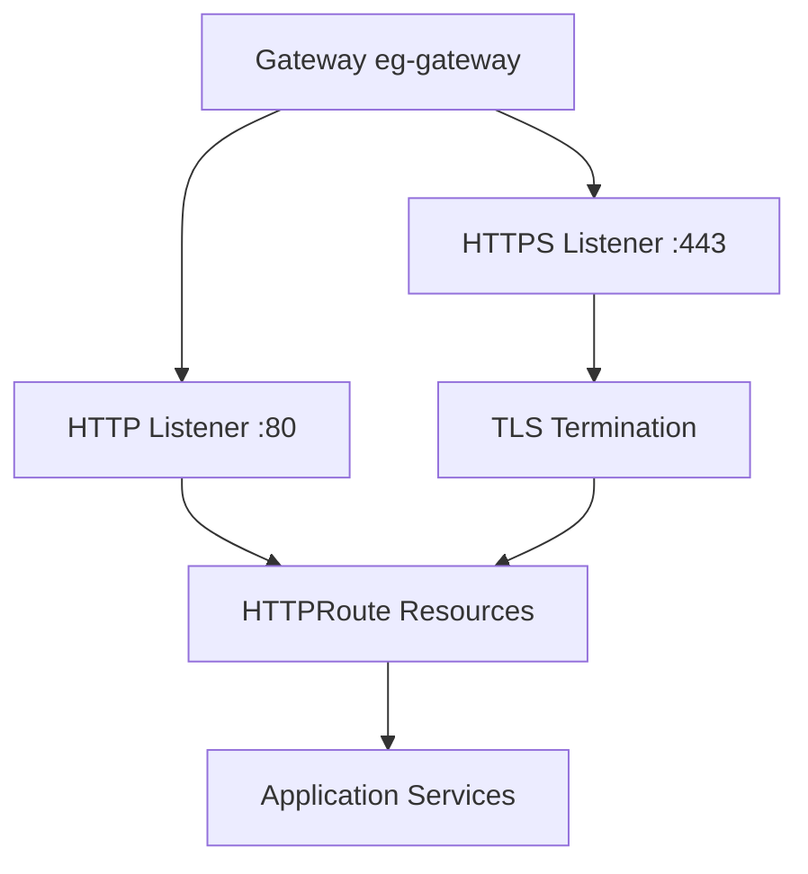

The application routing paths are still defined by `HTTPRoute`.

The Gateway only defines the traffic entry points and listener configuration.

---

# 10. TLS Configuration

TLS was added to the final Gateway so that application traffic can be accessed through HTTPS.

The secure endpoint uses:

```text
https://app.microservices.home.arpa
```

The Gateway HTTPS listener uses the hostname:

```text
*.microservices.home.arpa
```

This allows the same Gateway to serve multiple application subdomains, for example:

```text
app.microservices.home.arpa
argocd.microservices.home.arpa
```

The TLS certificate is attached to the HTTPS Gateway listener through the configured Kubernetes TLS Secret.

The high-level flow is:

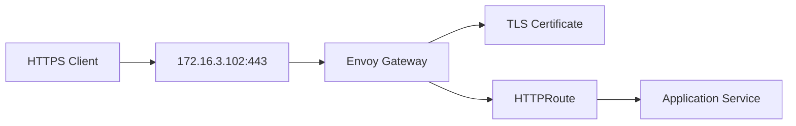

TLS termination occurs at the Gateway/Envoy layer.

After TLS termination, Envoy evaluates the HTTP request and forwards it to the appropriate Kubernetes Service.

---

# 11. HTTPS Hostname Routing

The application HTTPRoute uses the HTTPS Gateway listener.

The Frontend route is associated with:

```text
Hostname:
app.microservices.home.arpa
```

and the HTTPS Gateway listener:

```text
*.microservices.home.arpa
```

The relationship is:

```text
Client
  |
  | HTTPS
  v
172.16.3.102:443
  |
  v
eg-gateway
  |
  | TLS termination
  v
HTTPRoute
  |
  | Host: app.microservices.home.arpa
  v
frontend / backend
```

This provides both:

- Host-based routing.
- Path-based routing.

---

# 12. Gateway Address

The Gateway uses the following external address:

```text
172.16.3.102
```

The address is allocated from the Cilium LoadBalancer IP pool.

The configured pool is:

```text
172.16.3.100 - 172.16.3.150
```

The Envoy Gateway Service is exposed as a Kubernetes `LoadBalancer` Service.

Current Service information:

```text
Service:
envoy-gateway-demo-eg-gateway-c313a88b5

Namespace:
envoy-gateway-system

Type:
LoadBalancer

ClusterIP:
10.43.198.235

External IP:
172.16.3.102

HTTP:
80

HTTPS:
443

NodePort:
32411
```

The application-facing secure endpoint is:

```text
https://app.microservices.home.arpa
```

---

# 13. Gateway and LoadBalancer Flow

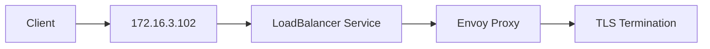

Cilium provides the LoadBalancer IP management and L2 announcement functionality used to make the Gateway address reachable on the internal network.

Envoy Gateway then handles the application-level traffic and TLS termination.

---

# 14. Gateway Evidence


The screenshot verifies:

- `eg-gateway` exists in the `gateway-demo` namespace.
- The GatewayClass is `envoy-gateway`.
- The Gateway address is `172.16.3.102`.
- The Gateway is the application traffic entry point.

The final Gateway configuration additionally includes the HTTPS listener on port `443`.

---

# 15. HTTPRoute

Application routing is defined using:

```text
HTTPRoute:
application-route

Namespace:
microservices
```

The route defines path-based application rules.

The main application paths are:

| Path | Backend | Port |
|---|---|---:|
| `/` | frontend | 80 |
| `/api` | backend | 4000 |
| `/internal` | backend | 4000 |

The HTTPRoute is attached to the HTTPS Gateway listener for the application hostname.

---

# 16. HTTPRoute Architecture

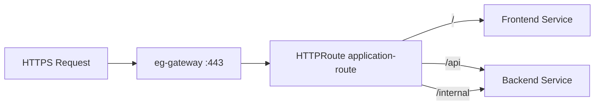

This allows a single secure Gateway IP to expose multiple application endpoints.

---

# 17. HTTPRoute Configuration

The routing logic is:

```text
Host:
app.microservices.home.arpa

/
    -> frontend:80

/api
    -> backend:4000

/internal
    -> backend:4000
```

The Frontend Service is:

```text
frontend
10.43.48.136:80
```

The Backend Service is:

```text
backend
10.43.220.95:4000
```

The HTTPRoute connects the Gateway traffic layer to these application Services.

For the Backend Canary deployment, the HTTPRoute can also contain both:

```text
backend-stable
backend-canary
```

with traffic weights controlled by Argo Rollouts.

---

# 18. HTTPRoute Evidence


The screenshot verifies:

- `application-route` exists in the `microservices` namespace.
- `/api` routes to the backend Service.
- `/internal` routes to the backend Service.
- `/` routes to the frontend Service.
- The HTTPRoute is accepted.
- Backend references are resolved successfully.

The final routing is additionally served through the HTTPS Gateway listener.

---

# 19. Cross-Namespace Routing

The Gateway and HTTPRoute are intentionally separated into different namespaces.

Gateway:

```text
gateway-demo
```

HTTPRoute:

```text
microservices
```

This provides separation between the Gateway infrastructure layer and the application layer.

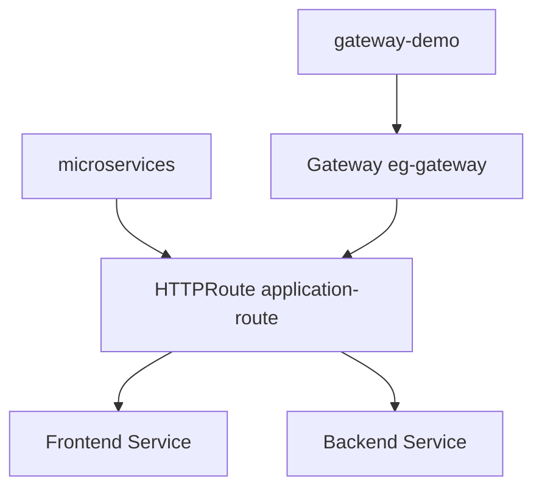

The Gateway listener is configured to accept routes from the required namespaces.

This allows applications to define their own routing rules without moving the Gateway infrastructure into the application namespace.

---

# 20. Envoy Gateway Deployment

Envoy Gateway provides the Envoy proxy infrastructure used by the Gateway.

The final proxy deployment uses three replicas distributed across the worker nodes:

```text
rke2-worke01
rke2-worke02
rke2-worke03
```

The architecture is:

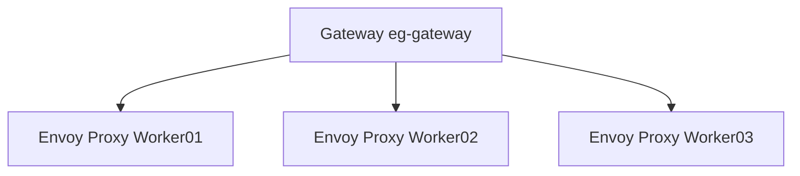

This avoids relying on a single Envoy proxy instance.

---

# 21. Envoy Gateway Evidence


The screenshot shows:

- Envoy Gateway controller.
- Envoy proxy infrastructure.
- Three Envoy proxy replicas.
- Proxy placement across the worker nodes.

The three proxy replicas provide redundancy at the Gateway layer.

---

# 22. HTTPS Application Access

The final application endpoint is:

```text
https://app.microservices.home.arpa
```

The HTTPS request flow is:

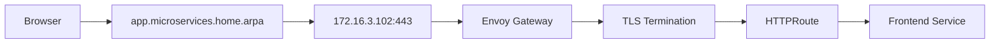

The Gateway therefore acts as the secure north-south entry point for the application.

---

# 23. HSTS

HTTPS is the preferred secure access method for the application.

The application Gateway is accessed through:

```text
https://app.microservices.home.arpa
```

HSTS was added as part of the secure Gateway configuration so that clients are instructed to prefer HTTPS for the application.

The security model is therefore:

```text
HTTP
  |
  | Redirect / secure access policy
  v
HTTPS
  |
  v
TLS
  |
  v
Envoy Gateway
  |
  v
HTTPRoute
  |
  v
Application Service
```

HSTS is a browser-side security policy. It complements TLS by preventing a compliant browser from voluntarily falling back to insecure HTTP after the policy has been learned.

The important distinction is:

- **TLS** encrypts and authenticates the connection.
- **HTTPS** is HTTP carried over TLS.
- **HSTS** tells compatible browsers to use HTTPS for the protected hostname.

---

# 24. Request Routing

The final request path is:

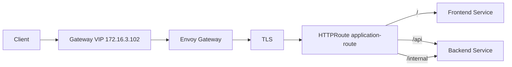

For example:

```text
GET https://app.microservices.home.arpa/
```

is routed to:

```text
frontend:80
```

while:

```text
GET https://app.microservices.home.arpa/api/health
```

is routed to:

```text
backend:4000
```

and:

```text
GET https://app.microservices.home.arpa/internal/health
```

is routed to:

```text
backend:4000
```

---

# 25. Complete Gateway Traffic Flow

This is the complete application traffic path:

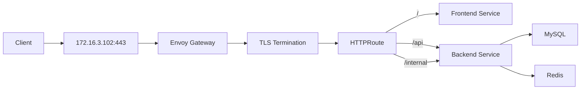

This represents the actual application flow:

- Client connects to the Gateway VIP over HTTPS.
- Traffic reaches Envoy Gateway.
- TLS is terminated at the Gateway.
- Envoy processes the HTTPRoute.
- `/` is routed to the frontend.
- `/api` is routed to the backend.
- `/internal` is routed to the backend.
- The backend communicates with MySQL and Redis.

---

# 26. Gateway API vs Ingress

Traditional Kubernetes Ingress provides HTTP routing using a single resource model.

Gateway API separates the traffic configuration into multiple resources.

### Ingress model

```text
Ingress
    |
    +-- Routing Rules
    |
    +-- Backend Services
```

### Gateway API model

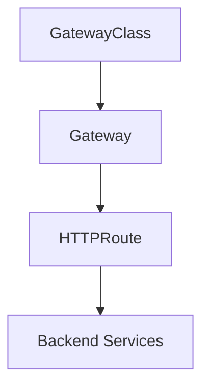

Gateway API provides clearer separation of responsibilities and is better suited to larger platforms with multiple applications and teams.

---

# 27. Why Envoy Gateway?

Envoy Gateway was selected as the final Gateway API implementation.

The design keeps Cilium and Envoy Gateway responsibilities separate.

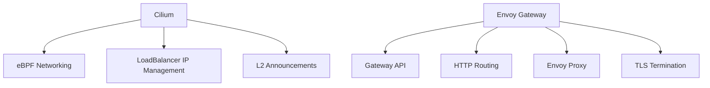

### Cilium responsibilities

- Cluster networking.
- eBPF datapath.
- LoadBalancer IP management.
- L2 announcements.

### Envoy Gateway responsibilities

- Gateway API implementation.
- Gateway resources.
- HTTPRoute processing.
- Envoy proxy infrastructure.
- HTTP traffic routing.
- TLS termination.

This separation keeps the architecture easier to understand and maintain.

---

# 28. Repository Structure

The Gateway resources are kept separately from the application workloads.

```text
k8s/
├── apps/
│   ├── backend/
│   ├── database/
│   ├── frontend/
│   ├── gateway/
│   │   ├── gateway.yaml
│   │   └── httproute.yaml
│   └── redis/
│
└── infrastructure/
    ├── cilium/
    │   ├── l2-announcement-policy.yaml
    │   └── loadbalancer-ip-pool.yaml
    │
    ├── envoy-gateway/
    │   ├── envoyproxy.yaml
    │   └── gatewayclass.yaml
    │
    └── longhorn/
        └── helmchart.yaml
```

The Gateway API resources are therefore ready to be managed through GitOps.

---

# 29. Verification Commands

## GatewayClass

```bash
kubectl get gatewayclass -o wide
```

## Gateway

```bash
kubectl get gateway -A -o wide
```

## Gateway Details

```bash
kubectl describe gateway eg-gateway -n gateway-demo
```

## HTTPRoute

```bash
kubectl get httproute -A -o wide
```

## HTTPRoute Details

```bash
kubectl describe httproute application-route -n microservices
```

## Envoy Gateway Pods

```bash
kubectl get pods -n envoy-gateway-system -o wide
```

## Gateway Services

```bash
kubectl get svc -A -o wide
```

## TLS Secret

```bash
kubectl get secret -n gateway-demo
```

## Gateway HTTPS Listener

```bash
kubectl get gateway eg-gateway -n gateway-demo -o yaml
```

---

# 30. End-to-End Verification

The Gateway was tested through the actual Gateway IP:

```text
172.16.3.102
```

The final user-facing application endpoint is:

```text
https://app.microservices.home.arpa
```

## Frontend

```bash
curl -k -i --resolve app.microservices.home.arpa:443:172.16.3.102 \
  https://app.microservices.home.arpa/
```

Expected:

```text
HTTP/2 200
```

The request reaches the frontend application through the HTTPS Gateway.

---

## Backend Health

```bash
curl -k -i --resolve app.microservices.home.arpa:443:172.16.3.102 \
  https://app.microservices.home.arpa/api/health
```

Expected:

```text
HTTP/2 200
```

The backend reports:

```text
status: UP
database: UP
```

---

## Backend Products API

```bash
curl -k -i --resolve app.microservices.home.arpa:443:172.16.3.102 \
  https://app.microservices.home.arpa/api/products
```

Expected:

```text
HTTP/2 200
```

The API returns the application product data.

---

## Internal Backend Route

```bash
curl -k -i --resolve app.microservices.home.arpa:443:172.16.3.102 \
  https://app.microservices.home.arpa/internal/health
```

Expected:

```text
HTTP/2 200
```

The request reaches the backend through the `/internal` route.

---

# 31. End-to-End Evidence


The screenshot verifies the complete application traffic path through the Gateway.

The previously verified application routes are:

```text
http://172.16.3.102/
http://172.16.3.102/api/health
http://172.16.3.102/api/products
http://172.16.3.102/internal/health
```

The final Gateway configuration extends this traffic layer with HTTPS and the application hostname:

```text
https://app.microservices.home.arpa
```

---

# 32. Final Architecture

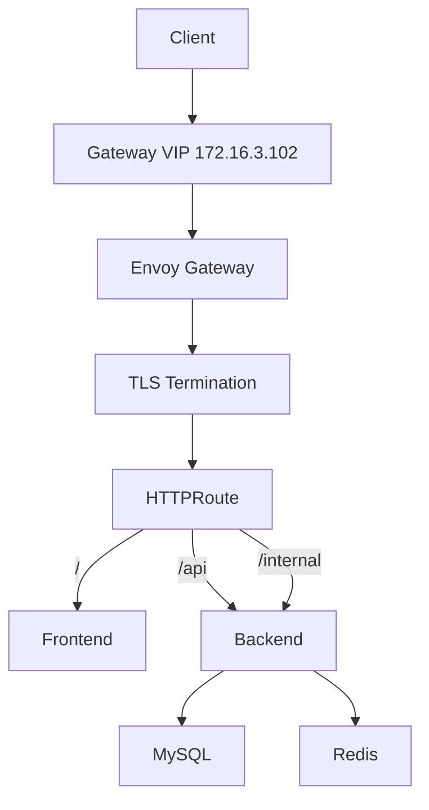

---

# 33. Final Gateway and TLS Flow

The final north-south traffic model is:


The responsibilities are intentionally separated:

```text
Cilium
  ↓
Network reachability + LoadBalancer IP

Envoy Gateway
  ↓
Gateway API + TLS + HTTP routing

HTTPRoute
  ↓
Application routing

Kubernetes Services
  ↓
Application workloads
```

---

# 34. Final State

The Gateway API layer now provides:

- Kubernetes Gateway API.
- Envoy Gateway as the Gateway API controller.
- `envoy-gateway` GatewayClass.
- `eg-gateway` Gateway.
- Dedicated Gateway VIP `172.16.3.102`.
- HTTP listener on port `80`.
- HTTPS listener on port `443`.
- Wildcard hostname `*.microservices.home.arpa`.
- TLS termination at Envoy Gateway.
- HSTS as part of the secure application access configuration.
- Three Envoy proxy replicas.
- Path-based HTTP routing.
- Host-based application routing.
- Cross-namespace Gateway and HTTPRoute separation.
- Integration with Cilium LoadBalancer IP management.
- Integration with Cilium L2 announcements.
- GitOps-ready Kubernetes manifests.
- End-to-end verified application traffic.

---

# 35. Design Summary

| Component | Final Design |
|---|---|
| Gateway API implementation | Envoy Gateway |
| GatewayClass | `envoy-gateway` |
| Gateway | `eg-gateway` |
| Gateway namespace | `gateway-demo` |
| Application namespace | `microservices` |
| Gateway IP | `172.16.3.102` |
| HTTP listener | `:80` |
| HTTPS listener | `:443` |
| HTTPS hostname | `*.microservices.home.arpa` |
| TLS termination | Envoy Gateway |
| Application hostname | `app.microservices.home.arpa` |
| HTTPRoute | `application-route` |
| Frontend route | `/` |
| Backend API route | `/api` |
| Internal route | `/internal` |
| Envoy replicas | 3 |
| LoadBalancer IP management | Cilium |
| L2 announcement | Cilium |
| Gateway manifests | `k8s/apps/gateway` |
| Envoy Gateway manifests | `k8s/infrastructure/envoy-gateway` |
| GitOps readiness | Yes |

---

# 36. Current Platform Flow

The platform currently follows this layered model:

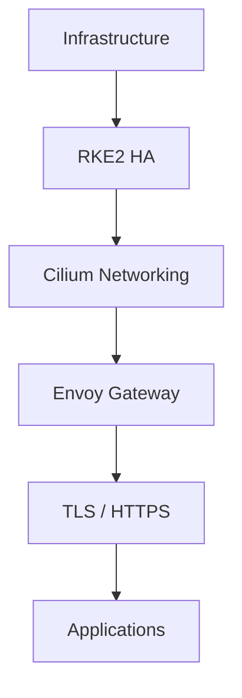

The Gateway layer provides the secure north-south traffic entry point into the application layer.

The final traffic flow is:

```text
Client
  ↓
HTTPS
  ↓
Gateway VIP 172.16.3.102
  ↓
Cilium LoadBalancer / L2
  ↓
Envoy Gateway
  ↓
TLS Termination
  ↓
Gateway API HTTPRoute
  ↓
Application Service
  ↓
Application Pod
```

The Gateway layer is now integrated with the secure external access model and is ready to serve the GitOps-managed application platform.
