# Progressive Delivery

## Overview

This platform uses Argo Rollouts to implement progressive delivery for the application layer, integrated with Argo CD (GitOps), Gateway API / Envoy Gateway, and Prometheus-based rollout analysis.

Two rollout strategies are intentionally used:

- Backend: Canary deployment with Gateway API traffic weighting.
- Frontend: Blue/Green deployment with separate Active and Preview Services.

Argo CD remains responsible for GitOps reconciliation and maintaining the desired application state, while Argo Rollouts manages the runtime rollout lifecycle.

The implementation combines manual rollout gates with automated Prometheus-based availability analysis. This makes each rollout stage observable while allowing health checks to validate the Backend release before progression.

---

## Architecture

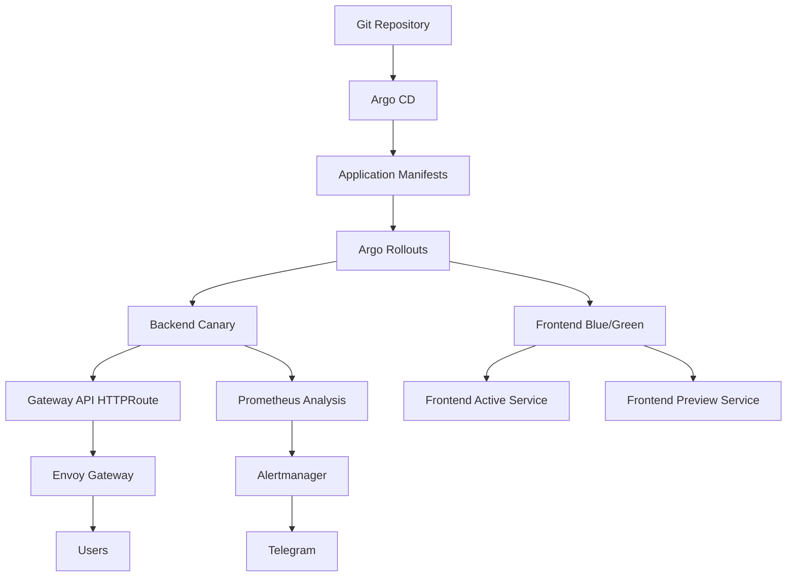
```mermaid
graph TD

    A["Git Repository"] --> B["Argo CD"]
    B --> C["Application Manifests"]
    C --> D["Argo Rollouts"]

    D --> E["Backend Canary"]
    D --> F["Frontend Blue/Green"]

    E --> G["Gateway API HTTPRoute"]
    G --> H["Envoy Gateway"]
    H --> I["Users"]

    F --> J["Frontend Active Service"]
    F --> K["Frontend Preview Service"]

    E --> L["Prometheus Analysis"]
    L --> M["Alertmanager"]
    M --> N["Telegram"]
```

The architecture separates the main platform responsibilities:

- Argo CD manages the desired state from Git.
- Argo Rollouts manages ReplicaSets and progressive delivery.
- Gateway API and Envoy Gateway manage external application routing.
- Prometheus provides rollout and application metrics.
- Argo Rollouts Analysis evaluates Prometheus results.
- Alertmanager handles rollout failure notifications.
- Telegram provides the operational notification channel.

---

# 1. GitOps with Argo CD

## 1.1 Argo CD Application

The application platform is managed by an Argo CD Application named:

`microservices-platform`

The Application tracks the Git repository and recursively manages manifests under the `apps/` directory.

The main source configuration is:

```yaml
spec:
  source:
    repoURL: git@github.com:ahmed-sayed-devops/microservices-platform-gitops.git
    targetRevision: main
    path: apps
    directory:
      recurse: true
  destination:
    server: https://kubernetes.default.svc
  syncPolicy:
    automated:
      prune: true
      selfHeal: true
```

The Git repository is the source of truth for the desired application state.

Argo CD continuously reconciles the desired state stored in Git with the actual state of the Kubernetes cluster.

Automated pruning removes resources that are no longer defined in Git, while self-healing allows Argo CD to restore resources that drift from the declared configuration.

## 1.2 HTTPRoute Runtime Differences

The Backend Canary rollout dynamically changes Gateway API HTTPRoute weights.

Therefore, the Argo CD Application ignores only the runtime-managed backend weights:

```yaml
ignoreDifferences:
  - group: gateway.networking.k8s.io
    kind: HTTPRoute
    jqPathExpressions:
      - .spec.rules[].backendRefs[].weight
```

This is intentionally limited to the backend weight fields.

The HTTPRoute remains GitOps-managed, while Argo Rollouts is allowed to modify the runtime traffic weights required for Canary progression.

## 1.3 Argo CD Health Verification

Command:

```bash
kubectl get application microservices-platform -n argocd
```

Expected state:

```text
NAME                    SYNC STATUS   HEALTH STATUS

microservices-platform  Synced        Healthy
```

### Evidence


The screenshot above shows the Argo CD Application in a healthy synchronized state.

This confirms that the application desired state is successfully managed through GitOps.

---

# 2. Backend Canary Deployment

The Backend uses an Argo Rollouts Rollout resource with the Canary strategy.

The Canary implementation uses two Services:

- `backend-stable`
- `backend-canary`

Gateway API is used as the traffic router between the stable and canary Services.

## 2.1 Canary Configuration

The Backend Rollout uses the following strategy:

```yaml
strategy:
  canary:
    stableService: backend-stable
    canaryService: backend-canary
    trafficRouting:
      plugins:
        argoproj-labs/gatewayAPI:
          httpRoute: application-route
          namespace: microservices
    steps:
      - setWeight: 10
      - analysis:
          templates:
            - templateName: backend-availability
      - pause: {}
      - setWeight: 25
      - analysis:
          templates:
            - templateName: backend-availability
      - pause: {}
      - setWeight: 50
      - analysis:
          templates:
            - templateName: backend-availability
      - pause: {}
      - setWeight: 100
```

The intended progression is:

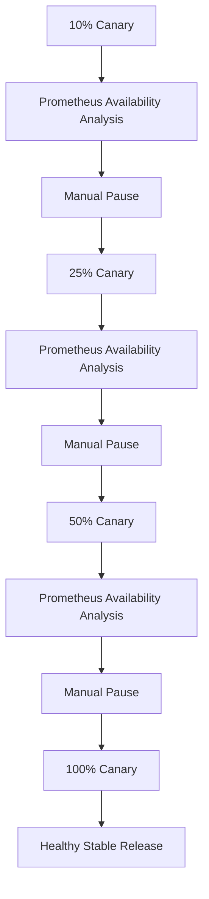
```mermaid
graph TD

    A["10% Canary"] --> B["Prometheus Availability Analysis"]
    B --> C["Manual Pause"]

    C --> D["25% Canary"]
    D --> E["Prometheus Availability Analysis"]
    E --> F["Manual Pause"]

    F --> G["50% Canary"]
    G --> H["Prometheus Availability Analysis"]
    H --> I["Manual Pause"]

    I --> J["100% Canary"]
    J --> K["Healthy Stable Release"]
```

The pause steps are intentionally configured as manual gates in the current lab implementation.

This allows the operator to inspect the rollout and validate the new version before moving to the next stage.

The AnalysisRun provides automated availability validation before progression.

## 2.2 Healthy Backend Rollout

The currently promoted Backend version is:

`a7medsayed/backend:v1.0.3`

Command:

```bash
kubectl argo rollouts get rollout backend -n microservices
```

The successful runtime state shows:

```text
Status: Healthy

Strategy: Canary

Step: 7/7

SetWeight: 100

ActualWeight: 100

Images:

a7medsayed/backend:v1.0.3 (stable)
```

The rollout has:

- 3 desired replicas.
- 3 current replicas.
- 3 updated replicas.
- 3 ready replicas.
- 3 available replicas.
- Previous ReplicaSets scaled down.

### Evidence


This screenshot demonstrates that the Backend Canary rollout completed successfully and that `v1.0.3` became the stable release.

## 2.3 Backend Canary Configuration

Command:

```bash
kubectl describe rollout backend -n microservices
```

The configuration contains:

```text
Strategy:

  Canary

Canary Service:

  backend-canary

Stable Service:

  backend-stable

Steps:

  Set Weight: 10
  Availability Analysis
  Pause

  Set Weight: 25
  Availability Analysis
  Pause

  Set Weight: 50
  Availability Analysis
  Pause

  Set Weight: 100

Traffic Routing:

  argoproj-labs/gatewayAPI
```

### Evidence

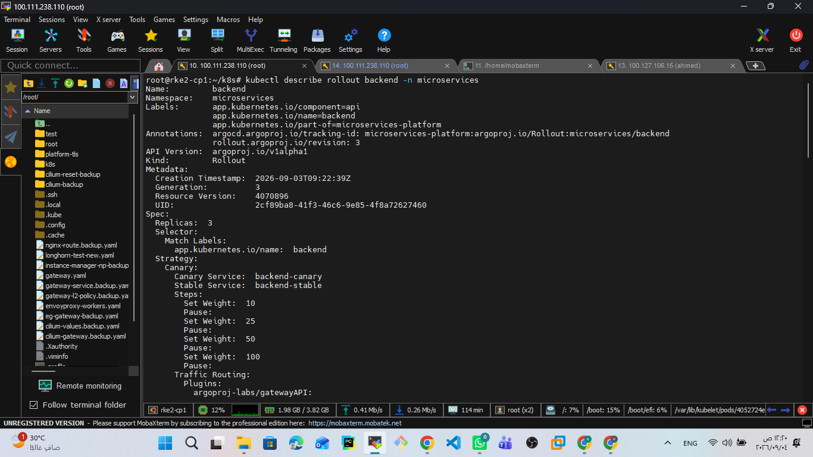

This screenshot demonstrates the actual Canary strategy configured in the cluster.

## 2.4 Stable and Canary Services

The Backend uses separate Services for stable and canary traffic.

Command:

```bash
kubectl get svc backend-stable backend-canary -n microservices
```

### Evidence

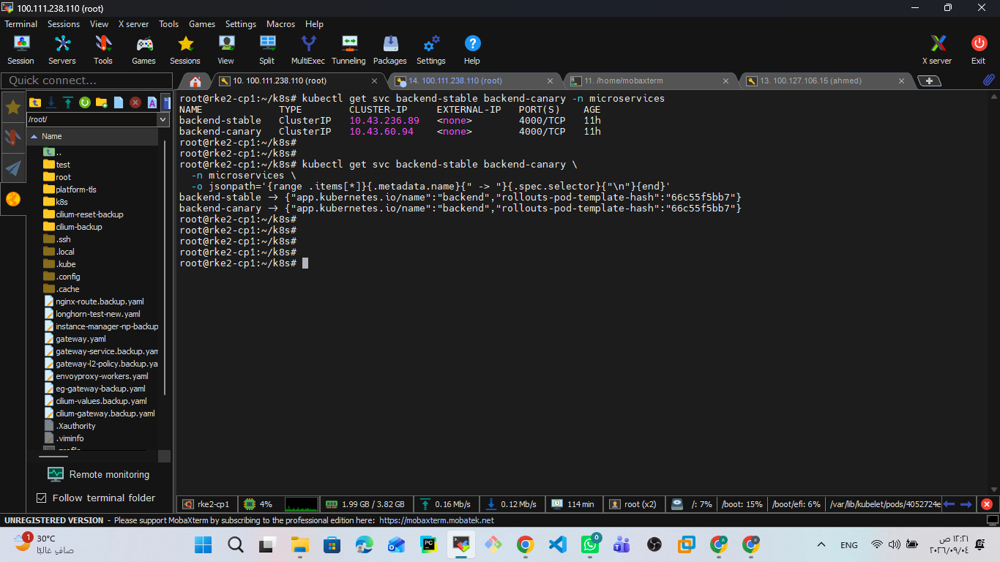

The Services provide distinct traffic destinations that Argo Rollouts can associate with the stable and canary ReplicaSets.

Argo Rollouts manages the runtime selectors using the `rollouts-pod-template-hash` label.

## 2.5 Gateway API Traffic Routing

The Backend Canary is integrated with the Gateway API through:

`application-route`

The HTTPRoute contains references to both backend Services.

A normal stable state can contain:

```yaml
backendRefs:
  - name: backend-stable
    port: 4000
    weight: 100

  - name: backend-canary
    port: 4000
    weight: 0
```

During an active Canary rollout, Argo Rollouts changes these weights according to the configured rollout steps.

Command:

```bash
kubectl get httproute application-route \
  -n microservices \
  -o yaml
```

### Evidence


The relationship between Argo Rollouts and Gateway API is:

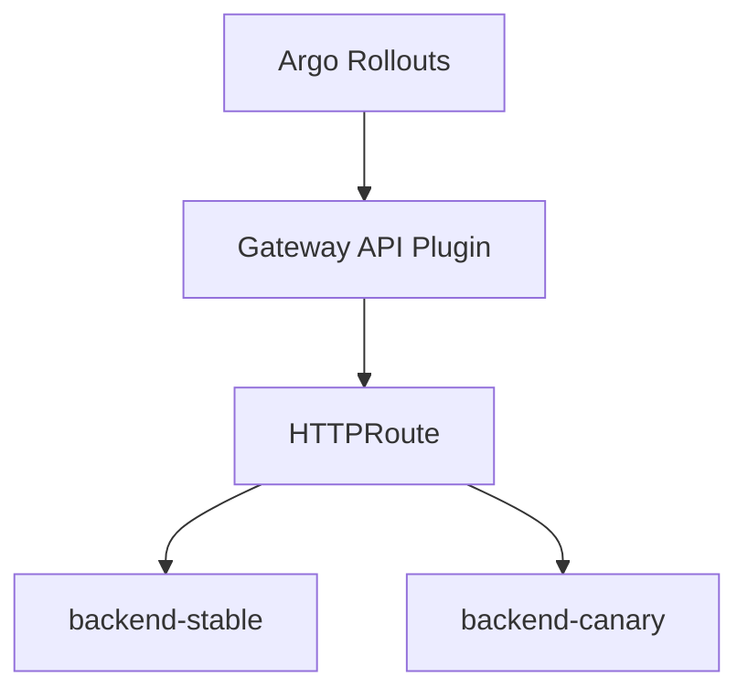
```mermaid
graph TD

    A["Argo Rollouts"] --> B["Gateway API Plugin"]
    B --> C["HTTPRoute"]
    C --> D["backend-stable"]
    C --> E["backend-canary"]
```

The important design point is that Argo Rollouts uses Gateway API routing weights to control how production traffic is distributed between the stable and canary Services.

---

# 3. Frontend Blue/Green Deployment

The Frontend uses the Blue/Green rollout strategy.

The Rollout manages two Services:

```text
frontend
frontend-preview
```

Their roles are:

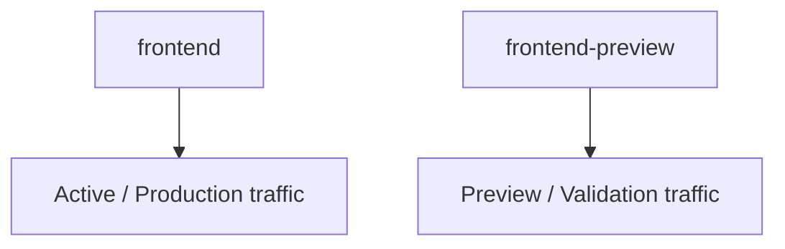
```mermaid
graph TD

    A["frontend"] --> B["Active / Production traffic"]
    C["frontend-preview"] --> D["Preview / Validation traffic"]
```

The external Gateway HTTPRoute continues to reference only the `frontend` Service.

The Preview Service is intentionally not used as the production backend.

Argo Rollouts controls which ReplicaSet each Service selects.

## 3.1 Blue/Green Configuration

The Frontend Rollout uses:

```yaml
strategy:
  blueGreen:
    activeService: frontend
    previewService: frontend-preview
    autoPromotionEnabled: false
```

The rollout workflow is:

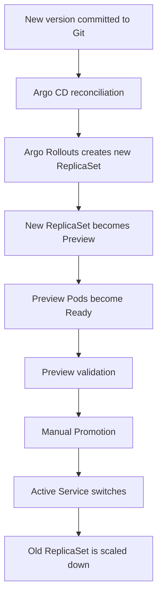
```mermaid
graph TD

    A["New version committed to Git"] --> B["Argo CD reconciliation"]
    B --> C["Argo Rollouts creates new ReplicaSet"]
    C --> D["New ReplicaSet becomes Preview"]
    D --> E["Preview Pods become Ready"]
    E --> F["Preview validation"]
    F --> G["Manual Promotion"]
    G --> H["Active Service switches"]
    H --> I["Old ReplicaSet is scaled down"]
```

`autoPromotionEnabled: false` creates an explicit validation gate between deployment and production activation.

## 3.2 Successful Blue/Green Rollout

The successful Frontend release is:

`a7medsayed/frontend:v1.0.1`

The final successful state is:

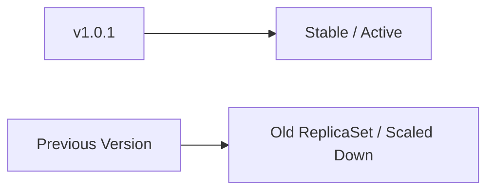
```mermaid
graph LR

    A["v1.0.1"] --> B["Stable / Active"]
    C["Previous Version"] --> D["Old ReplicaSet / Scaled Down"]
```

Command:

```bash
kubectl argo rollouts get rollout frontend -n microservices
```

Expected successful state:

```text
Status: Healthy

Strategy: BlueGreen

Images:

a7medsayed/frontend:v1.0.1 (stable, active)
```

### Evidence


This demonstrates that the new Frontend version became the stable Active release and that the previous ReplicaSet was scaled down.

## 3.3 Active and Preview Services

Command:

```bash
kubectl get svc frontend frontend-preview -n microservices
```

### Evidence


The two Services are maintained as part of the Blue/Green lifecycle.

During a rollout:

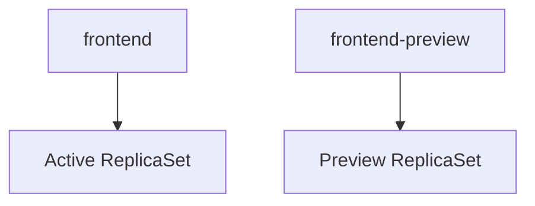
```mermaid
graph TD

    A["frontend"] --> B["Active ReplicaSet"]
    C["frontend-preview"] --> D["Preview ReplicaSet"]
```

The Services use the `rollouts-pod-template-hash` selector to identify the corresponding ReplicaSet.

## 3.4 Blue/Green Runtime State

Command:

```bash
kubectl describe rollout frontend -n microservices
```

The important configuration is:

```text
Active Service:

  frontend

Preview Service:

  frontend-preview

Auto Promotion Enabled:

  false
```

The Rollout status also exposes:

- Active selector.
- Preview selector.
- Current Pod hash.
- Stable ReplicaSet.
- Updated replicas.
- Ready replicas.

### Evidence

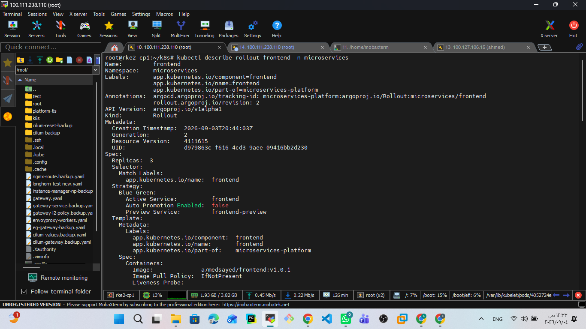

This provides direct evidence of how Argo Rollouts tracks the Active and Preview ReplicaSets.

---

# 4. Frontend End-to-End Validation

The application is exposed externally through Envoy Gateway and Gateway API.

The production endpoint is:

`https://app.microservices.home.arpa`

After the successful promotion, the application displays:

`Frontend Release v1.0.1`

### Evidence

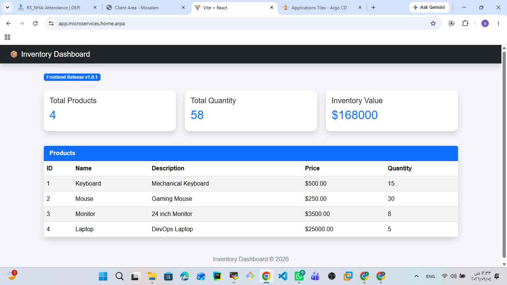

This provides user-facing evidence of the successful release.

The complete traffic path is:

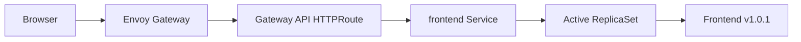
```mermaid
graph LR

    A["Browser"] --> B["Envoy Gateway"]
    B --> C["Gateway API HTTPRoute"]
    C --> D["frontend Service"]
    D --> E["Active ReplicaSet"]
    E --> F["Frontend v1.0.1"]
```

The important distinction is that the Gateway continues routing to the Service named:

`frontend`

Argo Rollouts changes the Service selector when switching between Blue and Green ReplicaSets.

---

# 5. Failed Frontend Preview Scenario

A controlled failure scenario was introduced to validate the behavior of an unsuccessful Preview release.

The intentionally invalid image was:

`a7medsayed/frontend:v9.9.9`

The image does not exist, so the new Preview Pods cannot start successfully.

The expected behavior is:

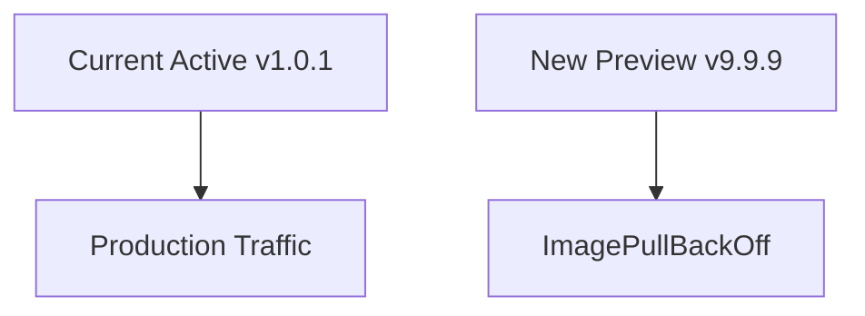
```mermaid
graph TD

    A["Current Active v1.0.1"] --> B["Production Traffic"]

    C["New Preview v9.9.9"] --> D["ImagePullBackOff"]
```

The important behavior is that the currently active production version remains available while the Preview release fails.

## 5.1 Failed Rollout

Command:

```bash
kubectl argo rollouts get rollout frontend -n microservices
```

### Evidence

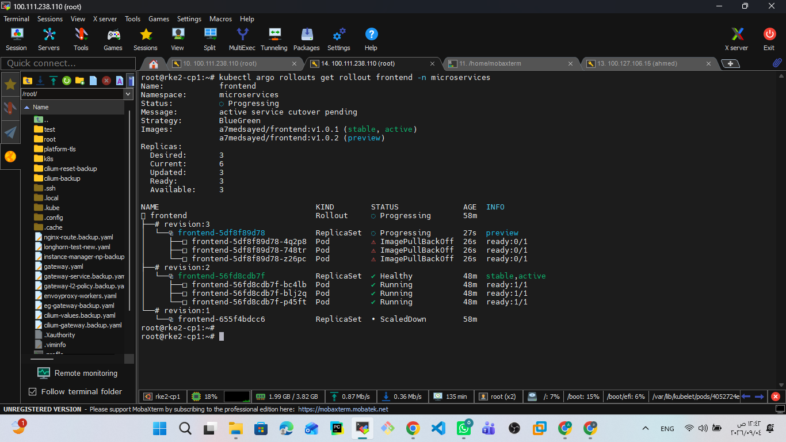

The evidence shows the failed Preview ReplicaSet while the existing stable release remains Active.

## 5.2 Failed Preview Pods

Command:

```bash
kubectl get pods -n microservices \
  -l app.kubernetes.io/name=frontend
```

### Evidence

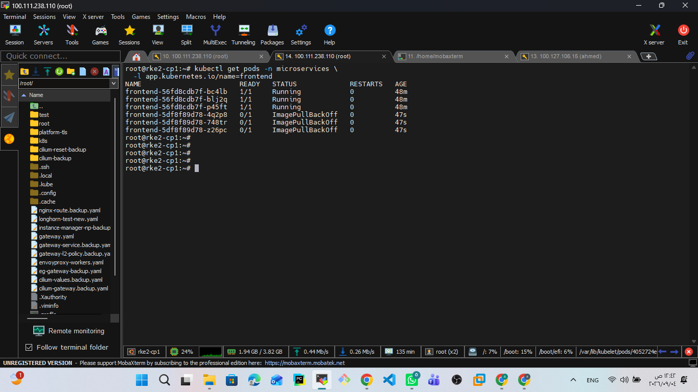

The Preview Pods are stuck in:

`ImagePullBackOff`

while the existing production Pods remain healthy.

## 5.3 Production Remains Available

The production application was tested while the Preview release was failing.

### Evidence


This validates the main Blue/Green safety property demonstrated by the lab:

A failed Preview release does not automatically replace the currently active production version.

---

# 6. Rollout Promotion

For the successful Frontend release, promotion was performed manually:

```bash
kubectl argo rollouts promote frontend -n microservices
```

Before promotion:

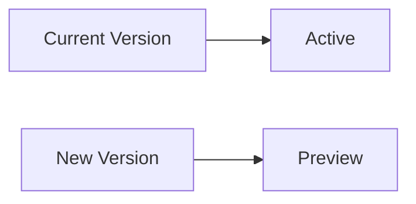
```mermaid
graph LR

    A["Current Version"] --> B["Active"]
    C["New Version"] --> D["Preview"]
```

After promotion:

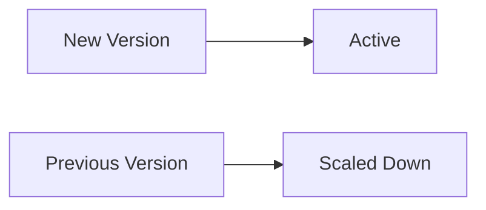
```mermaid
graph LR

    A["New Version"] --> B["Active"]
    C["Previous Version"] --> D["Scaled Down"]
```

This provides an explicit validation point before production traffic is switched to the new Frontend version.

---

# 7. Canary vs Blue/Green

The platform intentionally demonstrates both strategies.

| Capability | Backend | Frontend |
|---|---|---|
| Strategy | Canary | Blue/Green |
| Stable Service | `backend-stable` | `frontend` |
| New Version Service | `backend-canary` | `frontend-preview` |
| Gateway traffic split | Yes | No |
| Progressive percentages | 10/25/50/100 | N/A |
| Preview validation | Yes | Yes |
| Manual promotion | Yes | Yes |
| Automated availability analysis | Yes | No |
| Gateway API integration | Yes | Indirect |
| Active production traffic | Stable/weighted | Active Service |

## Canary

Canary gradually changes the amount of production traffic reaching the new version.

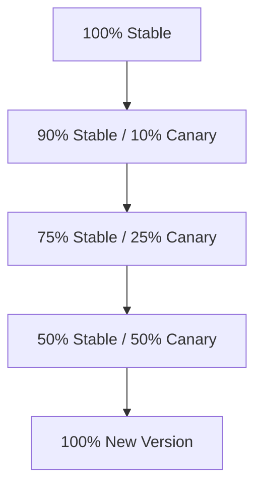
```mermaid
graph TD

    A["100% Stable"] --> B["90% Stable / 10% Canary"]
    B --> C["75% Stable / 25% Canary"]
    C --> D["50% Stable / 50% Canary"]
    D --> E["100% New Version"]
```

The exact transition is controlled by Argo Rollouts and reflected in the Gateway API HTTPRoute weights.

At the configured stages, Prometheus-based AnalysisRuns validate Backend availability before the rollout progresses.

## Blue/Green

Blue/Green keeps two environments available:

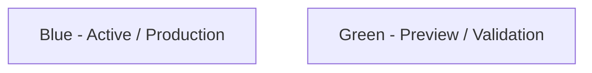
```mermaid
graph TD

    A["Blue - Active / Production"]
    B["Green - Preview / Validation"]
```

After validation, the Active Service selector is switched to the new ReplicaSet.

---

# 8. GitOps and Progressive Delivery Interaction

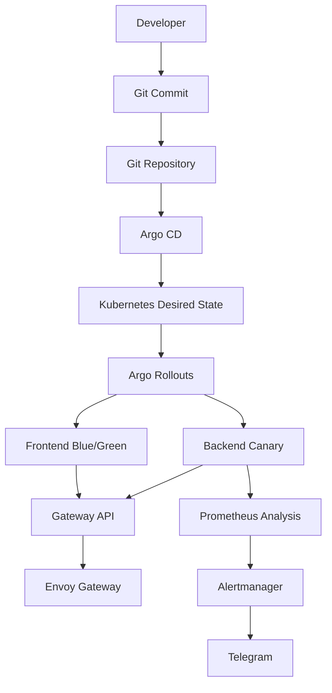
```mermaid
graph TD

    A["Developer"] --> B["Git Commit"]
    B --> C["Git Repository"]
    C --> D["Argo CD"]
    D --> E["Kubernetes Desired State"]

    E --> F["Argo Rollouts"]

    F --> G["Backend Canary"]
    F --> H["Frontend Blue/Green"]

    G --> I["Gateway API"]
    I --> J["Envoy Gateway"]

    H --> I

    G --> K["Prometheus Analysis"]
    K --> L["Alertmanager"]
    L --> M["Telegram"]
```

The important separation of responsibilities is:

### Git / Argo CD

Defines:

- Application manifests.
- Container image versions.
- Services.
- Rollout strategies.
- Gateway API resources.
- Desired configuration.

### Argo Rollouts

Controls:

- ReplicaSets.
- Canary progression.
- Blue/Green Active and Preview state.
- Runtime Service selectors.
- Gateway API traffic weights for the Backend.
- AnalysisRuns.
- Promotion and rollout lifecycle.

### Envoy Gateway / Gateway API

Controls:

- External application entry point.
- HTTP/HTTPS listeners.
- Host/path routing.
- Forwarding traffic to Kubernetes Services.

### Prometheus / Alertmanager

Controls:

- Metrics collection.
- Rollout analysis.
- Failed rollout detection.
- Recovery state detection.
- Notification delivery through Telegram.

---

# 9. Rollout Analysis and Monitoring

The Backend Canary rollout is integrated with Prometheus through an Argo Rollouts `AnalysisTemplate`.

The monitoring stack is deployed in the `monitoring` namespace.

The monitoring workflow is:

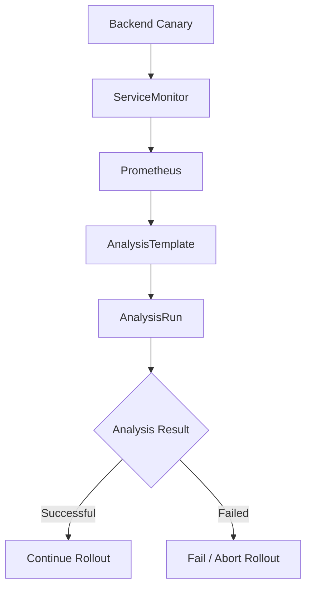
```mermaid
graph TD

    A["Backend Canary"] --> B["ServiceMonitor"]
    B --> C["Prometheus"]
    C --> D["AnalysisTemplate"]
    D --> E["AnalysisRun"]

    E --> F{"Analysis Result"}

    F -->|Successful| G["Continue Rollout"]
    F -->|Failed| H["Fail / Abort Rollout"]
```

## 9.1 Backend Availability Analysis

The `backend-availability` AnalysisTemplate queries Prometheus for the number of available Backend Rollout replicas.

The success condition requires at least three available replicas:

```yaml
apiVersion: argoproj.io/v1alpha1
kind: AnalysisTemplate
metadata:
  name: backend-availability
  namespace: microservices
spec:
  metrics:
    - name: backend-available-replicas
      initialDelay: 15s
      count: 1
      successCondition: result[0] >= 3
      failureLimit: 1
      provider:
        prometheus:
          address: http://monitoring-kube-prometheus-prometheus.monitoring.svc.cluster.local:9090
          query: |
            sum(
              rollout_info_replicas_available{
                namespace="argo-rollouts",
                name="backend"
              }
            ) or vector(0)
```

Each configured analysis stage creates an `AnalysisRun`.

During the successful Backend v1.0.3 rollout, the AnalysisRuns completed successfully and validated that the required replicas were available before the rollout progressed.

## 9.2 Backend Metrics Collection

The Backend exposes application metrics through:

`/metrics`

Prometheus discovers the Backend Canary through a ServiceMonitor targeting the Canary Service.

The ServiceMonitor uses:

```yaml
apiVersion: monitoring.coreos.com/v1
kind: ServiceMonitor
metadata:
  name: backend-canary
  namespace: monitoring
  labels:
    release: monitoring
spec:
  namespaceSelector:
    matchNames:
      - microservices
  selector:
    matchLabels:
      monitoring: backend-canary
  endpoints:
    - port: http
      path: /metrics
      interval: 15s
```

This provides a Prometheus target for the Backend Canary and allows rollout-specific metrics to be evaluated independently from the stable Service.

## 9.3 Rollout Analysis Result

The successful Backend rollout produced successful AnalysisRuns.

The analysis lifecycle is:

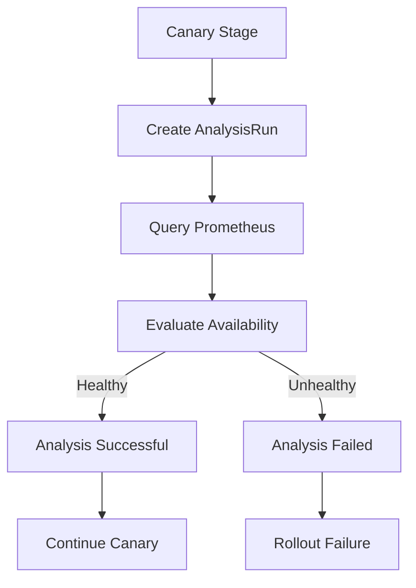
```mermaid
graph TD

    A["Canary Stage"] --> B["Create AnalysisRun"]
    B --> C["Query Prometheus"]
    C --> D["Evaluate Availability"]

    D -->|Healthy| E["Analysis Successful"]
    D -->|Unhealthy| F["Analysis Failed"]

    E --> G["Continue Canary"]
    F --> H["Rollout Failure"]
```

This separates metric collection from rollout control:

- Prometheus collects and exposes metrics.
- Argo Rollouts evaluates the AnalysisTemplate.
- The AnalysisRun records the result.
- The Rollout uses that result to determine whether progression can continue.

---

# 10. Rollout Failure Detection

Prometheus also evaluates a `BackendRolloutFailed` alert based on the Argo Rollouts `rollout_info` metric.

The alert detects failed rollout phases such as:

- `Timeout`
- `Degraded`
- `Error`
- `Aborted`

The PrometheusRule is:

```yaml
apiVersion: monitoring.coreos.com/v1
kind: PrometheusRule
metadata:
  name: microservices-rollout-alerts
  namespace: monitoring
  labels:
    release: monitoring
spec:
  groups:
    - name: microservices.rollouts
      rules:
        - alert: BackendRolloutFailed
          expr: |
            max(
              rollout_info{
                exported_namespace="microservices",
                name="backend",
                phase=~"Timeout|Degraded|Error|Aborted"
              }
            ) == 1
          for: 30s
          labels:
            severity: critical
            service: backend
          annotations:
            summary: "Backend rollout failed"
            description: "The backend Argo Rollout entered a failed state."
```

The monitoring path is:

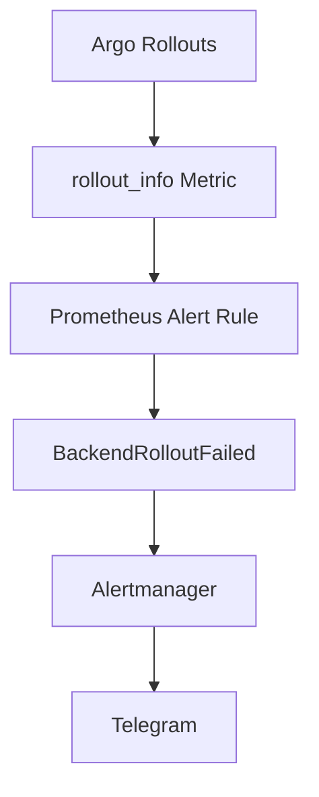
```mermaid
graph TD

    A["Argo Rollouts"] --> B["rollout_info Metric"]
    B --> C["Prometheus Alert Rule"]
    C --> D["BackendRolloutFailed"]
    D --> E["Alertmanager"]
    E --> F["Telegram"]
```

---

# 11. Alertmanager and Telegram Notifications

Alertmanager is configured through an `AlertmanagerConfig` resource.

The configuration matches the `BackendRolloutFailed` alert and sends notifications to Telegram.

The notification flow is:

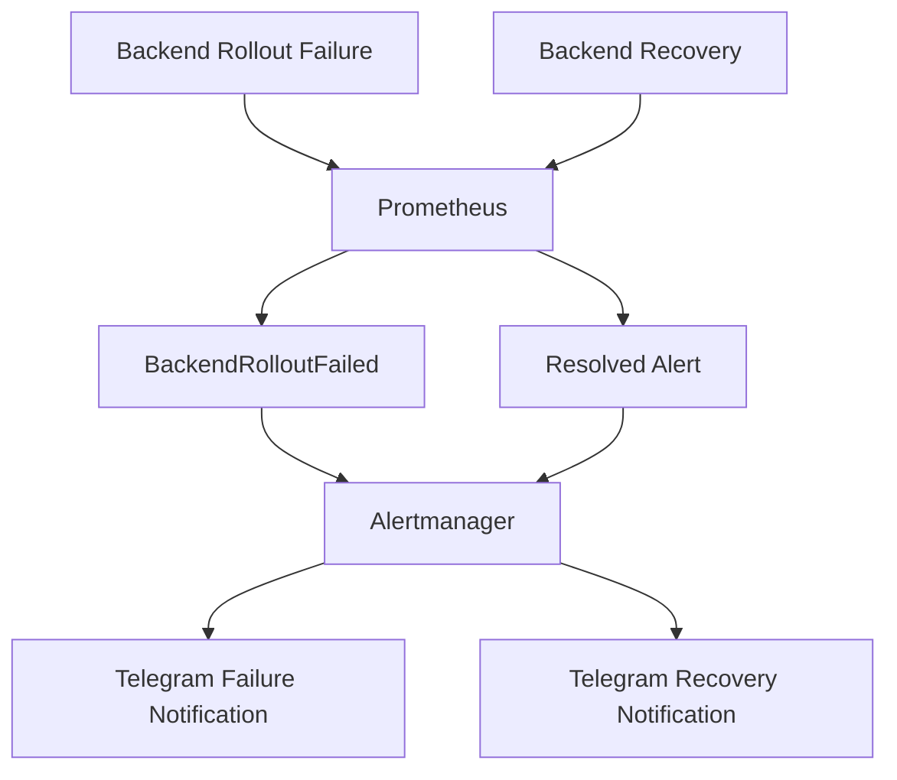
```mermaid
graph TD

    A["Backend Rollout Failure"] --> B["Prometheus"]
    B --> C["BackendRolloutFailed"]
    C --> D["Alertmanager"]
    D --> E["Telegram Failure Notification"]

    F["Backend Recovery"] --> B
    B --> G["Resolved Alert"]
    G --> D
    D --> H["Telegram Recovery Notification"]
```

The Telegram notification template distinguishes between firing and resolved states:

```yaml
message: |
  {{ if eq .Status "firing" }}
  <b>🚨 Backend Rollout Failed</b>
  {{ else }}
  <b>✅ Backend Rollout Recovered</b>
  {{ end }}

  <b>Alert:</b> {{ .CommonLabels.alertname }}
  <b>Service:</b> {{ .CommonLabels.service }}
  <b>Severity:</b> {{ .CommonLabels.severity }}

  <b>Summary:</b>
  {{ .CommonAnnotations.summary }}

  <b>Description:</b>
  {{ .CommonAnnotations.description }}
```

The configuration uses:

```yaml
sendResolved: true
```

This allows Alertmanager to send a recovery notification after the alert returns to a resolved state.

---

# 12. Backend Failure Scenario

A controlled Backend failure was introduced by deploying a non-existent image:

`a7medsayed/backend:v9.9.9`

The failed Canary created a new ReplicaSet while the existing stable version remained available.

The resulting state was:

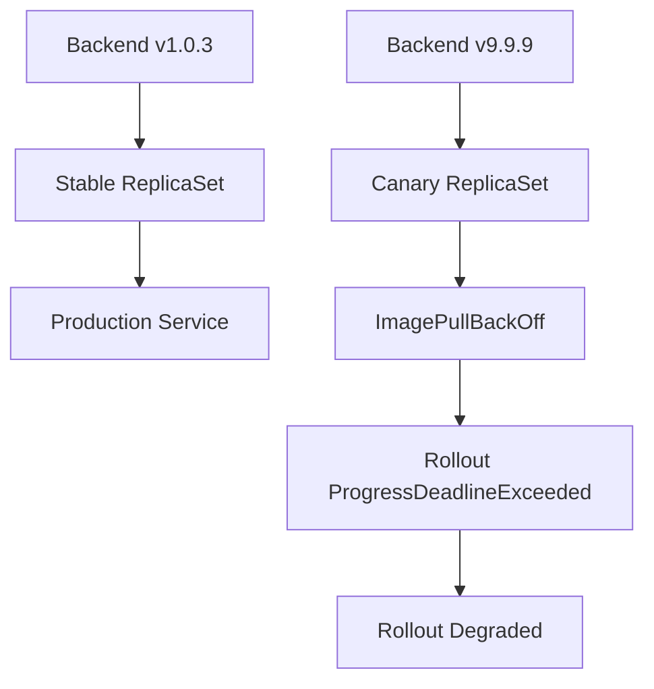
```mermaid
graph TD

    A["Backend v1.0.3"] --> B["Stable ReplicaSet"]
    B --> C["Production Service"]

    D["Backend v9.9.9"] --> E["Canary ReplicaSet"]
    E --> F["ImagePullBackOff"]

    F --> G["Rollout ProgressDeadlineExceeded"]
    G --> H["Rollout Degraded"]
```

## 12.1 Canary Pod Failure

The invalid image caused the Canary Pod to enter:

`ImagePullBackOff`

The Kubernetes events identified the image pull failure.

### Evidence


This screenshot demonstrates the first observable failure at the Kubernetes workload level.

The failure is isolated to the new Canary ReplicaSet and does not replace the known-good stable release.

## 12.2 Rollout Becomes Degraded

Because the new ReplicaSet could not make progress, the Argo Rollout eventually entered a degraded state.

The Rollout reported:

```text
Status: Degraded

ProgressDeadlineExceeded:
ReplicaSet has timed out progressing
```

### Evidence


This screenshot demonstrates how the Kubernetes workload failure is reflected in the Argo Rollouts lifecycle.

## 12.3 Argo CD Reflects the Failure

The failed rollout also affected the health status reported by the Argo CD Application.

The GitOps state remained synchronized with Git, while the runtime application health became degraded because the desired rollout could not successfully progress.

### Evidence


This demonstrates the distinction between:

- Sync status: whether the cluster matches Git.
- Health status: whether the deployed application is healthy.

A resource can remain synchronized with Git while its runtime health is degraded.

---

# 13. Prometheus Failure Detection

Once the Backend Rollout entered a failed phase, the Prometheus expression matched:

```promql
max(
  rollout_info{
    exported_namespace="microservices",
    name="backend",
    phase=~"Timeout|Degraded|Error|Aborted"
  }
) == 1
```

After the configured `for: 30s` period, the alert became:

`FIRING`

### Evidence


This screenshot demonstrates that Prometheus detected the Rollout failure through the actual Argo Rollouts metric rather than relying on a manually created application state.

The alert contains:

```text
Alert:
BackendRolloutFailed

Service:
backend

Severity:
critical
```

The detection chain is:

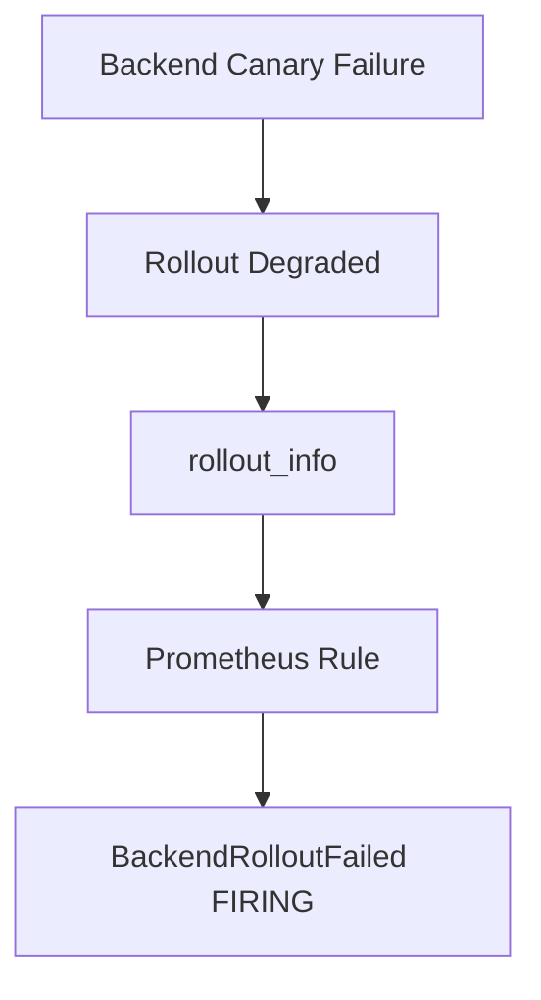
```mermaid
graph TD

    A["Backend Canary Failure"] --> B["Rollout Degraded"]
    B --> C["rollout_info"]
    C --> D["Prometheus Rule"]
    D --> E["BackendRolloutFailed FIRING"]
```

---

# 14. Telegram Failure Notification

After Prometheus fired the alert, Alertmanager routed it to the configured Telegram receiver.

### Evidence


The notification contains:

```text
Alert: BackendRolloutFailed
Service: backend
Severity: critical
```

and identifies the failed Backend Rollout.

The operational notification path is:

```mermaid
graph TD

    A["Backend Rollout"] --> B["Degraded"]
    B --> C["Prometheus"]
    C --> D["BackendRolloutFailed"]
    D --> E["Alertmanager"]
    E --> F["Telegram"]
```

This provides an operational alert without requiring an operator to continuously watch the Kubernetes or Prometheus dashboards.

---

# 15. GitOps Recovery

The failed Backend image was restored through the GitOps repository.

The known-good version was restored to:

`a7medsayed/backend:v1.0.3`

The recovery workflow is:

```mermaid
graph TD

    A["Bad Image v9.9.9"] --> B["Git Repository"]

    B --> C["Argo CD Reconciliation"]

    C --> D["Known-Good Image v1.0.3"]

    D --> E["Argo Rollouts"]

    E --> F["Healthy ReplicaSet"]

    F --> G["Stable Production Release"]
```

This preserves Git as the source of truth instead of performing an ad-hoc production-only change.

---

# 16. Backend Rollout Recovery

After the known-good image was restored, the Backend Rollout returned to:

```text
Status: Healthy

Strategy: Canary

Step: 7/7

SetWeight: 100

ActualWeight: 100

Images:

a7medsayed/backend:v1.0.3 (stable)

Replicas:

Desired: 3
Current: 3
Updated: 3
Ready: 3
Available: 3
```

### Evidence


This screenshot demonstrates that the Backend returned to a healthy stable state after the failed release was removed through the GitOps workflow.

The recovery state is:

```mermaid
graph TD

    A["Known-Good Image v1.0.3"] --> B["New Stable ReplicaSet"]
    B --> C["3 Ready Replicas"]
    C --> D["100% Production Traffic"]
    D --> E["Healthy Rollout"]
```

---

# 17. Prometheus Resolved State

Once the Backend Rollout returned to a healthy state, the failure expression no longer matched the Rollout.

The `BackendRolloutFailed` alert therefore became:

`INACTIVE`

### Evidence


This demonstrates that Prometheus automatically detected the recovery instead of requiring a manual alert reset.

The recovery path is:

```mermaid
graph TD

    A["Healthy Backend"] --> B["rollout_info"]
    B --> C["Prometheus Rule"]
    C --> D["BackendRolloutFailed INACTIVE"]
```

---

# 18. Telegram Recovery Notification

Because Alertmanager is configured with:

```yaml
sendResolved: true
```

the resolved alert is sent to Telegram.

The notification template checks the alert status and displays a dedicated recovery message.

### Evidence


The recovery notification is clearly identified as:

```text
✅ Backend Rollout Recovered
```

The complete operational lifecycle is:

```mermaid
graph TD

    A["Failed Backend Release"] --> B["ImagePullBackOff"]
    B --> C["Rollout Degraded"]
    C --> D["Prometheus FIRING"]
    D --> E["Telegram Failure"]

    E --> F["GitOps Restore"]
    F --> G["Backend Healthy"]
    G --> H["Prometheus INACTIVE"]
    H --> I["Telegram Recovery"]
```

This completes the demonstrated failure detection, notification, and recovery workflow.

---

# 19. Failure and Recovery Model

The platform treats failure scenarios as part of the operational design.

The demonstrated Backend failure follows this model:

```mermaid
graph TD

    A["New Release"] --> B["Canary Deployment"]

    B --> C{"Healthy?"}

    C -->|Yes| D["Continue Progression"]
    D --> E["Promote"]

    C -->|No| F["Keep Known-Good Version"]

    F --> G["Detect Failure"]
    G --> H["Prometheus Alert"]
    H --> I["Operational Notification"]

    I --> J["GitOps Recovery"]

    J --> K["Healthy Rollout"]
    K --> L["Resolved Alert"]
```

The key design principle is:

Do not expose an unverified release as the Active production version.

For the current lab, recovery is performed through Git by restoring the known-good image and allowing Argo CD to reconcile the desired state.

---

# 20. Production Safety Properties

The implemented scenarios demonstrate several important production-oriented properties.

## 20.1 Canary Isolation

During the failed Backend rollout, the invalid image was isolated to the Canary ReplicaSet.

The existing stable release remained available.

```mermaid
graph TD

    A["Stable v1.0.3"] --> B["Production Traffic"]

    C["Canary v9.9.9"] --> D["ImagePullBackOff"]

    D --> E["No Successful Promotion"]
```

## 20.2 Blue/Green Isolation

During the failed Frontend Preview rollout, the invalid Preview version did not replace the Active production version.

```mermaid
graph TD

    A["Active Frontend"] --> B["Production"]

    C["Preview Frontend"] --> D["ImagePullBackOff"]

    D --> E["Active Version Preserved"]
```

## 20.3 GitOps Recovery

Recovery was performed by restoring the desired image version in Git.

```mermaid
graph TD

    A["Bad Desired Version"] --> B["Git"]

    B --> C["Argo CD"]

    C --> D["Kubernetes"]

    D --> E["Argo Rollouts"]

    E --> F["Healthy Release"]
```

## 20.4 Automated Detection

The Backend failure was automatically detected by Prometheus after the Rollout entered a failed phase.

```mermaid
graph TD

    A["Rollout Degraded"] --> B["rollout_info"]
    B --> C["Prometheus"]
    C --> D["BackendRolloutFailed"]
    D --> E["Alertmanager"]
    E --> F["Telegram"]
```

---

# 21. Current Implementation Decisions

## Manual Promotion

The current implementation deliberately uses manual promotion gates.

For the Frontend:

```yaml
autoPromotionEnabled: false
```

For the Backend, explicit pause steps are used between Canary stages.

This makes the rollout process observable and easy to inspect during the lab.

## Automated Availability Analysis

The Backend Canary also uses Prometheus-based AnalysisRuns.

This provides an automated health check before the rollout progresses.

The design therefore combines:

```mermaid
graph TD

    A["Canary Traffic Stage"] --> B["Automated Prometheus Analysis"]
    B --> C["Manual Inspection"]
    C --> D["Manual Progression"]
```

This provides both automated validation and human-controlled progression.

## No Weighted Gateway Routing for Frontend

The Frontend does not add `frontend-preview` to the production HTTPRoute.

Instead:

```mermaid
graph TD

    A["HTTPRoute"] --> B["frontend Service"]
    B --> C["Active ReplicaSet"]
```

Argo Rollouts changes the Service selector during the Blue/Green transition.

This keeps the Gateway routing configuration simple and lets Rollouts own the Active/Preview switch.

## Gateway API for Backend Canary

The Backend Canary uses the Gateway API plugin so that traffic percentages are reflected directly in the HTTPRoute.

The traffic model is:

```mermaid
graph TD

    A["Argo Rollouts"] --> B["Gateway API Plugin"]
    B --> C["HTTPRoute"]

    C --> D["Stable Service"]
    C --> E["Canary Service"]
```

## Prometheus for Automated Availability Verification

Prometheus is used as the metric provider for Argo Rollouts Analysis.

The AnalysisTemplate evaluates Backend availability before the Canary progresses through the configured traffic stages.

This separates:

- Metrics collection by Prometheus.
- Decision evaluation by Argo Rollouts.
- Runtime traffic control by the Gateway API plugin.
- Notification delivery by Alertmanager.

---

# 22. Monitoring and Progressive Delivery Architecture

The final monitoring and progressive delivery architecture can be summarized as:

```mermaid
graph TD

    A["Git"] --> B["Argo CD"]
    B --> C["Argo Rollouts"]

    C --> D["Backend Canary"]
    C --> E["Frontend Blue/Green"]

    D --> F["Gateway API"]
    F --> G["Envoy Gateway"]

    D --> H["ServiceMonitor"]
    H --> I["Prometheus"]

    I --> J["AnalysisRun"]
    J --> C

    I --> K["BackendRolloutFailed"]
    K --> L["Alertmanager"]
    L --> M["Telegram"]
```

This provides a clear separation between:

- Desired state.
- Deployment orchestration.
- Traffic management.
- Metrics collection.
- Automated rollout analysis.
- Alerting.
- Operational notification.

---

# 23. Canary and Blue/Green Comparison

| Capability | Backend | Frontend |
|---|---|---|
| Strategy | Canary | Blue/Green |
| Stable Service | `backend-stable` | `frontend` |
| New Version Service | `backend-canary` | `frontend-preview` |
| Gateway traffic split | Yes | No |
| Progressive percentages | 10/25/50/100 | N/A |
| Automated availability analysis | Yes | No |
| Preview validation | Yes | Yes |
| Manual promotion | Yes | Yes |
| Failure isolation | Yes | Yes |
| GitOps recovery | Yes | Yes |
| Telegram failure alerting | Yes | Not configured |

The Backend demonstrates progressive traffic shifting and automated availability validation.

The Frontend demonstrates Active/Preview isolation and controlled promotion.

---

# 24. Result

The Progressive Delivery implementation demonstrates two production-relevant rollout strategies together with GitOps, Gateway API traffic management, automated availability analysis, and operational alerting.

```mermaid
graph TD

    A["GitOps"] --> B["Argo CD"]
    B --> C["Argo Rollouts"]

    C --> D["Backend Canary"]
    C --> E["Frontend Blue/Green"]

    D --> F["Gateway API Traffic Shifting"]
    D --> G["Prometheus Analysis"]

    G --> H["Continue or Fail"]

    H --> I["Alertmanager"]
    I --> J["Telegram"]

    E --> K["Active / Preview Validation"]

    F --> L["Production Traffic"]
    K --> L
```

The implementation includes:

- Argo CD GitOps Application.
- Backend Canary Rollout.
- Gateway API traffic routing.
- Frontend Blue/Green Rollout.
- Active / Preview Services.
- Manual promotion gates.
- Prometheus-based Backend availability analysis.
- AnalysisRuns for Canary validation.
- Controlled failed Backend Canary scenario.
- Controlled failed Frontend Preview scenario.
- Production isolation during failed releases.
- Prometheus rollout failure detection.
- Alertmanager notification routing.
- Telegram failure notification.
- GitOps-based recovery.
- Prometheus resolved-state detection.
- Telegram recovery notification.

The demonstrated failure and recovery scenario validates that an unhealthy Backend release can be detected, reported, isolated from the known-good version, recovered through GitOps, and automatically reflected as resolved in the monitoring and notification pipeline.

## Current Status

- [x] Argo CD GitOps Application
- [x] Backend Canary Rollout
- [x] Gateway API traffic routing
- [x] Frontend Blue/Green Rollout
- [x] Active / Preview Services
- [x] Manual promotion
- [x] Successful production release
- [x] Failed Frontend Preview scenario
- [x] Failed Backend Canary scenario
- [x] Production remains available during failed release
- [x] Prometheus-based rollout analysis
- [x] Backend availability AnalysisRuns
- [x] Rollout failure alerting
- [x] Alertmanager integration
- [x] Telegram failure notification
- [x] GitOps-based recovery
- [x] Prometheus resolved-state detection
- [x] Telegram recovery notification

The Progressive Delivery implementation is complete for the demonstrated lab scope.