# Storage & MySQL High Availability

This section implements the persistent storage and database high-availability layer of the private RKE2 Kubernetes platform.

The solution combines Longhorn persistent storage, MySQL StatefulSets, primary/replica architecture, HAProxy database routing, and an automated failover controller.

The complete storage and database HA workflow is deployed, integrated with the platform, and validated successfully.

---

## 1. Storage Architecture

Longhorn is used as the Kubernetes-native persistent storage platform.

It provides dynamic volume provisioning for stateful workloads and maintains replicated storage for MySQL volumes.

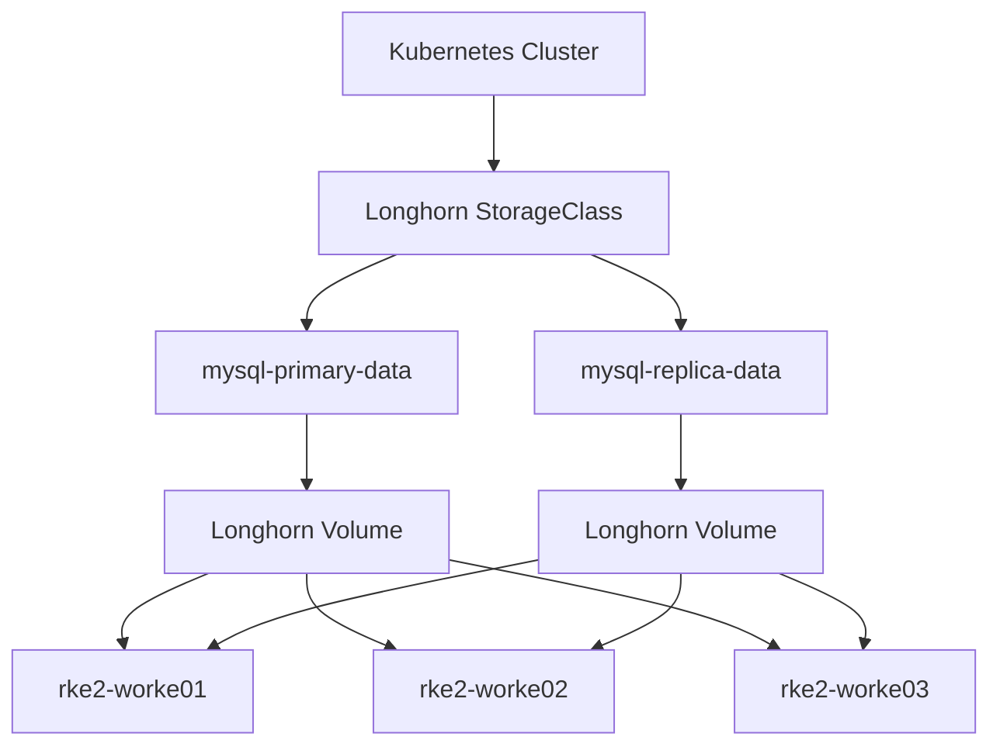
```mermaid
graph TD
    K8S[Kubernetes Cluster]

    SC[Longhorn StorageClass]

    PVC1[mysql-primary-data]
    PVC2[mysql-replica-data]

    V1[Longhorn Volume]
    V2[Longhorn Volume]

    N1[rke2-worke01]
    N2[rke2-worke02]
    N3[rke2-worke03]

    K8S --> SC
    SC --> PVC1
    SC --> PVC2
    PVC1 --> V1
    PVC2 --> V2
    V1 --> N1
    V1 --> N2
    V1 --> N3
    V2 --> N1
    V2 --> N2
    V2 --> N3
```

The `longhorn` StorageClass is configured as the default StorageClass.

Key configuration:

- Provisioner: `driver.longhorn.io`
- Reclaim Policy: `Delete`
- Volume Binding Mode: `Immediate`
- Allow Volume Expansion: enabled
- Filesystem: `ext4`
- Number of replicas: `3`
- Data locality: disabled
- Data engine: `v1`

The Longhorn worker nodes are:

- `rke2-worke01`
- `rke2-worke02`
- `rke2-worke03`

All Longhorn nodes are healthy, schedulable, and available for storage workloads.

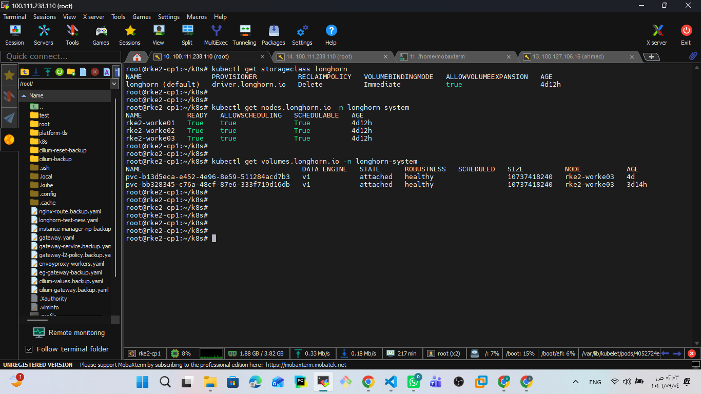

*Evidence: Longhorn StorageClass, Longhorn nodes, and active Longhorn volumes in the cluster.*

---

## 2. Longhorn Replicated Storage

Each MySQL persistent volume is provisioned through Longhorn with a replication factor of three.

This provides redundancy at the storage layer and protects persistent data from a single storage replica failure.

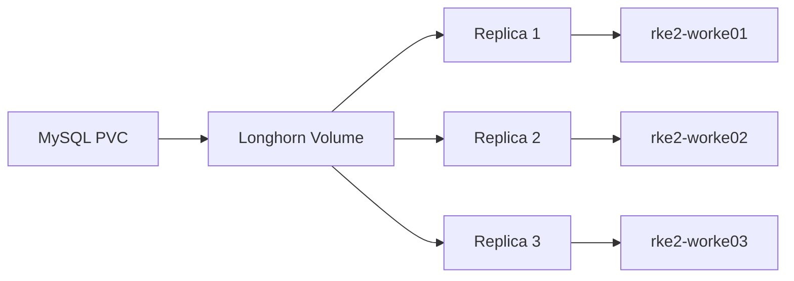
```mermaid
graph LR
    PVC[MySQL PVC]

    PVC --> VOL[Longhorn Volume]

    VOL --> R1[Replica 1]
    VOL --> R2[Replica 2]
    VOL --> R3[Replica 3]

    R1 --> W1[rke2-worke01]
    R2 --> W2[rke2-worke02]
    R3 --> W3[rke2-worke03]
```

The configured StorageClass contains:

```text
numberOfReplicas: "3"
```

The MySQL volumes are 10Gi and are reported as attached and healthy by Longhorn.

The resulting design provides:

- Dynamic provisioning
- Persistent block storage
- Replicated storage
- Kubernetes PVC integration
- Volume health monitoring
- Volume expansion support

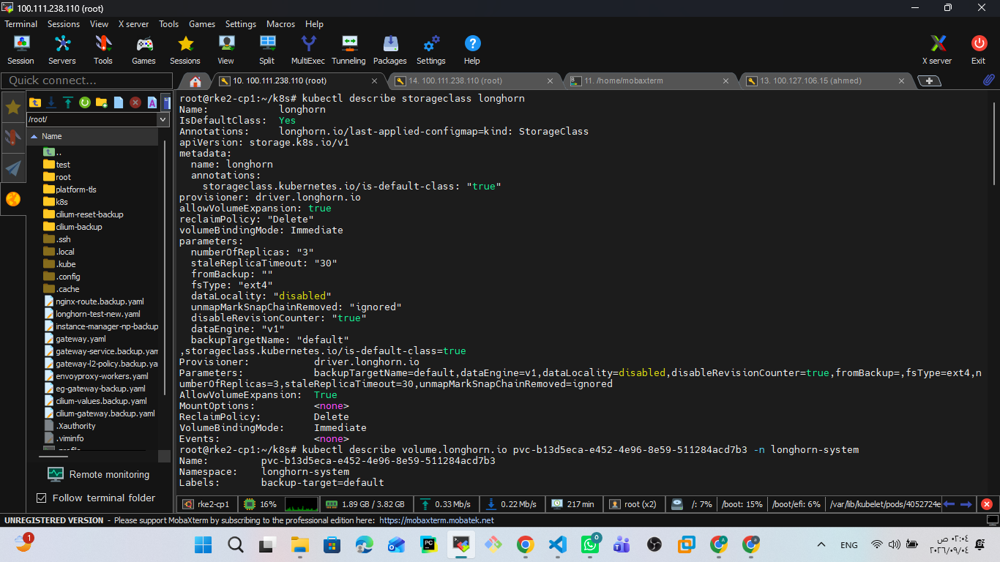

*Evidence: Longhorn StorageClass replication configuration and MySQL Longhorn volume details.*

---

## 3. MySQL Persistent Storage

MySQL is deployed using StatefulSets with dedicated PersistentVolumeClaims.

Two database instances are maintained:

- `mysql-primary-0`
- `mysql-replica-0`

Each instance has its own persistent volume.

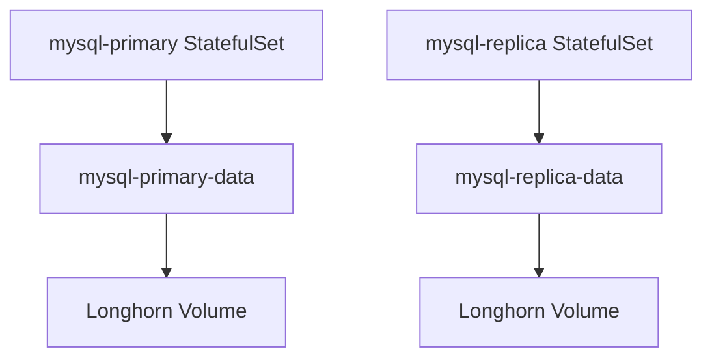
```mermaid
graph TD
    PRIMARY[mysql-primary StatefulSet]
    REPLICA[mysql-replica StatefulSet]

    PVC1[mysql-primary-data]
    PVC2[mysql-replica-data]

    VOL1[Longhorn Volume]
    VOL2[Longhorn Volume]

    PRIMARY --> PVC1
    REPLICA --> PVC2
    PVC1 --> VOL1
    PVC2 --> VOL2
```

Current PVC configuration:

```text
mysql-primary-data   Bound   10Gi   RWO   longhorn
mysql-replica-data   Bound   10Gi   RWO   longhorn
```

Both StatefulSets are healthy and running with their required replicas.

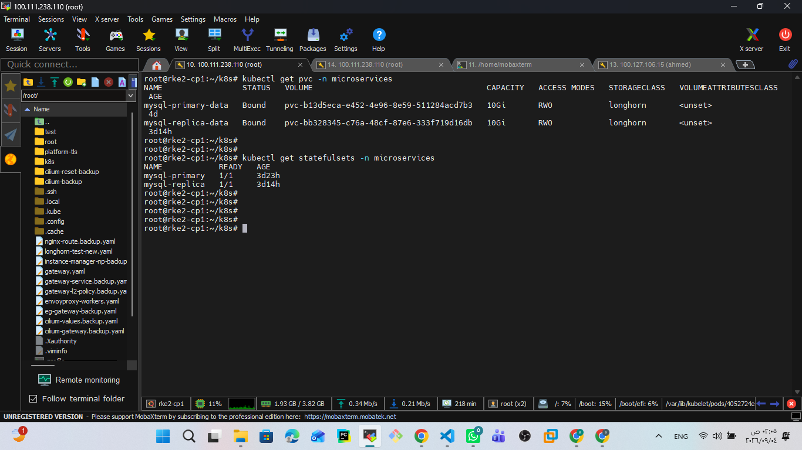

*Evidence: MySQL PVCs are Bound to Longhorn storage and both StatefulSets are available.*

---

## 4. MySQL Primary / Replica Architecture

The database layer follows a primary/replica architecture.

The primary handles normal database operations while the replica provides a failover target.

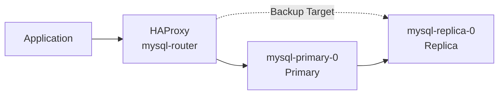
```mermaid
graph LR
    APP[Application]
    ROUTER[HAProxy<br/>mysql-router]
    PRIMARY[mysql-primary-0<br/>Primary]
    REPLICA[mysql-replica-0<br/>Replica]

    APP --> ROUTER
    ROUTER --> PRIMARY
    ROUTER -. Backup Target .-> REPLICA
    PRIMARY --> REPLICA
```

The StatefulSets provide stable database identities and persistent storage.

```text
mysql-primary-0
mysql-replica-0
```

This makes the database layer suitable for controlled failover and recovery operations.

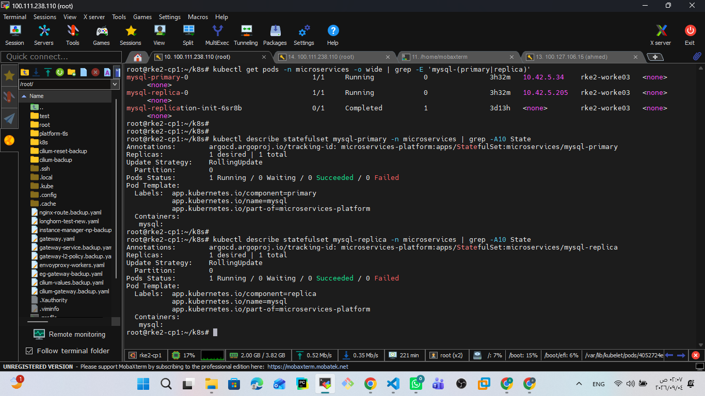

*Evidence: MySQL primary and replica StatefulSets and their running database pods.*

---

## 5. Database Services

The database layer uses dedicated Kubernetes Services to separate database identity from application access.

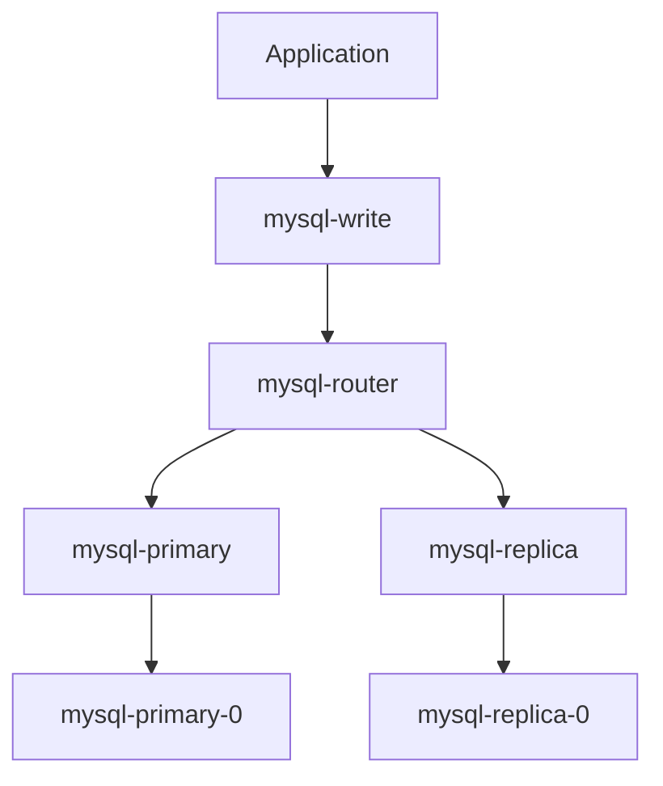
```mermaid
graph TD
    APP[Application]

    WRITE[mysql-write]
    ROUTER[mysql-router]

    PRIMARY[mysql-primary]
    REPLICA[mysql-replica]

    PRIMARYPOD[mysql-primary-0]
    REPLICAPOD[mysql-replica-0]

    APP --> WRITE
    WRITE --> ROUTER
    ROUTER --> PRIMARY
    ROUTER --> REPLICA
    PRIMARY --> PRIMARYPOD
    REPLICA --> REPLICAPOD
```

The deployed Services are:

```text
mysql-primary
mysql-replica
mysql-router
mysql-write
```

The router exposes:

```text
3306/TCP
```

for database traffic and:

```text
8404/TCP
```

for HAProxy statistics.

---

## 6. HAProxy Database Routing

HAProxy is deployed as the `mysql-router` component.

It provides a stable database endpoint for the application and abstracts the application from the individual MySQL pod.

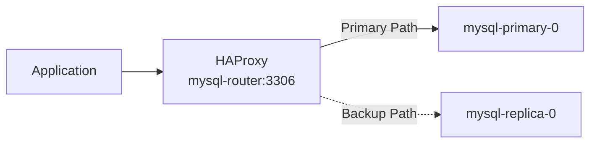
```mermaid
graph LR
    APP[Application]

    HAPROXY[HAProxy<br/>mysql-router:3306]

    PRIMARY[mysql-primary-0]
    REPLICA[mysql-replica-0]

    APP --> HAPROXY
    HAPROXY -->|Primary Path| PRIMARY
    HAPROXY -. Backup Path .-> REPLICA
```

HAProxy performs TCP health checks against the database endpoints and maintains the replica as the backup database target.

The HAProxy statistics interface is exposed through port `8404`.

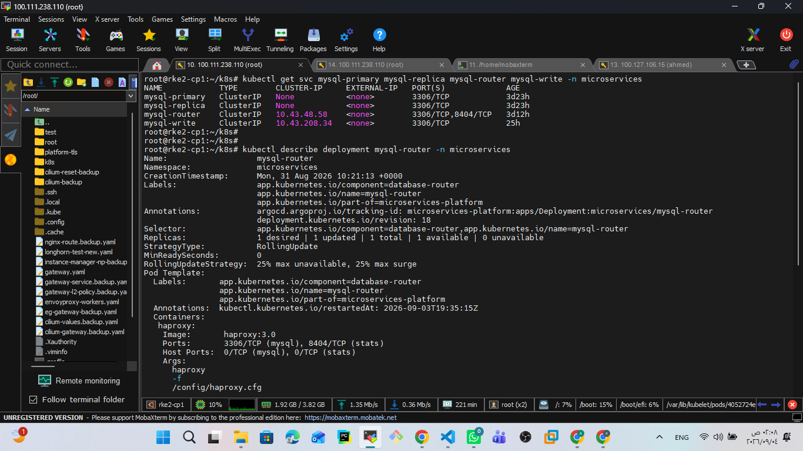

*Evidence: MySQL Services and HAProxy router configuration used by the database access layer.*

---

## 7. Automated Failover Controller

A dedicated `mysql-failover-controller` manages database failure detection and automatic failover.

The controller continuously checks the current primary and performs the required recovery actions when the primary becomes unavailable.

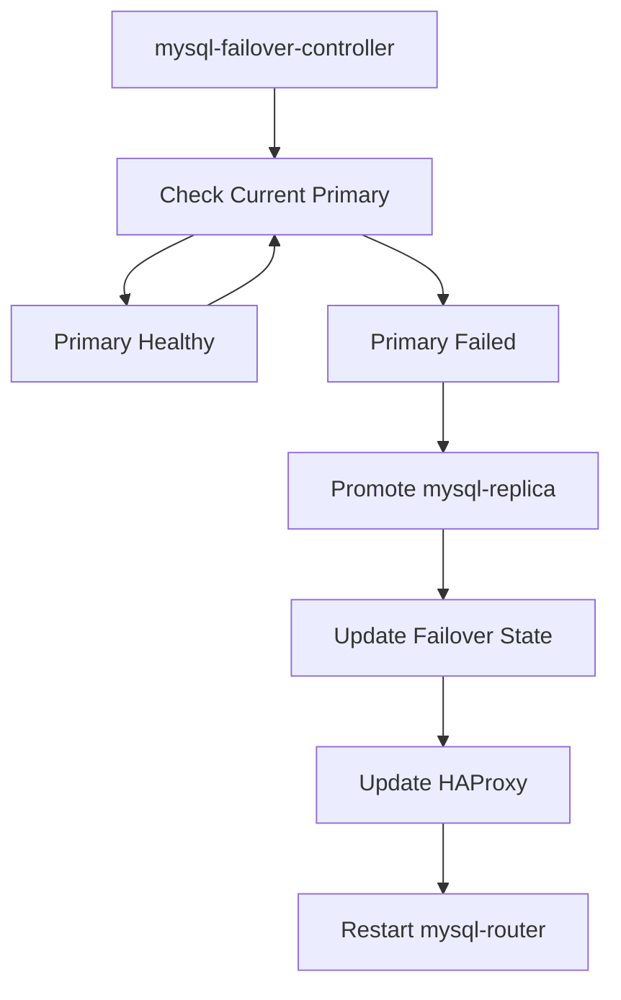
```mermaid
graph TD
    FC[mysql-failover-controller]

    CHECK[Check Current Primary]

    HEALTHY[Primary Healthy]
    FAILED[Primary Failed]

    PROMOTE[Promote mysql-replica]

    STATE[Update Failover State]

    ROUTER[Update HAProxy]

    RESTART[Restart mysql-router]

    FC --> CHECK
    CHECK --> HEALTHY
    CHECK --> FAILED
    HEALTHY --> CHECK
    FAILED --> PROMOTE
    PROMOTE --> STATE
    STATE --> ROUTER
    ROUTER --> RESTART
```

The failover state is maintained through:

```text
mysql-failover-state
```

The state tracks:

```text
current-primary
rejoin-required
```

The controller is deployed as a Kubernetes Deployment with one active replica.

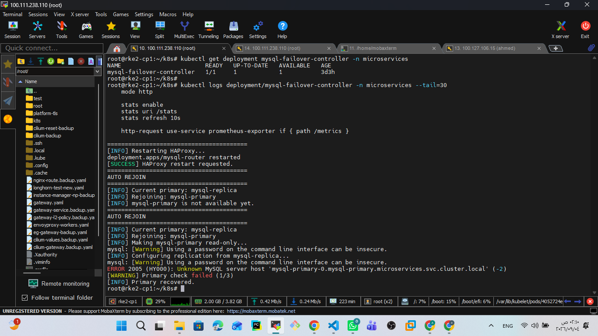

*Evidence: Failover controller deployment and controller output responsible for the database HA workflow.*

---

## 8. Normal HA Baseline

Before performing the failure test, the database platform was operating normally.

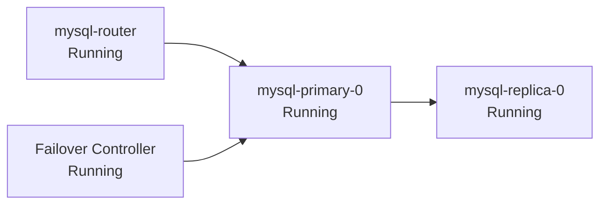
```mermaid
graph LR
    PRIMARY[mysql-primary-0<br/>Running]
    REPLICA[mysql-replica-0<br/>Running]
    ROUTER[mysql-router<br/>Running]
    FC[Failover Controller<br/>Running]

    PRIMARY --> REPLICA
    ROUTER --> PRIMARY
    FC --> PRIMARY
```

The baseline state was:

```text
mysql-primary-0              Running
mysql-replica-0              Running
mysql-router                 Running
mysql-failover-controller    Running

current-primary              mysql-primary
rejoin-required              false
```

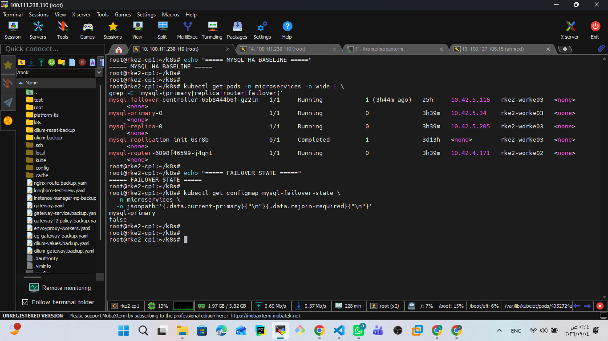

*Evidence: Healthy MySQL HA baseline captured before the controlled failure test.*

---

## 9. Automatic Failover Test

A controlled failure was introduced by deleting the current primary pod:

```text
mysql-primary-0
```

The StatefulSet automatically recreated the database pod while the failover controller detected the database failure.

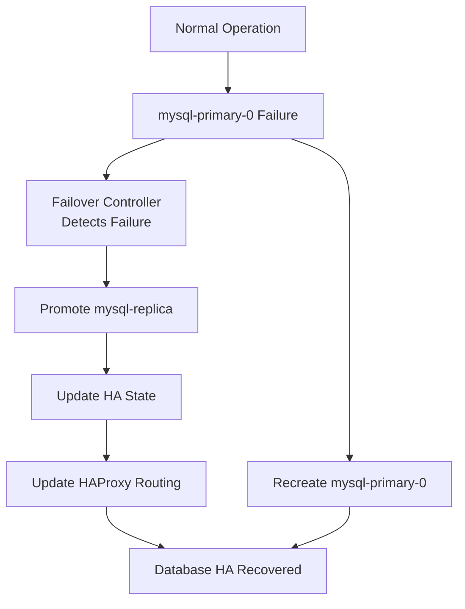
```mermaid
graph TD
    NORMAL[Normal Operation]

    FAILURE[mysql-primary-0 Failure]

    DETECT[Failover Controller<br/>Detects Failure]

    PROMOTE[Promote mysql-replica]

    STATE[Update HA State]

    ROUTE[Update HAProxy Routing]

    RECREATE[Recreate mysql-primary-0]

    RECOVERY[Database HA Recovered]

    NORMAL --> FAILURE
    FAILURE --> DETECT
    FAILURE --> RECREATE
    DETECT --> PROMOTE
    PROMOTE --> STATE
    STATE --> ROUTE
    ROUTE --> RECOVERY
    RECREATE --> RECOVERY
```

The failover controller successfully detected the failed primary after consecutive health-check failures.

It then performed the failover procedure:

```text
mysql-primary considered FAILED
mysql-replica promoted
New primary: mysql-replica
Rejoin required: true
HAProxy configuration updated
HAProxy restart requested
```

This confirms that the automatic failover mechanism is functioning as designed.

---

## 10. Failover State Transition

After the failure event, the database platform transitioned to the replica as the active primary.

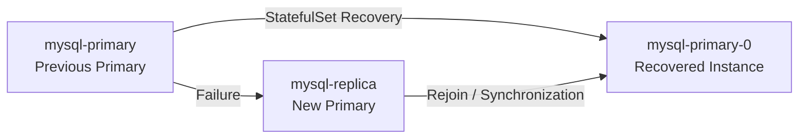
```mermaid
graph LR
    OLD[mysql-primary<br/>Previous Primary]

    NEW[mysql-replica<br/>New Primary]

    RECOVERED[mysql-primary-0<br/>Recovered Instance]

    OLD -->|Failure| NEW
    OLD -->|StatefulSet Recovery| RECOVERED
    NEW -->|Rejoin / Synchronization| RECOVERED
```

The failover controller updated the cluster state to:

```text
current-primary: mysql-replica
rejoin-required: true
```

The recreated `mysql-primary-0` does not immediately take ownership of the primary role.

The promoted replica remains the active primary while the recovered instance goes through the rejoin and recovery workflow.

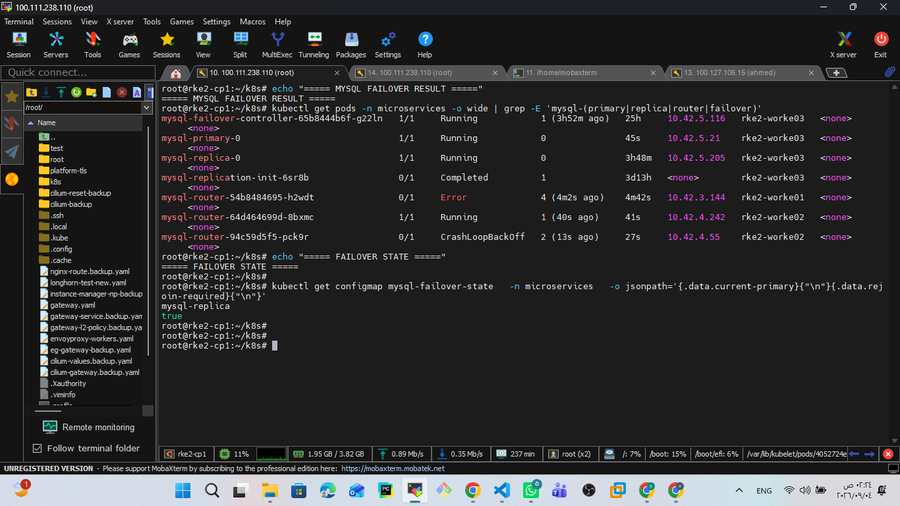

*Evidence: MySQL recovery state after the primary failure and automatic replica promotion.*

---

## 11. Automatic Recovery and Rejoin

After failover, the platform performs the recovery workflow for the original primary.

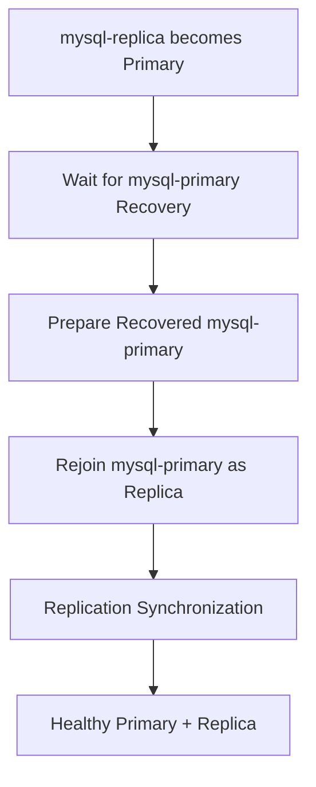
```mermaid
graph TD
    FAILOVER[mysql-replica becomes Primary]

    WAIT[Wait for mysql-primary Recovery]

    READONLY[Prepare Recovered mysql-primary]

    REJOIN[Rejoin mysql-primary as Replica]

    SYNC[Replication Synchronization]

    HEALTHY[Healthy Primary + Replica]

    FAILOVER --> WAIT
    WAIT --> READONLY
    READONLY --> REJOIN
    REJOIN --> SYNC
    SYNC --> HEALTHY
```

The recovered database instance is brought back into the replication topology while the promoted replica continues serving as the active primary.

This recovery model avoids an uncontrolled role switch immediately after the original primary pod is recreated.

---

## 12. Database HA Failure Flow

The complete failure-handling workflow is:

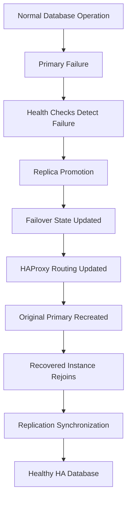
```mermaid
graph TD
    A[Normal Database Operation]

    B[Primary Failure]

    C[Health Checks Detect Failure]

    D[Replica Promotion]

    E[Failover State Updated]

    F[HAProxy Routing Updated]

    G[Original Primary Recreated]

    H[Recovered Instance Rejoins]

    I[Replication Synchronization]

    J[Healthy HA Database]

    A --> B
    B --> C
    C --> D
    D --> E
    E --> F
    F --> G
    G --> H
    H --> I
    I --> J
```

The architecture combines multiple layers of resilience:

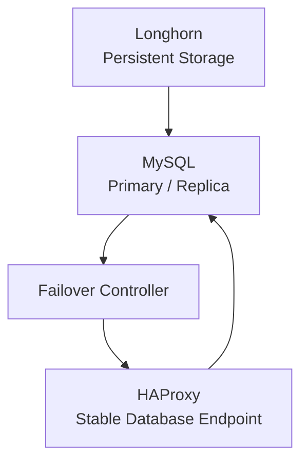
```mermaid
graph TD
    STORAGE[Longhorn<br/>Persistent Storage]

    MYSQL[MySQL<br/>Primary / Replica]

    CONTROLLER[Failover Controller]

    ROUTER[HAProxy<br/>Stable Database Endpoint]

    STORAGE --> MYSQL
    MYSQL --> CONTROLLER
    CONTROLLER --> ROUTER
    ROUTER --> MYSQL
```

Longhorn provides persistent replicated storage, while MySQL replication and the failover controller provide database-level availability.

HAProxy provides a stable database access point, and the failover controller automates the transition when the active primary fails.

---

## 13. StatefulSet Design

StatefulSets are used instead of Deployments because MySQL is a stateful workload.

They provide:

- Stable pod identities
- Stable storage association
- PersistentVolumeClaim integration
- Ordered lifecycle behavior
- Predictable database instance names

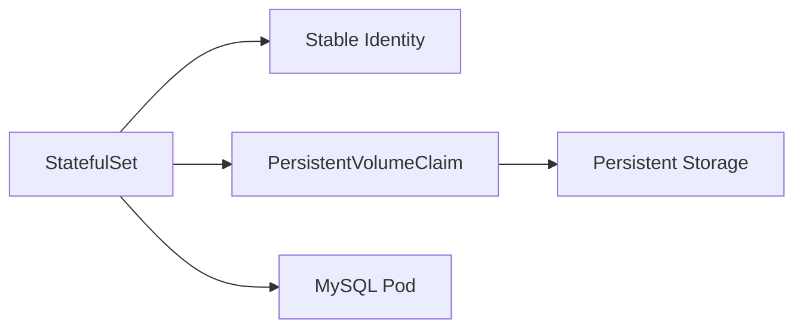
```mermaid
graph LR
    STS[StatefulSet]

    ID[Stable Identity]

    PVC[PersistentVolumeClaim]

    STORAGE[Persistent Storage]

    POD[MySQL Pod]

    STS --> ID
    STS --> PVC
    PVC --> STORAGE
    STS --> POD
```

The database instances therefore maintain predictable identities such as:

```text
mysql-primary-0
mysql-replica-0
```

---

## 14. Why Longhorn

Longhorn was selected because it integrates directly with Kubernetes PersistentVolumeClaims while providing replicated persistent storage.

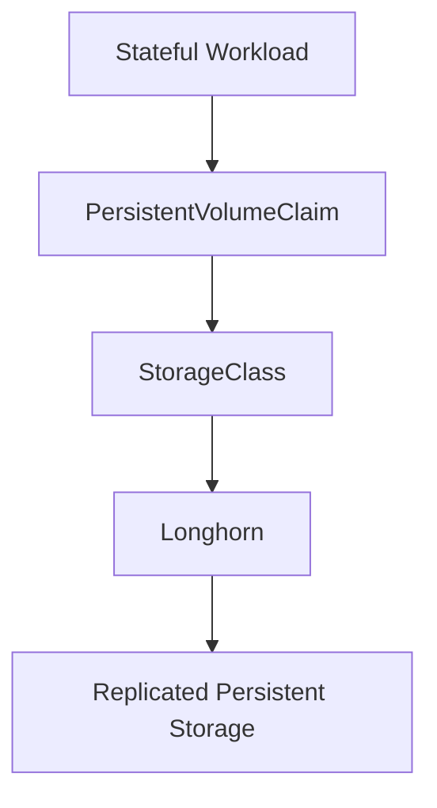
```mermaid
graph TD
    WORKLOAD[Stateful Workload]

    PVC[PersistentVolumeClaim]

    SC[StorageClass]

    LH[Longhorn]

    REPLICATED[Replicated Persistent Storage]

    WORKLOAD --> PVC
    PVC --> SC
    SC --> LH
    LH --> REPLICATED
```

This separates persistent storage from the lifecycle of individual MySQL pods.

If a database pod is recreated, its persistent storage remains associated with the workload through its PVC.

---

## 15. GitOps Integration

The complete storage and database stack is managed as part of the platform GitOps model.

Argo CD manages the Kubernetes resources from the Git repository.

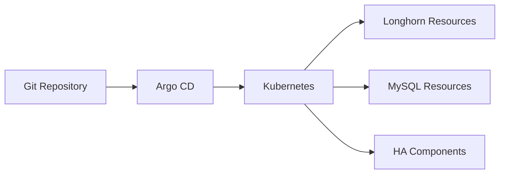
```mermaid
graph LR
    GIT[Git Repository]

    ARGO[Argo CD]

    K8S[Kubernetes]

    STORAGE[Longhorn Resources]

    MYSQL[MySQL Resources]

    HA[HA Components]

    GIT --> ARGO
    ARGO --> K8S
    K8S --> STORAGE
    K8S --> MYSQL
    K8S --> HA
```

This keeps the database platform declarative, reproducible, and integrated with the same GitOps workflow used by the rest of the platform.

---

## 16. High Availability Layers

The final database platform uses multiple complementary HA mechanisms.

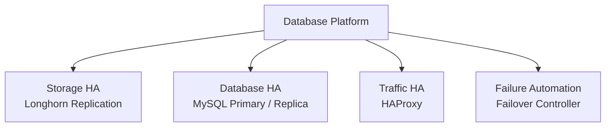
```mermaid
graph TD
    PLATFORM[Database Platform]

    STORAGEHA[Storage HA<br/>Longhorn Replication]

    DBHA[Database HA<br/>MySQL Primary / Replica]

    ROUTINGHA[Traffic HA<br/>HAProxy]

    FAILUREHA[Failure Automation<br/>Failover Controller]

    PLATFORM --> STORAGEHA
    PLATFORM --> DBHA
    PLATFORM --> ROUTINGHA
    PLATFORM --> FAILUREHA
```

Each layer has a dedicated responsibility:

- Longhorn protects persistent storage.
- MySQL replication provides a database failover target.
- HAProxy provides a stable database access point.
- The failover controller automates failure detection and recovery actions.
- StatefulSets maintain stable database identities and persistent storage associations.
- Argo CD manages the Kubernetes resources declaratively through GitOps.

---

## 17. Validation Summary

The storage and MySQL HA implementation is operational and the controlled failover scenario completed successfully.

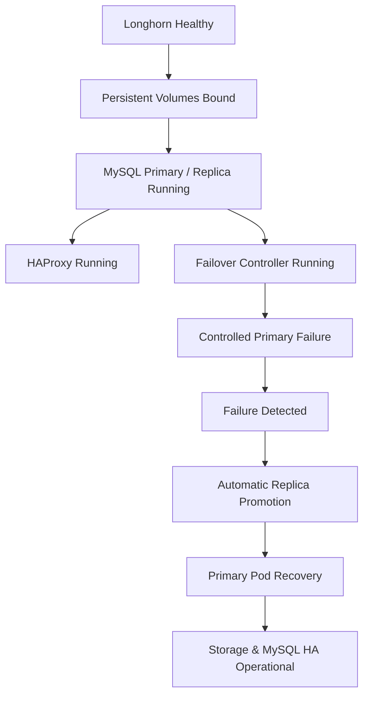
```mermaid
graph TD
    LH[Longhorn Healthy]

    PVC[Persistent Volumes Bound]

    MYSQL[MySQL Primary / Replica Running]

    HAPROXY[HAProxy Running]

    FC[Failover Controller Running]

    TEST[Controlled Primary Failure]

    DETECT[Failure Detected]

    PROMOTE[Automatic Replica Promotion]

    RECOVERY[Primary Pod Recovery]

    SUCCESS[Storage & MySQL HA Operational]

    LH --> PVC
    PVC --> MYSQL
    MYSQL --> HAPROXY
    MYSQL --> FC
    FC --> TEST
    TEST --> DETECT
    DETECT --> PROMOTE
    PROMOTE --> RECOVERY
    RECOVERY --> SUCCESS
```

Validated components:

- Longhorn installation
- Longhorn worker nodes
- Default StorageClass
- Dynamic persistent volume provisioning
- 10Gi MySQL persistent volumes
- Three-way Longhorn replication configuration
- MySQL primary StatefulSet
- MySQL replica StatefulSet
- MySQL Services
- HAProxy database router
- Failover controller
- Primary failure detection
- Automatic replica promotion
- HA state transition
- Primary pod recreation
- Database recovery workflow
- GitOps management through Argo CD

The storage and database HA layer is operational and ready to support the stateful workloads of the platform.

---

## 18. Final Storage Architecture

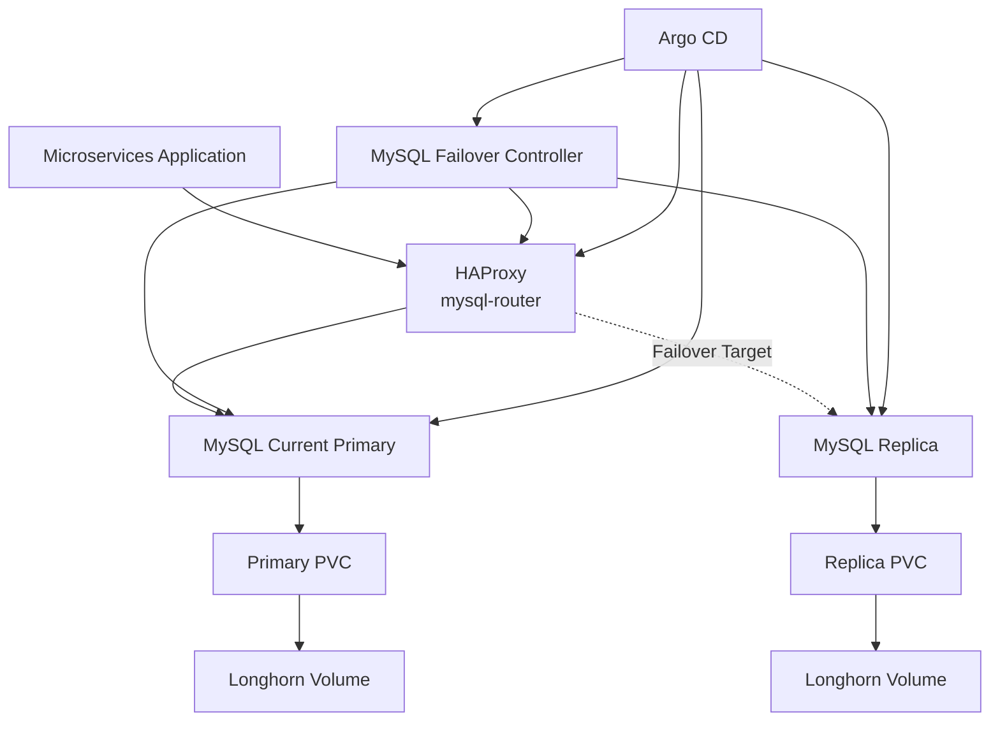
```mermaid
graph TD
    APP[Microservices Application]

    ROUTER[HAProxy<br/>mysql-router]

    PRIMARY[MySQL Current Primary]

    REPLICA[MySQL Replica]

    PVC1[Primary PVC]

    PVC2[Replica PVC]

    LH1[Longhorn Volume]

    LH2[Longhorn Volume]

    FC[MySQL Failover Controller]

    ARGO[Argo CD]

    APP --> ROUTER
    ROUTER --> PRIMARY
    ROUTER -. Failover Target .-> REPLICA

    PRIMARY --> PVC1
    REPLICA --> PVC2

    PVC1 --> LH1
    PVC2 --> LH2

    FC --> PRIMARY
    FC --> REPLICA
    FC --> ROUTER

    ARGO --> FC
    ARGO --> PRIMARY
    ARGO --> REPLICA
    ARGO --> ROUTER
```

The resulting design provides a production-oriented stateful platform where storage, database replication, routing, failure detection, recovery, and GitOps management work together as a single Kubernetes-native architecture.
