# Storage & MySQL High Availability

This section implements the persistent storage, database high availability, and application caching layer of the private RKE2 Kubernetes platform.

The solution combines Longhorn persistent storage, MySQL StatefulSets, primary/replica architecture, Redis caching, HAProxy database routing, and an automated MySQL failover controller.

The storage and database HA workflow is deployed, integrated with the platform, and validated successfully.

---

## 1. Storage Architecture

Longhorn is used as the Kubernetes-native persistent storage platform.

It provides dynamic volume provisioning for stateful workloads and replicated storage for MySQL volumes.

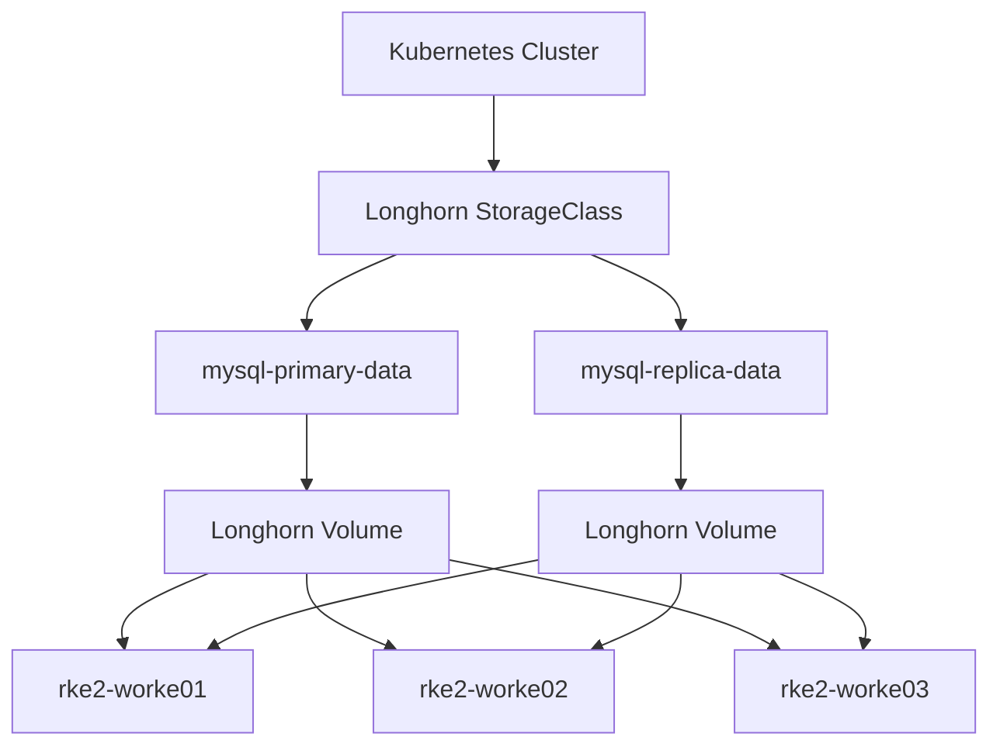

The `longhorn` StorageClass is configured as the default StorageClass.

Key configuration:

- Provisioner: `driver.longhorn.io`
- Reclaim Policy: `Delete`
- Volume Binding Mode: `Immediate`
- Allow Volume Expansion: enabled
- Filesystem: `ext4`
- Number of replicas: `3`
- Data locality: disabled
- Data engine: `v1`

The Longhorn worker nodes are:

- `rke2-worke01`
- `rke2-worke02`
- `rke2-worke03`

All Longhorn nodes are healthy, schedulable, and available for storage workloads.


*Evidence: Longhorn StorageClass, Longhorn nodes, and active Longhorn volumes.*

---

## 2. Longhorn Replicated Storage

Each MySQL persistent volume is provisioned through Longhorn with a replication factor of three.

This provides redundancy at the storage layer and protects persistent data from a single storage replica failure.

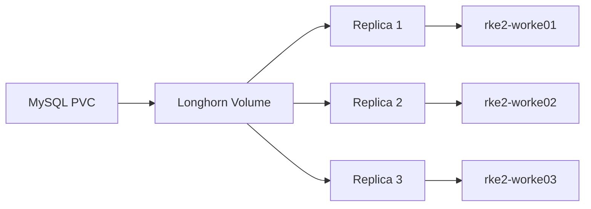

The configured StorageClass contains:

```text
numberOfReplicas: "3"
```

The MySQL volumes are 10Gi and are reported as attached and healthy by Longhorn.

The storage layer provides:

- Dynamic provisioning
- Persistent block storage
- Replicated storage
- Kubernetes PVC integration
- Volume health monitoring
- Volume expansion support


*Evidence: Longhorn replication configuration and MySQL volume details.*

---

## 3. MySQL Persistent Storage

MySQL is deployed using StatefulSets with dedicated PersistentVolumeClaims.

Two database instances are maintained:

- `mysql-primary-0`
- `mysql-replica-0`

Each instance has its own persistent volume.

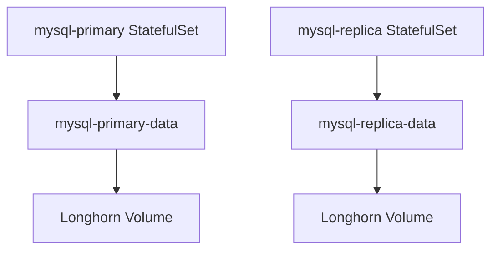

Current PVC configuration:

```text
mysql-primary-data   Bound   10Gi   RWO   longhorn
mysql-replica-data   Bound   10Gi   RWO   longhorn
```

Both StatefulSets are healthy and running with their required replicas.


*Evidence: MySQL PVCs are Bound to Longhorn storage and both StatefulSets are available.*

---

## 4. MySQL Primary / Replica Architecture

The database layer follows a primary/replica architecture.

The primary handles normal persistent database operations while the replica provides a failover target.

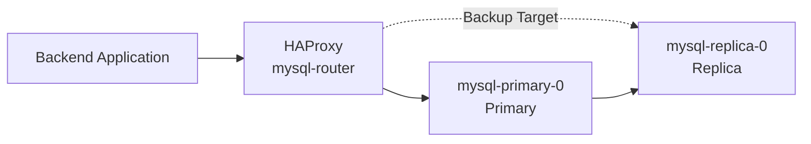

The StatefulSets provide stable database identities and persistent storage.

```text
mysql-primary-0
mysql-replica-0
```


*Evidence: MySQL primary and replica StatefulSets and running database pods.*

---

## 5. Redis Caching Layer

Redis is deployed in the `microservices` namespace as the application caching layer.

It provides a fast in-memory data store for cacheable and frequently accessed application data.

The backend can use Redis to reduce unnecessary database reads and improve application response performance.

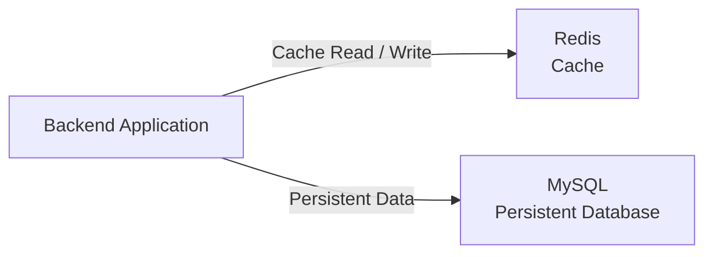

The current Redis deployment is:

```text
Deployment: redis
Replicas:   1/1
Service:    redis
Port:       6379/TCP
ClusterIP:  10.43.194.16
```

The Redis pod is running successfully on:

```text
rke2-worke02
```

The Redis Service provides a stable internal Kubernetes endpoint:

```text
redis:6379
```

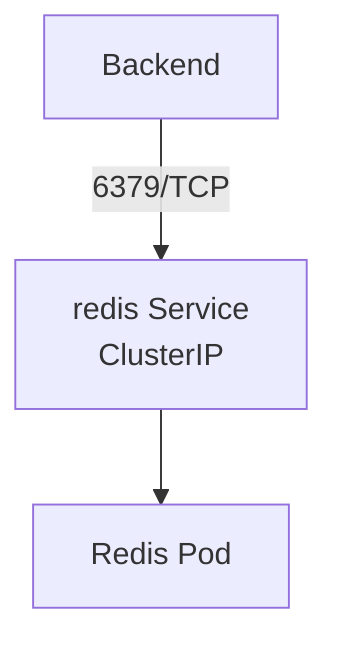

Redis is intentionally treated as a caching layer rather than the system of record.

MySQL remains responsible for persistent application data, while Redis provides fast access to cacheable data.

---

## 6. Database Services

The database layer uses dedicated Kubernetes Services to separate application access from individual database pod identities.

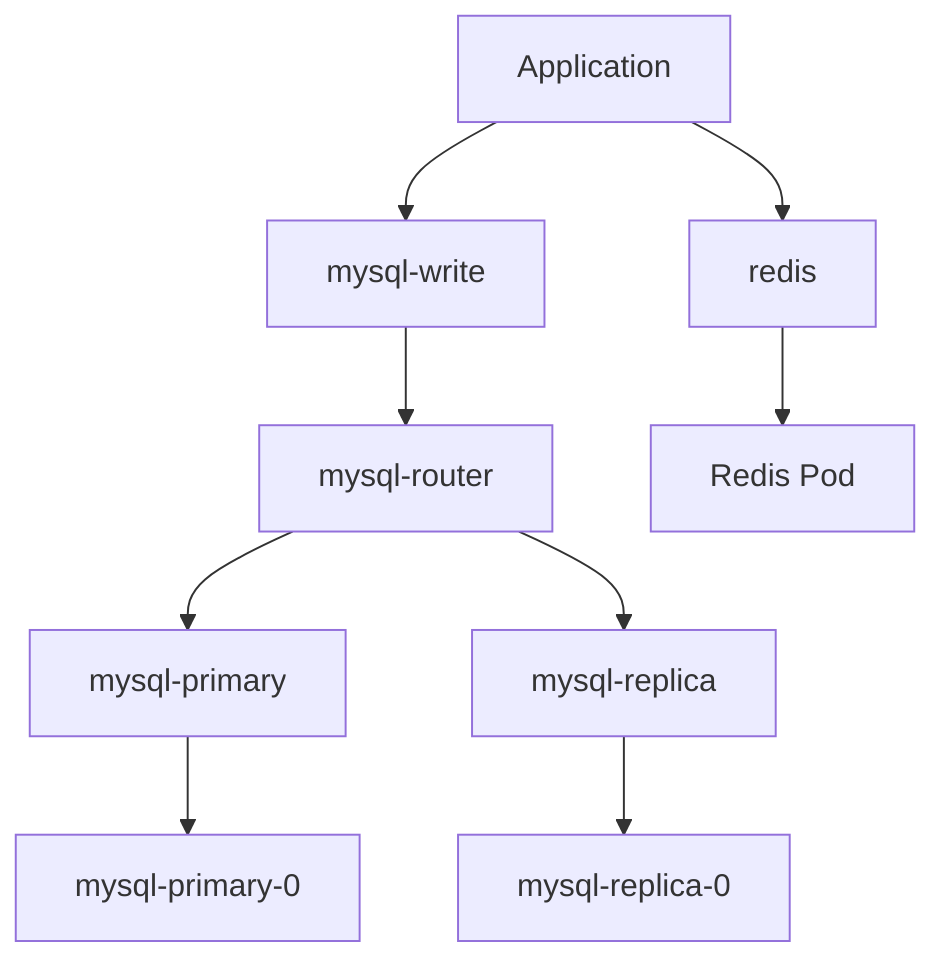

The deployed database-related Services are:

```text
mysql-primary
mysql-replica
mysql-router
mysql-write
redis
```

The database router exposes:

```text
3306/TCP
```

for MySQL traffic and:

```text
8404/TCP
```

for HAProxy statistics.

Redis exposes:

```text
6379/TCP
```

for internal application caching.

---

## 7. HAProxy Database Routing

HAProxy is deployed as the `mysql-router` component.

It provides a stable database endpoint for the application and abstracts the application from individual MySQL pod identities.

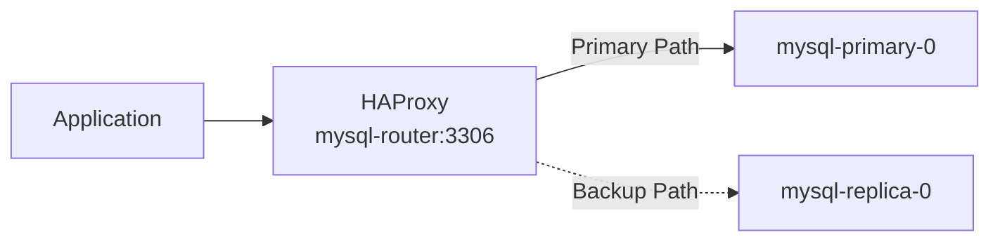

HAProxy performs TCP health checks against the database endpoints and maintains the replica as the backup database target.

The HAProxy statistics interface is exposed through:

```text
mysql-router:8404
```


*Evidence: MySQL Services and HAProxy router configuration.*

---

## 8. Automated Failover Controller

A dedicated `mysql-failover-controller` manages database failure detection and automatic failover.

The controller continuously checks the current primary and performs the required recovery actions when the primary becomes unavailable.

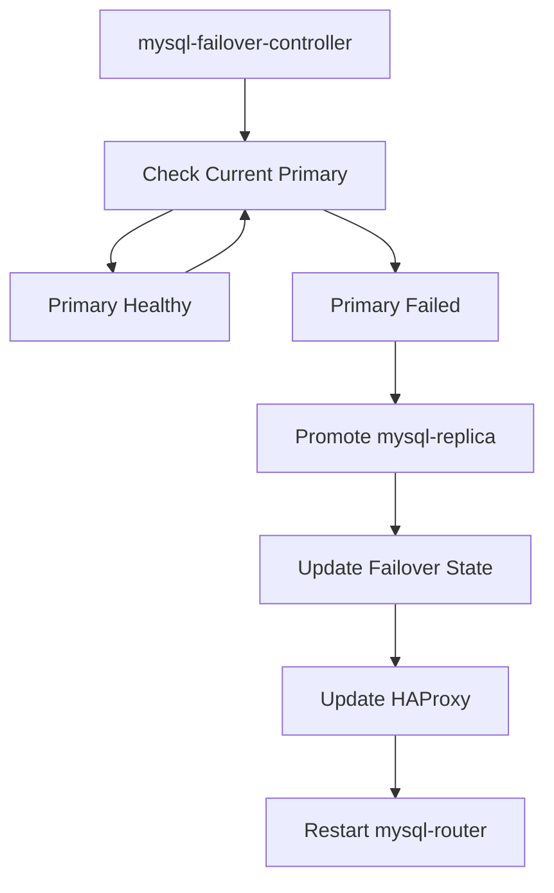

The failover state is maintained through:

```text
mysql-failover-state
```

The state tracks:

```text
current-primary
rejoin-required
```

The controller is deployed as a Kubernetes Deployment with one active replica.


*Evidence: Failover controller deployment and database HA controller output.*

---

## 9. Normal HA Baseline

Before performing the failure test, the database platform was operating normally.

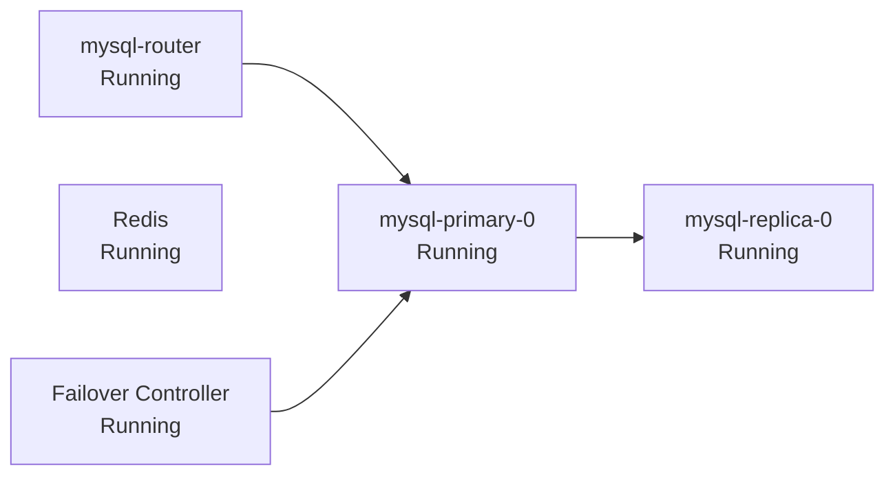

The baseline database state was:

```text
mysql-primary-0              Running
mysql-replica-0              Running
mysql-router                 Running
mysql-failover-controller    Running
redis                        Running

current-primary              mysql-primary
rejoin-required              false
```


*Evidence: Healthy MySQL HA baseline before the controlled failure test.*

---

## 10. Automatic Failover Test

A controlled failure was introduced by deleting the current primary pod:

```text
mysql-primary-0
```

The StatefulSet automatically recreated the database pod while the failover controller detected the database failure.

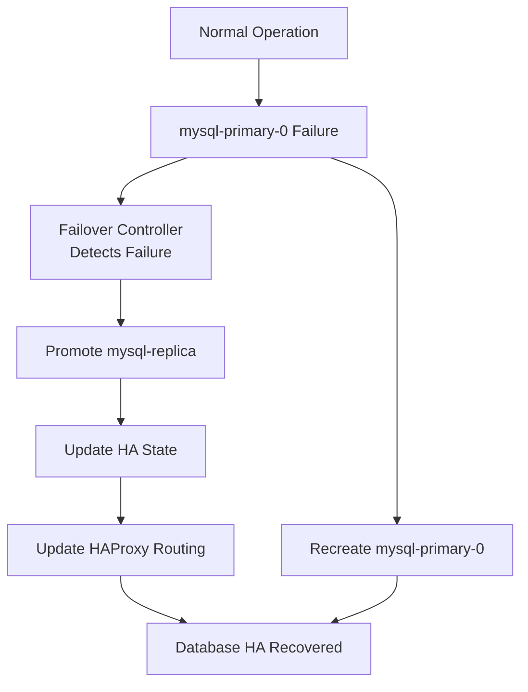

The failover controller successfully detected the failed primary after consecutive health-check failures.

It then performed the failover procedure:

```text
mysql-primary considered FAILED
mysql-replica promoted
New primary: mysql-replica
Rejoin required: true
HAProxy configuration updated
HAProxy restart requested
```

This confirms that the automatic failover mechanism is functioning as designed.

---

## 11. Failover State Transition

After the failure event, the database platform transitioned to the replica as the active primary.

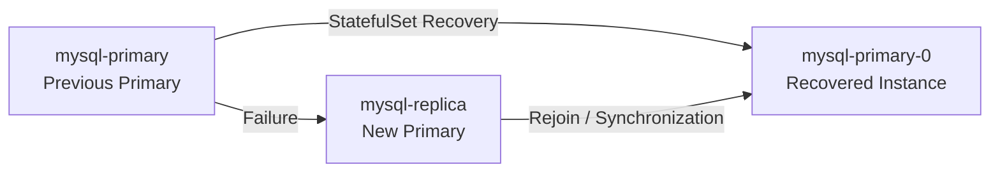

The failover controller updated the cluster state to:

```text
current-primary: mysql-replica
rejoin-required: true
```

The recreated `mysql-primary-0` does not immediately take ownership of the primary role.

The promoted replica remains the active primary while the recovered instance goes through the rejoin and recovery workflow.


*Evidence: MySQL recovery state after the primary failure and automatic replica promotion.*

---

## 12. Automatic Recovery and Rejoin

After failover, the platform performs the recovery workflow for the original primary.

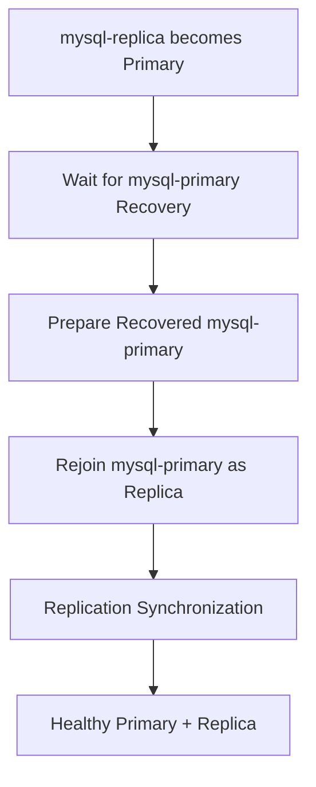

The recovered database instance is brought back into the replication topology while the promoted replica continues serving as the active primary.

This recovery model avoids an uncontrolled role switch immediately after the original primary pod is recreated.

---

## 13. Database and Cache Traffic Flow

The application layer uses Redis for fast cache access and MySQL for persistent database operations.

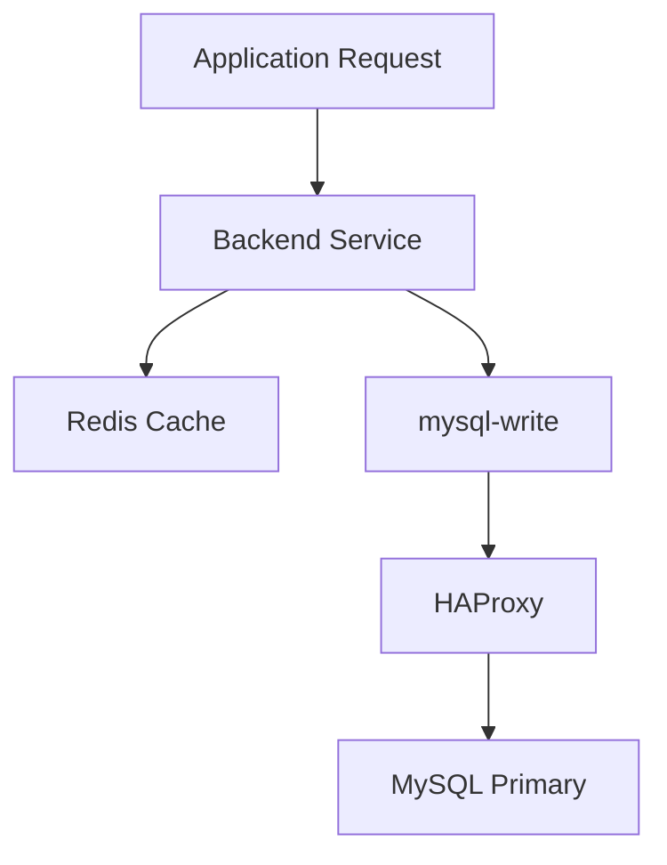

This separation allows the platform to keep frequently accessed cacheable data in Redis while persistent application data remains in MySQL.

---

## 14. Database HA Failure Flow

The complete database failure-handling workflow is:

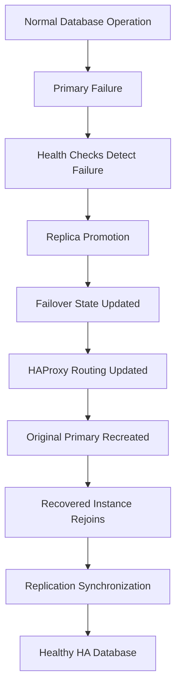

The architecture combines multiple layers of resilience:

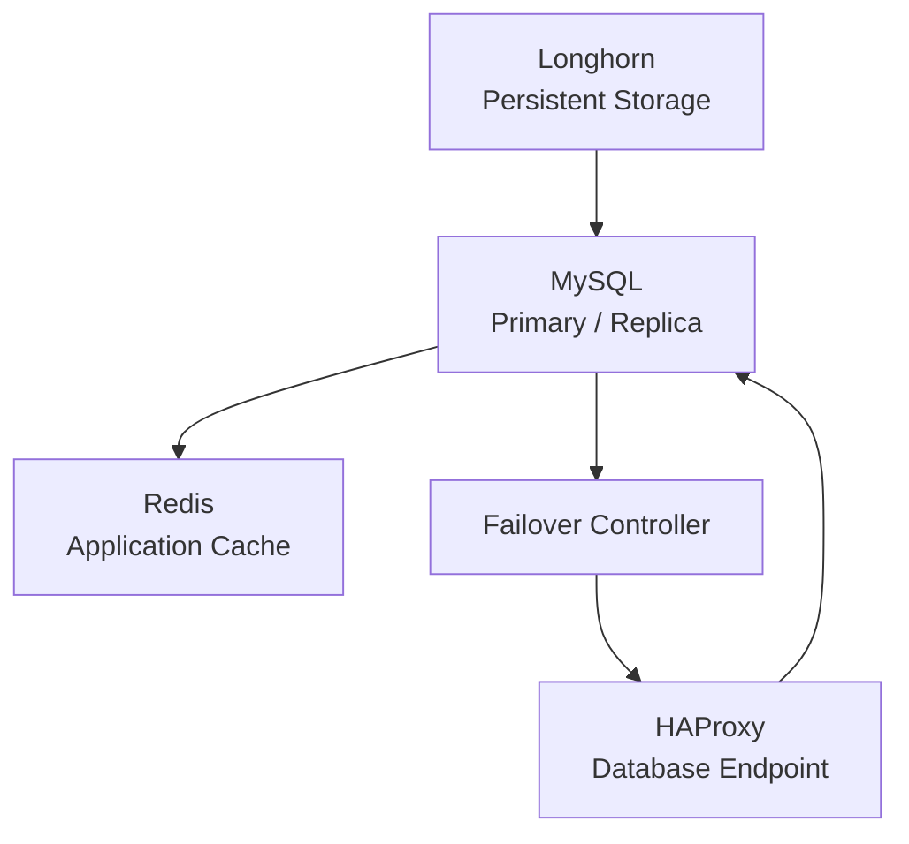

Longhorn provides persistent replicated storage.

MySQL provides persistent database storage and a replication-based failover target.

Redis provides a fast application caching layer.

HAProxy provides a stable database endpoint, while the failover controller automates database failure handling.

---

## 15. StatefulSet Design

StatefulSets are used instead of Deployments for MySQL because MySQL is a stateful workload.

They provide:

- Stable pod identities
- Stable storage association
- PersistentVolumeClaim integration
- Ordered lifecycle behavior
- Predictable database instance names

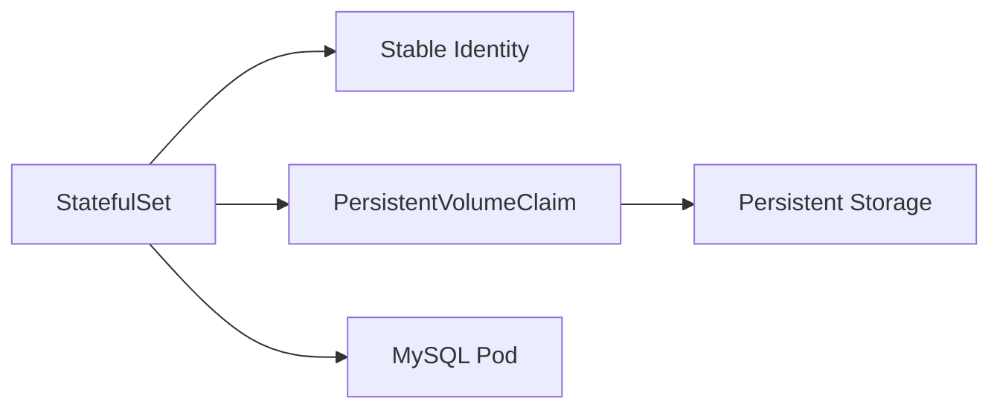

The database instances therefore maintain predictable identities:

```text
mysql-primary-0
mysql-replica-0
```

---

## 16. Why Longhorn

Longhorn was selected because it integrates directly with Kubernetes PersistentVolumeClaims while providing replicated persistent storage.

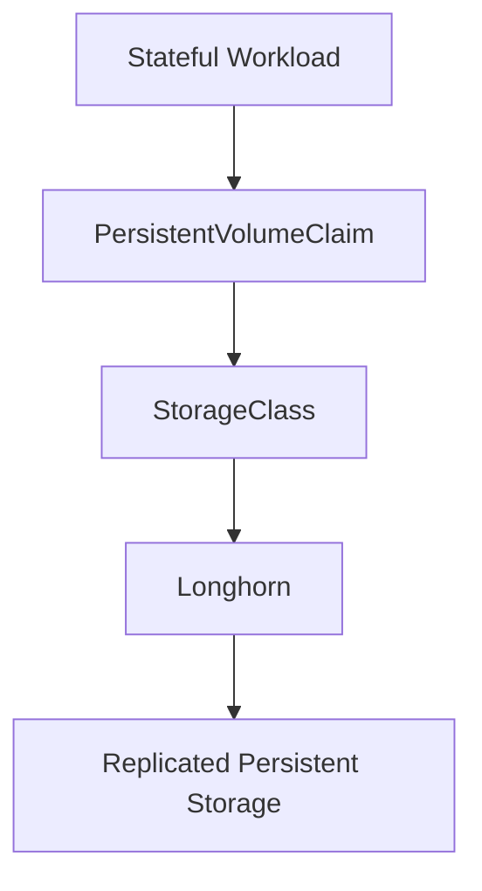

This separates persistent storage from the lifecycle of individual MySQL pods.

If a database pod is recreated, its persistent storage remains associated with the workload through its PVC.

---

## 17. Why Redis

Redis is used as an application caching layer because cache workloads have different characteristics from persistent database workloads.

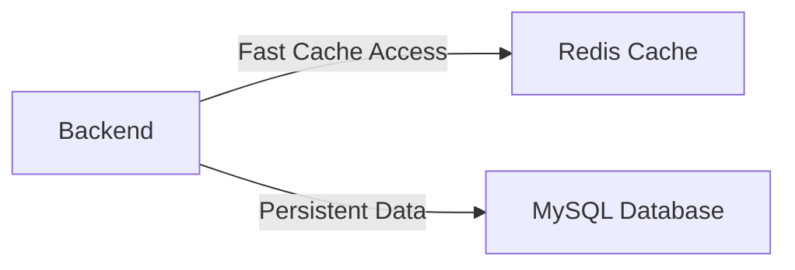

The separation provides a clear responsibility model:

- Redis → fast, cache-oriented data access
- MySQL → persistent application data
- Longhorn → persistent storage for MySQL
- HAProxy → stable MySQL access endpoint
- Failover Controller → automated MySQL failover

Redis is kept internal to the Kubernetes cluster through its ClusterIP Service.

---

## 18. GitOps Integration

The storage, database, cache, and HA resources are managed as part of the platform GitOps model.

Argo CD manages the Kubernetes resources from the Git repository.

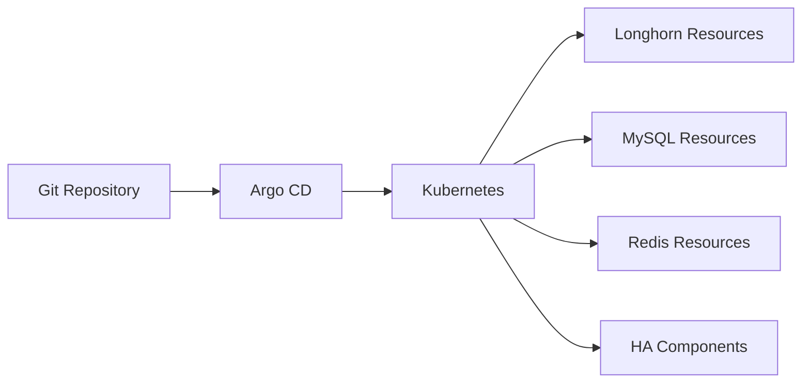

This keeps the platform declarative, reproducible, and integrated with the same GitOps workflow used by the application layer.

---

## 19. High Availability Layers

The final platform uses multiple complementary mechanisms for availability and performance.

```mermaid
graph TD
    PLATFORM[Stateful Application Platform]

    STORAGEHA[Storage HA<br/>Longhorn Replication]

    DBHA[Database HA<br/>MySQL Primary / Replica]

    CACHE[Application Cache<br/>Redis]

    ROUTINGHA[Database Routing<br/>HAProxy]

    FAILUREHA[Failure Automation<br/>Failover Controller]

    PLATFORM --> STORAGEHA
    PLATFORM --> DBHA
    PLATFORM --> CACHE
    PLATFORM --> ROUTINGHA
    PLATFORM --> FAILUREHA
```

Each layer has a dedicated responsibility:

- Longhorn provides replicated persistent storage.
- MySQL provides persistent database storage and replication.
- Redis provides application caching.
- HAProxy provides a stable database access endpoint.
- The failover controller automates database failure detection and failover.
- StatefulSets provide stable database identities and storage associations.
- Argo CD manages the Kubernetes resources declaratively.

---

## 20. Validation Summary

The storage and MySQL HA implementation is operational, and the controlled primary failure scenario completed successfully.

```mermaid
graph TD
    LH[Longhorn Healthy]

    PVC[Persistent Volumes Bound]

    MYSQL[MySQL Primary / Replica Running]

    REDIS[Redis Cache Running]

    HAPROXY[HAProxy Running]

    FC[Failover Controller Running]

    TEST[Controlled Primary Failure]

    DETECT[Failure Detected]

    PROMOTE[Automatic Replica Promotion]

    RECOVERY[Primary Pod Recovery]

    SUCCESS[Storage & MySQL HA Operational]

    LH --> PVC
    PVC --> MYSQL

    MYSQL --> HAPROXY
    MYSQL --> FC

    REDIS --> SUCCESS

    FC --> TEST
    TEST --> DETECT
    DETECT --> PROMOTE
    PROMOTE --> RECOVERY

    RECOVERY --> SUCCESS
```

Validated components:

- Longhorn installation
- Longhorn worker nodes
- Default StorageClass
- Dynamic persistent volume provisioning
- 10Gi MySQL persistent volumes
- Three-way Longhorn replication configuration
- MySQL primary StatefulSet
- MySQL replica StatefulSet
- MySQL Services
- Redis caching layer
- Redis Service
- HAProxy database router
- Failover controller
- Primary failure detection
- Automatic replica promotion
- HA state transition
- Primary pod recreation
- Database recovery workflow
- GitOps management through Argo CD

The storage, database HA, and Redis caching layers are operational and integrated with the overall microservices platform.

---

## 21. Final Storage Architecture

```mermaid
graph TD
    APP[Microservices Application]

    BACKEND[Backend]

    REDIS[Redis Cache]

    MYSQLWRITE[mysql-write]

    ROUTER[HAProxy<br/>mysql-router]

    PRIMARY[MySQL Current Primary]

    REPLICA[MySQL Replica]

    PVC1[Primary PVC]

    PVC2[Replica PVC]

    LH1[Longhorn Volume]

    LH2[Longhorn Volume]

    FC[MySQL Failover Controller]

    ARGO[Argo CD]

    APP --> BACKEND

    BACKEND --> REDIS
    BACKEND --> MYSQLWRITE

    MYSQLWRITE --> ROUTER

    ROUTER --> PRIMARY
    ROUTER -. Failover Target .-> REPLICA

    PRIMARY --> PVC1
    REPLICA --> PVC2

    PVC1 --> LH1
    PVC2 --> LH2

    PRIMARY --> REPLICA

    FC --> PRIMARY
    FC --> REPLICA
    FC --> ROUTER

    ARGO --> MYSQLWRITE
    ARGO --> REDIS
    ARGO --> PRIMARY
    ARGO --> REPLICA
    ARGO --> ROUTER
    ARGO --> FC
```

The resulting design provides a production-oriented stateful platform where persistent storage, database replication, caching, routing, automated failover, recovery, and GitOps management work together as a single Kubernetes-native architecture.