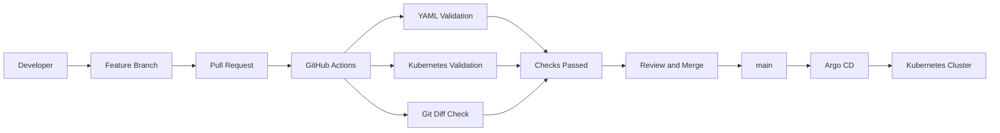
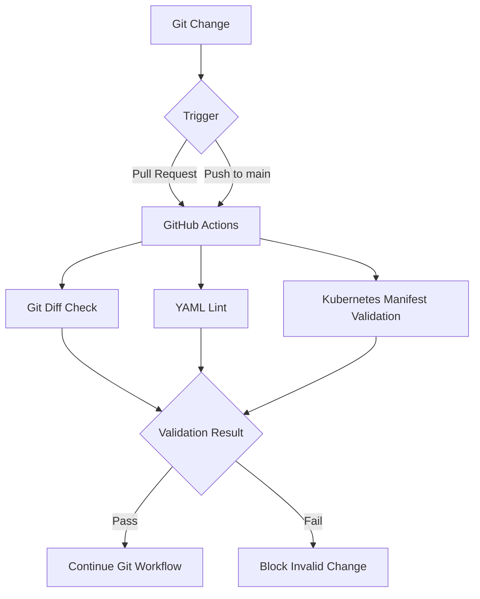
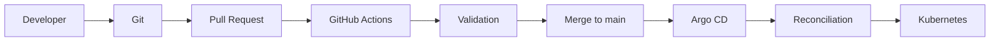
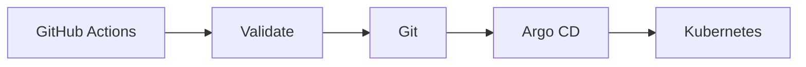

# CI & Pull Request Validation

## Overview

This section implements the Continuous Integration layer for the GitOps repository.

The objective is to validate Kubernetes manifests before they are merged into the `main` branch and to keep deployment responsibilities separated from CI.

The CI pipeline validates the GitOps repository only. It does not deploy workloads to the Kubernetes cluster.

Deployment remains the responsibility of Argo CD after changes are merged into `main`.

---

## Objectives

The CI implementation provides:

- YAML syntax and style validation.
- Kubernetes manifest schema validation.
- Git diff validation.
- Automatic validation on pushes to `main`.
- Automatic validation on Pull Requests targeting `main`.
- A clear separation between CI validation and GitOps deployment.
- A production-oriented workflow where invalid manifests can be detected before reaching the cluster.

---

## CI Architecture



The CI pipeline validates the repository before the Git change becomes part of the `main` branch.

After the change is merged, Argo CD remains responsible for reconciling the Kubernetes cluster with the desired state stored in Git.

---

## GitOps Separation of Responsibilities

The platform follows a clear separation between CI and CD.

| Component | Responsibility |
|---|---|
| GitHub Repository | Source of truth for Kubernetes manifests |
| GitHub Actions | Validate repository changes |
| Pull Request | Review and validate proposed changes |
| `main` branch | Approved desired state |
| Argo CD | Reconcile Git state with the cluster |
| Kubernetes | Run the desired workloads |

CI does not execute `kubectl apply` and does not directly deploy workloads.

This prevents the CI pipeline from becoming a second deployment mechanism and preserves the pull-based GitOps model.

---

## GitHub Actions Workflow

The CI workflow is located at:

```text
.github/workflows/ci.yaml
```

The workflow runs for both pushes to `main` and Pull Requests targeting `main`.

```yaml
on:
  pull_request:
    branches:
      - main
  push:
    branches:
      - main
```

---

## Validation Stages

### 1. Repository Checkout

The workflow first checks out the repository contents so that the Kubernetes manifests can be validated.

```yaml
- name: Checkout repository
  uses: actions/checkout@v5
```

---

### 2. Git Diff Validation

The workflow executes:

```bash
git diff --check
```

This detects whitespace and formatting problems that could otherwise be introduced into the repository.

---

### 3. YAML Validation

`yamllint` is used to validate YAML files under the GitOps manifest directories.

The repository contains the following YAML configuration:

```text
.yamllint.yml
```

The current configuration extends the relaxed profile and allows manifest lines up to 120 characters.

```yaml
extends: relaxed

rules:
  line-length:
    max: 120
    level: error
```

The CI validates:

```text
apps/
infrastructure/
argocd/
```

using:

```bash
yamllint -c .yamllint.yml apps infrastructure argocd
```

---

### 4. Kubernetes Manifest Validation

`kubeconform` is used to validate Kubernetes manifests against Kubernetes schemas.

The CI executes:

```bash
find apps infrastructure argocd \
  -type f \( -name "*.yaml" -o -name "*.yml" \) \
  -print0 |
xargs -0 kubeconform \
  -strict \
  -summary \
  -ignore-missing-schemas
```

The `-strict` option enables strict validation.

The repository also contains Custom Resources belonging to components such as:

```text
Argo CD
Argo Rollouts
Gateway API
Cilium
Envoy Gateway
Longhorn
RKE2 Helm Controller
```

Their CRD schemas are not stored as part of the application manifests in this repository, therefore `-ignore-missing-schemas` is used so that missing external CRD schemas do not incorrectly fail the CI pipeline.

---

## Repository Manifest Scope

The CI validates Kubernetes manifests stored under:

```text
apps/
infrastructure/
argocd/
```

The repository contains both standard Kubernetes resources and platform-specific Custom Resources.

Examples include:

```text
Deployment
StatefulSet
Service
ConfigMap
Secret
PersistentVolumeClaim
Namespace
Role
RoleBinding
ClusterRole
ClusterRoleBinding
ServiceAccount
Job

Application
Rollout
Gateway
GatewayClass
HTTPRoute
EnvoyProxy
CiliumL2AnnouncementPolicy
CiliumLoadBalancerIPPool
HelmChart
```

This allows the CI layer to validate the actual GitOps repository used by the platform.

---

## Pull Request Validation

The Pull Request workflow was tested using a dedicated temporary branch:

```text
test/ci-pr-check
```

The branch was used to create a Pull Request targeting:

```text
main
```

The Pull Request successfully triggered:

```text
GitOps CI / Validate Kubernetes Manifests (pull_request)
```

The check completed successfully.


The successful Pull Request check confirms that the `pull_request` trigger is functioning correctly.

---

## Push Validation

The CI workflow was also tested after changes were pushed to the `main` branch.

The GitHub Actions workflow completed successfully:

```text
GitOps CI
└── Validate Kubernetes Manifests
    └── Success
```


This confirms that the CI pipeline is also executed when changes reach the `main` branch.

---

## CI Workflow

The complete CI process can be represented as:



---

## CI and Argo CD Deployment Flow

CI and Argo CD have different responsibilities.



GitHub Actions verifies that the repository changes are valid.

Argo CD then uses the Git repository as the desired state and reconciles the cluster accordingly.

---

## Design Decisions

### CI Does Not Deploy to Kubernetes

The CI workflow intentionally does not use:

```bash
kubectl apply
```

or any other direct deployment mechanism.

This keeps deployment centralized through Argo CD and avoids having both GitHub Actions and Argo CD independently modifying the cluster.

---

### Validation Before Deployment

Manifest validation happens before changes become part of the approved Git state.

This reduces the possibility of introducing malformed YAML or invalid Kubernetes manifests into the GitOps repository.

---

### Pull Request Validation

Running CI on Pull Requests provides an early validation point before changes are merged.

The tested workflow is:

```text
Feature Branch
    ↓
Pull Request
    ↓
GitHub Actions
    ↓
Validation
    ↓
Review
    ↓
Merge
```

For documentation purposes, the flow above is represented by the Mermaid diagrams in this document.

---

### Custom Resource Handling

The platform uses several Kubernetes operators and extensions.

Examples include:

- Argo Rollouts
- Gateway API
- Cilium
- Envoy Gateway
- Longhorn
- Argo CD

Because their CRD schemas are managed by their respective platform components rather than stored with every application manifest, the CI uses `kubeconform` with missing-schema handling.

This keeps validation useful for standard Kubernetes resources without incorrectly failing on externally provided CRDs.

---

## Validation Result

The CI implementation was successfully validated in two scenarios:

### Push Validation

```text
Trigger:
push → main

Result:
Success
```

### Pull Request Validation

```text
Trigger:
pull_request → main

Result:
Success
```

Both execution paths were tested successfully.

---

## Current Status

CI and Pull Request validation are complete.

Implemented:

- [x] GitHub Actions workflow
- [x] YAML validation
- [x] Kubernetes manifest validation
- [x] Git diff validation
- [x] Push validation
- [x] Pull Request validation
- [x] CI/CD responsibility separation
- [x] Successful CI execution
- [x] Successful Pull Request check

Not implemented as part of this section:

- Automatic deployment from GitHub Actions
- Direct `kubectl apply` from CI
- Automated application testing against a temporary Kubernetes cluster
- Automated promotion or rollback

Application deployment and progressive delivery remain handled by Argo CD and Argo Rollouts respectively.

---

## Conclusion

The GitOps repository now has a dedicated CI validation layer that verifies Kubernetes configuration before deployment.

The resulting workflow maintains a clean separation of responsibilities:



GitHub Actions validates the desired state, while Argo CD remains responsible for synchronizing that desired state with the Kubernetes platform.

This completes the CI and Pull Request validation stage of the private RKE2 Kubernetes platform.
